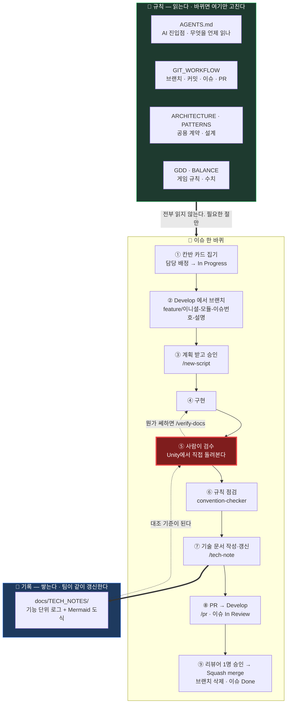
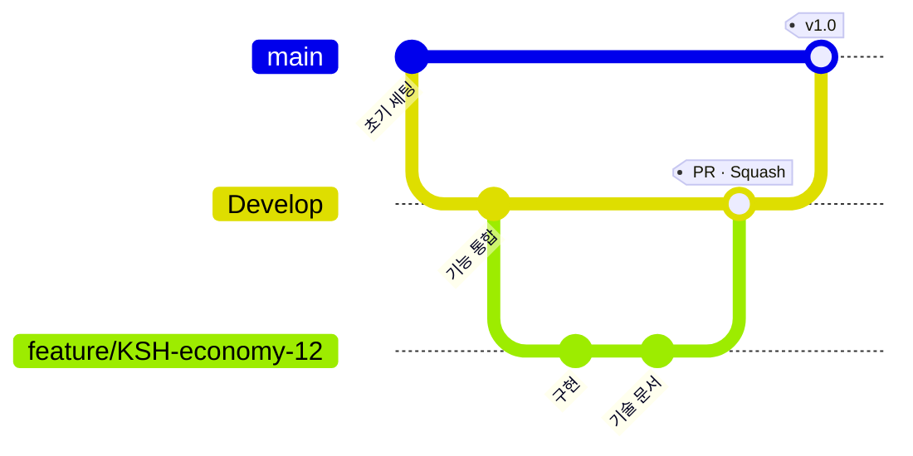

# NCAIClicker

NCAI 과정 팀 프로젝트(자유 주제) — 5인 7일간 Unity로 제작하는 스태미나 기반 인크리멘탈 게임.

## 한 장 요약

**⑤ 검수만은 사람이 합니다.** 한두 번 건너뛰면 컨벤션은 맞는데 어떤 논리로 만들었는지
아무도 모르는 코드가 쌓이고, 그때부터 수정·버그픽스의 **작업 일정을 말할 수 없게 됩니다.**

### 브랜치

`main` 은 배포 가능한 상태만 담습니다. **브랜치는 `Develop` 에서 따고 PR 대상도 `Develop`** 입니다.

### 사람과 AI의 경계

| 사람만 | AI에게 맡김 | AI가 하면 안 되는 것 |
|---|---|---|
| 계획 승인 · **검수** · PR 리뷰 · 머지 | 계획 수립 · 구현 · 규칙 점검 · 문서 작성 · PR 생성 | 머지 · 남의 씬 저장 · 공용 계약 임의 변경 · 진행률 추측 |

## 처음 오셨다면

### 1) PC 세팅 (한 번만)

1. `git clone` 후 **Unity Hub에서 6000.3.21f1** 로 엽니다 (버전 고정). 첫 실행은 느립니다.
2. UnityYAMLMerge 등록 — [배포 체크리스트](docs/RELEASE_CHECKLIST.md) 2절. **PC마다 1회 필요합니다.**
3. AI 에이전트로 Unity를 직접 조작하려면 Python 3.10+ 와 `uv` 를 설치합니다.
   Unity 패키지는 이미 들어 있습니다.

자세한 것은 [AGENTS.md](AGENTS.md) "새 세션 또는 다른 PC에서 이어서 작업할 때".

### 2) 읽을 것 — 세 개면 시작할 수 있습니다

1. [게임 기획서 (GDD)](docs/GDD.md) — 우리가 뭘 만드는지
2. [실행 계획](docs/EXECUTION_PLAN.md) — 내 담당과 작업 순서
3. [아키텍처](docs/ARCHITECTURE.md) — 코드를 어떤 계약으로 짜는지

**전부 읽지 마세요.** 필요할 때 필요한 절만 읽습니다. 어떤 일에 무엇을 읽는지는
[AGENTS.md](AGENTS.md) 맨 위 표에 있습니다.

### 3) 하루 작업 흐름

맨 위 [한 장 요약](#한-장-요약)의 그림을 따릅니다.
**규칙 정본은 [Git 작업 흐름](docs/GIT_WORKFLOW.md)** 입니다.

기억할 것 세 가지:

- **브랜치는 `main` 이 아니라 `Develop` 에서 땁니다.** PR 대상도 `Develop` 입니다.
- **자기 씬이 아니면 열어서 보되 저장하지 않습니다.** 남의 씬에 넣을 것은 프리팹으로 넘깁니다.
- **검수를 건너뛰지 않습니다.** 한두 번 놓치면 컨벤션은 맞는데 어떤 논리로 만들었는지
  아무도 모르는 코드가 쌓이고, 그때부터는 작업 일정을 말할 수 없게 됩니다.

### 4) AI에게 맡길 때

이 저장소에는 **팀 공용 AI 설정이 들어 있습니다.** 각자 따로 만들 필요가 없습니다.

| 부를 말 | 하는 일 |
|---|---|
| `/new-script` | 계획 승인 → 스크립트 작성 → 규칙 점검 |
| `/tech-note` | 기술 문서 + Mermaid 도식 작성·갱신 |
| `/verify-docs` | 문서와 실제 코드를 대조 (결과가 의심스러울 때) |
| `/commit` | 커밋 규칙에 맞춰 커밋 |
| `/pr` | 리베이스 → 점검 → `Develop` 으로 PR 생성 |
| `convention-checker` | 공용 계약 위반 점검 (읽기 전용 에이전트) |

처음 보는 에이전트에게는 **[AGENTS.md](AGENTS.md) 를 먼저 읽히세요.** Claude Code, Codex,
Cursor 등 도구를 가리지 않는 공통 진입점입니다. 문서를 통째로 읽히지 말고 이슈 번호를 주세요.

그다음 [칸반 보드](https://github.com/orgs/KDNA-Gwangju-1/projects/2/views/2)에서 자기 번호의
카드를 집으면 됩니다. 카드 본문에 담당·선행·완료 기준이 있습니다.

## 문서

| 문서 | 답하는 질문 |
|---|---|
| [GDD](docs/GDD.md) | 게임이 **무엇인가** — 규칙 |
| [실행 계획](docs/EXECUTION_PLAN.md) | **누가 무엇을 언제** — 작업 순서와 의존 |
| [아키텍처](docs/ARCHITECTURE.md) | 코드를 **어떤 계약으로** 짜나 |
| [설계 패턴](docs/PATTERNS.md) | **왜 그 설계**인가 — 학습용 |
| [밸런스 설계표](docs/BALANCE.md) | 숫자가 **왜 그 값**인가 (원본은 `Assets/GameData/Balance/*.csv`) |
| [원작 분석](docs/REFERENCE_ANALYSIS.md) | 원작은 **실제로 어떤가**, 무엇을 따르고 무엇을 뺐나 |
| [3D 에셋 파이프라인](docs/ASSET_PIPELINE.md) | 에셋을 **어떻게 만들고 끼우나** |
| [Git 작업 흐름](docs/GIT_WORKFLOW.md) | 브랜치·커밋·PR을 **어떻게 하나** |
| [기술 문서](docs/TECH_NOTES/) | 이 기능이 **실제로 어떻게 구현됐나** (+ C4 도식) |
| [배포 체크리스트](docs/RELEASE_CHECKLIST.md) | 빌드 전에 **뭘 확인하나** |
| [서드파티 라이선스](docs/THIRD_PARTY.md) | 외부 에셋 **출처와 라이선스** |
| [회고](docs/RETROSPECTIVE.md) | 끝나고 **뭐가 불편했나** |

## 진행 현황

이미지를 클릭하면 카드별 상세 보드로 이동합니다. **이슈 변경 시와 `main`·`Develop` 에 push 할 때** 자동 갱신됩니다. (30분 예약 실행도 걸려 있으나 GitHub 이 자주 건너뛰므로 신뢰하지 않는다. 즉시 갱신이 필요하면 Actions 탭에서 Run workflow 를 누른다.)

- [칸반 보드 원본](https://github.com/orgs/KDNA-Gwangju-1/projects/2/views/2)

카드 번호는 [실행 계획](docs/EXECUTION_PLAN.md)의 작업 번호와 1:1로 대응한다. 날짜가 아니라 **선후 관계**로 묶여 있으므로, 선행 작업이 끝난 카드는 담당이 다르면 동시에 진행한다.
