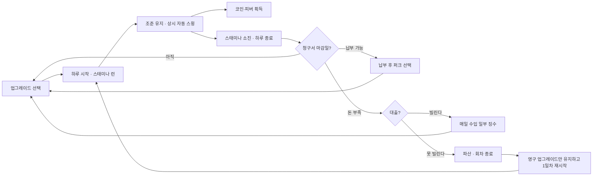

# NCAIClicker 게임 기획서

게임명은 저장소/프로젝트명과 같은 **NCAIClicker**로 확정했다. Unity Player Settings 의 Product Name 도 이 이름을 쓴다 — 저장 데이터 경로에 들어가므로 이후 변경하지 않는다. 저금통 비주얼도 확정이 아니라 언제든 다른 소재로 바뀔 수 있으므로, 아래 규칙은 "저금통"이 아니라 **타격 대상(Target)**이라는 개념으로 읽어도 무방하다.

## 문서 안내

이 문서는 **게임의 규칙**만 다룬다. 구체적인 수치는 `Assets/GameData/Balance/*.csv` 가 원본이며, 그 값을 그렇게 정한 근거는 [BALANCE.md](BALANCE.md) 에 있다. **같은 숫자를 두 곳에 적지 않는다.**

| 알고 싶은 것 | 볼 곳 |
|---|---|
| 게임이 무엇인가 (규칙) | 이 문서 |
| 어떤 작업을 어떤 순서로 | [EXECUTION_PLAN.md](EXECUTION_PLAN.md) |
| 코드를 어떤 계약으로 | [ARCHITECTURE.md](ARCHITECTURE.md) |
| 왜 그 설계인가 | [PATTERNS.md](PATTERNS.md) |
| 숫자가 왜 그 값인가 | [BALANCE.md](BALANCE.md) |
| 원작은 실제로 어떤가 | [REFERENCE_ANALYSIS.md](REFERENCE_ANALYSIS.md) |

## 0. 개요

NCAI 과정 팀 프로젝트(자유 주제)로 5명이 7일간 Unity로 제작하는 인크리멘탈 게임이다. [Bills Must Be Paid](https://store.steampowered.com/app/4421010/_Bills_Must_Be_Paid/)의 핵심 구조(스태미나 게이지, 호버 자동 스윙, 청구서 페널티)를 그대로 따르는 모작으로 시작한다.

- 망치는 대상이 있든 없든 **항상 일정 주기로 스윙한다.** 플레이어가 하는 일은 그 스윙이 닿을 곳에 커서를 두는 것, 즉 타격이 아니라 **조준 유지**다. 클릭 연타가 필요 없어 장시간 플레이에도 손 피로가 적다.
- 판 길이는 별도의 초시계 대신 스태미나 게이지로 표시한다. 스태미나는 플레이 중 계속 일정하게 줄어들며, 0이 되면 런이 끝난다.
- 한 번의 런이 게임 속 **하루**다. 청구서는 며칠 뒤 마감을 달고 오며, 마감일까지 못 내면 파산한다. 모자라면 대출로 막을 수 있지만 상환 전까지 매일 수입을 뜯긴다. 이 장치가 "언제 납부하고 언제 업그레이드에 투자할지"를 저울질하게 만드는 핵심 전략 요소다.

## 1. 프로젝트 개요

- 장르: 스태미나 기반 액티브 인크리멘탈
- 그래픽: **3D 확정** — 3D 저폴리 오브젝트, 고정 탑다운 카메라, 16:9 해상도 고정
- 카메라가 고정이고 타격 대상이 바닥 평면 위에서만 움직이므로, **이동과 판정 연산은 2축만 다룬다.** 표현은 3D이고 연산만 평면이라는 뜻이며, 스프라이트나 빌보드는 쓰지 않는다
- 플랫폼: PC Windows 스탠드얼론
- 플레이 인원: 싱글 플레이
- 조작: 마우스 커서를 타격 대상 위에 올리면 자동 타격 (클릭 연타 없음)
- 한 판 길이: 고정 시간 없음 — 스태미나 게이지가 소진될 때까지
- 제작 조건: 5인, 7일
- 핵심 목표: 스태미나가 소진되기 전에 목표 코인을 모으고, 청구서를 제때 납부하며 영구 성장을 달성한다

### 한 문장 소개

화면을 돌아다니는 타격 대상 위에 커서를 올려 자동으로 부수고, 스태미나가 다 떨어지기 전에 청구서를 막아가며 더 높은 기록에 도전하는 성장형 3D 인크리멘탈 게임이다.

## 2. 플레이 경험

망치는 쉬지 않고 스윙한다. 플레이어가 하는 일은 그 스윙이 닿을 곳에 커서를 두는 것이다. 클릭 연타는 없다. 스태미나는 남은 하루를 나타내듯 계속 줄어들고, 0이 되면 그날이 끝나 정산된다. 며칠에 한 번 청구서 마감이 돌아오는데, 그때까지 금액을 모으지 못하면 파산이다. 모자라면 대출로 막을 수 있지만 갚을 때까지 매일 수입을 뜯긴다. 하루가 끝나면 코인을 영구 업그레이드에 투자하고 다음 날로 넘어간다.

### 감정 곡선

1. 커서로 표적을 발견하고 위에 머무르며 자동 타격을 지켜본다.
2. 제한된 스태미나 시간 안에 가치가 높은 표적을 골라 자동 타격 시간을 최대화한다.
3. 청구서 마감이 다가오면 지금 납부할지, 업그레이드에 더 투자할지 저울질한다. 마감 하루 전인데 금액이 모자라면 대출을 쓸지 파산을 감수할지 결정해야 한다.
4. 스태미나가 바닥나기 직전 피버로 막판 스퍼트를 낸다.
5. 결과 화면에서 성장 수치를 확인하고 다음 업그레이드를 구매해 곧바로 재도전한다.

## 3. 핵심 게임 루프



## 4. 게임 규칙

### 런 진행 (스태미나)

- 시작 버튼을 누르면 스태미나 게이지가 가득 찬 상태로 런이 시작된다. HUD에는 막대뿐 아니라 **현재값/최대값 숫자를 함께** 표시한다 — 막대만으로는 "앞으로 몇 대 더 칠 수 있는가"를 가늠할 수 없다.
- 스태미나는 **시간에 따라 상시 감소**한다. 커서를 멈추거나 표적을 놓쳐도 계속 줄어들며, 이동과 타격은 스태미나를 추가로 소모하지 않는다.
- **설계 의도**: 조작의 핵심은 클릭 속도가 아니라 제한된 시간 동안 어느 표적에 커서를 붙여둘지 선택하는 것이다. 행동별 추가 소모를 없애 규칙을 즉시 이해할 수 있게 하고, 런 길이는 최대치와 초당 감소량만으로 안정적으로 통제한다.
- 수치는 `stamina.csv` 에 있다. 근거와 역산 과정은 [BALANCE.md](BALANCE.md) 2절 참고.
- 타격 대상은 화면 안전 영역 안에서 계속 이동한다.
- 부서진 저금통은 일정 시간 뒤 새 저금통으로 채워진다. **동시 출현 수와 재등장 대기 시간은 업그레이드 대상**이다 — 화면이 비어 있으면 아무리 조준해도 맞힐 것이 없다.
- **망치는 상시 스윙한다.** 커서가 빈 곳에 있어도 타격 모션은 일정 주기로 계속 재생되며, 대상 위에 있을 때만 실제로 적중해 코인이 나온다.
- **설계 의도**: 빗나간 스윙도 시간을 쓴다. 그래서 "아무것도 안 맞히고 흘려보낸 시간"이 곧 손해가 되고, 조준을 유지하는 것 자체가 플레이의 핵심이 된다. 커서를 올려야 비로소 망치가 움직이는 방식이면 이 압박이 사라진다. 원작 확인 결과이기도 하다 ([REFERENCE_ANALYSIS.md](REFERENCE_ANALYSIS.md) 5절).
- 자동 망치는 호버 자동 타격과 별개인 영구 업그레이드다. 글로벌 타이머에 따라 추가 수익을 만들며, 스태미나 감소 속도에는 영향을 주지 않는다.
- 다만 자동 망치만으로 버는 양이 적극적으로 움직이며 버는 양을 넘지 않도록 타격당 획득량을 낮게 잡는다. 넘어가는 순간 "커서를 세워두는 쪽이 이득"이 되어 게임을 플레이할 이유가 사라진다. Day 4 밸런싱에서 이 부등호를 실측으로 확인한다.
- 타격으로 쏟아진 코인은 바닥에 흩어진 채 남아 있다가, 런이 끝나는 시점에 **전량 자동으로 수금**된다. 플레이어가 커서로 주우러 다닐 필요는 없다.
- **설계 의도**: 코인을 직접 줍게 하면 "부수기"와 "줍기"가 스태미나를 두고 경쟁해 동선 판단이 복잡해진다. 원작도 자동 수금 방식이며, 7일 일정에서 굳이 늘릴 축이 아니다. 바닥에 쌓인 코인은 판단 요소가 아니라 "이만큼 벌었다"를 눈으로 보여주는 연출로만 쓴다.
- 스태미나가 0이 되면 입력과 자동 타격을 멈추고 즉시 결과를 표시한다.
- 단계 목표는 **누적 보유 코인이 아니라 이번 런에서 획득한 코인** 기준으로 판정한다. 누적 보유량 기준으로 하면 업그레이드를 사지 않고 코인을 모으기만 하는 것이 최적 전략이 되고, 단계 돌파가 실력이 아니라 플레이 시간 문제로 바뀐다.
- 런 내 획득 코인이 목표 이상이면 다음 단계가 열리며, 미달해도 획득한 코인은 전액 유지되어 업그레이드에 쓸 수 있다.

### 하루와 런

**한 번의 런이 게임 속 하루다.** 스태미나가 소진되면 그날이 끝나고, 결과 화면에서 업그레이드를 산 뒤 다음 날(다음 런)로 넘어간다.

이 단위가 필요한 이유는 청구서 때문이다. 청구서는 런 안에서 처리되는 것이 아니라 **며칠에 걸친 마감**을 갖는다. 그래서 "오늘 얼마를 벌어야 하는가"가 아니라 **"남은 며칠 동안 얼마를 모아야 하는가"**가 판단의 단위가 된다.

### 청구서 시스템

- 청구서는 **금액과 마감일(며칠 후)**을 함께 달고 도착한다. 단계가 오를수록 마감이 짧아진다 (`stages.csv`).
- 보유 코인이 충분하면 **언제든 조기 납부할 수 있다.** 마감일까지 기다릴 이유는 없으며, 일찍 내면 그만큼 마음이 편해진다.
- 납부하면 **퍼크 3장 중 1장을 고른다.** 후보 풀은 스태미나 소량 회복 / 일정 시간 코인 획득량 증가 / 타격 파워 증가 / 피격 판정 확대 등이며, 매번 무작위로 3장을 제시한다.
- **마감일이 끝날 때까지 납부하지 못하면 파산한다.** 유예도, 부분 납부도 없다.

- **설계 의도**: 마감이 며칠 단위라서 "오늘 못 벌었어도 내일 만회한다"가 성립하고, 동시에 날이 갈수록 압박이 누적된다. 런 하나로 끝나는 판정이었다면 매 런이 독립적이라 긴장이 쌓이지 않는다.

### 대출 — 빅 토니

마감일에 돈이 모자랄 때 파산을 피하는 유일한 수단이다. **두 번째 청구서부터** 이용할 수 있다.

| 규칙 | 내용 |
|---|---|
| 이자 | 빌린 금액에 이자를 더해 갚아야 한다 |
| 일일 징수 | 상환할 때까지 **매일 수입의 일정 비율**을 토니가 가져간다 |
| 징수의 성격 | **이 징수분은 부채를 줄이지 않는다.** 순수한 벌금이다 |
| 재대출 | 다 갚고 나면 일정 기간 다시 빌릴 수 없다 |
| 동시 대출 | 한 번에 한 건만 |

수치는 `bills.csv` 에 있다.

- **설계 의도**: 대출은 "지금 살아남는 대신 앞으로가 힘들어지는" 선택이다. 핵심은 **일일 징수가 부채를 갚아주지 않는다**는 점이다. 징수가 상환에 보탬이 된다면 대출은 그냥 분할 납부일 뿐이고 망설일 이유가 없다. 갚는 것과 별개로 계속 뜯긴다는 규칙이 있어야 "빌릴까 말까"가 진짜 고민이 된다.
- 업그레이드로 이자율을 낮추거나, 대출 직후 하루 동안 징수를 건너뛰게 만들 수 있다.

### 파산

- 마감일까지 청구서를 납부하지 못하면 그 시점에 회차가 끝난다.
- 결과 화면은 "정산 완료"가 아니라 **"파산"**으로 표기하고, 며칠째에 얼마를 못 냈는지 보여준다.
- **영구 업그레이드는 유지**되고, 단계 진행과 보유 코인은 초기화된 상태로 1일차부터 다시 시작한다.
- **설계 의도**: 프레스티지 화폐를 따로 만들지 않으면서 "실패해도 다음 회차가 더 강하다"는 인크리멘탈의 성장감을 유지하기 위한 절충이다. 업그레이드까지 날리면 실패가 너무 무겁고, 아무것도 안 잃으면 마감일이 무섭지 않다.
- 마감 하루 전부터 HUD에 경고를 띄운다. 모르고 넘겨서 끝나는 일은 없어야 한다.

- 청구서 금액·마감일·대출 계수는 ScriptableObject 데이터 에셋으로 관리하며, 단계가 오르면 금액은 오르고 마감일은 짧아진다.

### 타격 대상 종류

화면에는 **서로 다른 종류의 타격 대상이 동시에 여러 개** 존재한다. MVP는 3종으로 구성한다.

| 종류 | 이동 | 내구도 | 획득량 | 역할 |
|---|---|---|---|---|
| 일반형 | 보통 속도로 배회 | 낮음 | 기준값 | 기본 수입원 |
| 거치형 | 거의 정지 | 높음 | 높음 | 커서를 오래 붙잡아두는 고가치 목표 |
| 고속형 | 빠르고 불규칙 | 매우 낮음 | 낮음 | 쫓을 가치가 있는지 판단하게 만드는 미끼 |
| **회복형** | 느림 | 높음 | 매우 낮음 | **부수면 스태미나를 회복시킨다** |

- **원작 근거**: 공식 게임 페이지가 저금통 6종의 이름과 특성을 밝힌다. 위 4종은 그중 Normalito(일반), Woody(거치), El Loco(고속), **The Tourist(회복)** 에 대응한다. 원작 플레이 영상에서도 회복형에 대해 *"Smashing him restores stamina"* 라는 게임 내 안내가 확인된다.
- **회복형이 핵심이다.** 스태미나가 시간 기반이라 런 길이가 고정되면 "어디를 칠까"가 단순 가치 계산으로 납작해진다. 회복형이 섞여 있으면 **"런을 연장하려면 저놈부터 쳐야 하는데, 얘는 단단하고 돈이 안 된다"**는 손익 판단이 생긴다. 코인을 포기하고 시간을 사는 거래다.
- **설계 의도**: 제한된 런 시간에는 모든 대상을 충분히 부술 수 없다. 종류가 갈려야 "오래 걸리지만 비싼 거치형을 칠지, 빠르게 부서지는 일반형을 칠지" 선택이 생긴다. 원작이 재미를 뽑아내는 지점도 여기다.
- 구현 비용은 낮다. 이동 속도·내구도·획득량·스태미나 회복량·3D 프리팹만 다른 데이터 4종이면 되고, FSM과 피격 로직은 공유한다.
- 단계가 오르면 종류별 출현 비율을 조정해 난이도를 올린다.

### 타격 대상 이동 및 피격 판정

- 이동 안전 영역: 화면 경계와 UI 침범을 방지하기 위해 상하좌우 10% 여백을 둔다.
- 피격 판정 확대: 에이밍 실패 스트레스를 완화하기 위해 피격 콜라이더를 외형보다 25% 넓게 설정한다.
- 자동 스윙 주기: 망치는 대상 유무와 무관하게 일정 주기로 스윙한다 (`economy.csv`).
- 난이도 상승: 단계가 오르면 이동 속도와 방향 전환 빈도가 완만하게 증가한다.

### 코인 획득 및 수식 체계

```text
호버 타격 획득량 = 기본 타격 파워 × 피버 배율 × 보너스 배율
자동 망치 획득량 = 자동 망치 수 × 망치 파워 × 초당 타격 횟수
업그레이드 비용 = 초기 비용 × (1.15 ^ 현재 레벨)
다음 단계 목표 코인 = 이전 단계 목표 코인 × 2.5
스태미나 소모량 = 경과 시간 × 초당 스태미나 감소량
```

- 자동 망치 판정: 물리적으로 추적하지 않고, 글로벌 타이머에 따라 무조건 자동 적중으로 가산하여 물리 연산 오버헤드와 빗맞음 오류를 방지한다.
- 단계별 목표 코인은 **하루(런 1회) 내 획득량** 기준이다. 값은 `stages.csv` 에 있다.
- 수식의 모든 상수(기본 타격 파워, 망치 파워, 초당 스태미나 감소량 포함)는 ScriptableObject 데이터 에셋에서 관리한다.

### 피버 시스템

- **적중한** 타격마다 피버 게이지가 누적된다. 빗나간 스윙은 누적되지 않는다 — 망치가 상시 스윙하므로, 헛스윙까지 세면 가만히 있어도 피버가 찬다.
- 일정 시간 타격이 없으면 게이지가 서서히 자연 감소한다.
- 게이지가 가득 차면 5초간 피버 모드가 발동된다.
- 피버 효과: 코인 획득량 3배 증가, 황금빛 화면 연출 및 고음역 효과음 출력. 스태미나 감소 속도는 바꾸지 않는다.
- 피버 종료 후 게이지는 0으로 초기화된다.

## 5. 성장 시스템

MVP 업그레이드는 네 종류로 구성한다.

1. **악력 단련 (타격 강화)** — 타격당 코인 획득량 증가 및 타격 판정 범위 미세 확대
2. **카페인 중독 (자동 타격 강화)** — 초당 자동 타격 횟수 및 자동 망치 수량 증가
3. **헬스장 회원권 (피버 강화)** — 피버 지속 시간 연장 및 피버 배율 증가
4. **저금통 수집벽 (대상 증가)** — 동시 출현 저금통 수 증가 및 재등장 대기 시간 단축

- **4번이 필요한 이유**: 스태미나가 시간 기반이라 런 길이가 고정이므로, 수입을 늘리는 길은 **한 대당 코인을 늘리거나 맞힐 대상을 늘리거나** 둘뿐이다. 1~3번이 전부 전자에 몰려 있어 성장 축이 한쪽으로 치우친다. 화면이 비어 있으면 헛스윙이 늘어 정확도까지 떨어지므로, 대상 수는 수입과 정확도 양쪽에 걸리는 축이다.

단계 목표는 총 3개로 구성하며, 단계 클리어 시 대상 외형, 배경 테마, 목표 코인이 갱신된다. 복잡한 환생 시스템은 MVP에서 제외한다.

## 6. 화면 구성

### 메인 및 업그레이드
- 현재 보유 코인과 최고 기록 / 업그레이드 세 종류와 다음 효과 / 현재 단계와 목표 금액 / 라운드 시작 버튼

### 인게임 HUD
- 상단: 스태미나 게이지(현재값/최대값 숫자 병기), 현재 코인, 오늘 날짜
- 중앙: 이동하는 타격 대상과 상시 스윙 연출
- 하단: 피버 게이지
- 측면: 타격 파워, 자동 획득량, 현재 배율
- **정확도**: 이번 런의 `적중 / 전체 스윙` 비율을 백분율로 상시 표시
- 청구서: 금액과 **남은 일수**를 상시 노출, 납부 버튼 함께 표시. 마감 하루 전부터 강조

#### 정확도를 표시하는 이유

망치는 쉬지 않고 스윙하므로 **빗나간 스윙도 그대로 시간을 쓴다.** 그런데 그 손실은 눈에 보이지 않는다 — 코인이 안 들어온 것뿐이라 플레이어는 자기가 얼마나 흘리고 있는지 모른다.

정확도는 이 게임에서 **플레이어의 실력을 보여주는 유일한 숫자**다. 스태미나는 누구에게나 똑같이 줄고, 업그레이드는 돈만 있으면 산다. 같은 조건에서 더 잘하는 사람과 못하는 사람을 가르는 것은 조준뿐이고, 정확도가 그것을 드러낸다.

- 집계는 **런 단위**로 초기화한다. 누적 평균은 후반에 둔감해져 피드백이 안 된다.
- 결과 화면에도 표시해 최고 기록과 함께 비교하게 한다.

### 결과 화면
- 종료 사유에 따라 두 가지로 갈린다: 스태미나 소진은 "하루 정산", 마감일 미납은 "파산"
- 파산 연출은 코인 절반이 빠져나가는 것을 눈으로 보여준다 — 숫자만 줄면 왜 손해인지 체감되지 않는다
- 이번 하루 획득 코인, **정확도**, 청구서 상태(남은 일수 또는 납부 완료), 단계 목표 달성 여부
- 최고 기록 갱신 축하 연출 / 다음 구매 추천 / 업그레이드와 재도전 버튼

## 7. 연출 및 기술 사양

- 렌더링: URP 기본(3D) 렌더러. 2D Renderer 는 쓰지 않는다
- 카메라: 고정 원근 투영. 커서는 스크린 좌표를 책상 평면으로 레이캐스트해 위치를 구한다
- 3D 에셋: **VARCO 3D 로 생성**한다 ([ASSET_PIPELINE.md](ASSET_PIPELINE.md))
- 물리: 파편과 코인에만 리지드바디를 쓴다. 타격 판정과 자동 망치는 물리를 쓰지 않는다
- 호버 타격: 스쿼시 및 스트레치 스케일 변화, 경쾌한 타격음, 숫자 팝업
- 코인 획득: 타격 시 포물선으로 튀어나와 바닥에 쌓이고, 런 종료 시 일괄 수금되며 UI 카운터로 흡수되는 연출
- 피버 모드: 황금빛 강조 화면 효과, 속도선, 고음역 효과음, 대형 숫자 연출
- 저장 체계: 단일 SaveData DTO를 JSON으로 직렬화하여 로컬 파일로 저장
- 외부 트윈 라이브러리(LeanTween/DOTween) 도입 여부는 Day 1에 확정

## 8. 범위

### MVP
- 호버 자동 타격, 타격 대상 이동, 확장 피격 콜라이더, 코인 획득
- 스태미나 게이지(초당 지속 감소)와 런 상태 머신
- 하루 단위 진행, 청구서 마감일·조기 납부·납부 퍼크 3택
- 대출(이자·일일 징수·재대출 쿨다운)과 마감 미납 시 파산 처리
- 자동 망치 글로벌 적중 판정 로직
- 업그레이드 4종 및 레벨 비용 공식 적용
- 저금통 재등장(스폰) 관리
- 정확도 집계 및 표시
- 피버 시스템
- 목표 판정과 정산 화면 2종(정산 완료 / 파산)
- 로컬 저장 및 불러오기 기능
- 기본 2D UI, 파티클, 사운드
- 단계 3개 데이터 세트

### 추가 목표
- 단순 슬롯 또는 행운 룰렛 1종 / 오프라인 방치 보상 / 최고 기록과 상세 통계 / 타격 대상 외형 변화 / 짧은 튜토리얼 안내
- **망치 선택 2종**: 원작은 "크리티컬 확률이 높고 판정 반경이 좁은 망치"와 "스윙이 빠르고 반경이 넓지만 데미지가 낮은 망치"처럼 성향이 다른 망치를 고르게 한다. 런 시작 전 2종 중 선택만 붙여도 대상 3종 구성과 맞물려 판단이 늘어난다. 업그레이드 3종이 안정화된 뒤 여유가 있으면 착수한다.

### 제외
- 야바위와 슬롯 동시 구현 / 온라인 랭킹과 계정 시스템 / 복잡한 다중 환생·인벤토리·유료 상점 / 다수의 스테이지와 서사 스토리 / 게임패드 등 마우스 이외의 입력 디바이스 지원

## 9. 설계 참고

원작 [Bills Must Be Paid](https://store.steampowered.com/app/4421010/_Bills_Must_Be_Paid/)(Rike Games, 2026-07-29 출시, 리뷰 4,192개 중 96% 긍정)의 스태미나 게이지·호버 자동 스윙·청구서 페널티 구조를 그대로 채택했다. 항목별 대조와 근거는 [REFERENCE_ANALYSIS.md](REFERENCE_ANALYSIS.md)에 정리했다. 아래는 7일 일정에 맞춰 의도적으로 단순화한 부분이다.

- **레거시 포인트 등 이중 화폐 성장은 도입하지 않는다.** 원작은 파산 후 별도 화폐로 영구 업그레이드를 사지만, 새 화폐 체계를 만드는 대신 코인으로 업그레이드를 직접 구매하는 구조를 유지한다.
- **스킬 트리 분기는 도입하지 않는다.** 업그레이드 3종 구조로 단순화한다.
- **파산은 프레스티지 진입점이 아니라 런 실패로 축소한다.** 원작에서 파산은 회차를 끝내고 레거시 포인트를 정산하는 장치지만, 이중 화폐를 도입하지 않기로 했으므로 파산의 역할을 "런 강제 종료 + 수익 절반"으로만 남긴다. 청구서를 무시할 수 없게 만드는 압박은 유지하면서 새 시스템은 늘리지 않는다.

세부 실행 계획은 [EXECUTION_PLAN.md](EXECUTION_PLAN.md), 코드 아키텍처는 [ARCHITECTURE.md](ARCHITECTURE.md)를 참고한다.
