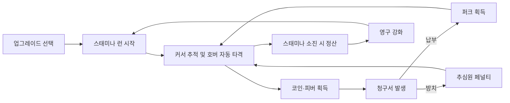

# NCAIClicker 게임 기획서

게임명은 아직 정하지 않았고, 저장소/프로젝트명으로 `NCAIClicker`를 임시로 쓴다. 저금통 비주얼도 확정이 아니라 언제든 다른 소재로 바뀔 수 있으므로, 아래 규칙은 "저금통"이 아니라 **타격 대상(Target)**이라는 개념으로 읽어도 무방하다.

## 0. 개요

NCAI 과정 팀 프로젝트(자유 주제)로 5명이 7일간 Unity로 제작하는 인크리멘탈 게임이다. [Bills Must Be Paid](https://store.steampowered.com/app/4421010/_Bills_Must_Be_Paid/)의 핵심 구조(스태미나 게이지, 호버 자동 스윙, 청구서 페널티)를 그대로 따르는 모작으로 시작한다.

- 커서를 타격 대상 위에 올리면 자동으로 타격한다(호버 자동 스윙). 클릭 연타가 필요 없어 장시간 플레이에도 손 피로가 적다.
- 판 길이는 고정 시간이 아니라 스태미나 게이지가 소진될 때까지다.
- 청구서를 방치하면 추심원이 이후 수익 일부를 계속 가져가는 페널티가 붙는다. 이 장치가 "언제 납부하고 언제 업그레이드에 투자할지"를 저울질하게 만드는 핵심 전략 요소다.

## 1. 프로젝트 개요

- 장르: 스태미나 기반 액티브 인크리멘탈
- 그래픽: 2D 스프라이트 기반, 16:9 해상도 고정
- 플랫폼: PC Windows 스탠드얼론
- 플레이 인원: 싱글 플레이
- 조작: 마우스 커서를 타격 대상 위에 올리면 자동 타격 (클릭 연타 없음)
- 한 판 길이: 고정 시간 없음 — 스태미나 게이지가 소진될 때까지
- 제작 조건: 5인, 7일
- 핵심 목표: 스태미나가 소진되기 전에 목표 코인을 모으고, 청구서를 제때 납부하며 영구 성장을 달성한다

### 한 문장 소개

화면을 돌아다니는 타격 대상 위에 커서를 올려 자동으로 타격하고, 스태미나가 다 떨어지기 전에 청구서를 막아가며 더 높은 기록에 도전하는 성장형 2D 인크리멘탈 게임이다.

## 2. 플레이 경험

플레이어는 커서로 타격 대상을 쫓아가 위에 올려두기만 하면 자동으로 타격한다. 이동과 타격 모두 스태미나를 소모하며, 스태미나가 0이 되면 그 판은 즉시 정산된다. 판 중간에 주기적으로 청구서가 도착하고, 기한 안에 납부하지 않으면 추심원이 이후 수익의 일부를 계속 가져간다. 판이 끝나면 코인을 영구 업그레이드에 투자하고 더 높은 목표에 재도전한다.

### 감정 곡선

1. 커서로 표적을 발견하고 위에 머무르며 자동 타격을 지켜본다.
2. 코인 분출과 스태미나 소모 속도 사이에서 동선을 최적화한다.
3. 청구서가 도착하면 지금 납부할지, 업그레이드 코인을 더 모을지 저울질한다.
4. 스태미나가 바닥나기 직전 피버로 막판 스퍼트를 낸다.
5. 결과 화면에서 성장 수치를 확인하고 다음 업그레이드를 구매해 곧바로 재도전한다.

## 3. 핵심 게임 루프



## 4. 게임 규칙

### 런 진행 (스태미나)

- 시작 버튼을 누르면 스태미나 게이지가 가득 찬 상태로 런이 시작된다.
- 스태미나는 커서 이동 거리와 타격 대상 타격 양쪽 모두에서 소모된다 — 정지해 있으면 소모되지 않는다.
- 타격 대상은 화면 안전 영역 안에서 계속 이동한다.
- 플레이어는 커서를 타격 대상 위에 올려두는 것만으로 자동 타격(호버 자동 스윙)으로 코인을 얻는다.
- 자동 망치는 별도 주기로 타격 대상을 추가 타격하는 영구 업그레이드 요소로 유지한다.
- 스태미나가 0이 되면 입력과 자동 타격을 멈추고 즉시 결과를 표시한다.
- 목표 코인 이상이면 다음 단계가 열리며, 미달해도 획득한 코인은 전액 유지된다.

### 청구서 시스템

- 런 시작 후 일정 주기(예: 10~15초)마다 청구서가 도착하며, 금액과 납부 기한이 함께 표시된다.
- 화면의 납부 버튼을 눌러 즉시 코인으로 정산하면 소소한 퍼크(스태미나 소량 회복 또는 짧은 코인 획득량 보너스) 1종을 얻는다.
- 기한 내 납부하지 않으면 추심원이 활성화되어, 정산될 때까지 이후 획득 코인의 일정 비율(예: 10~20%)을 계속 가져간다. 페널티는 여러 건이 겹치면 누적된다.
- 청구서 금액·주기·페널티율은 ScriptableObject 데이터 에셋으로 관리하며, 단계가 오르면 완만히 증가한다.

### 타격 대상 이동 및 피격 판정

- 이동 안전 영역: 화면 경계와 UI 침범을 방지하기 위해 상하좌우 10% 여백을 둔다.
- 피격 판정 확대: 에이밍 실패 스트레스를 완화하기 위해 피격 콜라이더를 외형보다 25% 넓게 설정한다.
- 자동 스윙 주기: 커서가 대상 위에 머무는 동안 0.15초 간격으로 자동 타격한다.
- 난이도 상승: 단계가 오르면 이동 속도와 방향 전환 빈도가 완만하게 증가한다.

### 코인 획득 및 수식 체계

```text
호버 타격 획득량 = 기본 타격 파워 × 피버 배율 × 보너스 배율
자동 망치 획득량 = 자동 망치 수 × 망치 파워 × 초당 타격 횟수
업그레이드 비용 = 초기 비용 × (1.15 ^ 현재 레벨)
다음 단계 목표 코인 = 이전 단계 목표 코인 × 2.5
스태미나 소모량 = 이동 거리 × 이동 소모 계수 + 타격 횟수 × 타격 소모 계수
```

- 자동 망치 판정: 물리적으로 추적하지 않고, 글로벌 타이머에 따라 무조건 자동 적중으로 가산하여 물리 연산 오버헤드와 빗맞음 오류를 방지한다.
- 단계별 목표 코인 기본값: 1단계 500 / 2단계 1,250 / 3단계 3,125 코인.
- 수식의 모든 상수(기본 타격 파워, 망치 파워, 이동/타격 스태미나 소모 계수 포함)는 ScriptableObject 데이터 에셋에서 관리한다.

### 피버 시스템

- 타격할 때마다 피버 게이지가 누적된다.
- 일정 시간 타격이 없으면 게이지가 서서히 자연 감소한다.
- 게이지가 가득 차면 5초간 피버 모드가 발동된다.
- 피버 효과: 코인 획득량 3배 증가, 스태미나 소모량 감소, 황금빛 화면 연출 및 고음역 효과음 출력.
- 피버 종료 후 게이지는 0으로 초기화된다.

## 5. 성장 시스템

MVP 업그레이드는 세 종류로 구성한다.

1. **강한 망치 (호버 타격 강화)** — 호버 타격당 코인 획득량 증가 및 타격 판정 범위 미세 확대
2. **자동 망치 (방치 및 누적 강화)** — 초당 자동 타격 횟수 및 망치 수량 증가
3. **피버 강화 (폭발적 버스트 강화)** — 피버 지속 시간 연장 및 피버 배율 증가

단계 목표는 총 3개로 구성하며, 단계 클리어 시 대상 외형, 배경 테마, 목표 코인이 갱신된다. 복잡한 환생 시스템은 MVP에서 제외한다.

## 6. 화면 구성

### 메인 및 업그레이드
- 현재 보유 코인과 최고 기록 / 업그레이드 세 종류와 다음 효과 / 현재 단계와 목표 금액 / 라운드 시작 버튼

### 인게임 HUD
- 상단: 스태미나 게이지, 현재 코인, 목표 코인 게이지
- 중앙: 이동하는 타격 대상과 호버 자동 타격 연출
- 하단: 피버 게이지
- 측면: 타격 파워, 자동 획득량, 현재 배율
- 청구서 알림: 도착 시 금액·기한과 함께 팝업, 납부 버튼 상시 노출

### 결과 화면
- 스태미나 소진 및 정산 완료 연출 (패배 대신 "정산 완료"로 표기)
- 이번 런 획득 코인, 납부/방치한 청구서 내역, 단계 목표 달성 여부
- 최고 기록 갱신 축하 연출 / 다음 구매 추천 / 업그레이드와 재도전 버튼

## 7. 연출 및 기술 사양

- 렌더링: Unity 2D Sprite 또는 Canvas UI 기반
- 호버 타격: 스쿼시 및 스트레치 스케일 변화, 경쾌한 타격음, 숫자 팝업
- 코인 획득: 포물선 파티클과 UI 카운터 흡수 연출
- 피버 모드: 황금빛 강조 화면 효과, 속도선, 고음역 효과음, 대형 숫자 연출
- 저장 체계: 단일 SaveData DTO를 JSON으로 직렬화하여 로컬 파일로 저장
- 외부 트윈 라이브러리(LeanTween/DOTween) 도입 여부는 Day 1에 확정

## 8. 범위

### MVP
- 호버 자동 타격, 타격 대상 이동, 확장 피격 콜라이더, 코인 획득
- 스태미나 게이지(이동·타격 소모)와 런 상태 머신
- 청구서 발생·납부·추심원 페널티 로직
- 자동 망치 글로벌 적중 판정 로직
- 업그레이드 3종 및 레벨 비용 공식 적용
- 피버 시스템
- 목표 판정과 스태미나 소진 정산 화면
- 로컬 저장 및 불러오기 기능
- 기본 2D UI, 파티클, 사운드
- 단계 3개 데이터 세트

### 추가 목표
- 단순 슬롯 또는 행운 룰렛 1종 / 오프라인 방치 보상 / 최고 기록과 상세 통계 / 타격 대상 외형 변화 / 짧은 튜토리얼 안내

### 제외
- 야바위와 슬롯 동시 구현 / 온라인 랭킹과 계정 시스템 / 복잡한 다중 환생·인벤토리·유료 상점 / 다수의 스테이지와 서사 스토리 / 게임패드 등 마우스 이외의 입력 디바이스 지원

## 9. 설계 참고

원작 [Bills Must Be Paid](https://store.steampowered.com/app/4421010/_Bills_Must_Be_Paid/)(Steam 리뷰 96% 긍정)의 스태미나 게이지·호버 자동 스윙·청구서 페널티 구조를 그대로 채택했다. 다만 아래는 7일 일정에 맞춰 의도적으로 단순화했다.

- **레거시 포인트 등 이중 화폐 성장은 도입하지 않는다.** 원작은 파산 후 별도 화폐로 영구 업그레이드를 사지만, 새 화폐 체계를 만드는 대신 코인으로 업그레이드를 직접 구매하는 구조를 유지한다.
- **스킬 트리 분기는 도입하지 않는다.** 업그레이드 3종 구조로 단순화한다.

세부 실행 계획은 [EXECUTION_PLAN.md](EXECUTION_PLAN.md), 코드 아키텍처는 [ARCHITECTURE.md](ARCHITECTURE.md)를 참고한다.
