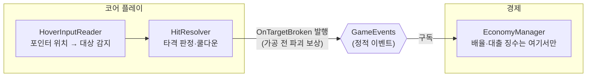

# 기술 문서 (TECH_NOTES)

**기술 문서는 로그다.** 누가 무엇을 왜 그렇게 만들었는지 계속 쌓아 가는 기록이고,
한 사람의 소유물이 아니라 **팀이 같이 갱신하는 문서**다.

목적은 포트폴리오가 아니다.

- A가 구현한 기능을 나중에 B가 고치게 된다. 그때 B가 읽을 것이 여기다.
- 프로젝트가 커지면 사람도 에이전트도 저장소 전체를 다시 파악해야 한다.
  여기 문서가 있으면 **관련 문서 한두 개만 읽고 착수**할 수 있다.
- **AI가 뭔가 잘못 만들고 있다는 느낌이 들 때, 대조할 기준이 된다** (아래 5절).

## 1. 문서 하나의 단위 — 이슈가 아니라 기능

`PlayerController.cs` 같은 **파일 단위로 쪼개지 않는다.** "플레이어 이동", "코인 정산",
"피버 게이지"처럼 **큰 기능 단위**로 한 문서를 만들고, 그 기능에 얽힌 요소를 모두 담는다.

그래서 문서 하나를 **여러 명이, 여러 이슈에 걸쳐** 갱신한다.

- 이미 그 기능의 문서가 있으면 **새로 만들지 말고 고친다.** 이슈마다 새 문서를 만들지 않는다.
- 기능이 커져 클래스를 쪼개면 문서도 그때 갱신한다. 구조가 바뀌었는데 문서가 그대로면
  그 문서는 다음 사람을 속인다.
- 문서 맨 아래 **갱신 이력**에 한 줄씩 남긴다. 누가 언제 무엇 때문에 고쳤는지가 로그다.

파일명은 기능 이름으로 짓는다. 이슈 번호를 파일명에 넣지 않는다 — 문서는 이슈보다 오래 산다.

```
docs/TECH_NOTES/
  player-movement.md
  coin-economy.md
  fever-gauge.md
  diagrams/            # .puml 을 쓸 때만 (2절 참고)
```

## 2. 도식 — 기본은 Mermaid

**글로만 적혀 있으면 AI가 구조를 오판한다.** 도식을 코드로 적어 두면 무엇이 무엇과
어떻게 연결되는지가 명확해지고, 사람과 AI 양쪽의 실수가 줄어든다.

| 형식 | 쓰나 | 이유 |
|---|---|---|
| **Mermaid 코드블록** | **기본** | GitHub이 마크다운 안에서 **바로 렌더한다.** PR 화면에서 그림이 그대로 보인다 |
| `.puml` (PlantUML) | 필요할 때만 | GitHub에서 **렌더되지 않는다.** 각자 확장으로 열어야 보인다 |

둘 다 텍스트라 Git이 행 단위로 병합하고 diff에 변경이 보인다.
**렌더된 png/svg 는 커밋하지 않는다** — 바이너리가 이력에 쌓이고 diff가 안 보인다.

### C4 모델 — 어느 레벨을 그리나

C4는 시스템을 **줌 레벨**로 나눠 보는 방법이다. 전부 그리지 않는다.

| 레벨 | 무엇 | 이 프로젝트에서 |
|---|---|---|
| L1 System Context | 시스템과 바깥 세계 | `ARCHITECTURE.md` 에 **한 번만** |
| L2 Container | 실행 단위(앱·서버·DB) | **안 쓴다** — PC 스탠드얼론 하나뿐이다 |
| **L3 Component** | 모듈·매니저가 어떻게 얽히나 | **기술 문서 도식의 기본** |
| L4 Code | 클래스 관계 | 상태 기계·상속처럼 실제로 헷갈릴 때만 |

GitHub의 Mermaid는 **C4 전용 문법(`C4Component`)을 렌더하지 못한다.** 그래서 C4의
*생각하는 방식*만 가져오고, 그림은 `flowchart` 로 그린다.



규칙 하나를 지킨다: **`GameEvents` 를 거치는 관계를 모듈끼리 직접 화살표로 잇지 않는다.**
그렇게 그리면 도식이 "직접 참조해도 된다"고 말하게 된다. 실제 구조와 어긋난 그림은 없는
것보다 나쁘다.

Mermaid는 구조도 말고도 쓸모가 많다 — `sequenceDiagram`(호출 순서), `stateDiagram-v2`
(피버·런 상태), `gitGraph`(브랜치 흐름). 말로 길게 적는 것보다 짧고 정확하다.

## 3. 무엇을 쓰나

`ARCHITECTURE.md` 와 겹치는 것을 옮겨 적지 않는다. 그쪽은 **팀 전체의 계약**이고,
여기는 **이 기능이 실제로 어떻게 구현됐나**다.

1. **왜 이 방법인가** — 캐릭터를 점프시키는 방법도 여럿이다. 검토했다가 버린 방법과
   버린 이유를 적는다. 이게 없으면 다음 사람이 같은 고민을 처음부터 다시 한다.
2. **어떤 클래스가 얽혀 있고 각각 어느 경로에 있나**
3. **구독·발행하는 `GameEvents` 이벤트**
4. **읽는 밸런스 CSV 열**
5. **알려진 한계와 미처리** — "이건 아직 안 됨"을 적어 두는 게 문서의 절반이다
6. **갱신 이력**

## 4. 언제 쓰나

**이슈를 닫기 전에.** 구현이 끝나고 검수를 통과한 뒤, PR에 코드와 **같이** 담는다.
나중에 몰아 쓰지 않는다 — 왜 그렇게 했는지는 그때 가면 본인도 기억하지 못한다.

문서만 고치는 변경(오탈자·보강)은 `docs:` 커밋으로 따로 올려도 된다.

새 문서는 [`_TEMPLATE.md`](_TEMPLATE.md) 를 복사해서 쓴다.

## 5. 쎄할 때 — 문서와 프로젝트를 대조한다

겉보기에 모양도 괜찮고 기능도 돌아가고 문서도 트집 잡을 게 없는데 **뭔가 쎄할 때**가 있다.
그 느낌은 대체로 맞다. 그럴 때 시간이 걸려도 재검증한다.

1. **기술 문서와 현재 프로젝트 상태를 대조시킨다.** 둘이 안 맞으면 어딘가 틀어진 것이다.
   (`/verify-docs` 스킬)
2. 그래도 안 잡히면 모델을 바꿔서 같은 것을 다시 보게 한다.

**이게 기술 문서를 계속 쌓으라는 진짜 이유다.** 대조할 기준이 없으면 "쎄하다"는 느낌을
확인할 방법이 없다. 놓친 것이 누적되면 나중에는 걷잡을 수 없이 커지고, 규모가 커진 뒤에는
AI에게 시켜도 제대로 못 고친다.

## 구현된 기능 문서

- [밸런스 임포트](balance-import.md) — 검증 후 반영, GUID 보존, 회귀 검증
- [진행 대시보드](project-dashboard.md) — 선행 파서와 전체 페이지 조회, 작업 번호 중복 검출, `/list-work` 와 공유하는 판정
- [초기 PC 설정](project-setup.md) — 창·리로드·검증 범위
- [공용 계약](contracts.md) — 인터페이스, 이벤트 버스, DTO 규격 동결
- [매니저 자동 생성](manager-bootstrap.md) — RuntimeInitializeOnLoadMethod 로 Resources 프리팹을 씬 로드 전 1회 생성
- [UI 폰트](ui-fonts.md) — 나눔고딕·나눔스퀘어 OFL 원본, Dynamic SDF 에셋, TMP 기본 폰트 교체
- [코인 정산](coin-economy.md) — 파괴 보상에 배율·대출 징수 적용, 소수 잔여 이월, 런 순수입 분리
- [타격 대상](hit-targets.md) — 그레이박스 4종, 내구도와 피격, 파괴 시 보상 발행
- [스태미나](stamina.md) — 시간 감소와 회복형 회복, 소진 시 런 종료 요청, 발행 묶기
- [피버 게이지](fever-gauge.md) — 적중만 누적, 유예 후 감쇠, 발동과 종료, 런당 발동 빈도 조정
- [업그레이드](upgrades.md) — 레벨과 비용 공식, 효과 적용된 실효값 계산, 구매의 원자성
- [저장·불러오기](save-load.md) — SaveManager, JsonUtility 직렬화, 버전 마이그레이션, null 직렬화 우회
- [런 상태 머신](run-state.md) — GameManager, 씬 로드 기반 MainMenu/Running 전이, 이벤트 기반 Result 전이
- [단계 목표 판정](stage-goal.md) — StageGoalManager, 런 순수입과 GoalCoin 비교, 런당 1회 발행
