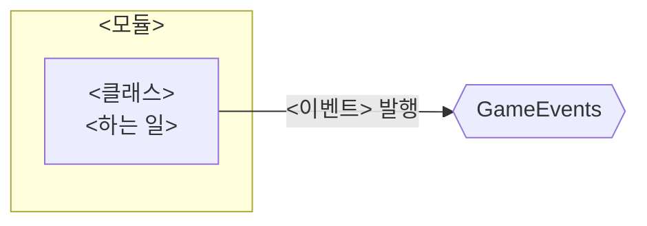

# <기능 이름>

> 관련 이슈: #  · 최종 수정: YYYY-MM-DD

**이 문서는 로그다.** 이 기능을 고칠 때마다 갱신한다. 새 문서를 만들지 않는다.

## 무엇을 하는가

한두 문장. 게임 규칙은 [GDD](../GDD.md) 에 있으니 여기서 반복하지 않는다.

## 왜 이 방법인가

| 검토한 방법 | 채택 | 이유 |
|---|---|---|
| <방법 A> | ✅ | |
| <방법 B> | ❌ | 버린 이유 — 이 칸이 이 문서에서 가장 중요하다 |

## 구조

<!-- GameEvents 를 거치는 관계는 이벤트 노드를 경유해 그린다. 모듈끼리 직접 잇지 않는다 -->

| 클래스 | 경로 | 하는 일 |
|---|---|---|
| `<클래스>` | `Assets/Scripts/Runtime/.../<파일>.cs` | |

### 이벤트

| 이벤트 | 발행/구독 | 언제 |
|---|---|---|
| `GameEvents.On...` | | |

### 읽는 밸런스 값

| CSV | 열 | 쓰는 곳 |
|---|---|---|
| `Assets/GameData/Balance/<파일>.csv` | `<열>` | |

## 검증

Edit Mode / Play Mode 에서 **실제로 확인한 것**만 적는다. 안 한 건 "미검증"이라고 적는다.

- [ ] 

## 알려진 한계

- 아직 처리하지 않은 것, 다음 사람이 밟을 지뢰

## 갱신 이력

| 날짜 | 이슈 | 누가 | 무엇이 바뀌었나 |
|---|---|---|---|
| YYYY-MM-DD | #  | | 최초 작성 |
