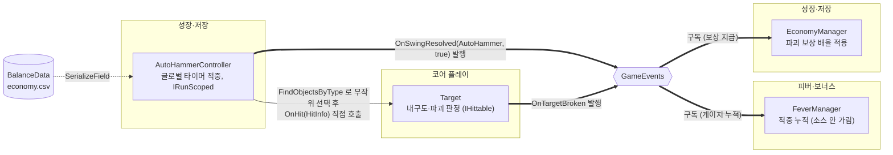

# 자동 망치

> 관련 이슈: #23 · 최종 수정: 2026-09-17

**이 문서는 로그다.** 이 기능을 고칠 때마다 갱신한다. 새 문서를 만들지 않는다.

## 무엇을 하는가

호버 망치와 별개로, 보유한 자동 망치 수만큼 **하나의 글로벌 타이머**로 살아있는 대상 하나를
골라 무조건 적중시켜 내구도를 깎는다. 물리 판정을 쓰지 않고, 스태미나 소모 속도에도 영향을
주지 않는다. 게임 규칙은 [GDD 4절](../GDD.md)에 있으니 여기서 반복하지 않는다.

## 왜 이 방법인가

| 검토한 방법 | 채택 | 이유 |
|---|---|---|
| 망치마다 개별 타이머 | ❌ | GDD 4절 공식 `자동 망치 기여 = 수 × 파워 × 초당 타격 횟수`는 모든 망치가 같은 박자로 동시에 적중한다고 전제한다. 망치마다 따로 돌리면 이 공식을 맞추기 위해 다시 나눗셈을 해야 하고, 구현도 복잡해진다 |
| 단일 글로벌 타이머(주기 = 1 / 초당 타격 횟수), 틱마다 `수 × 파워`를 한 대상에 적용 | ✅ | 위 공식과 정확히 일치한다. `HammerSwingController` 의 "나머지 시간 이월" 패턴을 그대로 가져와 프레임이 밀려도 박자가 어긋나지 않는다 |
| `Physics.Raycast` 로 대상 판정 | ❌ | GDD가 명시적으로 금지한다 — "물리적으로 추적하지 않고, 글로벌 타이머에 따라 무조건 자동 적중으로 가산" (물리 연산 오버헤드·빗맞음 오류 방지) |
| 살아있는 `Target` 중 무작위 하나 선택 | ✅ | GDD의 "무조건 적중" 전제와 맞고, 대상이 여러 개일 때 항상 같은 개체(예: 먼저 스폰된 것)만 노리는 편향을 피한다 |
| 대상 탐색에 `IHittable` 인터페이스만 사용 (`FindObjectsByType<MonoBehaviour>()` 후 `is IHittable` 필터) | ❌ | Unity의 `Object.FindObjectsByType<T>()`는 `UnityEngine.Object` 파생 구체 타입만 받고 인터페이스를 직접 못 받는다. 인터페이스로 하려면 씬의 모든 `MonoBehaviour`를 훑어야 해서 대상 6~12개뿐인 이 씬에서는 손해만 크다 |
| 대상 탐색에 `FindObjectsByType<Target>()` (구체 클래스 직접 참조) | ✅ | `Target`은 ARCHITECTURE 1절의 9종 매니저 목록에 없는 엔티티 컴포넌트라 "다른 매니저 구현 클래스를 직접 참조하지 않는다" 규칙에 걸리지 않는다. `convention-checker`가 판단을 요청했고, 위 성능·API 제약을 근거로 그대로 채택했다 |
| 업그레이드 개수 반영을 `IUpgradeStats` 등 새 인터페이스로 조회 | ❌ | 그 계약(#116, 업그레이드 실효값 조회 통로)이 아직 합의 전이다. 선점하면 #116 논의 결과와 어긋날 위험이 있다 |
| `SetBonusCount(int)` 메서드로 외부 주입 | ✅ | `CreatureManager.SetUpgradeOverrides`, `EconomyManager.SetBillService`와 같은 기존 주입 패턴을 재사용한다. 새 공용 계약 없이도 작업 3.3(업그레이드)이 나중에 개수를 얹을 수 있다 |
| `Game` 씬에 직접 배치 (`HammerSwingController`처럼 씬 로컬) | ❌ | 카메라·책상 평면 Y값 같은 씬 종속 참조가 필요 없다. 굳이 씬 로컬로 두면 `Game` 씬(코어 플레이 소유)을 저장해야 해서 AGENTS.md의 "자기 씬이 아니면 저장하지 않는다" 규칙과 부딪힌다 |
| `Managers` 프리팹에 상주 (`DontDestroyOnLoad`), `IRunScoped`로 게이트 | ✅ | `FeverManager`와 같은 패턴. 씬을 건드리지 않고 `GameManager`가 `GetComponentsInChildren<IRunScoped>()`로 자동 인식해 `BeginRun`/`EndRun`을 불러 준다 — `GameManager` 코드 수정도 필요 없었다 |

## 구조

| 클래스 | 경로 | 하는 일 |
|---|---|---|
| `AutoHammerController` | `Assets/Scripts/Runtime/Economy/AutoHammerController.cs` | `Managers` 프리팹의 `MonoBehaviour`. 글로벌 타이머로 틱을 진행하고, 살아있는 `Target`을 골라 `OnHit()`을 직접 호출한다 |

## 공개 API

| 멤버 | 계약 | 누가 부르나 |
|---|---|---|
| `BeginRun()` / `EndRun()` | **`IRunScoped`** | `GameManager` — 런 시작/종료. `EndRun()` 이후에는 틱이 돌지 않는다 |
| `AutoHammerCount` | 없음 | 조회. `economy.csv`의 `auto_hammer_count_init` + `SetBonusCount`로 주입된 보너스 |
| `SetBonusCount(int)` | 없음 (일반 메서드 주입) | 작업 3.3(업그레이드)이 나중에 붙일 통로. 지금은 아무도 호출하지 않는다 |

### 이벤트

| 이벤트 | 발행/구독 | 언제 |
|---|---|---|
| `GameEvents.OnSwingResolved` | **발행** | 틱마다 살아있는 대상을 찾아 실제로 적중시켰을 때만. 대상이 없으면 그 틱은 조용히 넘어간다 (미스 개념 없음) |

`HitSource.AutoHammer`는 정확도 집계에서는 제외되지만 (ARCHITECTURE 3절), 피버 게이지는
호버·자동 망치를 가리지 않고 함께 센다 (`FeverManager`, [피버 게이지](fever-gauge.md) 참고) —
이 컴포넌트는 그 필터링에 관여하지 않고 그냥 발행만 한다.

### 읽는 밸런스 값

| CSV | 열 | 쓰는 곳 |
|---|---|---|
| `economy.csv` | `auto_hammer_count_init` | `AutoHammerCount`의 기준값 |
| `economy.csv` | `auto_hammer_power` | 틱당 적용 피해량의 인자 (`count × power`) |
| `economy.csv` | `auto_hammer_hits_per_sec` | 글로벌 타이머 주기 (`1 / 이 값`) |

## 검증

Unity 6000.3.21f1, Play Mode, 2026-09-17. `Game` 씬을 열고 Play 후 리플렉션으로 확인했다
(씬은 저장하지 않았다).

- [x] `SetBonusCount(5)`(파워 0.6) 설정 후 `ResolveTick()`을 반복 호출 — 살아있는 대상이 있던
      횟수만큼만 `OnSwingResolved(AutoHammer, true)` 발행, 대상 소진 후에는 조용히 스킵됨을 확인
- [x] 적중이 누적되어 대상이 파괴되고 `OnTargetBroken` → `EconomyManager`로 이어져 코인이
      정상 지급됨을 확인 (`RunCoin`/`CurrentCoin` 증가)
- [x] 같은 적중이 `FeverManager`의 게이지에도 반영됨을 확인 (호버·자동 망치 모두 센다는
      설계와 일치)
- [x] `GameManager.CurrentState == Running`일 때 `IRunScoped.BeginRun()`이 이미 호출되어
      `_isRunning`이 켜져 있음을 확인 — `GameManager` 코드를 고치지 않고도 자동 배선됨
- [x] 컴파일 에러·경고 0건, `convention-checker` 위반 0건
- [ ] Update() 루프의 실시간 진행 자체는 미검증 — 에디터가 창 포커스를 잃으면 Play Mode
      프레임이 심하게 스로틀되어(3초 대기에 게임 시간 0.04초만 진행) 실시간 대기로는 확인이
      안 됐다. 그래서 타이머 로직은 `HammerSwingController`와 동일한 이월 패턴을 코드 대조로만
      확인했고, 실제 적중·파괴·코인 지급 경로는 `ResolveTick()`을 리플렉션으로 직접 반복 호출해
      검증했다

**미검증**: EditMode 자동 테스트 (형제 컴포넌트 `HammerSwingController`·`FeverManager`도
EditMode 테스트가 없는 선례를 따름). 업그레이드로 `SetBonusCount`가 실제로 호출되는 경로
(작업 3.3, 진행 중).

## 알려진 한계

- **업그레이드가 반영되지 않는다.** "카페인 중독"(자동 망치 수 증가)은 작업 3.3이며, 아직
  아무도 `SetBonusCount()`를 호출하지 않아 `auto_hammer_count_init`(현재 0)만 적용된다.
  즉 지금 상태로는 자동 망치가 실제로 작동하지 않는다 — 업그레이드가 붙어야 수가 0보다 커진다
- **대상 탐색이 매 틱 `FindObjectsByType`로 씬을 훑는다.** 동시 대상 수가 지금처럼 10개 미만이면
  문제없지만, "저금통 수집벽" 업그레이드로 동시 출현 수가 크게 늘면 재검토가 필요하다
- **정확도 집계 쪽 필터링은 이 문서의 책임이 아니다.** `HitSource.AutoHammer`를 정확도
  분모·분자에서 빼는 것은 아직 구현되지 않은 정확도 UI(작업 6.1)의 몫이다

## 갱신 이력

| 날짜 | 이슈 | 누가 | 무엇이 바뀌었나 |
|---|---|---|---|
| 2026-09-17 | #23 | hunil58 | 최초 작성 (글로벌 타이머 적중, `Managers` 프리팹 상주, `SetBonusCount` 주입 통로) |
