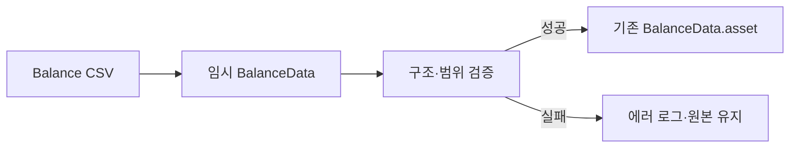

# 밸런스 CSV 임포트

> 관련 이슈: #46 · 최종 수정: 2026-09-16

## 무엇을 하는가

CSV를 임시 `BalanceData`에 읽고 전체 검증을 통과한 경우에만 기존 에셋에 복사한다. 실패하면 기존 파일과 메모리 객체를 유지한다.

## 왜 이 방법인가

| 방법 | 채택 | 이유 |
|---|---|---|
| 기존 ScriptableObject 직접 수정 후 검증 | ❌ | 중간 실패가 에디터 메모리 상태를 오염시킨다 |
| 임시 객체 검증 후 `CopySerialized` | ✅ | 성공 시 GUID를 유지하고 실패 시 원본을 보존한다 |

## 구조

| 클래스 | 경로 | 하는 일 |
|---|---|---|
| `BalanceImporter` | `Assets/Scripts/Editor/BalanceImporter.cs` | CSV 파싱·검증·에셋 갱신 |
| `BalanceImporterChecks` | `Assets/Scripts/Editor/BalanceImporterChecks.cs` | 잘못된 CSV, 정밀도, GUID 보존 회귀 검증 |

## 검증

- Unity 6000.3.21f1 배치 실행: 15개 검증 통과, CSV 재임포트 완료, 종료 코드 0 (2026-09-16).
- Play Mode 미검증.

## 알려진 한계

- `GameManager` 가 아직 없어 실제 수입·대출 상환의 플레이 검증은 남아 있다. `EconomyManager`(3.1)·`SaveManager`(3.4) 는 구현됐다.

## 갱신 이력

| 날짜 | 이슈 | 누가 | 무엇이 바뀌었나 |
|---|---|---|---|
| 2026-09-16 | #46 | Codex | 원자적 임포트와 회귀 검증 기록 |
