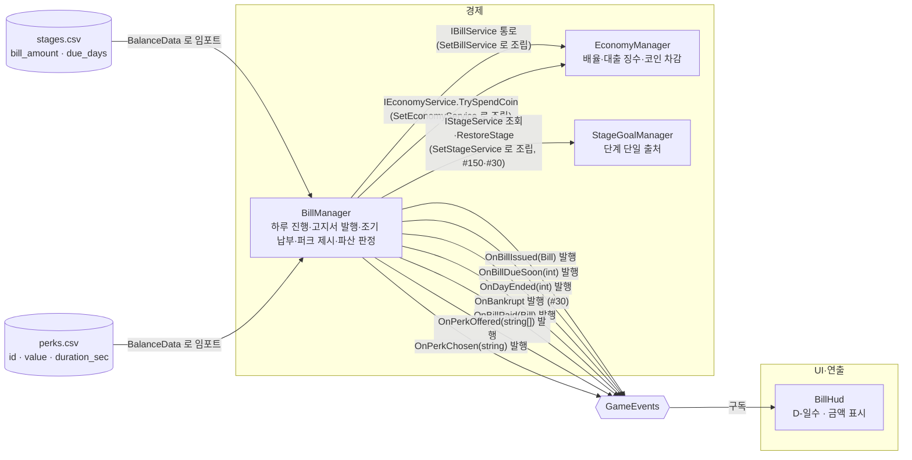

# 하루 진행과 고지서

> 관련 이슈: #27, #28, #29, #150, #30, #164, #92, #175, #203, #212, #211, #249, #270, #306, #272, #291, #273 · 최종 수정: 2026-09-23
**이 문서는 로그다.** 이 기능을 고칠 때마다 갱신한다. 새 문서를 만들지 않는다.

## 무엇을 하는가

런 종료를 하루 종료로 집계하고 `stages.csv` 단계값으로 고지서(금액·마감일)를 발행한다. HUD는 남은 일수와 금액을 항상 보여준다. 마감 전이면 `TryPay`로 언제든 조기 납부할 수 있고, 납부에 성공하면 기존 고지서의 납부 완료 표시 뒤 `perks.csv`에서 3종을 무작위로 뽑아 `OnPerkOffered`로 알린다. `TryChoosePerk`로 하나를 고르면 다음 단계의 고지서를 즉시 발행해 메뉴에서 보여 주되, `계속하기` 전에는 날짜·납기 일수를 진행하지 않는 흐름이 #249의 확정 목표다. **현재 구현과의 차이는 아래 알려진 한계에 남긴다.** 퍼크 효과의 실제 게임플레이 반영은 이 클래스 범위 밖이다. 대출(#29)은 두 번째 고지서부터 활성 고지서 금액을 한도로 빌리고(`TryTakeLoan`), 이자를 더한 전액을 한 번에 갚는다(`TryRepayLoan`). 미상환 기간에는 `LoanDailyCut`이 0이 아니게 되어 `EconomyManager`가 수입에서 그만큼 떼며, 그 징수분은 부채를 줄이지 않는다. 고지서 화면의 상환 버튼(#272)은 활성 대출이 있을 때만 나타나 상환액(`LoanOwedAmount`)을 보여 주고, 대출 버튼은 거절 사유를 쿨다운(`LoanCooldownDaysRemaining`)과 해금 순번 미달(`IsLoanUnlocked`)로 구분해 캡션에 보여 준다 — 셋 다 `IBillService` 읽기 전용 프로퍼티다(#306). 대출 버튼은 곧바로 빌리지 않고 금액 선택창을 연다(#273) — 기본값은 부족분(`고지서 금액 - 보유 코인`), 상한은 고지서 전액이고, 상환액·징수율 미리보기는 `BillManager`가 대출을 확정할 때 쓰는 바로 그 식(`LoanTerms.CalculateOwed`·`LoanTerms.CalculateDailyCut`)을 부른다. **파산 판정(#30, #211)도 여기서 한다** — 아래 "마감 미납과 파산" 절. 게임 규칙은 [GDD](../GDD.md)에 있으니 여기서 반복하지 않는다.

## 왜 이 방법인가

| 검토한 방법 | 채택 | 이유 |
|---|---|---|
| `BillManager`가 `EconomyManager`처럼 싱글톤 + `IBillService` 구현, `Managers` 프리팹에 부착 | ✅ | 기존 매니저(EconomyManager/StaminaManager/SaveManager) 패턴과 동일해 팀이 이미 아는 구조를 그대로 쓴다. `ManagerBootstrap`이 조립 지점에서 `EconomyManager.SetBillService`로 연결한다 |
| 별도 `StageManager`를 새로 만들어 단계 진행을 관리 | ❌ → **뒤집힘** | 이슈 #27 범위 밖이라 `_billIndex` 순번으로 `stages.csv`를 순서대로 읽었다. **#150 에서 뒤집혔다** — `StageGoalManager`가 `IStageService`로 단일 출처가 되었고 `_billIndex`는 누적 고지서 순번으로만 남는다 |
| HUD가 매 프레임 `IBillService.DaysLeft`를 폴링 | ❌ | ARCHITECTURE.md 3절 "UI는 구독 후 공용 조회 인터페이스로 초기 상태를 한 번 읽는다"에 어긋난다. `GameEvents.OnBillDueSoon`(이미 선언돼 있었지만 아무도 발행하지 않던 이벤트)을 `BillManager.BeginRun()` 끝에서 발행하도록 고쳐 HUD가 구독하게 했다 |
| `OnBillDueSoon`을 "마감 임박" 때만(예: 2일 이하) 발행 | ❌ | 이슈 #27 완료 기준이 "HUD는 항상 일수·금액을 보여준다"라 매일 갱신이 필요하다. `contracts.md`의 "마감 임박 시" 설명과는 결이 다르지만 인자·발행 메서드 시그니처(`Action<int>`, `PublishBillDueSoon(int)`)는 그대로이므로 계약 변경이 아니다 — 다음에 "진짜 임박" 필터가 필요해지면 그때 구독측(HUD)에서 걸러도 된다 |
| HUD를 `Game.unity`에 직접 배치 | ❌ | `Game.unity`은 "코어 플레이" 모듈 소유 씬이라 남의 씬을 고치면 안 된다(AGENTS.md). 대신 `Assets/Prefabs/UI/BillHud.prefab`(Canvas + TextMeshProUGUI)을 독립 프리팹으로 만들어 넘긴다 — 코어 플레이 담당이 씬에 배치하면 된다 |
| (#28) 퍼크 4종을 `IPerkEffect` 등으로 서브클래스화 | ❌ | 후보가 정확히 4종 고정이고 각자 적용 대상 시스템이 다를 뿐 분기 로직은 없다. `PerkType` enum + `PerkDef`(값·지속시간) 데이터 하나로 충분하다 — 과설계 금지(ponytail) |
| (#28) `TryPay`를 `BillManager`에 직접 추가 vs 새 `PaymentManager` 신설 | ✅ 전자 | `BillManager`가 이미 `_activeBill`과 마감 판정을 갖고 있다. 새 매니저를 만들면 활성 고지서 상태를 두 곳에서 동기화해야 한다 |
| (#28) 코인 차감을 `BillManager`가 직접 지갑 필드를 건드림 | ❌ | "코인 배율·차감은 EconomyManager 안에서만"(AGENTS.md). `BillManager`는 `IEconomyService.TrySpendCoin`만 호출하고, `EconomyManager`가 `ManagerBootstrap`에서 `SetEconomyService`로 주입된다(`EconomyManager`가 `SetBillService`로 자신을 넘기는 것과 대칭 구조) |
| (#28) 퍼크 선택 시 즉시 스태미나/코인배율/타격력 등에 반영 | ❌ | 각 수치는 StaminaManager·EconomyManager·코어 플레이 등 다른 모듈 소유다. `BillManager`는 `OnPerkChosen(string perkId)` 이벤트만 발행하고, 각 시스템이 `BalanceData.GetPerk(id)`로 값을 읽어 스스로 적용하는 훅만 열어 둔다(이슈 범위 밖, 알려진 한계 참고) |
| (#28) 퍼크 고르는 메서드 이름을 `ChoosePerk` 로 둠 | ❌ | `IBillService`의 다른 액션 메서드(`TryPay`/`TryTakeLoan`/`TryRepayLoan`)가 전부 실패 가능성을 이름에 담는 `Try*` 접두어라, `TryChoosePerk`로 맞췄다(convention-checker 지적) |
| (#29) 일일 징수율을 `loan_daily_cut_min`~`max` 범위에서 무작위로 뽑음 | ❌ | 같은 선택이 매번 다른 결과를 내면 7.2 밸런싱 실측도 Edit Mode 검증도 성립하지 않는다. 사채업자 분위기는 살지만 검증 비용이 그보다 크다 |
| (#29) 빌린 금액에 비례해 정함 — 전액이면 상한, 소액이면 하한 | ✅ | 결정적이라 검증·실측이 가능하고 "많이 빌릴수록 비싸다"는 저울질이 생긴다. `Loan.DailyCut`을 대출 시 1회 결정하고 고정한다는 ARCHITECTURE 계약과도 맞는다 |
| (#29) 대출 한도를 두지 않고 호출측(UI)에 맡김 | ❌ | 한도가 없으면 한 번에 빚을 몰아 나선형 파산이 난다. BALANCE.md 4절이 "고지서 전액을 빌리면"을 전제로 상환 가능성을 검증하므로 활성 고지서 금액을 상한으로 삼았다 |
| (#30) 파산 판정을 `BillManager`에서 | ✅ | ARCHITECTURE 1절의 매니저 표가 이 매니저에 "하루 진행, 고지서 마감, 대출과 징수, **파산 판정**"을 맡겨 두었다. 마감일·미납 여부를 아는 곳이 여기 하나뿐이기도 하다 |
| (#30) 파산 시 상태를 지운 **뒤** `OnBankrupt` 발행 | ❌ | 받는 쪽이 이미 초기화된 상태를 보게 되어 결과 화면(6.2)이 무엇이 실패했는지 읽을 수 없다. 알리는 것이 먼저다 |
| (#30) 지갑 비우기를 `IEconomyService.TrySpendCoin(CurrentCoin)` 으로 | ❌ | 정수만 떼므로 **소수 잔여가 남는다.** 계약 7번이 "소수 잔여는 파산 시 버린다"고 정했다 |
| (#30) `IWalletPersistence` 를 조립 통로로 주입받아 `RestoreWallet(0, "0")` | ❌ | 한 번 넣었다가 되돌렸다. 그 인터페이스는 **"SaveManager 만 쓴다"**로 사용자가 묶여 있어 `BillManager` 가 두 번째 사용자가 된다 — 공용 계약 확장이라 이슈가 먼저다 |
| (#30) `EconomyManager` 가 `OnBankrupt` 를 구독해 스스로 비움 | ❌ | ARCHITECTURE 3절이 "`OnBankrupt`는 GameManager만 구독"으로 막아 두었다. 같은 이유로 막힌다 |
| (#30) 단계 초기화를 `IStageService.RestoreStage(0)` 로 | ✅ | #150 이 만든 계약을 **쓰기만 한다** — 확장이 필요 없다. 그쪽이 용도까지 "파산 처리용"으로 적어 두었다 |
| (#30) 지갑 초기화를 이 카드에서 빼고 계약 이슈로 | ✅ | 셋 다 공용 문서를 고쳐야 하는데, 규칙은 **구현 전에** 이슈를 먼저 올리라고 한다. 판정·발행·`BillManager` 자체 초기화는 계약을 건드리지 않으므로 먼저 넣는다 |
| (#29) 저장·복원을 이 이슈에서 함께 붙임 | ❌ | `IBillService`에 복원 통로를 더하는 공용 계약 변경이라 규칙상 별도 이슈가 먼저다(AGENTS.md). 날짜·고지서·퍼크 후보 저장까지 함께 걸리는 범위라 #29 완료 기준을 넘는다 |
| (#158) `IWalletPersistence` 소비자에 `BillManager` 추가 (A안) | ✅ | #30 에서 이슈로 발의해 합의를 거쳤다. 지금 필요한 곳이 `SaveManager` 외에 하나(`BillManager`)뿐이라 소비자 목록만 넓히는 것이 새 계약(`IRoundResettable` 등)을 파는 것보다 작다 — 소비처가 둘 이상 될 때 승격한다는 #116 의 교훈을 따랐다 |
| (#158) 전용 `IRoundResettable` 계약 신설 (B안) | ❌ | 구현자가 `EconomyManager` 하나뿐이라 계약만 만들고 소비처가 없던 #116 의 전철을 밟을 위험이 컸다. 3.7(#150)이 되돌릴 대상을 더 만들면 그때 승격한다 |
| (#158) `EconomyManager` 가 `OnBankrupt` 를 직접 구독 (C안) | ❌ | `OnBankrupt` 는 GameManager 만 구독한다는 제한(ARCHITECTURE 3절)이 흐려지고, "종료 순서는 GameManager 가 조정한다"는 원칙과도 어긋난다 |
| (#212) 납부 실패 시 부족액을 `PayCaption` 라벨로 표시 | ✅ | `_economyService.CurrentCoin` 과 `bill.Amount` 차이만 화면에 적을 뿐 코인을 건드리지 않는다 — 표시와 차감을 분리해 `EconomyManager` 경계를 지킨다 |
| (#212) 기한 당일에도 `[아직]` 버튼을 계속 보이게 둠 | ❌ → **뒤집힘** | 원작 실측과 GDD에 따라 마감 당일에는 `[아직]` 을 숨기고 납부·대출 선택만 남긴다. 잔액 부족 시에는 실제 배선된 대출 버튼으로 고지서 전액을 빌릴 수 있다 |
| (#212) `BillPanelChecks` 에서 납부 실패 검증 시 `onClick.Invoke()` 로 클릭 시뮬레이션 | ❌ | `_payButton.onClick` 리스너는 `OnEnable` 에서 등록되는데, `[ExecuteAlways]` 가 없는 `BillPanelController` 는 Edit Mode(플레이 모드 밖)에서 `OnEnable` 이 돌지 않는다. `NCAI/전체 검증 실행` 은 Edit Mode 에서 프리팹을 인스턴스화하므로 `Invoke()` 가 리스너 0개를 부르고 조용히 통과해 버린다 |
| (#212) `HandlePayClicked` 를 리플렉션으로 직접 호출 | ✅ | 실제 클릭 경로(`OnEnable` 배선)는 Play Mode 에서 별도로 확인했다. 검증이 묻는 질문은 "버튼을 누르면 이 메서드가 불리는가"가 아니라 "이 메서드가 부족액을 맞게 그리는가"이므로, Edit Mode 검증에서는 메서드를 직접 불러도 계약을 어기지 않는다 |
| (#211) `EndRun` 에서 즉시 파산 판정 | ❌ | 런 종료 직후 파산 화면으로 덮여 정산창 확인 및 마감 당일 납부 기회가 박탈된다. `EndRun` 에서는 `OnDayEnded` 만 발행하고 파산 판정은 다음 날 진입 시점으로 옮긴다 |
| (#211) UI 두 곳(`ResultUIController`·`BillPanelController`)에서 `TryCloseDay()` 호출 | ❌ | 확인을 두 곳에 두면 새 경로(일시정지 등)가 생길 때 마감이 누락된다. `GameManager.ContinueRun()` 단일 지점으로 모으고 UI 코드는 수정하지 않는다 |
| (#211) `IBillService.TryCloseDay()` 계약 추가 및 `GameManager.ContinueRun()` 에서 호출 | ✅ | 공용 계약에 `bool TryCloseDay()` 를 열고, `GameManager.ContinueRun()` 에서 Result 상태일 때 마감을 확정하여 미납 파산 시 씬 전환을 차단하고 파산 화면을 유지한다 |
| (#211) 마감 당일 납부 실패 시 즉시 파산 직행 | ❌ | 플레이어에게 대출 기회가 있어도 납부 버튼을 먼저 누르면 즉시 파산하고 `TryCloseDay()` 중앙 판정을 우회한다. 현재는 부족액을 표시하고 대출 기회를 유지하며, 최종 파산은 `GameManager.ContinueRun()`의 `TryCloseDay()` 한 곳에서 확정한다 |
| (#211) 고지서 모달의 대출 버튼을 활성 고지서 전액 대출로 배선 | ✅ → **#273 에서 바뀜** | 마감 당일 `[아직]` 이 사라져도 `TryTakeLoan(bill.Amount)`으로 부족분을 막을 기회를 보장한다. 성공 직후 다시 그려 보유 코인과 `대출 완료` 상태를 동기화한다 |
| (#270) `IssueBill()`에 발행일을 매개변수로 받는 오버로드 추가 | ✅ | `TryChoosePerk()`가 정산 중(아직 `계속하기` 전, `_currentDay`가 다음 날로 안 넘어간 시점)에 새 고지서를 발행할 때 `_currentDay`를 그대로 썼더니 `DueDay`가 `due_days`보다 하루 짧게 나왔다(#249가 정한 "정산 중엔 날짜를 진행하지 않는다" 원칙과, `IssueBill`이 발행일=현재 날짜를 전제하던 기존 가정이 충돌). 무인자 `IssueBill()`은 `_currentDay`를 그대로 쓰는 기존 호출(`BeginRun`)을 유지하고, `IssueBill(int issuedDay)`만 다음 런의 날짜(`_currentDay + 1`)를 명시로 받는다 |
| (#270) `TryChoosePerk()`에서 `_currentDay`를 먼저 증가시켜 두고 `IssueBill()` 무인자로 호출 | ❌ | `_currentDay`는 `BeginRun`이 하루 시작을 알리는 단일 출처다. 여기서 미리 올리면 아직 `계속하기`를 누르지 않았는데도 다른 조회자(HUD 등)가 다음 날짜를 보게 되어 #249가 막은 "계속하기 전 날짜 진행"이 다시 생긴다 |
| (#272/#306) `BillPanelController`가 `IBillPersistence`(`CurrentLoan`/`LastLoanRepaidDay`/`CurrentBillIndex`)를 직접 참조 | ❌ | 그 계약은 문서(코드 주석)에 "SaveManager 만 쓴다"고 못 박혀 있다. UI가 두 번째 사용자가 되면 SaveManager 전용이라는 경계가 흐려지고, 저장 스키마가 바뀔 때 UI도 같이 흔들린다 |
| (#272/#306) `IBillService`에 `Loan CurrentLoan`(객체 전체)을 그대로 노출 | ❌ | UI에 필요한 건 상환액 하나뿐인데 `Principal`·`DailyCut`까지 열리면 나중에 `Loan` 내부 구조가 바뀔 때 UI 쪽도 따라 깨진다. `LoanDailyCut`이 이미 쓰던 "필요한 스칼라 값만 좁게 노출" 패턴을 그대로 따라 `LoanOwedAmount`(long)만 열었다 |
| (#272) 대출 거절 사유를 `TryTakeLoan`의 반환 타입(enum 등)으로 확장 | ❌ | 이미 있는 `bool` 시그니처를 바꾸는 게 계약 변경 폭이 더 크다. 대신 클릭 **전에** `IsLoanUnlocked`·`LoanCooldownDaysRemaining`으로 상태를 미리 읽어 `RenderButtons`가 캡션과 `interactable`을 함께 결정한다 — 실패하고 나서 사유를 되묻지 않는다 |
| (#272) 해금 순번 캡션("N번째 고지서부터")의 숫자를 코드 상수로 박음 | ❌ | AGENTS.md 데이터 규칙 위반. `BillPanelController`가 이미 갖고 있는 `_balanceData.Bill.LoanUnlockBillIndex`(CSV `loan_unlock_bill_index`)에서 그때그때 계산한다 |
| (#272) 상환 실패(잔액 부족) 캡션을 새 형식으로 만듦 | ❌ | `HandlePayClicked`의 `"$N 부족"` 패턴(#212)을 그대로 따랐다 — 같은 화면 안에서 실패 표기 방식이 갈리면 한쪽만 고쳐진 것처럼 읽힌다 |
| (#273) 상환액·징수율 계산을 정적 클래스 `LoanTerms`로 옮겨 `BillManager`와 화면이 함께 부름 | ✅ | 식이 한 곳뿐이라 화면이 보여 준 금액과 실제로 확정되는 금액이 어긋날 수 없다. 화면은 이미 `BalanceData`(`BillConfig`)를 들고 있어 인터페이스·이벤트·CSV 스키마를 건드리지 않는다 |
| (#273) 식을 `Loan` 정적 메서드로 둠 (이슈 본문이 적은 안) | ❌ | `Loan`은 `SaveData.ActiveLoan`으로 저장되는 DTO이고 PATTERNS.md 6절이 "DTO에는 메서드를 넣지 않는다"고 못 박았다(convention-checker 지적). 같은 `Data` 폴더의 별도 정적 클래스로 뺐다 |
| (#273) `IBillService`에 미리보기 조회(`PreviewLoan(amount)` 등)를 추가 | ❌ | 공용 계약 변경이라 이슈부터 내야 하는데, 들어가는 값이 금액과 설정뿐인 순수 계산이라 매니저 상태가 필요 없다. 인터페이스를 넓힐 이유가 없다 |
| (#273) 화면에 같은 식을 따로 적음 | ❌ | 두 벌이 되면 한쪽만 고쳐졌을 때 미리보기와 실제 징수가 조용히 갈린다. 변이 시험에서 "화면만 이자를 뺀다"·"화면만 징수율을 상한으로 본다"를 넣어 `BillPanelChecks`가 잡는 것을 확인했다 |
| (#273) 금액을 ±단계 버튼으로 고름 | ❌ | 단계 폭이 새 수치가 되는데 둘 근거가 없고, 고지서가 단계마다 수십~천 단위로 벌어져 고정 폭 하나로는 맞지 않는다. 슬라이더는 범위를 고지서에 맞춰 늘이면 된다 |
| (#273) 슬라이더만 둠 | ❌ | 수백 px 슬라이더에 고지서 전액을 나누면 한 픽셀이 여러 코인이라, 한 번 움직이면 부족분에 정확히 돌아올 수 없다. `부족분만큼`·`고지서 전액` 단추를 붙였다 |
| (#273) 슬라이더 하한을 부족분으로 | ❌ | 오늘은 일부만 빌리고 나머지는 벌어서 채우는 선택을 막는다. 하한은 1로 두고, 부족분보다 적게 고르면 `"$N 모자라 이대로는 납부할 수 없습니다"`로 알린다 |
| (#273) 부족분이 0 이하여도 대출 허용 | ❌ | 이슈 DoD. 가진 돈으로 낼 수 있는데 빌리면 이자와 징수만 남는다. 버튼을 잠그고 캡션에 `잔액으로 충분`을 적는다 — 잠긴 이유가 안 보이면 고장으로 읽힌다. **화면 규칙이다** — `TryTakeLoan`은 여전히 보유 코인을 보지 않는다 |

## 구조



<!-- GameEvents 를 거치는 관계는 이벤트 노드를 경유해 그린다. 모듈끼리 직접 잇지 않는다 -->

| 클래스 | 경로 | 하는 일 |
|---|---|---|
| `BillManager` | `Assets/Scripts/Runtime/Economy/BillManager.cs` | `IBillService` 구현. `BeginRun`으로 하루 시작(날짜 증가·고지서 발행), `EndRun`으로 하루 종료(`OnDayEnded` 발행), `TryPay`로 조기 납부(`IEconomyService.TrySpendCoin` 경유) 성공 시 퍼크 3종을 뽑아 `OnPerkOffered` 발행, `TryChoosePerk`로 하나를 고르면 `OnPerkChosen` 발행. 대출은 `TryTakeLoan`으로 빌리고 `TryRepayLoan`으로 갚으며, 징수율은 `LoanDailyCut`으로만 내보낸다(#29). 마감 미납 파산을 판정해 `OnBankrupt`를 발행하고 회차를 되돌린다(#30) |
| `BankruptcyChecks` | `Assets/Scripts/Editor/BankruptcyChecks.cs` | 파산 판정 경계와 회차 초기화 범위의 Edit Mode 검증 8건 (#30) |
| `RunWiringChecks` | `Assets/Scripts/Editor/RunWiringChecks.cs` | 런 경계 **배선과 순서** 검증 5건 (#164) |
| `BillHud` | `Assets/Scripts/Runtime/UI/BillHud.cs` | `OnBillIssued`/`OnBillDueSoon` 구독, `TextMeshProUGUI`에 "D-N  N원" 형식으로 표시 |
| (프리팹) | 삭제됨 (#173) | 본래 Assets/Prefabs/UI/BillHud.prefab 이었으나 GameHud.prefab 으로 단일화되어 삭제됨 |
| `BillManagerChecks` | `Assets/Scripts/Editor/BillManagerChecks.cs` | EditMode 배치 검증. `MenuItem` 없이 `RunBatch()`를 외부에서 호출한다 |
| `LoanTerms` | `Assets/Scripts/Runtime/Data/LoanTerms.cs` | 대출 계산식 `CalculateOwed`·`CalculateDailyCut`. #273 에서 `BillManager` private 메서드에서 옮겨 왔다 — 대출 확정과 화면 미리보기가 같은 식을 부른다 |
| `BillPanelController` | `Assets/Scripts/Runtime/UI/BillPanelController.cs` | 고지서 화면(모달/탭 겸용). `TryPay` 실패 시 부족액을 표시하고, 기한 당일에는 `[아직]` 을 숨겨 납부·대출 선택만 남긴다. 대출 버튼은 금액 선택창(`_loanPickerPanel`)을 열고, 고른 금액을 `TryTakeLoan`에 넘긴다(#273). 자발적 파산 확정 후에는 프레스티지 전용 반지 화면(`PrestigeOnly`)으로 전환한다(#211, #212). 상환 버튼(`_repayButton`)은 활성 대출이 있을 때만 나타나 `LoanOwedAmount`를 캡션에 보여 주고 `TryRepayLoan`을 부른다. 대출 버튼 캡션은 `IsLoanUnlocked`·`LoanCooldownDaysRemaining`으로 해금 순번 미달/쿨다운을 구분해 보여 준다(#272, #306). **프레스티지 화면이 반지를 살 수 있는 유일한 창이다** — 매일 여는 탭 화면에서는 반지 탭 버튼을 숨긴다(#291) |
| `BillPanelChecks` | `Assets/Scripts/Editor/BillPanelChecks.cs` | 고지서 화면 Edit Mode 검증. 모달/탭/프레스티지 전용 상태별 노출, 기한 당일 `[아직]` 숨김, 납부 실패 부족액, 실제 대출 버튼 리스너 경유 호출과 완료 상태, 이름 생성 결정성, 대출 거절 사유 캡션 구분, 상환 버튼 노출·상환액 표시·실패/성공 경로(#272), 탭 화면에 반지 탭 버튼이 없고 억지로 열어도 반지 상점이 안 보이는지(#291), 대출 금액 선택창의 기본값(부족분)·범위·미리보기·부족 경고·단추·취소·부분 대출·부족분 0 잠금(#273)을 본다 |

### 이벤트

| 이벤트 | 발행/구독 | 언제 |
|---|---|---|
| `GameEvents.OnBillIssued` | `BillManager`가 발행, `BillHud`·`AudioManager`(6.4)가 구독 | 새 고지서가 만들어질 때(활성 고지서가 없는 상태에서 `BeginRun` 호출 시) |
| `GameEvents.OnBillDueSoon` | `BillManager`가 발행, `BillHud`가 구독 | 활성 고지서가 있는 상태로 `BeginRun`이 끝날 때마다(하루마다). 인자는 그 시점의 `DaysLeft` |
| `GameEvents.OnDayEnded` | `BillManager`가 발행 | `EndRun` 호출 시. 런당 한 번 = 날짜당 한 번 |
| `GameEvents.OnBankrupt` | `BillManager`가 발행 | `EndRun` 에서 마감 미납이 확정된 순간(#30). **회차를 되돌리기 전에** 발행한다 |
| `GameEvents.OnBillPaid` | `BillManager`가 발행, `AudioManager`(6.4)가 구독 | `TryPay` 성공 시(#28) |
| `GameEvents.OnPerkOffered` | `BillManager`가 발행, `PerkChoiceController`가 구독(#92) | `TryPay` 성공 직후, `perks.csv`에서 무작위로 뽑은 퍼크 id 3개(#28). 받은 쪽이 선택 화면을 띄운다 — [퍼크 3장 선택 화면](perk-choice-ui.md) |
| `GameEvents.OnPerkChosen` | `BillManager`가 발행, **네 소유자가 구독**(#126) | `TryChoosePerk` 성공 시, 고른 퍼크 id(#28). 효과 적용은 각 시스템 몫 — [퍼크 효과](perks.md) |

### 읽는 밸런스 값

| CSV | 열 | 쓰는 곳 |
|---|---|---|
| `Assets/GameData/Balance/stages.csv` | `bill_amount` | 고지서 금액(`Bill.Amount`) |
| `Assets/GameData/Balance/stages.csv` | `due_days` | 고지서 마감일 계산(`Bill.DueDay = IssuedDay + due_days - 1`) |
| `Assets/GameData/Balance/perks.csv` | `id` | `PerkType`(스냅케이스) 매칭 — `PerkDef.Id`, `BalanceData.GetPerk(id)` 조회 키 |
| `Assets/GameData/Balance/perks.csv` | `value` | 퍼크 효과 수치(`PerkDef.Value`). 실제 적용은 각 시스템 몫 — 알려진 한계 참고 |
| `Assets/GameData/Balance/perks.csv` | `duration_sec` | 지속시간(`PerkDef.DurationSec`). `coin_gain_boost`만 0보다 커야 하고 나머지는 0이어야 한다(임포터 검증) |
| `Assets/GameData/Balance/bills.csv` | `loan_unlock_bill_index` | 대출 해금 순번 — 손에 든 고지서가 몇 번째부터 빌릴 수 있나 |
| `Assets/GameData/Balance/bills.csv` | `loan_interest_rate` | 상환액 계산(`LoanTerms.CalculateOwed`, 소수 올림) |
| `Assets/GameData/Balance/bills.csv` | `loan_daily_cut_min`·`loan_daily_cut_max` | 일일 징수율을 빌린 금액에 비례해 보간하는 범위(`LoanTerms.CalculateDailyCut`) |
| `Assets/GameData/Balance/bills.csv` | `loan_cooldown_days` | 완제 후 재대출 금지 일수(`IsLoanOnCooldown`) |
| `Assets/GameData/Balance/bills.csv` | `loan_max_concurrent` | 동시에 유지할 수 있는 대출 건수 |

## 검증

### 지갑 초기화 (2026-09-18, #158)

`ManagerBootstrap`에서 `billManager.SetWalletPersistence(economyManager)`를 추가로 배선했다.
Edit Mode에서 확인했다 (Unity 6000.3.21f1, MCP로 열린 에디터에 직접 호출):

- [x] `ContractsValidationChecks.RunBatch()`: `[ContractsValidationChecks] All contract checks passed successfully.` — 4번 케이스(방어적 경로)를 유지하고, 이미 Result인 상태에서 `OnBankrupt`가 다시 발행돼도 `EndRun`을 재호출하지 않는 5번 케이스를 추가해 통과 확인
- [x] `BankruptcyChecks.RunBatch()`: `[BankruptcyChecks] PASS 9 checks.` (기존 8건 + 신규 1건) — 파산 후 `FakeWalletPersistence.RestoreWallet`이 정확히 1회, `balance=0`·`remainderText="0"`으로 호출됨을 확인
- [x] `ValidationRunner.RunAll()` 전체 하네스: 오류 0건. `BillManagerChecks`(24건)·`CoinWalletChecks`(11건)·`EconomyManagerChecks`(8건) 등 기존 검증에 회귀 없음

**미검증**: Play Mode. `ManagerBootstrap`의 배선은 `RuntimeInitializeOnLoadMethod`라 Play Mode에서만
실행된다. 막고 있던 #164(`BillManager.EndRun()` 을 부르는 곳이 없음)는 풀렸지만, 아래 #164 의
Play Mode 확인은 이 배선이 들어오기 **전**에 돈 것이라 그 회차를 근거로 삼을 수 없다.
확인하려면 크리처를 때려 코인을 모은 뒤 마감을 넘겨 파산시키고 잔액이 0 이 되는지 봐야 한다.

### 파산 (2026-09-18, #30)

Edit Mode 에서 `BankruptcyChecks.RunBatch()` 로 확인했다 (**8건 PASS**, #158에서 9건으로 증가).
`ValidationRunner.RunAll()`(#159)이 `*Checks` 를 리플렉션으로 모으므로 별도 등록 없이 전체
하네스와 함께 돈다. `BillManagerChecks` 회귀(24건)도 통과한다.

- [x] 마감 전날까지는 파산하지 않는다
- [x] 마감 당일 미납 `EndRun()` 직후에는 파산하지 않고, 다음 날 진입 시 `TryCloseDay()`가 파산을 확정해 `OnBankrupt` 를 정확히 1회 발행한다 (#211)
- [x] 마감 전에 내면 파산하지 않고, 다음 날 새 고지서도 기한 안이면 파산하지 않는다
- [x] 고지서가 없으면 판정하지 않는다
- [x] 파산 후 날짜·고지서·대출·퍼크 후보가 새 회차 값이다
- [x] **단계가 1단계로 돌아간다** (`IStageService.RestoreStage(0)`)
- [x] 다음 런이 1일차 1단계 고지서를 새로 발행한다
- [x] `BalanceData` 가 dirty 되지 않는다

검증이 실제로 잡는지도 확인했다. `RestoreStage(0)` 을 빼 보니
"파산이 단계를 1단계로 되돌리지 않았습니다: -1" 로 실패했다.

### Play Mode — 하루가 실제로 흐른다 (2026-09-18, #164)

배선이 붙어 **처음으로 게임에서 확인했다.** `Game` 씬 Play 후 스태미나 소진을 발행해 런을
끝내고 씬을 다시 로드하는 식으로 날짜를 넘겼다.

| 단계 | 관찰 |
|---|---|
| 런 시작 | `Running` · 1일차 · **1단계 고지서 발행** (금액·기한은 `stages.csv`) |
| 런 종료 | `Result` 전이 · `OnDayEnded(1)` 발행 |
| 재도전 | 2일차 · 남은 일수 하나 줄어듦 — 하루가 정확히 하나씩 |
| 반복 | 마감 당일까지 하루씩 진행 (`due_days` 만큼) |
| 마감 당일 미납 종료 | **당시 구현 기준** 즉시 1일차로 되돌아가고 고지서가 사라짐 — #211 이전 관찰 |
| 파산 재시작 | 1일차 · **1단계 고지서 재발행** · 단계 인덱스 0 |

오류·경고 0건. 이 결과는 #211 이전 구현의 기록이다. 현재는 남은 일수 1(마감 당일)에
`EndRun()`만으로 파산하지 않고, 정산 뒤 `ContinueRun()`이 `TryCloseDay()`를 호출할 때 확정한다.
변경된 전체 UI 흐름의 Play Mode 재검증은 아직 남아 있다.

**미검증**: 파산 시 지갑 초기화(#158)는 이 회차로 확인하지 못했다. 이 Play Mode 확인은 #158
배선이 들어오기 전에 돌았고, 번 돈도 0 이라 초기화 전후의 차이가 보이지 않는다 — 크리처를
실제로 때려 코인을 모은 뒤 파산시켜야 한다.

### 고지서·납부·대출 (2026-09-17, #27·#28·#29)

Unity 6000.3.21f1 헤드리스 배치 실행, 2026-09-17.

- [x] 컴파일: `unity run . -- -executeMethod NCAIClicker.EditorTools.BillManagerChecks.RunBatch -logFile -` → 도메인 리로드 포함 정상 종료, `error CS` 0건
- [x] `BillManagerChecks.RunBatch()`: `[BillManagerChecks] PASS 15 checks.` — 기존 6건(#27, 위 최초 작성 시점 내용) + 신규 9건(#28): `TryPay` 성공 시 코인 차감(`IEconomyService.TrySpendCoin` 경유)·`OnBillPaid` 발행·`_activeBill` 해제, 잔액 부족 시 `TryPay` 실패, 이미 낸 고지서 재납부 실패, `TryPay` 성공 시 `perks.csv` 4종 중 3개를 중복 없이 뽑아 `OnPerkOffered` 발행, 후보에 없는 id로 `TryChoosePerk` 실패(후보 목록·`OnPerkChosen` 불변), 후보 중 하나로 `TryChoosePerk` 성공(`OnPerkChosen` 발행·후보 목록 비움), 이미 고른 뒤 재선택 실패
- [x] `EconomyManagerChecks.RunBatch()` 회귀: `[EconomyManagerChecks] PASS 8 checks.` — `IBillService` 확장(`ActiveBill`/`OfferedPerkIds`/`TryChoosePerk` 추가)으로 `FakeBillService`를 고친 뒤에도 기존 배선·대출 징수 검증이 깨지지 않음을 확인
- [x] (#29) `BillManagerChecks.RunBatch()`: `[BillManagerChecks] PASS 23 checks.` — 열린 에디터에서 MCP로 직접 호출(헤드리스 배치 아님), 2026-09-17. 기존 14건(#27·#28 — 대출 스텁 전제 1건은 실제 동작 검증으로 대체) + 신규 9건(`RunLoanChecks`): 첫 고지서에서 대출 잠김, 두 번째 고지서에서 해금, 고지서 금액 초과 거부, 전액 대출 성공(원금이 `AddLoanPrincipal`로 입금·징수율이 상한), 동시 1건 거부, 잔액 부족 시 상환 실패(대출·징수율 불변), 상환 성공(이자 포함 금액 차감·징수율 0), 완제 직후 쿨다운 거부, 쿨다운 경과 후 재대출 성공(소액이라 징수율이 하한 쪽)
- [x] (#29) `EconomyManagerChecks.RunBatch()` 회귀: `[EconomyManagerChecks] PASS 8 checks.` — `LoanDailyCut`이 실제 값을 돌려주게 된 뒤에도 기존 징수 배선이 그대로 통과함을 확인
- [ ] (#29) 대출을 실제로 쓰는 Play Mode 흐름 — `TryTakeLoan` 호출 UI와 Edit Mode 클릭 검증은 붙었지만, 실제 지갑 증가부터 납부 재시도까지의 사용자 흐름은 아직 Play Mode 미검증
- [x] `BillHud.prefab` 생성(#27): 임시 `-executeMethod` 스크립트(`TempBillHudPrefabBuilder.Build`, 실행 후 삭제)로 `PrefabUtility.SaveAsPrefabAsset` → `[TempBillHudPrefabBuilder] 저장 완료` 로그 확인, 정상 종료
- [x] `perks.csv` → `NCAI > 밸런스 CSV 임포트`로 `BalanceData.asset` 재생성, 임포터 검증(4종 고정·`id` 중복 없음·`CoinGainBoost`만 `duration_sec > 0`) 통과
- [x] 에디터 Play Mode에서 퍼크 선택 UI 확인 — #92 에서 화면이 생겨 확인했다(라이브 `TryPay` 호출로 후보를 띄웠다). HUD 프리팹을 `Game.unity`에 배치하는 것은 여전히 코어 플레이 모듈 담당 몫이다
- [x] `GameManager`가 `BeginRun`/`EndRun`을 실제로 호출하는 배선 — #164 에서 `IRunScoped` 를 구현해 붙였고, Play Mode 로 하루 진행과 파산 발동을 확인했다 (위 "Play Mode" 절)

## 마감 미납과 파산 (#30)

**미납 = 즉시 파산.** 유예·부분 납부·추심 삭감·반액 정산은 없다 (#6 에서 확정, 근거는
REFERENCE_ANALYSIS 6절). 대출로 코인을 만드는 것이 유일한 회피 수단이고, 그것도 마감 전에
`TryPay` 로 실제 납부까지 끝내야 한다.

```
EndRun()       → OnDayEnded 발행 (하루 집계만 수행, 파산 판정 안 함)
[정산창]       → 정산 내용 확인 및 납부·대출 기회 제공
ContinueRun()  → TryCloseDay() 호출 (#211)
                 → 고지서가 있고 · 미납이고 · 오늘이 마감일 당일이거나 그 뒤면
                 → OnBankrupt 발행 → 회차 초기화 → ContinueRun 씬 로드 중단 (파산 화면 유지)
```

### 스스로 선언하는 파산 (#175)

플레이어가 고지서 화면의 **파산 선고** 탭으로 직접 파산할 수 있다 — 원작과 같은 자리다.
`IBillService.DeclareBankruptcy()` 가 진입점이고 **미납 파산과 같은 처리(`HandleBankruptcy`)를
부른다.** 두 갈래로 나누면 한쪽만 고쳐졌을 때 결과가 달라진다.

되돌릴 수 없으므로 **확인창을 한 번 거친다.** 확인은 화면 쪽에만 둔다 — `BillManager` 가 다시
묻지 않는다. 두 곳에 두면 한쪽을 건너뛰는 경로가 생긴다.

고지서가 없으면 버튼이 잠긴다. 낼 것이 없는데 파산을 선언하면 잃기만 하고 얻는 것이 없다.

자세한 것은 [레거시 포인트와 반지](legacy-points.md).

### 마감일 판정 시점의 이동 (#211)

종전에는 `DueDay` 당일에 런이 끝나면서 `EndRun()` 이 즉시 파산을 확정했다. 이로 인해
마감일에 스태미나가 소진되면 정산창이 뜨자마자 파산 화면으로 덮여 마감 당일의 납부 기회가 박탈되었다.
이를 해결하기 위해 파산 판정을 **정산창에서 다음 날로 넘어가는 시점(`TryCloseDay()`)** 으로 옮겼다.
정산창을 통해 최종 수입을 확인하고 납부/대출을 선택한 뒤, "계속하기"를 눌렀을 때 비로소 마감이 확정된다.
`DaysLeft == 1`(마감 당일) 런을 마치고 정산창에서 내지 못한 채 계속하기를 누르면 파산이 확정된다.

### 런 경계에 붙기까지 (#164)

**한동안 이 판정은 게임에서 실행되지 않았다.** `BillManager` 가 `BeginRun`/`EndRun` 메서드는
가졌는데 `IRunScoped` 를 선언하지 않아 `GameManager` 의 `GetComponentsInChildren<IRunScoped>`
에 잡히지 않았다. 1.16(#111)이 런 경계를 배선할 때 구현체만 모았고, 이 클래스는 이름만 같아
빠졌다 — **하루 진행·고지서 발행·대출 징수·파산 판정이 전부 잠들어 있었다.**

각 기능의 Edit Mode 검증은 `BeginRun`/`EndRun` 을 직접 불러 전부 통과했다. **부르는 주체가
없다는 것은 아무 검증도 보지 않았다.** 그래서 #164 가 배선 자체를 보는 `RunWiringChecks` 를
함께 만들었다.

#164 에서 인터페이스를 붙였는데 한 줄로 끝나지 않았다. **`StageGoalManager` 가 `BillManager`
보다 먼저 불려야 한다** — `EndRun` 에서 앞은 목표를 채웠으면 단계를 올리고 뒤는 파산이면
단계를 0 으로 되돌린다. 순서가 뒤집히면 **파산인데 단계가 올라간다.** `GetServiceOrder` 는
클래스 이름으로 순번을 매기는데 둘 다 기타(10)라 동점이었고, `Array.Sort` 는 동점 순서를
보장하지 않는다. `Stage`=5 · `Bill`=6 을 줘서 고정했다.

### `OnBankrupt` 로 Result 로 전이한다는 계약은 이 경로에서 늦다

ARCHITECTURE 3절은 "`OnBankrupt` 는 GameManager 만 구독해 Result 로
전이시킨다"고 적었지만, `EndRun()` 은 **Result 전이 도중에** 불리게 된다. 발행 시점에는 이미
Result 이므로 `GameManager.HandleRunEnded` 의 `CurrentState == Running` 검사에 걸려 아무 일도
하지 않는다.

**파산은 런을 끝내는 원인이 아니라 끝난 런의 결과다.** 마감을 놓치는 순간이 곧 하루의 끝이라
런 도중에 파산이 발생할 길이 없다. 그래서 `OnBankrupt` 는 "이 회차가 파산으로 끝났다"는
통지로 쓴다. `ARCHITECTURE.md` "하루 종료 순서"의 문구를 이 뜻에 맞게 정리했고,
`ContractsValidationChecks` 에도 이미 Result 인 상태에서 `OnBankrupt` 가 다시 발행돼도
`EndRun` 을 재호출하지 않는다는 케이스를 추가했다 ([#158](https://github.com/KDNA-Gwangju-1/NCAIClicker/issues/158)).

### 무엇을 되돌리나

| 대상 | 초기화 | 비고 |
|---|---|---|
| 날짜 | 1일차 | `_hasBegun` 을 내려 다음 `BeginRun` 이 날짜를 올리지 않게 한다 |
| 고지서 순번 | 1부터 | `_billIndex`. #150 이후 이 필드는 단계가 아니라 **누적 발행 순번**이고 대출 해금(`loan_unlock_bill_index`)의 기준이라 새 회차에서 다시 세야 한다 |
| 활성 고지서 | 버림 | 다음 `BeginRun` 이 1단계 고지서를 새로 낸다 (ARCHITECTURE "게임 시작과 파산 재시작에도") |
| 대출·재대출 쿨다운 | 없음으로 | |
| 퍼크 후보 | 비움 | |
| 코인·소수 잔여 | **0 으로 초기화** | `IWalletPersistence` 소비자에 `BillManager` 를 추가해 열었다 (#158) |
| **업그레이드** | **0 으로 초기화** | 업그레이드는 영구 층이 아니라 회차 층이다 ([#250](https://github.com/KDNA-Gwangju-1/NCAIClicker/issues/250), 4.16). `IUpgradePersistence.RestoreUpgradeLevels(null)` 로 비운다 — **지갑 초기화보다 먼저** 부른다. `RestoreWallet` 이 발행하는 `OnBalanceChanged` 를 `UpgradeShopPanel` 이 받아 카드를 다시 그리므로, 순서가 뒤집히면 이미 지워진 레벨이 화면에 옛 값으로 남는다 |
| **레거시 포인트·반지** | **유지** | 파산을 넘어 남는 영구 층 ([#183](https://github.com/KDNA-Gwangju-1/NCAIClicker/issues/183)). 회차 초기화가 `IWalletPersistence` 로 코인만 비우므로 이쪽은 닿지 않는다 — [레거시 포인트와 반지](legacy-points.md) |
| **단계** | 1단계로 | `IStageService.RestoreStage(0)`. #150 이 단일 출처를 열어 주었고 그 주석이 "저장 복원 및 **파산 처리용**"으로 이 자리를 가리킨다 |

### 납부 실패가 아무 표시 없이 무시된다 (2026-09-21, #212)

**버그**: 고지서 모달에서 잔액 부족으로 `TryPay` 가 실패해도 화면에 아무 표시가 없었다. 게다가
기한 당일에는 `[아직]` 버튼이 숨겨져 있어, 납부에 실패하면 모달에서 빠져나갈 방법이 없었다 —
납부하거나 갇히거나 둘 중 하나였다.

**#212 당시 고침**: `HandlePayClicked` 가 `TryPay` 실패 시 `_payCaptionText` 에 `"${부족액:N0} 부족"` 을
채웠다(`ResultUIController` 의 기존 금액 표기 형식과 맞춤). `RenderButtons` 에서 `[아직]` 을
숨기던 기한 당일 조건을 없애 모달 탈출 경로를 보장했다.
`BillPanelPrefabCreator` 에 `PayCaption` 라벨을 추가하고 `ActionColumn` 크기를 `(760, 180)` →
`(760, 210)` 으로 늘려 겹침 없이 배치했다.

**#211 이후 현재 상태**: 원작 실측대로 마감 당일 `[아직]` 은 숨긴다. 대신 `_loanButton`을
`TryTakeLoan(bill.Amount)`에 배선해 잔액 부족 시 고지서 전액을 빌릴 수 있게 했다. 성공하면
화면을 다시 그려 보유 코인과 `대출 완료` 캡션을 동기화한다.

**Edit Mode**: `BillPanelChecks.RunBatch()` — 기존 due-day 검증에 `ShouldFailPay` 스위치와 실패
캡션 어서션을 더했다. `NCAI/전체 검증 실행`: **23/24 PASS** (유일한 실패는 `TargetChecks` 의
`TargetNormal: Visual 아래 Mesh 자식이 없습니다` — 이 브랜치가 건드리지 않은 기존 실패다).

검증이 `onClick.Invoke()` 로 클릭을 흉내 내면 리스너 0개를 불러 조용히 실패한다(위 "왜 이
방법인가" 참고) — `HandlePayClicked` 를 리플렉션으로 직접 호출하도록 고쳤다.

**#212 당시 Play Mode**: 실제 버튼 클릭(등록된 리스너 경유)으로 두 경로를 확인했다.
- 잔액 10원 부족 상태에서 납부 클릭 → `PayCaption` 이 `"$10 부족"` 으로 표시, `LoanColumn` 과
  겹치지 않고 `ActionColumn` 안에 온전히 들어간다(`RectTransform.GetWorldCorners()` 로 확인)
- `DaysLeft=1`(기한 당일, `"지금 납부!"`) 에서도 `[아직]` 이 보이고 클릭하면 `CurrentMode` 가
  `Tab` 으로 전환됐다. 이후 원작 재확인으로 이 동작은 뒤집혔고, 현재는 `[아직]` 을 숨긴 채
  실제 대출 버튼으로 부족액을 막는다

`UiGuidelineChecks` 가 새 `PayCaption` 에 대해 글자크기(18px < 캡션 최소 20px)·대비(2.88:1 <
4.5:1) 권고 2건을 추가로 냈다 — 같은 화면의 기존 `LoanCaption` 과 동일한 스타일이라 일관성을
위해 그대로 두었다. 하드 실패는 아니다(`UiGuidelineChecks` 는 여전히 `PASS`).

### 퍼크 선택 후 새 고지서 마감일이 하루 짧음 (2026-09-22, #270)

**버그**: 납부 후 퍼크를 고르면(`TryChoosePerk`) 다음 단계 고지서가 즉시 발행되는데, 이때
`IssueBill()`이 `_currentDay`(정산 중인, 아직 안 넘어간 날)를 발행일로 썼다. 실제로 그 고지서를
받는 시점은 `계속하기`를 눌러 다음 런으로 넘어간 뒤이므로, 발행일이 하루 이르게 찍혀
`DueDay = IssuedDay + due_days - 1`도 `stages.csv`가 정한 기한보다 하루 짧게 나왔다.

**고침**: 위 "왜 이 방법인가" #270 행 참고. `TryChoosePerk()`에서 `IssueBill(_currentDay + 1)`을
명시로 호출한다.

**Edit Mode**: `BillManagerChecks.RunBatch()`에 퍼크 선택 후 발행된 고지서의 `IssuedDay`/`DueDay`가
`_currentDay + 1` 기준으로 맞는지 보는 단언을 추가했다. `NCAI/전체 검증 실행`(Unity 6000.3.21f1,
MCP로 열린 에디터에서 직접 호출):
`[BillManagerChecks] PASS 25 checks.`(기존 24건 + 신규 1건), `[BankruptcyChecks] PASS 14 checks.`
포함 나머지 `*Checks` 전부 통과. 유일한 실패는 이 브랜치가 건드리지 않은 기존 실패
`TargetChecks: TargetNormal: Visual 아래 Mesh 자식이 없습니다`.

**미검증**: Play Mode. 퍼크 선택 후 실제로 다음 날 진입 시 고지서 기한이 온전한 일수만큼
남는지는 크리처를 때려 코인을 모으고 납부·퍼크 선택까지 거쳐야 확인할 수 있다.

### 대출 상환 UI (2026-09-23, #272·#306)

**버그(설계 공백)**: `IBillService.TryRepayLoan`은 #29 때부터 있었지만 부르는 화면이 없었다.
대출은 빌릴 수만 있고 갚을 수 없어 `LoanDailyCut` 징수가 파산까지 이어지고 `loan_cooldown_days`가
죽은 값이었다.

**막힌 지점**: `BillPanelController`는 `IBillService`만 참조하는데, 상환액·쿨다운 잔여일·해금
여부 중 어느 것도 그 계약으로는 읽을 수 없었다. 비슷한 값(`CurrentLoan`/`LastLoanRepaidDay`/
`CurrentBillIndex`)이 `IBillPersistence`에 있지만 "SaveManager 만 쓴다"는 계약이라 UI가 가져다
쓰면 경계가 깨진다. 그래서 구현 전에 계약 변경 이슈(#306)를 먼저 올려 `IBillService`에
읽기 전용 프로퍼티 3개(`LoanOwedAmount`·`IsLoanUnlocked`·`LoanCooldownDaysRemaining`)를 추가하는
것으로 합의(본인 판단 승인, 기존 시그니처를 깨지 않는 추가형 변경이라 팀 확인 생략)한 뒤 진행했다.

**고침**: 위 "왜 이 방법인가" #272/#306 행 참고.
`BillPanelController.RenderButtons`가 활성 대출 유무로 상환 버튼(`_repayButton`)을 켜고 끄며
`LoanOwedAmount`를 캡션에 표시한다. 대출 버튼 캡션은 해금 순번 미달이면
`"{LoanUnlockBillIndex + 1}번째 고지서부터"`(**한 장 늦게 안내하는 버그였다** — #273 에서 `+ 1` 을 뺐다, 아래 "대출 해금 안내 순번" 절), 쿨다운 중이면 `"{LoanCooldownDaysRemaining}일 후
가능"`으로 나뉜다 — 이전에는 둘 다 `"대출 실패"`였다. `HandleRepayClicked`는 `TryRepayLoan()`만
부르고, 실패(잔액 부족)하면 `HandlePayClicked`(#212)와 같은 `"$N 부족"` 캡션을 띄운다.
`BillPanelPrefabCreator`에 `RepayColumn`(버튼+캡션)을 추가했고, `ActionColumn` 높이를
`(760, 210)` → `(760, 302)`로 늘렸다.

**Edit Mode**: `BillManagerChecks.RunLoanChecks`에 새 프로퍼티 어서션을 끼워 넣었다(해금 전
`IsLoanUnlocked == false`, 대출 중 `LoanOwedAmount == expectedOwed`, 완제 직후
`LoanCooldownDaysRemaining > 0`, 쿨다운 경과 후 `== 0` 등). `BillPanelChecks`에는 대출 거절 사유
캡션 구분(해금 미달/쿨다운)과 상환 버튼 노출·상환액 표시·실패(부족액 캡션 유지)·성공(버튼·"대출
완료" 캡션 동시 소멸) 경로를 실제 `Button.onClick` 경유로 추가했다.

`NCAI/전체 검증 실행`(Unity 6000.3.21f1, MCP로 열린 에디터에서 직접 호출):
`[BillManagerChecks] PASS 25 checks.`(건수는 그대로다 — 새 프로퍼티 어서션을 기존 counted 블록
안에 끼워 넣었을 뿐 `checkCount++`를 새로 추가하지 않았다), `[BillPanelChecks] PASS 40 checks.`
(기존 35건 + 신규 5건), `[ValidationRunner] 통과 29 / 실패 0 (전체 29)` — 전체 회귀 없음.
`UiGuidelineChecks`가 새 `RepayCaption`에 글자크기(18px)·대비(4.06:1) 권고를 냈지만 같은 화면의
기존 `LoanCaption`과 동일한 스타일이라 일관성을 위해 그대로 두었다(#212와 같은 판단, 하드 실패
아님).

**미검증**: Play Mode. 실제로 대출을 받고 상환 버튼을 눌러 코인이 빠지고 징수가 멎는지, 정산창
`_loanCutRow`가 상환 직후 사라지는지는 크리처를 때려 코인을 모아야 확인할 수 있다.

### 대출 금액 선택 (2026-09-23, #273)

**Edit Mode** — `ValidationRunner.RunAll()` **통과 29 / 실패 0 (전체 29)**. 컴파일이 끝나 새 어셈블리가
올라온 것을 먼저 확인한 뒤 요약 줄로 봤다. `[BillPanelChecks] PASS 51 checks.`,
`[BillManagerChecks] PASS 32 checks.` 새 검사는 `BillPanelChecks.RunLoanPickerChecks` 9건과 프리팹 검사
1건(선택창이 꺼진 채 저장됐나), `BillManagerChecks.RunLoanFormulaChecks` 2건과 `RunLoanChecks` 안의
1건(확정된 값이 `LoanTerms` 와 같은가)이다. 기존 "대출 버튼 → 전액 대출" 검사는 "대출 버튼 → 선택창 →
`빌린다`" 경로로 바꿨다.

`UiGuidelineChecks` 의 `BillPanel` 권고는 추가 전후 모두 19건으로 **줄 단위까지 같다** — 새 선택창이
늘린 권고는 없다 (글자 24px 이상, 단추 44px 이상, 불투명 카드 위 글자).

프리팹은 `BillPanelPrefabCreator` 로 다시 만들었다. **다시 만들기 전에** 고치지 않은 생성기로 한 번 다시
만들어 모든 컴포넌트의 직렬화 값을 이전 프리팹과 대조했고 차이가 0줄이었다 — 손으로 고친 흔적이 없어
재생성이 아무것도 지우지 않는다. 새 프리팹과의 차이는 `LoanPickerPanel` 하위 추가와, 그 앞에 끼어든
탓에 `SkillTreeNoticePanel` 의 자식 순번이 2→3 으로 밀린 것뿐이다.

**변이 시험** — 넣은 결함 9종이 전부 잡혔다.

| 넣은 결함 | 잡은 검사 |
|---|---|
| 대출 버튼이 선택창 없이 바로 전액을 빌림 | `BillPanelChecks` — "대출 버튼만 눌렀는데 TryTakeLoan 이 불렸습니다" |
| 선택창 기본값이 부족분이 아니라 전액 | `BillPanelChecks` — "기본값은 부족분(700)이어야 합니다: 1000" |
| 미리보기가 이자를 뺀 자체 식 | `BillPanelChecks` — "미리보기 상환액이 LoanTerms.CalculateOwed(700) = 770 와 다릅니다" |
| 미리보기 징수율이 늘 상한 | `BillPanelChecks` — "미리보기 징수율이 … 8.5% 와 다릅니다" |
| 부족분 0 이하 잠금 삭제 | `BillPanelChecks` — "잔액으로 낼 수 있는데 대출 버튼이 눌립니다" |
| 패널을 닫아도 선택창이 남음 | `BillPanelChecks` |
| `빌린다`가 고른 금액 대신 전액을 넘김 | `BillPanelChecks` — "고른 금액(400)을 TryTakeLoan 에 넘겨야 합니다: 1000" |
| 상환액을 `double` 로 계산 | `BillManagerChecks` — "LoanOwedAmount 가 이자 포함 상환액과 다릅니다: 89 (기대 88)" |
| `BillManager` 가 징수율 식을 부르지 않음(늘 상한) | `BillManagerChecks` |

`float` 로 계산하는 결함은 **잡히지 않았는데, 결함이 아니었다.** `float` 곱은 결과를 가장 가까운 `float` 로
반올림해 1~5000 원금을 이자 10% 로 전부 맞게 계산한다. 틀리는 쪽은 `double` 이다 — 410 × 1.1 이
451.00000000000006 이 되어 452 로 올라가고, 1~5000 중 228개가 이렇게 한 푼 더 뜯긴다. 옛 주석의
"450.99… 로 떨어져 한 푼이 깎인다" 는 방향이 반대였어서 옮기면서 확인한 사실로 고쳤다.

**Play Mode** — `Game` 씬, 두 번째 고지서($465)·보유 $165 를 심고 고지서 모달을 연다.

| 단계 | 결과 |
|---|---|
| A. 대출 버튼 | 선택창이 뜬다 · 슬라이더 $300(부족분) · 범위 1~465 · "갚을 돈 $330 (이자 10%) / 갚을 때까지 수입의 8.2% 징수" · 경고 없음 |
| A. `빌린다` → 납부 | 보유 $465 · 상환액 330 · 징수율 0.08226 (미리보기와 같음) · 캡션 `대출 완료` · 상환 버튼 보임 · **납부 성공** |
| B. `고지서 전액` | $465 · 갚을 돈 $512 · 10% |
| B. 슬라이더 $150 → `빌린다` → 납부 | 경고 "$150 모자라 이대로는 납부할 수 없습니다" · 상환액 165 · 징수율 0.06613 (미리보기 6.6%) · 납부 실패 캡션 `$150 부족` |
| C. 보유 $500 | 대출 버튼 잠김 · 캡션 `잔액으로 충분` |

선택창 화면은 캡처로 눈으로 확인했다. 콘솔 오류 0건. 버튼은 `Button.onClick.Invoke()` 로 눌렀다.

**식을 `LoanTerms` 로 옮긴 뒤(convention-checker 지적)** 다시 컴파일해 전체 검증 29/29 를 확인했고, `double` 계산과 화면 자체 식 두 결함을 새 자리에 다시 넣어 둘 다 잡히는 것을 봤다. 위 Play Mode 표는 옮기기 **전** 코드로 잰 것이다 — 식 본문은 글자 그대로 같고 호출 이름만 바뀌었다.

**재확인 (옮긴 뒤 코드, Play Mode)** — `onClick.Invoke()` 로는 안 보이는 입력 경로 두 가지를 쟀다.

- **선택창 뒤가 눌리지 않는다.** 바깥 막은 알파 0 이고 `CanvasRenderer.cullTransparentMesh` 가 켜져 있어,
  그리지 않는 그래픽을 레이캐스트가 건너뛰면 뒤의 버튼이 눌릴 수 있었다. 선택창을 연 채 `GraphicRaycaster` 로
  쏴 보니 `파산 선고`·대출 버튼·화면 구석 자리의 맨 위는 `LoanPickerPanel`(깊이 112)이었고 버튼이 아니었다.
  카드 안 버튼(`빌린다`·`돌아간다`·`고지서 전액`)만 자기 자리에서 맞았다.
- **슬라이더가 포인터 입력을 받는다.** 트랙 25%·0%·100% 지점에 `pointerDown` 을 보내면 값이 117·1·465 가
  되고(1 + 0.25 × 464 = 117) 금액·미리보기가 따라 바뀐다.

**정상 흐름 한 바퀴 (옮긴 뒤 코드, Play Mode)** — 상태를 심지 않고 저장된 판을 메인 메뉴 `이어하기` 로 열어,
화면의 실제 버튼(`onClick.Invoke()`)과 실제 수입 경로(`EconomyManager.AddCoin`)만으로 돌렸다. 시작 상태는
4일차 · 두 번째 고지서 $465(마감 5일차) · 보유 $165 · 대출 없음.

| 단계 | 결과 |
|---|---|
| 런 수입 raw 20 → 스태미나 소진 | 정산창 · 보유 $185 · `$280 부족` |
| 정산창 납부 → 고지서 모달 → 대출 버튼 | 선택창 기본값 **$280**(정산창의 부족분과 같다) · 갚을 돈 $308 · 징수 8% |
| `빌린다` → `납부하기` | 보유 465 → 0 · 상환액 308 · 징수율 0.08011 · 상환 버튼 `상환액 $308` · 납부 완료 |
| 퍽 선택 → 새 고지서 → `아직` → `계속하기` | 5일차 런 시작 · **대출이 씬 재로드·저장을 넘어 남는다**(상환액 308) · 새 고지서에서 대출 버튼은 `대출 완료` 로 잠김 |
| 5일차 수입 raw 100 → 보유 91, raw 400 더 → 459 | 징수가 실제로 떼인다 — ⌊500 × (1 − 0.08011)⌋ = 459 |
| 스태미나 소진 | 정산창에 `빅 토니 징수 (8%)` 행 (금액 칸은 `—` — 기존 한계, `ResultUIController.UpdateLoanCutRow`) |
| 정산창 납부 → `대출 갚기` | 보유 459 → 151 · 상환액 0 · 징수율 0 · 상환 버튼 사라짐 · 대출 버튼 `5일 후 가능` 으로 잠김 |

콘솔 오류 0건. 이 판은 저장에 남는다(이어하기로 연 로컬 저장을 진행시켰다).

**#312 리베이스 뒤** — #312(#247)가 고지서를 11장($20~$250,000)으로 바꾸고 고지서 화면의 남은 날 계산을
`DueDay − CurrentDay` 로 옮겼다. 충돌 없이 합쳐졌고 전체 검증 29/29. Play Mode 로 가장 큰 고지서($250,000,
마감 당일, 보유 $61,234)를 심어 쟀다: `[아직]` 숨김·`지금 납부!`(#312 계산) · 선택창 기본값 $188,766 ·
갚을 돈 $207,643 · 징수 8.8% · 부족분만큼 빌려 납부 성공(상환액 207,643 · 징수율 0.08775). 콘솔 오류 0건.

**#313 리베이스 뒤** — #313(#239)은 `Game` 씬 소품·크리처 이동이라 겹치는 파일이 없고, 씬에 고지서·정산 패널이
새로 박히지도 않았다(여전히 `InGameUIFallbackLoader` 가 띄운다). 새 어셈블리 확인 뒤 전체 검증 29/29.
Play Mode — 메인 메뉴 `이어하기` → 새 `Game` 씬에서 런 종료 → 정산창 납부: 첫 고지서($20)라 대출 버튼 잠김.
두 번째 고지서($45)·보유 $12 로 바꿔 선택창 기본값 $33 · 갚을 돈 $37 · 징수 8.7% → 빌려 납부 성공
(상환액 37 · 징수율 0.08667). 콘솔 오류 0건.

**실제 마우스로 끌어 보는 조작과 빌드된 실행 파일에서는 확인하지 않았다.**

### 대출 해금 안내 순번 (2026-09-23, #273 에서 함께 고침)

**버그**: 대출은 두 번째 고지서부터 열리는데, 첫 고지서에서 잠긴 이유를 **"3번째 고지서부터"** 로 안내했다.
#272 의 캡션이 `LoanUnlockBillIndex + 1` 을 썼기 때문이다. `_billIndex` 는 1부터 시작해 첫 고지서를 발행하면
2가 되고, `IsLoanUnlocked` 는 손에 든 고지서의 1부터 센 순번(`_billIndex - 1`)이 `loan_unlock_bill_index`(2)
이상일 때 연다. 그러니 안내할 순번은 그 값 **그대로**다 — `bills.csv` 설명("두 번째 고지서부터")과도 맞다.

**왜 검사가 못 잡았나**: `BillPanelChecks` 가 캡션에 `"번째 고지서부터"` 가 **들어 있는지만** 봤다.
숫자가 틀려도 통과했다. 이제 `"{loan_unlock_bill_index}번째 고지서부터"` 와 **같은지**를 본다.

**찾은 경위**: #313 리베이스 뒤 Play Mode 에서, 첫 고지서($20)를 든 저장으로 정산창 납부를 열었더니 캡션이
"3번째 고지서부터" 였다. 두 번째 고지서($45)로 바꾸자 실제로 대출이 열렸다.

**고친 뒤**: `BillPanelChecks` 가 `"2번째 고지서부터"` 를 기대하고 통과한다. 되돌려 `+ 1` 을 넣으면
"해금 순번 미달이면 '2번째 고지서부터' 안내가 떠야 합니다: 3번째 고지서부터" 로 실패한다(변이 시험).

## 알려진 한계

- ~~`GameManager`가 `BillManager.BeginRun()`/`EndRun()`을 호출하지 않는다.~~ — #164 에서 `IRunScoped` 를 구현해 붙였다. Play Mode 로 하루 진행·고지서 발행·파산 발동을 확인했다 (위 검증).
- ~~단계 진행(`_billIndex`)을 `BillManager`가 자체 순번으로 관리한다.~~ — #150 에서 `IStageService` 단일 출처 연결로 해결됐다. 고지서 금액과 기한은 현재 단계를 따르고, `_billIndex` 는 대출 해금 등에서 쓸 누적 발행 순번으로만 쓰인다.
- ~~파산 판정(#30)이 없어 고지서를 기한 내에 내지 않아도 아무 일이 일어나지 않는다.~~ — #30 에서 붙였다. 함께 남았던 셋 중 지갑 초기화는 #158 이 해결했고 아래 둘이 남는다.
- **결과 화면에 "파산"이 뜨지 않는다.** `OnBankrupt` 를 받아 표시할 화면(6.2/#34)이 아직 없다. #34 가 이 카드를 선행으로 잡고 있어 순환이었고, 발행까지가 #30 의 몫이다.
- **파산 결과가 저장되지 않는다.** `SaveData.WasBankrupt`·`LastCompletedDay` 필드는 있지만 채우는 곳이 없다. #221 이 `IBillPersistence` 로 날짜·고지서·대출·퍼크 후보의 복원 통로는 열었지만, `WasBankrupt`·`LastCompletedDay` 는 그 계약에 없어 여전히 범위 밖이다 — 담아 봐야 되돌릴 수 없다 ([저장·불러오기](save-load.md) 알려진 한계).
- ~~**파산해도 돈이 그대로 남는다 — 페널티가 약하다.**~~ — #158 에서 해결. `IWalletPersistence`
  소비자에 `BillManager` 를 추가해(A안) 파산 시 `RestoreWallet(0, "0")` 으로 코인·소수 잔여를
  비운다. 업그레이드도 [#250](https://github.com/KDNA-Gwangju-1/NCAIClicker/issues/250) 에서 함께
  비우도록 바꿨다 — 파산을 넘어 남는 것은 레거시 포인트와 반지뿐이다.
- **파산 즉시 상태를 되돌리는 것이 임시 방편이다.** 원래는 결과 화면을 보여 준 뒤 새 회차를 시작할 때 되돌리는 것이 맞지만, 새 회차 시작이 매니저 상태를 초기화하지 않아(`DontDestroyOnLoad`) 지금은 여기서 되돌리지 않으면 1일차 재시작이 성립하지 않는다.
- ~~마감일 잔액 부족 시 고지서 모달에서 진행할 경로가 없다.~~ — #211 후속 보완에서 `_loanButton`을 활성 고지서 전액 대출로 배선했다. 마감 당일 `[아직]` 은 원작대로 숨긴다.
- ~~대출 금액을 고르는 UI는 없다.~~ — #273 에서 금액 선택창을 붙였다. 상한은 여전히 `BillManager`가 활성 고지서 금액으로 검증한다. 상환은 **전액 상환 단일 선택**이다(#272) — 부분 상환은 원작에도 없다.
- **부족분은 선택창을 연 순간의 값이다.** 모달이 떠 있는 동안에는 코인이 들어오지 않아 지금은 어긋날 일이 없지만, 선택창을 연 채 수입이 생기는 흐름이 생기면 기본값·경고가 낡는다.
- **"잔액으로 충분" 잠금은 화면에만 있다.** `TryTakeLoan`은 보유 코인을 보지 않으므로, 다른 화면이 대출을 부르면 잔액이 넉넉해도 빌릴 수 있다. 지금 대출을 부르는 화면은 고지서 패널 하나다.
- ~~대출 상태(`ActiveLoan`·`LastLoanRepaidDay`)가 저장·복원되지 않는다.~~ — #221 에서 `IBillPersistence` 로 붙였다.
- 징수는 수입이 들어올 때만 일어난다. 하루 종일 한 푼도 벌지 못하면 뜯기는 것도 없다 — 원작이 그러한지는 7.2 실측에서 확인한다.
- ~~`BillManager`의 날짜·고지서·퍼크 후보(`OfferedPerkIds`) 상태는 저장/복원되지 않는다.~~ — #221 에서 `IBillPersistence` 로 붙였다. `PendingPerkIds`(선택 대기 중인 퍼크)는 이 계약에 없어 여전히 저장되지 않는다.
* ~~`BillHud.prefab`은 **쓰지 않는다.**~~ #173 (1.25)에서 중복 정리를 위해 `BillHud.prefab` 에셋을 삭제하고 `GameHud.prefab` 으로 단일화했다.
- ~~퍼크 선택(`OnPerkChosen`)의 실제 게임플레이 효과 적용이 없다.~~ — #126 에서 네 소유자(`StaminaManager`·`EconomyManager`·`HammerSwingController`·`CreatureManager`)가 `OnPerkChosen` 을 구독해 스스로 적용한다. 적용 시점 규칙과 한계는 [퍼크 효과](perks.md).
- ~~퍼크 선택 UI가 없다.~~ — #92 에서 붙였다. "선택 중 게임 시계 정지"도 함께 들어갔다
  ([퍼크 3장 선택 화면](perk-choice-ui.md)). 다만 **`TryPay` 를 부르는 곳이 없어 정상 플레이로는
  이 화면이 뜨지 않는다** — 납부 UI 는 6.10([#181](https://github.com/KDNA-Gwangju-1/NCAIClicker/issues/181))이다.

## 갱신 이력

| 날짜 | 이슈 | 누가 | 무엇이 바뀌었나 |
|---|---|---|---|
| 2026-09-17 | #27 | Claude | 최초 작성 — `BillManager`/`BillHud` 구현, `OnBillDueSoon` 발행 연결 |
| 2026-09-17 | #28 | Claude | `TryPay` 조기 납부 구현, `perks.csv`/`PerkType`/`PerkDef` 추가, 납부 성공 시 퍼크 3종 제시(`OnPerkOffered`)·선택(`TryChoosePerk`, `OnPerkChosen`) |
| 2026-09-17 | #29 | Claude | 대출 구현 — 해금 순번·고지서 금액 한도·이자 올림·금액 비례 징수율·동시 1건·재대출 쿨다운. `BillManagerChecks`에 `RunLoanChecks` 추가 |
| 2026-09-18 | #150 | saltlake00 | `IStageService` 연결 — 자체 단계 순번을 걷어내고 단일 출처의 현재 단계로 고지서 발행 |
| 2026-09-18 | #30 | twins6375-art | 마감 미납 파산 판정·`OnBankrupt` 발행·회차 초기화(단계 포함). `BankruptcyChecks` 신규. **지갑 초기화는 공용 계약에 막혀 제외** |
| 2026-09-18 | #158 | hunil58 | `IWalletPersistence` 소비자에 `BillManager` 추가(A안) — 파산 시 코인·소수 잔여를 0으로 초기화. `ARCHITECTURE.md` "하루 종료 순서"의 `OnBankrupt` 문구를 "결과 통지"로 정정, `ContractsValidationChecks` 5번 케이스 추가, `BankruptcyChecks`에 지갑 초기화 검증(`FakeWalletPersistence`) 추가 |
| 2026-09-18 | #164 | twins6375-art | `BillManager` 가 `IRunScoped` 를 구현해 런 경계에 붙음 — 4.1~4.4 가 처음으로 실제 동작한다. `GetServiceOrder` 순번 부여, `RunWiringChecks` 신규, Play Mode 확인 |
| 2026-09-18 | #33 | yahoo-afk | `BillHud`에 마감 임박 강조(`_emphasisDaysLeft`, 기본 2)와 `OnBillPaid` 구독 추가, `OnEnable`에서 `IBillService.ActiveBill`로 금액까지 조회. `GameHud.prefab`이 `BillHud.prefab`을 대체 — [ingame-hud.md](ingame-hud.md) |
| 2026-09-18 | #92 | twins6375-art | 퍼크 선택 화면이 붙어 관련 한계를 닫았다. 납부 통로가 없다는 사실(`TryPay` 호출처 0)을 한계에 명시 |
| 2026.09.18 | #173 | saltlake00 | HUD 프리팹 중복 정리. BillHud.prefab 에셋 삭제 및 GameHud 단일화 (1.25) |
| 2026-09-21 | #175 | twins6375-art | 자발적 파산 진입점(`DeclareBankruptcy`) 추가와 고지서 화면 파산 선고 잠금 해제. 회차 초기화 표에 레거시 포인트·반지를 '유지' 로 명시 |
| 2026-09-21 | #203 | twins6375-art | 매니저↔저장 배선이 붙었으나 고지서·대출·파산 결과는 `IBillService` 에 복원 통로가 없어 범위 밖으로 남은 사실을 한계에 명시 |
| 2026-09-21 | #212 | Claude | 납부 실패 무표시·기한 당일 탈출 불가 버그 수정. `PayCaption` 부족액 표시, `[아직]` 상시 노출, `BillPanelChecks` 실패 캡션 검증 추가 |
| 2026-09-21 | #221 | Yang | `IBillPersistence` 로 날짜·고지서·대출·퍼크 후보 저장 복원 배선. "대출 상태가 저장·복원되지 않는다"·"날짜·고지서·퍼크 후보 상태는 저장/복원되지 않는다" 한계를 닫음 |
| 2026-09-21 | #211 | saltlake00 | 파산 판정을 런 종료 시점에서 다음 날 진입 시점으로 이동. `IBillService.TryCloseDay` 추가, `GameManager.ContinueRun` 에서 Result 시 호출, `BankruptcyChecks` 및 `BillManagerChecks` 갱신 |
| 2026-09-21 | #211 | Codex | 현재 코드와 문서 재대조. 마감일 `[아직]` 숨김과 미배선 대출 버튼 때문에 잔액 부족 시 모달 진행 경로가 막히는 한계를 기록하고, #211 이전 Play Mode 결과를 역사적 검증으로 구분 |
| 2026-09-21 | #211 | Codex | 원작 실측에 따라 마감 당일 `[아직]` 숨김을 유지하고, 대출 버튼을 활성 고지서 전액 대출로 배선. 실제 `Button.onClick` 경유 검증과 툴팁 수명주기 초기화 보강 |
| 2026-09-22 | #249, #255 | Codex | 납부 후 흐름을 `PaidFeedback → PerkSelection → NewBillConfirmation → InvestmentMenu` 상태로 분리했다. 납부 완료는 한 프레임 렌더링한 뒤 퍽 화면으로 전환하고, 각 상태를 SaveData v5에 저장·복원한다. 퍽 대기 중 `BeginRun`과 투자 메뉴 이전 `계속하기`를 차단하며 저장은 주입된 `IGamePersistence`만 사용한다. |
| 2026-09-22 | #249 | saltlake00 | 고지서 납부 및 탭 화면 우측 상단에 원작 스타일의 보유 금액 알약 박스와 레거시 포인트 알약 박스 및 단일 라인 툴팁 추가. BillPanelChecks에 통화 및 레거시 포인트 HUD 검증 추가 |
| 2026-09-22 | #249 | saltlake00 | 보유 금액 갱신 버그 수정(EnsureServices 서비스 개별 탐색 및 InGameUIFallbackLoader 서비스 전달, OnBalanceChanged 구독), 납부 버튼 원작 기준 붉은색 적용, 계속하기 클릭 시 정산창 0.1초 노출 제거(Close notifyClosed false 처리) |
| 2026-09-22 | #270 | Claude | 퍼크 선택 직후 발행되는 고지서의 마감일이 하루 짧던 버그 수정. `IssueBill()`을 무인자/발행일 명시 오버로드로 나누고 `TryChoosePerk()`는 `_currentDay + 1`을 넘긴다. `BillManagerChecks`에 발행일·마감일 검증 추가 |
| 2026-09-23 | #306 | Claude | 공용 계약 변경 발의·본인 승인 — `IBillService`에 `LoanOwedAmount`·`IsLoanUnlocked`·`LoanCooldownDaysRemaining` 읽기 전용 프로퍼티 3개 추가. `BillManager`가 구현, `EconomyManagerChecks`·`BillPanelChecks`의 `FakeBillService` 갱신 |
| 2026-09-23 | #272 | Claude | 대출 상환 UI 신설. `BillPanelController`에 상환 버튼(`_repayButton`/`_repayCaptionText`)·`HandleRepayClicked` 추가, 대출 버튼 거절 사유를 해금 순번/쿨다운으로 구분. `BillPanelPrefabCreator`에 `RepayColumn` 추가. `BillManagerChecks`·`BillPanelChecks` 검증 보강 |
| 2026-09-23 | #291 | twins6375-art | `IBillService.IsPrestigeWindowOpen` 추가 — `HandleBankruptcy` 가 켜고 다음 사이클 첫 `BeginRun` 과 `RestoreBillState` 가 끈다. 자발적·미납 파산을 구분하지 않는다. 탭 화면에서 반지 탭을 숨긴다 |
| 2026-09-23 | #273 | twins6375-art | 대출 금액 선택창 추가 — 기본값 부족분, 상한 고지서 전액, 상환액·징수율 미리보기, 부족분 0 이하면 잠금. 계산식을 `BillManager` private 에서 새 정적 클래스 `LoanTerms`로 옮겨 확정과 미리보기가 같은 식을 부른다. 상환액 올림 주석의 부동소수 설명을 실측으로 고쳤다. #272 의 대출 해금 안내가 한 장 늦던("3번째") 버그를 함께 고치고 검사가 숫자까지 보게 했다 |
