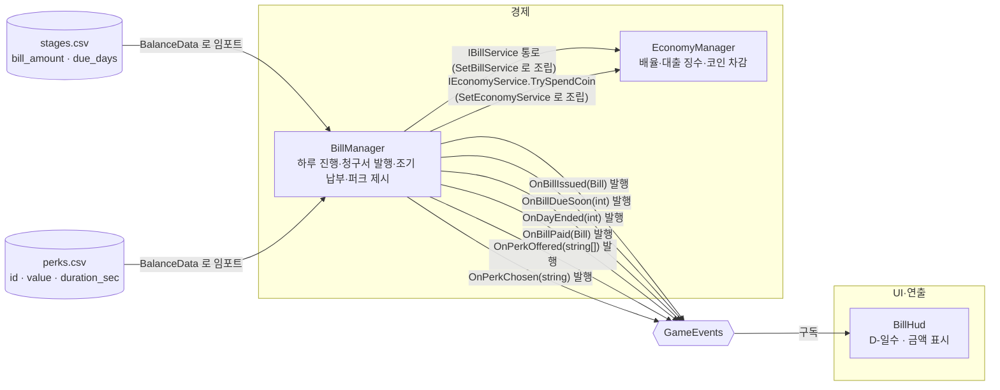

# 하루 진행과 청구서

> 관련 이슈: #27, #28, #29 · 최종 수정: 2026-09-17

**이 문서는 로그다.** 이 기능을 고칠 때마다 갱신한다. 새 문서를 만들지 않는다.

## 무엇을 하는가

런 종료를 하루 종료로 집계하고, 하루가 시작될 때마다 `stages.csv` 단계값으로 청구서(금액·마감일)를 발행한다. HUD는 남은 일수와 금액을 항상 보여준다. 마감 전이면 `TryPay`로 언제든 조기 납부할 수 있고, 납부에 성공하면 `perks.csv`에서 3종을 무작위로 뽑아 `OnPerkOffered`로 알린 뒤 `TryChoosePerk`로 하나를 고른다(#28). 퍼크 효과의 실제 게임플레이 반영은 이 클래스 범위 밖 — 아래 "알려진 한계" 참고. 대출(#29)은 두 번째 청구서부터 활성 청구서 금액을 한도로 빌리고(`TryTakeLoan`), 이자를 더한 전액을 한 번에 갚는다(`TryRepayLoan`). 미상환 기간에는 `LoanDailyCut`이 0이 아니게 되어 `EconomyManager`가 수입에서 그만큼 떼며, 그 징수분은 부채를 줄이지 않는다. 파산 판정(4.4)은 여전히 이 문서 범위 밖이다. 게임 규칙은 [GDD](../GDD.md)에 있으니 여기서 반복하지 않는다.

## 왜 이 방법인가

| 검토한 방법 | 채택 | 이유 |
|---|---|---|
| `BillManager`가 `EconomyManager`처럼 싱글톤 + `IBillService` 구현, `Managers` 프리팹에 부착 | ✅ | 기존 매니저(EconomyManager/StaminaManager/SaveManager) 패턴과 동일해 팀이 이미 아는 구조를 그대로 쓴다. `ManagerBootstrap`이 조립 지점에서 `EconomyManager.SetBillService`로 연결한다 |
| 별도 `StageManager`를 새로 만들어 단계 진행을 관리 | ❌ | 이슈 #27 범위 밖(공용 계약에 없는 새 매니저). 당장은 `BillManager` 내부의 `_billIndex` 순번으로 `stages.csv`를 순서대로 읽는 것으로 충분하고, 단계 진행 전담 매니저가 필요해지면 그때 분리한다 |
| HUD가 매 프레임 `IBillService.DaysLeft`를 폴링 | ❌ | ARCHITECTURE.md 3절 "UI는 구독 후 공용 조회 인터페이스로 초기 상태를 한 번 읽는다"에 어긋난다. `GameEvents.OnBillDueSoon`(이미 선언돼 있었지만 아무도 발행하지 않던 이벤트)을 `BillManager.BeginRun()` 끝에서 발행하도록 고쳐 HUD가 구독하게 했다 |
| `OnBillDueSoon`을 "마감 임박" 때만(예: 2일 이하) 발행 | ❌ | 이슈 #27 완료 기준이 "HUD는 항상 일수·금액을 보여준다"라 매일 갱신이 필요하다. `contracts.md`의 "마감 임박 시" 설명과는 결이 다르지만 인자·발행 메서드 시그니처(`Action<int>`, `PublishBillDueSoon(int)`)는 그대로이므로 계약 변경이 아니다 — 다음에 "진짜 임박" 필터가 필요해지면 그때 구독측(HUD)에서 걸러도 된다 |
| HUD를 `Game.unity`에 직접 배치 | ❌ | `Game.unity`은 "코어 플레이" 모듈 소유 씬이라 남의 씬을 고치면 안 된다(AGENTS.md). 대신 `Assets/Prefabs/UI/BillHud.prefab`(Canvas + TextMeshProUGUI)을 독립 프리팹으로 만들어 넘긴다 — 코어 플레이 담당이 씬에 배치하면 된다 |
| (#28) 퍼크 4종을 `IPerkEffect` 등으로 서브클래스화 | ❌ | 후보가 정확히 4종 고정이고 각자 적용 대상 시스템이 다를 뿐 분기 로직은 없다. `PerkType` enum + `PerkDef`(값·지속시간) 데이터 하나로 충분하다 — 과설계 금지(ponytail) |
| (#28) `TryPay`를 `BillManager`에 직접 추가 vs 새 `PaymentManager` 신설 | ✅ 전자 | `BillManager`가 이미 `_activeBill`과 마감 판정을 갖고 있다. 새 매니저를 만들면 활성 청구서 상태를 두 곳에서 동기화해야 한다 |
| (#28) 코인 차감을 `BillManager`가 직접 지갑 필드를 건드림 | ❌ | "코인 배율·차감은 EconomyManager 안에서만"(AGENTS.md). `BillManager`는 `IEconomyService.TrySpendCoin`만 호출하고, `EconomyManager`가 `ManagerBootstrap`에서 `SetEconomyService`로 주입된다(`EconomyManager`가 `SetBillService`로 자신을 넘기는 것과 대칭 구조) |
| (#28) 퍼크 선택 시 즉시 스태미나/코인배율/타격력 등에 반영 | ❌ | 각 수치는 StaminaManager·EconomyManager·코어 플레이 등 다른 모듈 소유다. `BillManager`는 `OnPerkChosen(string perkId)` 이벤트만 발행하고, 각 시스템이 `BalanceData.GetPerk(id)`로 값을 읽어 스스로 적용하는 훅만 열어 둔다(이슈 범위 밖, 알려진 한계 참고) |
| (#28) 퍼크 고르는 메서드 이름을 `ChoosePerk` 로 둠 | ❌ | `IBillService`의 다른 액션 메서드(`TryPay`/`TryTakeLoan`/`TryRepayLoan`)가 전부 실패 가능성을 이름에 담는 `Try*` 접두어라, `TryChoosePerk`로 맞췄다(convention-checker 지적) |
| (#29) 일일 징수율을 `loan_daily_cut_min`~`max` 범위에서 무작위로 뽑음 | ❌ | 같은 선택이 매번 다른 결과를 내면 7.2 밸런싱 실측도 Edit Mode 검증도 성립하지 않는다. 사채업자 분위기는 살지만 검증 비용이 그보다 크다 |
| (#29) 빌린 금액에 비례해 정함 — 전액이면 상한, 소액이면 하한 | ✅ | 결정적이라 검증·실측이 가능하고 "많이 빌릴수록 비싸다"는 저울질이 생긴다. `Loan.DailyCut`을 대출 시 1회 결정하고 고정한다는 ARCHITECTURE 계약과도 맞는다 |
| (#29) 대출 한도를 두지 않고 호출측(UI)에 맡김 | ❌ | 한도가 없으면 한 번에 빚을 몰아 나선형 파산이 난다. BALANCE.md 4절이 "청구서 전액을 빌리면"을 전제로 상환 가능성을 검증하므로 활성 청구서 금액을 상한으로 삼았다 |
| (#29) 저장·복원을 이 이슈에서 함께 붙임 | ❌ | `IBillService`에 복원 통로를 더하는 공용 계약 변경이라 규칙상 별도 이슈가 먼저다(AGENTS.md). 날짜·청구서·퍼크 후보 저장까지 함께 걸리는 범위라 #29 완료 기준을 넘는다 |

## 구조

<!-- GameEvents 를 거치는 관계는 이벤트 노드를 경유해 그린다. 모듈끼리 직접 잇지 않는다 -->

| 클래스 | 경로 | 하는 일 |
|---|---|---|
| `BillManager` | `Assets/Scripts/Runtime/Economy/BillManager.cs` | `IBillService` 구현. `BeginRun`으로 하루 시작(날짜 증가·청구서 발행), `EndRun`으로 하루 종료(`OnDayEnded` 발행), `TryPay`로 조기 납부(`IEconomyService.TrySpendCoin` 경유) 성공 시 퍼크 3종을 뽑아 `OnPerkOffered` 발행, `TryChoosePerk`로 하나를 고르면 `OnPerkChosen` 발행. 대출은 `TryTakeLoan`으로 빌리고 `TryRepayLoan`으로 갚으며, 징수율은 `LoanDailyCut`으로만 내보낸다(#29) |
| `BillHud` | `Assets/Scripts/Runtime/UI/BillHud.cs` | `OnBillIssued`/`OnBillDueSoon` 구독, `TextMeshProUGUI`에 "D-N  N원" 형식으로 표시 |
| (프리팹) | `Assets/Prefabs/UI/BillHud.prefab` | Canvas(ScreenSpaceOverlay) + `BillLabel`(우상단, `BillHud` 부착) |
| `BillManagerChecks` | `Assets/Scripts/Editor/BillManagerChecks.cs` | EditMode 배치 검증. `MenuItem` 없이 `RunBatch()`를 외부에서 호출한다 |

### 이벤트

| 이벤트 | 발행/구독 | 언제 |
|---|---|---|
| `GameEvents.OnBillIssued` | `BillManager`가 발행, `BillHud`가 구독 | 새 청구서가 만들어질 때(활성 청구서가 없는 상태에서 `BeginRun` 호출 시) |
| `GameEvents.OnBillDueSoon` | `BillManager`가 발행, `BillHud`가 구독 | 활성 청구서가 있는 상태로 `BeginRun`이 끝날 때마다(하루마다). 인자는 그 시점의 `DaysLeft` |
| `GameEvents.OnDayEnded` | `BillManager`가 발행 | `EndRun` 호출 시. 런당 한 번 = 날짜당 한 번 |
| `GameEvents.OnBillPaid` | `BillManager`가 발행 | `TryPay` 성공 시(#28). 구독자 아직 없음 — UI는 이슈 범위 밖 |
| `GameEvents.OnPerkOffered` | `BillManager`가 발행 | `TryPay` 성공 직후, `perks.csv`에서 무작위로 뽑은 퍼크 id 3개(#28). 구독자 아직 없음 — 선택 UI는 이슈 범위 밖 |
| `GameEvents.OnPerkChosen` | `BillManager`가 발행 | `TryChoosePerk` 성공 시, 고른 퍼크 id(#28). 구독자 아직 없음 — 효과 적용은 각 시스템 몫(알려진 한계 참고) |

### 읽는 밸런스 값

| CSV | 열 | 쓰는 곳 |
|---|---|---|
| `Assets/GameData/Balance/stages.csv` | `bill_amount` | 청구서 금액(`Bill.Amount`) |
| `Assets/GameData/Balance/stages.csv` | `due_days` | 청구서 마감일 계산(`Bill.DueDay = IssuedDay + due_days - 1`) |
| `Assets/GameData/Balance/perks.csv` | `id` | `PerkType`(스냅케이스) 매칭 — `PerkDef.Id`, `BalanceData.GetPerk(id)` 조회 키 |
| `Assets/GameData/Balance/perks.csv` | `value` | 퍼크 효과 수치(`PerkDef.Value`). 실제 적용은 각 시스템 몫 — 알려진 한계 참고 |
| `Assets/GameData/Balance/perks.csv` | `duration_sec` | 지속시간(`PerkDef.DurationSec`). `coin_gain_boost`만 0보다 커야 하고 나머지는 0이어야 한다(임포터 검증) |
| `Assets/GameData/Balance/bills.csv` | `loan_unlock_bill_index` | 대출 해금 순번 — 손에 든 청구서가 몇 번째부터 빌릴 수 있나 |
| `Assets/GameData/Balance/bills.csv` | `loan_interest_rate` | 상환액 계산(`CalculateOwed`, 소수 올림) |
| `Assets/GameData/Balance/bills.csv` | `loan_daily_cut_min`·`loan_daily_cut_max` | 일일 징수율을 빌린 금액에 비례해 보간하는 범위(`CalculateDailyCut`) |
| `Assets/GameData/Balance/bills.csv` | `loan_cooldown_days` | 완제 후 재대출 금지 일수(`IsLoanOnCooldown`) |
| `Assets/GameData/Balance/bills.csv` | `loan_max_concurrent` | 동시에 유지할 수 있는 대출 건수 |

## 검증

Unity 6000.3.21f1 헤드리스 배치 실행, 2026-09-17.

- [x] 컴파일: `unity run . -- -executeMethod NCAIClicker.EditorTools.BillManagerChecks.RunBatch -logFile -` → 도메인 리로드 포함 정상 종료, `error CS` 0건
- [x] `BillManagerChecks.RunBatch()`: `[BillManagerChecks] PASS 15 checks.` — 기존 6건(#27, 위 최초 작성 시점 내용) + 신규 9건(#28): `TryPay` 성공 시 코인 차감(`IEconomyService.TrySpendCoin` 경유)·`OnBillPaid` 발행·`_activeBill` 해제, 잔액 부족 시 `TryPay` 실패, 이미 낸 청구서 재납부 실패, `TryPay` 성공 시 `perks.csv` 4종 중 3개를 중복 없이 뽑아 `OnPerkOffered` 발행, 후보에 없는 id로 `TryChoosePerk` 실패(후보 목록·`OnPerkChosen` 불변), 후보 중 하나로 `TryChoosePerk` 성공(`OnPerkChosen` 발행·후보 목록 비움), 이미 고른 뒤 재선택 실패
- [x] `EconomyManagerChecks.RunBatch()` 회귀: `[EconomyManagerChecks] PASS 8 checks.` — `IBillService` 확장(`ActiveBill`/`OfferedPerkIds`/`TryChoosePerk` 추가)으로 `FakeBillService`를 고친 뒤에도 기존 배선·대출 징수 검증이 깨지지 않음을 확인
- [x] (#29) `BillManagerChecks.RunBatch()`: `[BillManagerChecks] PASS 23 checks.` — 열린 에디터에서 MCP로 직접 호출(헤드리스 배치 아님), 2026-09-17. 기존 14건(#27·#28 — 대출 스텁 전제 1건은 실제 동작 검증으로 대체) + 신규 9건(`RunLoanChecks`): 첫 청구서에서 대출 잠김, 두 번째 청구서에서 해금, 청구서 금액 초과 거부, 전액 대출 성공(원금이 `AddLoanPrincipal`로 입금·징수율이 상한), 동시 1건 거부, 잔액 부족 시 상환 실패(대출·징수율 불변), 상환 성공(이자 포함 금액 차감·징수율 0), 완제 직후 쿨다운 거부, 쿨다운 경과 후 재대출 성공(소액이라 징수율이 하한 쪽)
- [x] (#29) `EconomyManagerChecks.RunBatch()` 회귀: `[EconomyManagerChecks] PASS 8 checks.` — `LoanDailyCut`이 실제 값을 돌려주게 된 뒤에도 기존 징수 배선이 그대로 통과함을 확인
- [ ] (#29) 대출을 실제로 쓰는 플레이 흐름 — `TryTakeLoan`을 부르는 UI가 아직 없어 Play Mode 미검증(알려진 한계 참고)
- [x] `BillHud.prefab` 생성(#27): 임시 `-executeMethod` 스크립트(`TempBillHudPrefabBuilder.Build`, 실행 후 삭제)로 `PrefabUtility.SaveAsPrefabAsset` → `[TempBillHudPrefabBuilder] 저장 완료` 로그 확인, 정상 종료
- [x] `perks.csv` → `NCAI > 밸런스 CSV 임포트`로 `BalanceData.asset` 재생성, 임포터 검증(4종 고정·`id` 중복 없음·`CoinGainBoost`만 `duration_sec > 0`) 통과
- [ ] 에디터 Play Mode에서 실제 HUD·퍼크 선택 UI 확인 — `Game.unity`에 프리팹을 배치하는 것은 코어 플레이 모듈 담당 몫이고, 퍼크 선택 UI 자체가 아직 없다(알려진 한계 참고). 미검증
- [ ] `GameManager`가 `BeginRun`/`EndRun`을 실제로 호출하는 배선(작업 2.5) — 아직 없다. 미검증

## 알려진 한계

- `GameManager`가 아직 `BillManager.BeginRun()`/`EndRun()`을 호출하지 않는다(작업 2.5, 이 이슈 범위 밖). 지금은 `BillManagerChecks`가 직접 호출해서만 검증했다.
- ~~단계 진행(`_billIndex`)을 `BillManager`가 자체 순번으로 관리한다.~~ — #150 에서 `IStageService` 단일 출처 연결로 해결됐다. 청구서 금액과 기한은 현재 단계를 따르고, `_billIndex` 는 대출 해금 등에서 쓸 누적 발행 순번으로만 쓰인다.
- 파산 판정(#30)이 없어 청구서를 기한 내에 내지 않아도 아무 일이 일어나지 않는다. HUD의 "D-0"은 기한 초과 상태를 그대로 보여줄 뿐이다.
- 대출을 부르는 UI가 없다. `TryTakeLoan`의 금액은 호출측이 정하고 이 클래스는 활성 청구서 금액을 넘지 못하게만 막는다 — 얼마를 빌릴지 고르는 화면은 아직 없다.
- 대출 상태(`ActiveLoan`·`LastLoanRepaidDay`)가 저장·복원되지 않는다. `SaveData`에 필드는 이미 있지만 `IBillService`에 복원 통로가 없어 재실행하면 빚이 사라진다 — 공용 계약 변경이라 별도 이슈로 발의한다.
- 징수는 수입이 들어올 때만 일어난다. 하루 종일 한 푼도 벌지 못하면 뜯기는 것도 없다 — 원작이 그러한지는 7.2 실측에서 확인한다.
- `BillManager`의 날짜·청구서·퍼크 후보(`OfferedPerkIds`) 상태는 저장/복원되지 않는다(`SaveManager` 미연동). ARCHITECTURE.md는 `SaveData.OfferedPerkIds`/`PendingPerkIds` 필드를 이미 계약해 뒀으므로, 저장 연동은 그 필드에 채워 넣는 방식으로 붙이면 된다.
- `BillHud.prefab`은 `Game.unity`에 아직 배치되지 않았다. 코어 플레이 담당이 씬에 넣어야 실제로 보인다.
- ~~퍼크 선택(`OnPerkChosen`)의 실제 게임플레이 효과 적용이 없다.~~ — #126 에서 네 소유자(`StaminaManager`·`EconomyManager`·`HammerSwingController`·`CreatureManager`)가 `OnPerkChosen` 을 구독해 스스로 적용한다. 적용 시점 규칙과 한계는 [퍼크 효과](perks.md).
- 퍼크 선택 UI가 없다. GDD 6.9절이 요구하는 "선택 중 게임 시계 정지" 같은 연출도 그 UI가 생긴 뒤에야 붙일 수 있다.

## 갱신 이력

| 날짜 | 이슈 | 누가 | 무엇이 바뀌었나 |
|---|---|---|---|
| 2026-09-17 | #27 | Claude | 최초 작성 — `BillManager`/`BillHud` 구현, `OnBillDueSoon` 발행 연결 |
| 2026-09-17 | #28 | Claude | `TryPay` 조기 납부 구현, `perks.csv`/`PerkType`/`PerkDef` 추가, 납부 성공 시 퍼크 3종 제시(`OnPerkOffered`)·선택(`TryChoosePerk`, `OnPerkChosen`) |
| 2026-09-17 | #29 | Claude | 대출 구현 — 해금 순번·청구서 금액 한도·이자 올림·금액 비례 징수율·동시 1건·재대출 쿨다운. `BillManagerChecks`에 `RunLoanChecks` 추가 |
| 2026-09-18 | #150 | saltlake00 | `IStageService` 연결 — 자체 단계 순번을 걷어내고 단일 출처의 현재 단계로 청구서 발행 |
