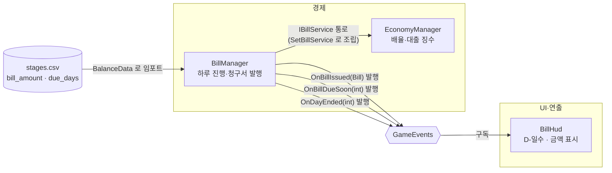

# 하루 진행과 청구서

> 관련 이슈: #27 · 최종 수정: 2026-09-17

**이 문서는 로그다.** 이 기능을 고칠 때마다 갱신한다. 새 문서를 만들지 않는다.

## 무엇을 하는가

런 종료를 하루 종료로 집계하고, 하루가 시작될 때마다 `stages.csv` 단계값으로 청구서(금액·마감일)를 발행한다. HUD는 남은 일수와 금액을 항상 보여준다. 납부·대출·파산 판정(이슈 #27 범위 밖)은 `IBillService`의 스텁(`TryPay`/`TryTakeLoan`/`TryRepayLoan`)으로만 계약을 지키고 실제 동작은 아직 없다. 게임 규칙은 [GDD](../GDD.md)에 있으니 여기서 반복하지 않는다.

## 왜 이 방법인가

| 검토한 방법 | 채택 | 이유 |
|---|---|---|
| `BillManager`가 `EconomyManager`처럼 싱글톤 + `IBillService` 구현, `Managers` 프리팹에 부착 | ✅ | 기존 매니저(EconomyManager/StaminaManager/SaveManager) 패턴과 동일해 팀이 이미 아는 구조를 그대로 쓴다. `ManagerBootstrap`이 조립 지점에서 `EconomyManager.SetBillService`로 연결한다 |
| 별도 `StageManager`를 새로 만들어 단계 진행을 관리 | ❌ | 이슈 #27 범위 밖(공용 계약에 없는 새 매니저). 당장은 `BillManager` 내부의 `_billIndex` 순번으로 `stages.csv`를 순서대로 읽는 것으로 충분하고, 단계 진행 전담 매니저가 필요해지면 그때 분리한다 |
| HUD가 매 프레임 `IBillService.DaysLeft`를 폴링 | ❌ | ARCHITECTURE.md 3절 "UI는 구독 후 공용 조회 인터페이스로 초기 상태를 한 번 읽는다"에 어긋난다. `GameEvents.OnBillDueSoon`(이미 선언돼 있었지만 아무도 발행하지 않던 이벤트)을 `BillManager.BeginRun()` 끝에서 발행하도록 고쳐 HUD가 구독하게 했다 |
| `OnBillDueSoon`을 "마감 임박" 때만(예: 2일 이하) 발행 | ❌ | 이슈 #27 완료 기준이 "HUD는 항상 일수·금액을 보여준다"라 매일 갱신이 필요하다. `contracts.md`의 "마감 임박 시" 설명과는 결이 다르지만 인자·발행 메서드 시그니처(`Action<int>`, `PublishBillDueSoon(int)`)는 그대로이므로 계약 변경이 아니다 — 다음에 "진짜 임박" 필터가 필요해지면 그때 구독측(HUD)에서 걸러도 된다 |
| HUD를 `Game.unity`에 직접 배치 | ❌ | `Game.unity`은 "코어 플레이" 모듈 소유 씬이라 남의 씬을 고치면 안 된다(AGENTS.md). 대신 `Assets/Prefabs/UI/BillHud.prefab`(Canvas + TextMeshProUGUI)을 독립 프리팹으로 만들어 넘긴다 — 코어 플레이 담당이 씬에 배치하면 된다 |

## 구조

<!-- GameEvents 를 거치는 관계는 이벤트 노드를 경유해 그린다. 모듈끼리 직접 잇지 않는다 -->

| 클래스 | 경로 | 하는 일 |
|---|---|---|
| `BillManager` | `Assets/Scripts/Runtime/Economy/BillManager.cs` | `IBillService` 구현. `BeginRun`으로 하루 시작(날짜 증가·청구서 발행), `EndRun`으로 하루 종료(`OnDayEnded` 발행). 납부·대출은 스텁 |
| `BillHud` | `Assets/Scripts/Runtime/UI/BillHud.cs` | `OnBillIssued`/`OnBillDueSoon` 구독, `TextMeshProUGUI`에 "D-N  N원" 형식으로 표시 |
| (프리팹) | `Assets/Prefabs/UI/BillHud.prefab` | Canvas(ScreenSpaceOverlay) + `BillLabel`(우상단, `BillHud` 부착) |
| `BillManagerChecks` | `Assets/Scripts/Editor/BillManagerChecks.cs` | EditMode 배치 검증. `MenuItem` 없이 `RunBatch()`를 외부에서 호출한다 |

### 이벤트

| 이벤트 | 발행/구독 | 언제 |
|---|---|---|
| `GameEvents.OnBillIssued` | `BillManager`가 발행, `BillHud`가 구독 | 새 청구서가 만들어질 때(활성 청구서가 없는 상태에서 `BeginRun` 호출 시) |
| `GameEvents.OnBillDueSoon` | `BillManager`가 발행, `BillHud`가 구독 | 활성 청구서가 있는 상태로 `BeginRun`이 끝날 때마다(하루마다). 인자는 그 시점의 `DaysLeft` |
| `GameEvents.OnDayEnded` | `BillManager`가 발행 | `EndRun` 호출 시. 런당 한 번 = 날짜당 한 번 |

### 읽는 밸런스 값

| CSV | 열 | 쓰는 곳 |
|---|---|---|
| `Assets/GameData/Balance/stages.csv` | `bill_amount` | 청구서 금액(`Bill.Amount`) |
| `Assets/GameData/Balance/stages.csv` | `due_days` | 청구서 마감일 계산(`Bill.DueDay = IssuedDay + due_days - 1`) |

## 검증

Unity 6000.3.21f1 헤드리스 배치 실행, 2026-09-17.

- [x] 컴파일: `unity run . -- -executeMethod NCAIClicker.EditorTools.BillManagerChecks.RunBatch -logFile -` → 도메인 리로드 포함 정상 종료, `error CS` 0건
- [x] `BillManagerChecks.RunBatch()`: `[BillManagerChecks] PASS 6 checks.` — 시작 전 상태(1일차·청구서 없음), 첫 `BeginRun` 청구서 발행(금액·마감일·`DaysLeft`·`OnBillDueSoon` 발행값 일치), 두 번째 `BeginRun` 날짜 증가·미납 시 재발행 안 함·`DaysLeft` 감소·`OnBillDueSoon` 갱신, 기한 초과 시 `DaysLeft` 0 고정, `EndRun` 1회당 `OnDayEnded` 1회, `TryPay`/`TryTakeLoan`/`TryRepayLoan`/`LoanDailyCut` 스텁 반환값
- [x] `BillHud.prefab` 생성: 임시 `-executeMethod` 스크립트(`TempBillHudPrefabBuilder.Build`, 실행 후 삭제)로 `PrefabUtility.SaveAsPrefabAsset` → `[TempBillHudPrefabBuilder] 저장 완료` 로그 확인, 정상 종료
- [ ] 에디터 Play Mode에서 실제 HUD 표시 확인 — `Game.unity`에 프리팹을 배치하는 것은 코어 플레이 모듈 담당 몫이라 이 이슈에서는 하지 않았다. 미검증
- [ ] `GameManager`가 `BeginRun`/`EndRun`을 실제로 호출하는 배선(작업 2.5) — 아직 없다. 미검증

## 알려진 한계

- `GameManager`가 아직 `BillManager.BeginRun()`/`EndRun()`을 호출하지 않는다(작업 2.5, 이 이슈 범위 밖). 지금은 `BillManagerChecks`가 직접 호출해서만 검증했다.
- 단계 진행(`_billIndex`)을 `BillManager`가 자체 순번으로 관리한다. 전담 단계 매니저가 생기면 이 필드를 걷어내고 그쪽 조회로 바꿔야 한다.
- 납부(#28)·대출(#29)·파산 판정(#30)은 스텁이라 청구서가 한 번 발행되면 절대 사라지지 않는다. HUD의 "D-0"은 기한 초과 상태를 그대로 보여줄 뿐 파산 처리로 이어지지 않는다.
- `BillManager`의 날짜·청구서 상태는 저장/복원되지 않는다(`SaveManager` 미연동).
- `BillHud.prefab`은 `Game.unity`에 아직 배치되지 않았다. 코어 플레이 담당이 씬에 넣어야 실제로 보인다.

## 갱신 이력

| 날짜 | 이슈 | 누가 | 무엇이 바뀌었나 |
|---|---|---|---|
| 2026-09-17 | #27 | Claude | 최초 작성 — `BillManager`/`BillHud` 구현, `OnBillDueSoon` 발행 연결 |
