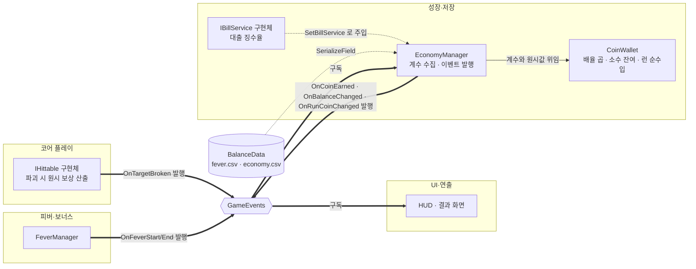

# 코인 정산

> 관련 이슈: #22 · 최종 수정: 2026-09-16

**이 문서는 로그다.** 이 기능을 고칠 때마다 갱신한다. 새 문서를 만들지 않는다.

## 무엇을 하는가

타격 대상이 부서질 때 나온 **원시 보상**에 피버 배율·보너스 배율·대출 징수를 적용해 지갑에 넣는다.
배율을 적용하는 곳은 여기 하나뿐이고, 호출측은 가공 전 값만 넘긴다.
규칙의 정본은 [ARCHITECTURE](../ARCHITECTURE.md) "코인 계산·정산 계약" 3~8번이다.

## 왜 이 방법인가

| 검토한 방법 | 채택 | 이유 |
|---|---|---|
| 계산부(`CoinWallet`)를 매니저에서 떼어낸다 | ✅ | Edit Mode 에서 프리팹 없이 수식 전체를 검증할 수 있다. 매니저에는 구독과 발행만 남아 얇아진다 |
| `EconomyManager` 한 클래스에 전부 넣는다 | ❌ | MonoBehaviour 라서 Edit Mode 에서 `OnEnable` 이 돌지 않는다. 수식 하나 확인하려고 프리팹과 Play Mode 가 필요해진다 |
| `decimal` 로 계산한다 | ✅ | 계약 4번이 요구한다. 아래 두 대안이 실제로 틀린 값을 낸다 |
| `long` 으로 계산한다 | ❌ | 배율 곱에서 소수가 매번 잘려 파괴 보상이 체계적으로 깎인다 |
| `float`/`double` 로 계산한다 | ❌ | 0.1 을 열 번 더해도 1 에 못 미쳐 입금이 0 이 된다. 검증으로 확인했다 |
| 피버 배율을 FeverManager 에서 직접 받는다 | ❌ | 매니저 구현 클래스 직접 참조 금지. 게다가 FeverManager 가 없으면 컴파일도 안 된다 |
| 피버 상태를 `OnFeverStart`/`OnFeverEnd` 로 받는다 | ✅ | 의존이 0 이다. 배율 값은 CSV 에서 읽으면 된다 |

## 구조

| 클래스 | 경로 | 하는 일 |
|---|---|---|
| `EconomyManager` | `Assets/Scripts/Runtime/Economy/EconomyManager.cs` | `IEconomyService` 구현. 이벤트 구독·발행, 배율 계수 수집. `Managers` 프리팹에 붙는다 |
| `CoinWallet` | `Assets/Scripts/Runtime/Economy/CoinWallet.cs` | 배율 곱, 소수 잔여 이월, 런 순수입 집계. 이벤트를 모른다 |
| `CoinWalletChecks` | `Assets/Scripts/Editor/CoinWalletChecks.cs` | 계산식 검증 11건 |
| `EconomyManagerChecks` | `Assets/Scripts/Editor/EconomyManagerChecks.cs` | 이벤트 배선 검증 8건 |

계산식 자체는 [ARCHITECTURE](../ARCHITECTURE.md) "코인 계산·정산 계약" 4·5번이 정본이라 옮겨 적지 않는다.
구현에서 갈리는 지점만 적는다 — `CoinWallet` 은 **누적기를 두 개** 들고 있다.
하나는 지갑(소수 잔여를 이월), 하나는 런 순수입이다.
단계 목표가 *이번 런 획득량* 기준이라 전날 잔여·대출 원금·지출이 섞이면 판정이 흐려지기 때문이다.
하나로 합치면 `BeginRun` 직후 검증이 깨진다.

### 이벤트

| 이벤트 | 발행/구독 | 언제 |
|---|---|---|
| `GameEvents.OnTargetBroken` | 구독 | 대상 파괴. **코인 지급의 유일한 입구다** |
| `GameEvents.OnFeverStart` / `OnFeverEnd` | 구독 | 피버 배율을 켜고 끈다 |
| `GameEvents.OnCoinEarned` | 발행 | 지갑에 실제로 들어간 정수 증분. 0 이면 발행하지 않는다 |
| `GameEvents.OnBalanceChanged` | 발행 | 입금·지출·대출 원금·복원 뒤 잔액 |
| `GameEvents.OnRunCoinChanged` | 발행 | 런 순수입 **정수값이 바뀐 때만**. 파괴마다 같은 값을 다시 쏘지 않는다 |

구독은 `OnEnable`, 해제는 `OnDisable` 에서 쌍으로 한다. 빠뜨리면 코인이 두 배로 들어간다.

### 읽는 밸런스 값

| CSV | 열 | 쓰는 곳 |
|---|---|---|
| `Assets/GameData/Balance/fever.csv` | `coin_multiplier` | 피버 중 배율 |
| `Assets/GameData/Balance/economy.csv` | `coin_bonus_multiplier` | 보너스 배율 기준값 |

대출 징수율은 `bills.csv` 가 원본이지만 이 기능이 직접 읽지 않는다.
`IBillService.LoanDailyCut` 으로 받으며, 주입 전에는 0 이다.

## 검증

Unity 6000.3.21f1, Edit Mode, 2026-09-16.

- [x] `CoinWalletChecks.RunBatch()` 11건 통과 — 배율 곱, 소수 이월, 런 경계 분리, 대출 원금 제외, 저장 왕복, 계약 위반 인자 예외
- [x] `EconomyManagerChecks.RunBatch()` 8건 통과 — 파괴 1회당 지급 1회, 해제 후 미지급, 재구독 시 중복 없음, 피버 on/off, 대출 징수, `BeginRun`, 복원
- [x] **연속 3회 실행 통과** — 정적 이벤트 구독이 새면 2회차부터 깨진다. 이걸로 누수 없음을 확인했다
- [x] 컴파일 에러·경고 0건
- [x] `Managers.prefab` 에 컴포넌트 부착, `_balanceData` 가 `BalanceData.asset`(guid `148d52a3…`)을 가리키는 것을 프리팹 diff 로 확인
- [ ] **Play Mode 미검증** — Unity 가 `OnEnable`/`OnDisable` 을 실제로 그 시점에 부르는지. 아래 한계 참고
- [x] **실제 루프 확인** (2026-09-16, 작업 2.1) — `Target` 프리팹을 3타로 부수니
      `OnTargetBroken` → `EconomyManager` → 지갑 4코인 / `RunCoin` 4 로 이어졌다.
      다만 스폰과 이동이 붙은 상태에서는 아직 못 돌려 봤다 (작업 2.2)

## 알려진 한계

- **`IEconomyService` 에 없는 public API 가 4개다** — `SetBillService`, `BeginRun`, `RestoreWallet`,
  `CurrentRemainderText`. 이걸 쓰려면 BillManager·GameManager·SaveManager 가 `EconomyManager`
  구현 클래스를 직접 잡아야 하고, 이는 ARCHITECTURE 2절의 직접 참조 금지와 충돌한다.
  **공용 계약 변경 이슈가 필요하다.**
- **Edit Mode 에서는 Unity 가 MonoBehaviour 생명주기를 부르지 않는다.** 그래서 검증이
  `OnEnable`/`OnDisable` 을 리플렉션으로 직접 불러 *구독과 해제가 짝을 이루는지* 만 본다.
  Play Mode 로 옮기지 못한 이유는 테스트 asmdef 가 런타임 코드(`Assembly-CSharp`)를 참조할 수 없기
  때문이다 — 런타임에 asmdef 가 없다. **이건 이 기능만의 문제가 아니라 모든 매니저에 해당한다.**
- 리플렉션 문자열(`"_balanceData"`, `"OnEnable"`)은 이름이 바뀌면 컴파일이 아니라 실행 시점에 깨진다.
- `CoinWallet` 이 `public` 이라 다른 런타임 스크립트가 직접 `new CoinWallet()` 으로 배율을 적용할 수
  있다. `internal` 로 좁혀도 같은 어셈블리라 막히지 않고 Editor 검증만 깨지므로, **소유자는
  `EconomyManager` 하나** 라는 약속에 기대고 있다.
- 보너스 배율은 CSV 기준값만 읽는다. 퍼크 가산(작업 4.2)과 업그레이드 효과(작업 3.3)를 반영할
  통로가 아직 없다.
- 파산 시 소수 잔여를 버리는 처리(계약 7번)는 전용 API 없이 `RestoreWallet(0, "0")` 으로만 된다.
  파산 처리 주체(작업 4.4)가 생길 때 다시 본다.
- `SaveManager`(작업 3.4)가 없어 지금은 매번 잔액 0 에서 시작한다. 초기화 순서상
  저장 로드가 먼저여야 한다 (ARCHITECTURE 1절).

## 갱신 이력

| 날짜 | 이슈 | 누가 | 무엇이 바뀌었나 |
|---|---|---|---|
| 2026-09-16 | #22 | twins6375-art | 최초 작성 (CoinWallet, EconomyManager, 검증 19건) |
| 2026-09-16 | #16 | twins6375-art | 타격 대상이 생겨 실제 지급 경로를 확인. 검증 절 갱신 |
