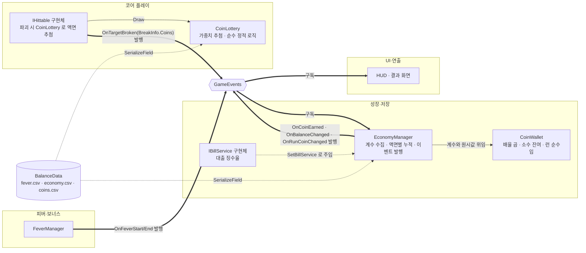

# 코인 정산

> 관련 이슈: #22, #71, #116, #32, #126, #30, #178, #217, #235 · 최종 수정: 2026-09-22

**이 문서는 로그다.** 이 기능을 고칠 때마다 갱신한다. 새 문서를 만들지 않는다.

## 무엇을 하는가

타격 대상이 부서지는 순간 `CoinLottery`가 `coins.csv` 가중치 테이블에서 코인 액면을 추첨해
**원시 보상**(액면들의 합)과 그 구성(`CoinDrop[]`)을 함께 만든다. `EconomyManager`는 이 원시
보상에 피버 배율·보너스 배율·대출 징수를 적용해 지갑에 넣고, 구성은 런 단위로 누적해
`RunCoinBreakdown`으로 노출한다. 배율을 적용하는 곳은 여기 하나뿐이고, 호출측은 가공 전 값만 넘긴다.
규칙의 정본은 [ARCHITECTURE](../ARCHITECTURE.md) "코인 계산·정산 계약" 2~9번이다.
코인 개수와 지급 금액이 서로 다른 값이라는 점, 액면 추첨 자체는 [BALANCE](../BALANCE.md) 3절
"코인 액면 추첨"이 다룬다 — 이 문서는 정산 파이프라인만 본다.

## 왜 이 방법인가

| 검토한 방법 | 채택 | 이유 |
|---|---|---|
| 계산부(`CoinWallet`)를 매니저에서 떼어낸다 | ✅ | Edit Mode 에서 프리팹 없이 수식 전체를 검증할 수 있다. 매니저에는 구독과 발행만 남아 얇아진다 |
| `EconomyManager` 한 클래스에 전부 넣는다 | ❌ | MonoBehaviour 라서 Edit Mode 에서 `OnEnable` 이 돌지 않는다. 수식 하나 확인하려고 프리팹과 Play Mode 가 필요해진다 |
| `decimal` 로 계산한다 | ✅ | 계약 4번이 요구한다. 아래 두 대안이 실제로 틀린 값을 낸다 |
| `long` 으로 계산한다 | ❌ | 배율 곱에서 소수가 매번 잘려 파괴 보상이 체계적으로 깎인다 |
| `float`/`double` 로 계산한다 | ❌ | 0.1 을 열 번 더해도 1 에 못 미쳐 입금이 0 이 된다. 검증으로 확인했다 |
| 피버 배율을 FeverManager 에서 직접 받는다 | ❌ | 매니저 구현 클래스 직접 참조 금지. 게다가 FeverManager 가 없으면 컴파일도 안 된다 |
| 피버 상태를 `OnFeverStart`/`OnFeverEnd` 로 받는다 | ✅ | 의존이 0 이다. **상태만 받고 배율 값은 이쪽이 정한다** — 업그레이드가 배율을 올리는데(#32) 그 레벨도 여기 있어서, 값까지 받으면 오히려 두 곳을 봐야 한다 |

## 구조



| 클래스 | 경로 | 하는 일 |
|---|---|---|
| `EconomyManager` | `Assets/Scripts/Runtime/Economy/EconomyManager.cs` | `IEconomyService` 외 런 경계·저장·업그레이드 계약(#71·#111·#116)을 함께 구현. 이벤트 구독·발행, 배율 계수 수집, `BreakInfo.Coins` 를 액면별로 누적해 `RunCoinBreakdown` 노출(#178) |
| `CoinWallet` | `Assets/Scripts/Runtime/Economy/CoinWallet.cs` | 배율 곱, 소수 잔여 이월, 런 순수입 집계. 이벤트를 모른다 |
| `CoinLottery` | `Assets/Scripts/Runtime/Economy/CoinLottery.cs` | `coins.csv` 가중치 테이블에서 `coin_count`개 추첨(`min_denom_id` 필터), 액면 합계 계산. 순수 정적 로직 — 매니저·씬에 의존하지 않는다 (#178) |
| `UpgradeState` | `Assets/Scripts/Runtime/Economy/UpgradeState.cs` | 업그레이드 레벨·비용·실효값. `EconomyManager` 가 함께 들고 있다 — 자세한 것은 [업그레이드](upgrades.md) |
| `CoinWalletChecks` | `Assets/Scripts/Editor/CoinWalletChecks.cs` | 계산식 검증 11건 |
| `EconomyManagerChecks` | `Assets/Scripts/Editor/EconomyManagerChecks.cs` | 이벤트 배선 검증 8건 |
| `CoinLotteryChecks` | `Assets/Scripts/Editor/CoinLotteryChecks.cs` | 추첨 로직 검증 — 경계값, 액면 필터, 분포 수렴, 집계 (#178) |
| `CoinVisual` | `Assets/Scripts/Runtime/Economy/CoinVisual.cs` | `Coin.prefab`의 `Visual` 자식 아래 액면별 광석 모델 4종 중 하나만 활성화. 아직 아무도 호출하지 않는다 — 코인 스폰 기능이 붙을 때 `SetDenomination`을 부른다 (#235) |

계산식 자체는 [ARCHITECTURE](../ARCHITECTURE.md) "코인 계산·정산 계약" 4·5번이 정본이라 옮겨 적지 않는다.
구현에서 갈리는 지점만 적는다 — `CoinWallet` 은 **누적기를 두 개** 들고 있다.
하나는 지갑(소수 잔여를 이월), 하나는 런 순수입이다.
단계 목표가 *이번 런 획득량* 기준이라 전날 잔여·대출 원금·지출이 섞이면 판정이 흐려지기 때문이다.
하나로 합치면 `BeginRun` 직후 검증이 깨진다.

### 이벤트

| 이벤트 | 발행/구독 | 언제 |
|---|---|---|
| `GameEvents.OnTargetBroken` | 구독 | 대상 파괴. **코인 지급의 유일한 입구다.** `BreakInfo.Coins` 가 함께 온다 (#178) |
| `GameEvents.OnFeverStart` / `OnFeverEnd` | 구독 | 피버 배율을 켜고 끈다 |
| `GameEvents.OnCoinEarned` | 발행 | 지갑에 실제로 들어간 정수 증분. 0 이면 발행하지 않는다 |
| `GameEvents.OnBalanceChanged` | 발행 | 입금·지출·대출 원금·복원 뒤 잔액 |
| `GameEvents.OnRunCoinChanged` | 발행 | 런 순수입 **정수값이 바뀐 때만**. 파괴마다 같은 값을 다시 쏘지 않는다 |

구독은 `OnEnable`, 해제는 `OnDisable` 에서 쌍으로 한다. 빠뜨리면 코인이 두 배로 들어간다.

### 시각 매핑 (#235)

`Coin.prefab`은 코드 어디서도 스폰하지 않는 고아 프리팹이었다(grep 결과 참조 0건).
그래서 이번 작업은 스포너를 새로 만들지 않고 **프리팹 구조만** 갖췄다 — `SetDenomination`을
부르는 코드는 미래의 코인 스폰 기능 몫이다.

`coins.csv`는 액면 5개(c1/c5/c25/c100/c1000)지만 시각 자원은 광석 4종뿐이라 가장 희귀한
두 액면이 Gold를 공유한다(이슈 코멘트로 합의):

| 액면 | 시각 | 등장 비중(`coins.csv` weight 기준) |
|---|---|---|
| c1 | Iron | 60% |
| c5 | Copper | 25% |
| c25 | Silver | 10% |
| c100 | Gold | 4% |
| c1000 | Gold (재사용) | 1% |

`Coin.prefab` 구조 — 루트(Transform + CapsuleCollider)는 손대지 않았다(판정 반경이 공용 계약이라
#235 범위 밖):

```
Coin (Transform + CapsuleCollider + CoinVisual)
└ Visual (Transform, localScale = (1/0.3, 1/0.05, 1/0.3))
  ├ IronVisual   (OreChunkIronVisual.prefab 인스턴스, 기본 활성)
  ├ CopperVisual (OreChunkCopperVisual.prefab 인스턴스, 비활성)
  ├ SilverVisual (OreChunkSilverVisual.prefab 인스턴스, 비활성)
  └ GoldVisual   (OreChunkGoldVisual.prefab 인스턴스, 비활성)
```

루트 `localScale`이 `(0.3, 0.05, 0.3)`으로 비균일하다 — 그레이박스 시절 원통 메시를 얇은
코인 모양으로 눌러 놓은 값인데, 판정 반경을 바꾸는 게 이번 이슈 범위 밖이라 그대로 뒀다.
그대로 두면 그 아래 어떤 자식도 같은 비율로 눌린다. `Visual`에 역수 스케일
`(1/0.3, 1/0.05, 1/0.3)`을 줘서 그 지점에서 스케일을 다시 `(1,1,1)`로 되돌리고,
그 안의 광석 모델은 원래 계산된 절대 크기로 렌더링되게 했다.

각 `OreChunk{X}Visual.prefab`은 [mineral-creature-assets.md](mineral-creature-assets.md)와 같은
컨벤션이다 — 루트(빈 GameObject)가 스케일을 들고, 그 안에 `.glb` 임포트 자산의 중첩 인스턴스
하나만 둔다. 목표 높이는 크리처 높이(0.8)의 약 1/3인 0.267(이슈 본문 지정값). VARCO 내보내기 시
`pivotToBottom=true`를 써서 스케일만 맞추면 바닥이 자동으로 y=0에 온다:

| 프리팹 | 원본 높이 | 스케일 | 최종 높이 | 최종 minY |
|---|---|---|---|---|
| OreChunkIronVisual | 0.9826325 | 0.271719068 | 0.267 | 0 |
| OreChunkCopperVisual | 0.99538064 | 0.268239081 | 0.267 | 0 |
| OreChunkSilverVisual | 1.00245762 | 0.2663454 | 0.267 | 0 |
| OreChunkGoldVisual | 1.00066566 | 0.266822368 | 0.267 | 0 |

### 읽는 밸런스 값

| CSV | 열 | 쓰는 곳 |
|---|---|---|
| `Assets/GameData/Balance/fever.csv` | `coin_multiplier` | 피버 중 배율의 **기준값** |
| `Assets/GameData/Balance/upgrade_effects.csv` | `stat`, `value_per_level` | 위 기준값에 얹는 업그레이드 증분. `stat` 이 `fever_multiplier` 인 행 (#32) |
| `Assets/GameData/Balance/economy.csv` | `coin_bonus_multiplier` | 보너스 배율 기준값 |
| `Assets/GameData/Balance/coins.csv` | `id`, `value`, `weight` | 코인 액면과 추첨 가중치. `CoinLottery` 만 읽는다 (#178) |
| `Assets/GameData/Balance/targets.csv` | `coin_count`, `min_denom_id` | 파괴 시 뽑을 코인 개수와 최소 액면. 타겟별 확정값은 [BALANCE.md](../BALANCE.md) 3절 "코인 액면 확정" 참고 (#217) |

피버 배율은 CSV 값을 그대로 쓰지 않는다. `GetStat(StatId.FeverMultiplier, ...)` 를 거쳐
업그레이드가 얹힌 실효값을 쓴다 — 자세한 것은 [업그레이드](upgrades.md)·[피버 게이지](fever-gauge.md).
`coin_bonus_multiplier` 는 아직 기준값 그대로이며, 퍼크·업그레이드가 붙으면 같은 통로를 타야 한다.

대출 징수율은 `bills.csv` 가 원본이지만 이 기능이 직접 읽지 않는다.
`IBillService.LoanDailyCut` 으로 받으며, 주입 전에는 0 이다.

## 검증

Unity 6000.3.21f1, Edit Mode, 2026-09-16.

- [x] `CoinWalletChecks.RunBatch()` 11건 통과 — 배율 곱, 소수 이월, 런 경계 분리, 대출 원금 제외, 저장 왕복, 계약 위반 인자 예외
- [x] `EconomyManagerChecks.RunBatch()` 8건 통과 — 파괴 1회당 지급 1회, 해제 후 미지급, 재구독 시 중복 없음, 피버 on/off, 대출 징수, `BeginRun`, 복원
- [x] `CoinLotteryChecks.RunBatch()` 통과 — 경계값(null 밸런스, count≤0, 없는 min_denom_id 는 필터 없이 전체 풀 사용), 액면 필터(값 기준, weight 0 배제), 분포(경계 굴림값, 시드 고정 20000회 평균 수렴), 집계(같은 액면 병합, coins.csv 순서 보존, `SumValue` null 안전) (#178)
- [x] **연속 3회 실행 통과** — 정적 이벤트 구독이 새면 2회차부터 깨진다. 이걸로 누수 없음을 확인했다
- [x] 컴파일 에러·경고 0건
- [x] `Managers.prefab` 에 컴포넌트 부착, `_balanceData` 가 `BalanceData.asset`(guid `148d52a3…`)을 가리키는 것을 프리팹 diff 로 확인
- [ ] **Play Mode 미검증** — Unity 가 `OnEnable`/`OnDisable` 을 실제로 그 시점에 부르는지. 아래 한계 참고
- [x] **실제 루프 확인** (2026-09-16, 작업 2.1) — `Target` 프리팹을 3타로 부수니
      `OnTargetBroken` → `EconomyManager` → 지갑 4코인 / `RunCoin` 4 로 이어졌다.
      다만 스폰과 이동이 붙은 상태에서는 아직 못 돌려 봤다 (작업 2.2)
- [x] **`Coin.prefab` 시각 교체 확인** (2026-09-22, #235, Unity 6000.3.21f1) —
      Prefab Stage를 열어 Iron 비주얼(기본 활성)이 실제로 렌더링되는지 Scene View 스크린샷으로
      확인. 컴파일·콘솔 에러 0건(MCP 포트 재연결 경고만 있음). `Coin.prefab`이 여전히 어디서도
      스폰되지 않는 고아 프리팹이라 `SetDenomination("c5"/"c25"/"c100"/"c1000")` 분기는 Play
      Mode에서 실제로 호출해 볼 무대가 없다 — 코드 리뷰로만 확인(스위치문이 4개 필드를 배타적으로
      켜고 끄는 것을 `CoinVisual.cs` 소스로 직접 확인)

## 알려진 한계

- ~~**`IEconomyService` 에 없는 public API 가 4개다** — `SetBillService`, `BeginRun`, `RestoreWallet`,
  `CurrentRemainderText`. 이걸 쓰려면 BillManager·GameManager·SaveManager 가 `EconomyManager`
  구현 클래스를 직접 잡아야 하고, 이는 ARCHITECTURE 2절의 직접 참조 금지와 충돌한다.
  공용 계약 변경 이슈가 필요하다.~~ — 이슈 #71에서 해결. `BeginRun` 은 `IRunScoped` 로, `RestoreWallet`·
  `CurrentRemainderText` 는 `IWalletPersistence` 로 분리 동결했다. `SetBillService` 는 서비스 계약이
  아닌 조립(wiring) 통로로 남기고 인터페이스에 넣지 않았다 (ARCHITECTURE.md 2절 참고).
- **Edit Mode 에서는 Unity 가 MonoBehaviour 생명주기를 부르지 않는다.** 그래서 검증이
  `OnEnable`/`OnDisable` 을 리플렉션으로 직접 불러 *구독과 해제가 짝을 이루는지* 만 본다.
  Play Mode 로 옮기지 못한 이유는 테스트 asmdef 가 런타임 코드(`Assembly-CSharp`)를 참조할 수 없기
  때문이다 — 런타임에 asmdef 가 없다. **이건 이 기능만의 문제가 아니라 모든 매니저에 해당한다.**
- 리플렉션 문자열(`"_balanceData"`, `"OnEnable"`)은 이름이 바뀌면 컴파일이 아니라 실행 시점에 깨진다.
- `CoinWallet` 이 `public` 이라 다른 런타임 스크립트가 직접 `new CoinWallet()` 으로 배율을 적용할 수
  있다. `internal` 로 좁혀도 같은 어셈블리라 막히지 않고 Editor 검증만 깨지므로, **소유자는
  `EconomyManager` 하나** 라는 약속에 기대고 있다.
- 보너스 배율의 **업그레이드** 몫은 아직 CSV 기준값만 읽는다. 통로가 없어서가 아니다 —
  `StatId.CoinBonusMultiplier` 가 이미 있고 배율을 곱하는 곳이 업그레이드 상태와 같은 클래스라
  피버 배율처럼 `GetStat` 을 거치면 된다. 아직 `GetBonusMultiplier()` 가 그렇게 하지 않을 뿐이다.
  **퍼크 몫은 #126 에서 붙었다** — 기간제 코인 강화가 같은 자리에서 곱해진다
  ([퍼크 효과](perks.md)).
- ~~**파산이 지갑을 비우지 못한다.**~~ — #158 에서 해결. `IWalletPersistence` 소비자에
  `BillManager` 를 추가해(A안) `EconomyManager` 를 직접 구독하지 않고도 파산 시
  `RestoreWallet(0, "0")` 으로 코인과 소수 잔여를 비운다 ([고지서·파산](billing.md) "마감 미납과 파산").
- `SaveManager`(작업 3.4)가 없어 지금은 매번 잔액 0 에서 시작한다. 초기화 순서상
  저장 로드가 먼저여야 한다 (ARCHITECTURE 1절).
- ~~**`coins.csv` 가중치 테이블과 `targets.csv`의 `coin_count`/`min_denom_id`는 잠정값이다.**~~ —
  #217 에서 확정. `normal`/`tourist`는 `min_denom_id=c5`, `anchor`는 `c25`, `runner`는 `c1` 유지로
  타겟별 차등을 뒀다([BALANCE.md](../BALANCE.md) 3절 "코인 액면 확정"). `coins.csv` 자체의 가중치·
  액면 구조는 여전히 공용 계약이라 이번에도 바꾸지 않았다.
- ~~**`coin_mult`·`break_bonus`(`targets.csv`)는 죽은 열이다.**~~ — #241 에서 제거했다.
  `TargetDef.CoinMult`/`BreakBonus` 와 임포터의 파싱·검증도 함께 없앴다. 원작 관찰
  ([REFERENCE_ANALYSIS.md](../REFERENCE_ANALYSIS.md) 6절 "저금통 스탯")도 HP 산식이 아니라
  종류별 가중 구간 테이블이라 제거가 원작과 부합한다
  ([BALANCE.md](../BALANCE.md) 3절 "코인 액면 확정").
- **`stages.csv`의 `bill_amount`가 1단계만 실측·재조정됐다.** `coins.csv` 도입으로 경제 규모
  자체가 커져(1회 추첨 기댓값 ≈18.35) 1단계는 10→35로 다시 뽑았지만, 2·3단계(25→90, 65→235)는
  1단계와 같은 성장률(2.5배·2.6배)을 적용한 값일 뿐 직접 재시뮬레이션하지 않았다. 실측은 작업
  7.2(3단계 밸런싱 실측)의 몫이다.

## 갱신 이력

| 날짜 | 이슈 | 누가 | 무엇이 바뀌었나 |
|---|---|---|---|
| 2026-09-16 | #22 | twins6375-art | 최초 작성 (CoinWallet, EconomyManager, 검증 19건) |
| 2026-09-16 | #16 | twins6375-art | 타격 대상이 생겨 실제 지급 경로를 확인. 검증 절 갱신 |
| 2026-09-17 | #71 | yahoo-afk | `IEconomyService` 외 public API 4개를 `IRunScoped`·`IWalletPersistence` 로 분리 동결. `SetBillService` 는 계약이 아닌 조립(wiring) 통로로 남김 |
| 2026-09-17 | #111 | saltlake00 | `IRunScoped` 계약 확장에 따라 `EconomyManager.EndRun()` 구현 (런 종료 시 내부 플래그 정리) |
| 2026-09-17 | #24 | twins6375-art | `EconomyManager` 가 `UpgradeState` 와 구매 API 를 함께 들게 됨. 클래스 표와 보너스 배율 한계 항목 갱신 |
| 2026-09-17 | #32 | twins6375-art | 피버 배율이 CSV 원본이 아니라 업그레이드 실효값을 쓰게 됨. 읽는 밸런스 값 표 갱신 |
| 2026-09-17 | #126 | twins6375-art | 기간제 코인 강화 퍼크를 보너스 배율에 합류. `Update`/`Tick` 으로 잔여 시간 관리 |
| 2026-09-18 | #30 | twins6375-art | 파산 시 지갑 비우기가 공용 계약에 막혀 있음을 확인하고 한계를 다시 씀 |
| 2026-09-18 | #158 | hunil58 | `IWalletPersistence` 소비자에 `BillManager` 추가로 파산 시 지갑 비우기 해결. 한계 항목 취소선 처리 |
| 2026-09-21 | #178 | yahoo-afk | 코인 액면 도입 — 개수와 금액을 분리했다. `coins.csv` 신설, `CoinLottery` 추가, `BreakInfo`에 `Coins` 필드, `IEconomyService.RunCoinBreakdown` 추가. `EconomyManager`가 파괴마다 액면별 개수를 런 단위로 누적한다. `coin_count`/`min_denom_id`/가중치 테이블은 #176 재계산 전까지 잠정값 — 한계 항목에 반영 |
| 2026-09-22 | #217 | hunil58 | `coin_count`·`min_denom_id`를 타겟별로 확정(`normal`/`tourist` c5, `anchor` c25, `runner` c1 유지). `simulate_balance.py`에 `draw_coin_lottery` 추가해 실제 추첨을 반영하고 `value` 정책의 목표 선택 기준을 죽은 열(`coin_mult`·`break_bonus`) 대신 기대 지급액 기준으로 교체. `coin_mult`·`break_bonus` 제거가 맞다고 판단했으나 스키마 변경이라 별도 공용 계약 이슈로 미룸. `stages.csv`의 `bill_amount`(10→35→90→235) 재조정 |
| 2026-09-22 | #241 | saltlake00 | `targets.csv` 의 죽은 열 `coin_mult`·`break_bonus` 와 `TargetDef.CoinMult`/`BreakBonus`, 임포터 파싱·검증을 제거. 지급 경로(`CoinLottery`)는 변경 없음 |
| 2026-09-22 | #235 | soilrist | 고아 프리팹이던 `Coin.prefab`에 액면별 광석 시각을 붙임. `Visual` 자식(역수 스케일로 루트의 비균일 스케일 상쇄) 아래 `OreChunk{Iron,Copper,Silver,Gold}Visual.prefab` 4종을 두고 `CoinVisual.SetDenomination`으로 스위칭. 스포너·호출 코드는 범위 밖(YAGNI) |
