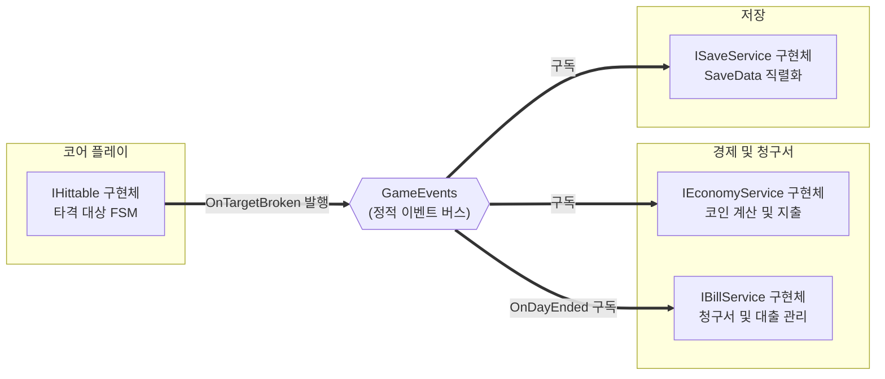

# 공용 계약 (인터페이스·이벤트·DTO)

> 관련 이슈: #3, #71 · 최종 수정: 2026-09-17

**이 문서는 로그다.** 이 기능을 고칠 때마다 갱신한다. 새 문서를 만들지 않는다.

## 무엇을 하는가

모듈 간 직접 참조를 차단하고 5인 병렬 개발을 지원하기 위해 공용 인터페이스, 전역 정적 이벤트 버스, 데이터 전송 객체(DTO) 및 모델 구조체를 선언하고 동결합니다.
ARCHITECTURE.md 2절과 3절에 명시된 시그니처를 정본으로 코드로 구현하였습니다.

## 왜 이 방법인가

| 검토한 방법 | 채택 | 이유 |
|---|---|---|
| 인터페이스 분리와 정적 이벤트 버스 | ✅ | 상대방 구현을 기다리지 않고 인터페이스와 이벤트 구독만으로 병렬 구현 가능 |
| 매니저 간 싱글톤 직접 참조 | ❌ | 매니저 구현이 끝날 때까지 다른 팀원이 대기해야 하며 순환 참조 위험 증가 |
| DI 프레임워크 도입 (Zenject, VContainer) | ❌ | 7일 단기 개발 일정에서 학습 및 바인딩 세팅 비용 과다로 배제 (PATTERNS.md 8절) |
| 메시징 라이브러리 도입 (UniRx, MessagePipe) | ❌ | 외부 패키지 의존성 증가 위험 및 C# 기본 이벤트로 충분히 해결 가능 |

## 구조

| 클래스 | 경로 | 하는 일 |
|---|---|---|
| `HitSource` | `Assets/Scripts/Runtime/Data/HitSource.cs` | 타격 발신원(Hover, AutoHammer) 열거형 |
| `HitInfo` | `Assets/Scripts/Runtime/Data/HitInfo.cs` | 단일 타격 정보(Source, Damage, WorldPos) 불변 구조체 |
| `BreakInfo` | `Assets/Scripts/Runtime/Data/BreakInfo.cs` | 파괴 보상(TargetId, RawCoin, StaminaRestore, WorldPos) 불변 구조체 |
| `Bill` | `Assets/Scripts/Runtime/Data/Bill.cs` | 청구서 데이터(Amount, IssuedDay, DueDay, IsPaid) 직렬화 클래스 |
| `Loan` | `Assets/Scripts/Runtime/Data/Loan.cs` | 대출 데이터(Principal, Owed, DailyCut) 직렬화 클래스 |
| `ResumePoint` | `Assets/Scripts/Runtime/Data/ResumePoint.cs` | 재개 지점(MainMenu, Result, PerkSelection) 열거형 |
| `SaveData` | `Assets/Scripts/Runtime/Data/SaveData.cs` | 저장 DTO(Version 2 기준 전체 영속 필드) |
| `IHittable` | `Assets/Scripts/Runtime/Interfaces/IHittable.cs` | 타격 대상 피격(OnHit) 및 생존 여부(IsAlive) 인터페이스 |
| `IBillService` | `Assets/Scripts/Runtime/Interfaces/IBillService.cs` | 청구서 납부 및 대출 서비스 인터페이스 |
| `IEconomyService` | `Assets/Scripts/Runtime/Interfaces/IEconomyService.cs` | 코인 적립, 지출, 대출 원금 입금 인터페이스 |
| `IRunScoped` | `Assets/Scripts/Runtime/Interfaces/IEconomyService.cs` | 런 경계(`BeginRun`·`EndRun`) 인터페이스. GameManager 전용 (이슈 #71, #111) |
| `IWalletPersistence` | `Assets/Scripts/Runtime/Interfaces/IEconomyService.cs` | 지갑 저장 복원 인터페이스. SaveManager 전용 (이슈 #71) |
| `ISaveService` | `Assets/Scripts/Runtime/Interfaces/ISaveService.cs` | 저장 및 불러오기 인터페이스 |
| `GameEvents` | `Assets/Scripts/Runtime/Events/GameEvents.cs` | 16종 정적 이벤트 및 Publish 메서드, ResetAll 제공 |
| `ContractsValidationChecks` | `Assets/Scripts/Editor/ContractsValidationChecks.cs` | 계약 정합성 배치 검증(이벤트 Publish·ResetAll, DTO 구조, IRunScoped 구현 및 GameManager 런 라이프사이클 배선). 에디터 전용, `MenuItem` 없이 `RunBatch()` 를 외부에서 호출한다 |

### 이벤트

| 이벤트 | 인자 | 언제 발행되는가 |
|---|---|---|
| `OnCoinEarned` | `long` | 지갑 정수 입금 증분 발생 시 (파괴 수입만) |
| `OnBalanceChanged` | `long` | 입금, 지출, 대출, 로드 후 지갑 현재 잔액 변동 시 |
| `OnRunCoinChanged` | `long` | 현재 런 순수입 값 변동 시 |
| `OnBillIssued` | `Bill` | 새로운 청구서 발행 시 |
| `OnBillPaid` | `Bill` | 청구서 납부 완료 시 |
| `OnDayEnded` | `int` | 하루 런이 종료되고 결과 정산 완료 시 |
| `OnBillDueSoon` | `int` | 청구서 마감 임박 시 남은 일수 안내 |
| `OnBankrupt` | 없음 | 마감일 납부 실패로 파산 확정 시 |
| `OnTargetBroken` | `BreakInfo` | 타격 대상 파괴 시 보상 전달 (코인 지급 유일 출처) |
| `OnSwingResolved` | `HitSource, bool` | 스윙 판정 완료 시 적중 여부 및 발신원 전달 |
| `OnStaminaChanged` | `float, float` | 스태미나 잔여량 또는 최대치 변경 시 |
| `OnStaminaRestored` | `float` | 회복형 대상 타격으로 스태미나 실제 회복 시 |
| `OnStaminaDepleted` | 없음 | 스태미나 소진으로 런 종료 요청 시 |
| `OnFeverGaugeChanged` | `float, float` | 피버 게이지 잔여량 또는 최대치 변경 시 |
| `OnFeverStart` | 없음 | 피버 모드 진입 시 |
| `OnFeverEnd` | 없음 | 피버 모드 종료 시 |

### 읽는 밸런스 값

공용 계약 자체는 수치를 직접 파싱하지 않으며, 각 인터페이스 구현 매니저가 BalanceData 에셋을 주입받거나 참조하여 소비합니다.

## 검증

* [x] `Assembly.CSharp.csproj` 빌드 통과 (경고 0개, 오류 0개)
* [x] `Assembly.CSharp.Editor.csproj` 빌드 통과 (경고 0개, 오류 0개)
* [x] convention.checker 기준 9대 규칙 전수 검증 통과 (직접 참조 없음, 네이밍 규칙 준수, public 필드 직렬화 예외 준수)
* [x] `GameEvents.ResetAll()` 정적 구독 초기화 구현 확인
* [x] `ContractsValidationChecks.RunBatch()` IRunScoped 및 GameManager 런 라이프사이클 배선 검증 통과

## 알려진 한계

* 매니저 구현체는 후속 작업에서 작성된다. 2026-09-17 현재 `EconomyManager`(3.1)·`SaveManager`(3.4) 가 있고 2.x 코어·4.x 청구서·5.x 피버는 진행 중이다.
* ~~`ActiveBill`·`ActiveLoan` 등 null 허용 참조 필드가 `JsonUtility`로 왕복 직렬화되는지는 문서로만 확정~~ — 이슈 #25에서 실제로 확인한 결과 **문서 서술이 틀렸다.** `JsonUtility`는 참조 타입의 null을 표현하지 못한다. `SaveData`에 `HasActiveBill`·`HasActiveLoan` 플래그를 추가하고 `SaveManager`가 변환하는 방식으로 수정했다 (이슈 #76, ARCHITECTURE.md "직렬화 방식" 참고).

## 갱신 이력

| 날짜 | 이슈 | 누가 | 무엇이 바뀌었나 |
|---|---|---|---|
| 2026-09-16 | #3 | saltlake00 | 최초 작성 (공용 인터페이스, 이벤트 버스, DTO 동결) |
| 2026-09-16 | #8 | hunil58 | `SaveData` 직렬화기(`JsonUtility`)·저장 경로·버전 정책·JSON 예시를 ARCHITECTURE.md에 확정. 알려진 한계 항목 갱신 |
| 2026-09-16 | #25, #76 | hunil58 | `SaveManager` 구현 중 `JsonUtility`가 참조 필드 null을 직렬화하지 못함을 확인. `SaveData`에 `HasActiveBill`·`HasActiveLoan` 필드 추가, ARCHITECTURE.md 서술 정정 |
| 2026-09-17 | — | soilrist | 날짜 형식 통일·BOM 제거, 매니저 구현 현황 갱신, `ContractsValidationChecks` 기재 |
| 2026-09-17 | #71 | yahoo-afk | `IEconomyService` 의 계약 외 public API 4개(`BeginRun`·`RestoreWallet`·`CurrentRemainderText`·`SetBillService`)를 `IRunScoped`·`IWalletPersistence` 로 분리 동결. `SetBillService` 는 계약이 아닌 조립(wiring) 통로로 남김 |
| 2026-09-17 | #111 | saltlake00 | `IRunScoped` 계약에 `EndRun()` 추가, StaminaManager 상속 및 EconomyManager 구현 편입, ContractsValidationChecks 검증 추가 |
