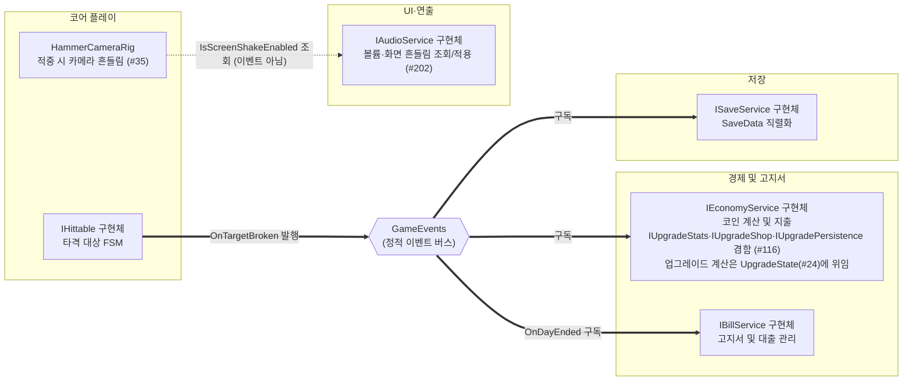

# 공용 계약 (인터페이스·이벤트·DTO)

> 관련 이슈: #3, #71, #116, #24, #139, #142, #150, #171, #175, #183, #202 · 최종 수정: 2026-09-21

**이 문서는 로그다.** 이 기능을 고칠 때마다 갱신한다. 새 문서를 만들지 않는다.

## 무엇을 하는가

모듈 간 직접 참조를 차단하고 5인 병렬 개발을 지원하기 위해 공용 인터페이스, 전역 정적 이벤트 버스, 데이터 전송 객체(DTO) 및 모델 구조체를 선언하고 동결합니다.
ARCHITECTURE.md 2절과 3절에 명시된 시그니처를 정본으로 코드로 구현하였습니다.

## 왜 이 방법인가

| 검토한 방법 | 채택 | 이유 |
|---|---|---|
| 인터페이스 분리와 정적 이벤트 버스 | ✅ | 상대방 구현을 기다리지 않고 인터페이스와 이벤트 구독만으로 병렬 구현 가능 |
| 매니저 간 싱글톤 직접 참조 | ❌ | 매니저 구현이 끝날 때까지 다른 팀원이 대기해야 하며 순환 참조 위험 증가 |
| DI 프레임워크 도입 (Zenject, VContainer) | ❌ | 7일 단기 개발 일정에서 학습 및 바인딩 세팅 비용 과다로 배제 (PATTERNS.md 8절) |
| 메시징 라이브러리 도입 (UniRx, MessagePipe) | ❌ | 외부 패키지 의존성 증가 위험 및 C# 기본 이벤트로 충분히 해결 가능 |
| 업그레이드 실효값을 `IUpgradeStats`·`IUpgradeShop`·`IUpgradePersistence` 3개로 분리 (#116) | ✅ | PATTERNS.md 5절 인터페이스 분리 원칙과 #71 선례(`IEconomyService` → `IRunScoped`/`IWalletPersistence` 분리)를 따라, 조회·구매·저장을 역할별로 나눠 소비처마다 필요한 것만 의존하게 함 |
| 업그레이드 실효값·구매를 `IEconomyService` 안에 그대로 포함 (#116) | ❌ | 소비처(스탯 조회)와 상점(구매)의 변경 주기가 다르고 `IEconomyService`가 이미 커서 계약이 비대해짐 |
| `GetStat(StatId, float baseValue)` 하나만 제공 (기준값 없는 편의 오버로드는 안 둠) (#116) | ✅ | `StatId.SpawnCount`는 `StageDef.SpawnCount`처럼 단계별 값이라 매니저가 자체적으로 기준값을 못 찾는다. 호출측이 어차피 기준값을 들고 있어 이 방식이면 BalanceData 기준값 표를 코드에 복제할 필요가 없다. #24(twins6375-art) 구현 중 같은 결론에 도달해 #116에 코멘트로 남겼고, `UpgradeState`도 이 형태로 이미 구현·검증돼 있었다 |
| `GetStat(StatId)` 편의 오버로드를 추가로 제공 (내부에서 기준값 조회) | ❌ | 기준값 표를 `EconomyManager` 안에 `GetBaseValue` 스위치문으로 복제해야 해 BALANCE.md와 코드 두 곳을 맞춰야 한다. `UpgradeState`가 이미 기준값-인자 방식으로 구현·Edit Mode 22건 검증까지 끝나 있어 굳이 편의 오버로드로 되짚을 이유가 없다 |
| `EconomyManager` 안에 업그레이드 계산(레벨·비용·실효값)을 직접 구현 | ❌ | Edit Mode는 MonoBehaviour 생명주기를 부르지 않아 그 안에 계산을 두면 검증할 수 없다 (`CoinWallet`·`StaminaPool`·`FeverGauge`와 같은 이유). 처음엔 `_upgradeLevels` 배열로 직접 구현했으나, `Develop`에 이미 병합된 #24의 `UpgradeState`(Unity 비의존 순수 클래스, 테스트 22건 PASS)와 리베이스 중 충돌해 발견 — 중복 구현을 버리고 `UpgradeState`에 위임하는 쪽으로 정리했다 |
| `OnUpgradePurchased` 등 구매 이벤트 신규 추가 (#116) | ❌ | 이슈 #116 요청 범위 밖(소비처 마이그레이션은 후속 이슈) — 실제로 구독자가 필요해지면 그때 계약에 추가 |
| `ISaveService`에 `bool HasSave` 프로퍼티 추가 (#139) | ✅ | 6.7 메인 메뉴(#90)의 "저장 없으면 이어하기 비활성" 요건 때문. `Load()`는 파일이 없어도 항상 기본값 `SaveData`를 반환해 "저장 없음"과 "저장은 있는데 전부 기본값"을 구분 못 한다. `SaveManager`가 유일한 구현체라 additive 변경으로 깨지는 곳이 없다 |
| `SaveData` 필드값(전부 기본값인지)으로 저장 존재 여부 유추 (#139) | ❌ | "저장은 했지만 우연히 전부 기본값인 상태"와 "저장이 아예 없는 상태"를 구분할 수 없어 신뢰할 수 없다 |
| 신규 `IAudioService`(`BgmVolume`·`SfxVolume`·`IsScreenShakeEnabled` 조회 + `Set*` 3종) 추가, `AudioManager.Instance`를 이 타입으로 노출 (#202) | ✅ | 설정 패널(#196)이 볼륨을 바꾸려면 `AudioManager`에 공용 API가 필요하고, 화면 흔들림은 코어 플레이 모듈(`HammerCameraRig`)이 읽어야 실제로 멈춘다. `EconomyManager.Instance`(#171)와 같은 "Instance를 인터페이스 타입으로 노출" 패턴을 그대로 따랐다 |
| 화면 흔들림 on/off를 새 `GameEvents` 이벤트로 통지 (#202) | ❌ | "설정 시점에만 바뀌는 현재 상태"를 매번 방송하는 이벤트로 만들 이유가 없다. `HammerCameraRig`는 타격이 적중한 그 순간에만 값이 필요하므로 조회(`IAudioService.IsScreenShakeEnabled`) 한 번으로 충분하다 |
| `SaveData`에 `BgmVolume`·`SfxVolume`·`IsFullscreen`·`IsScreenShakeEnabled` 필드 추가, `Version` 2→3 (#202) | ✅ | 설정값이 "게임을 껐다 켜도 유지"돼야 하는데(#196 DoD) 이 값을 담을 자리가 없었다. 필드 이니셜라이저 기본값(전부 켬/최대 볼륨)이 v2 저장분의 마이그레이션도 겸한다(HasActiveBill 추가 때와 같은 방식) |

## 구조

| 클래스 | 경로 | 하는 일 |
|---|---|---|
| `HitSource` | `Assets/Scripts/Runtime/Data/HitSource.cs` | 타격 발신원(Hover, AutoHammer) 열거형 |
| `HitInfo` | `Assets/Scripts/Runtime/Data/HitInfo.cs` | 단일 타격 정보(Source, Damage, WorldPos) 불변 구조체 |
| `BreakInfo` | `Assets/Scripts/Runtime/Data/BreakInfo.cs` | 파괴 보상(TargetId, RawCoin, StaminaRestore, WorldPos) 불변 구조체 |
| `Bill` | `Assets/Scripts/Runtime/Data/Bill.cs` | 고지서 데이터(Amount, IssuedDay, DueDay, IsPaid) 직렬화 클래스 |
| `Loan` | `Assets/Scripts/Runtime/Data/Loan.cs` | 대출 데이터(Principal, Owed, DailyCut) 직렬화 클래스 |
| `ResumePoint` | `Assets/Scripts/Runtime/Data/ResumePoint.cs` | 재개 지점(MainMenu, Result, PerkSelection) 열거형 |
| `SaveData` | `Assets/Scripts/Runtime/Data/SaveData.cs` | 저장 DTO(Version 4 기준 전체 영속 필드). v3에서 `LegacyPoints`·`RingLevels` 추가(#175·#183), v4에서 `BgmVolume`·`SfxVolume`·`IsFullscreen`·`IsScreenShakeEnabled` 추가(#202) |
| `IHittable` | `Assets/Scripts/Runtime/Interfaces/IHittable.cs` | 타격 대상 피격(OnHit) 및 생존 여부(IsAlive) 인터페이스 |
| `IBillService` | `Assets/Scripts/Runtime/Interfaces/IBillService.cs` | 고지서 납부 및 대출 서비스 인터페이스 |
| `IEconomyService` | `Assets/Scripts/Runtime/Interfaces/IEconomyService.cs` | 코인 적립, 지출, 대출 원금 입금 인터페이스. `EconomyManager.Instance` 가 이 타입으로 노출 — UI 가 초기 잔액을 한 번 읽는 통로 (이슈 #171) |
| `IRunScoped` | `Assets/Scripts/Runtime/Interfaces/IEconomyService.cs` | 런 경계(`BeginRun`·`EndRun`) 인터페이스. GameManager 전용 (이슈 #71, #111) |
| `IWalletPersistence` | `Assets/Scripts/Runtime/Interfaces/IEconomyService.cs` | 지갑 저장 복원 인터페이스. SaveManager·BillManager 가 쓴다 — 후자는 파산 시 회차 초기화용 (이슈 #71, #158) |
| `IUpgradeStats` | `Assets/Scripts/Runtime/Interfaces/IEconomyService.cs` | 업그레이드 실효값 조회(`GetStat`). 소비처는 `BalanceData` 기준값 대신 이것을 읽는다. `EconomyManager` 구현 (이슈 #116) |
| `IUpgradeShop` | `Assets/Scripts/Runtime/Interfaces/IEconomyService.cs` | 업그레이드 레벨·다음 비용 조회, 구매(`TryPurchase`). `EconomyManager` 구현이고 `EconomyManager.Shop` 이 이 타입으로 노출 (이슈 #116, #171). 소비처는 업그레이드 구매 UI(작업 6.8, #91) |
| `IUpgradePersistence` | `Assets/Scripts/Runtime/Interfaces/IEconomyService.cs` | 업그레이드 레벨 저장 복원. SaveManager 전용으로 설계했으나 현재 미배선 (이슈 #116) |
| `UpgradeState` | `Assets/Scripts/Runtime/Economy/UpgradeState.cs` | 업그레이드 레벨·다음 비용·실효값 실제 계산 (Unity 비의존 순수 클래스). `EconomyManager`가 `IUpgradeStats`/`IUpgradeShop`/`IUpgradePersistence` 구현에서 그대로 위임한다 (이슈 #24, twins6375-art, Edit Mode 22건 PASS) |
| `ISaveService` | `Assets/Scripts/Runtime/Interfaces/ISaveService.cs` | 저장 및 불러오기 인터페이스. `HasSave`로 저장 파일 존재 여부 조회 (이슈 #139) |
| `IGameFlowService` | `Assets/Scripts/Runtime/Interfaces/IGameFlowService.cs` | MainMenu 버튼의 씬 전환 요청(`StartNewRun`/`ContinueRun`/`QuitGame`). `GameManager` 구현, `GameManager.Instance`가 이 타입으로 노출 (이슈 #142) |
| `IStageService` | `Assets/Scripts/Runtime/Interfaces/IStageService.cs` | 단계 진행 상태 공용 조회(`CurrentStageIndex`/`CurrentStageNumber`/`IsGoalReached`/`IsMaxStage`/`AdvanceStage`/`RestoreStage`). `StageGoalManager` 구현, `ManagerBootstrap`이 `CreatureManager`·`BillManager`에 주입 (이슈 #150) |
| `IAudioService` | `Assets/Scripts/Runtime/Interfaces/IAudioService.cs` | 볼륨(`BgmVolume`/`SfxVolume`)·화면 흔들림(`IsScreenShakeEnabled`) 조회 및 `Set*` 적용. `AudioManager` 구현, `Instance`를 이 타입으로 노출. `HammerCameraRig`(코어 플레이)가 조회 전용으로 소비 (이슈 #196, #202) |
| `GameEvents` | `Assets/Scripts/Runtime/Events/GameEvents.cs` | 19종 정적 이벤트 및 Publish 메서드, ResetAll 제공 |
| `ContractsValidationChecks` | `Assets/Scripts/Editor/ContractsValidationChecks.cs` | 계약 정합성 배치 검증(이벤트 Publish·ResetAll, DTO 구조, IRunScoped 구현 및 GameManager 런 라이프사이클 배선). 에디터 전용, `MenuItem` 없이 `RunBatch()` 를 외부에서 호출한다 |

### 이벤트

| 이벤트 | 인자 | 언제 발행되는가 |
|---|---|---|
| `OnCoinEarned` | `long` | 지갑 정수 입금 증분 발생 시 (파괴 수입만) |
| `OnBalanceChanged` | `long` | 입금, 지출, 대출, 로드 후 지갑 현재 잔액 변동 시 |
| `OnRunCoinChanged` | `long` | 현재 런 순수입 값 변동 시 |
| `OnBillIssued` | `Bill` | 새로운 고지서 발행 시 |
| `OnBillPaid` | `Bill` | 고지서 납부 완료 시 |
| `OnDayEnded` | `int` | 하루 런이 종료되고 결과 정산 완료 시 |
| `OnBillDueSoon` | `int` | 고지서 마감 임박 시 남은 일수 안내 |
| `OnBankrupt` | 없음 | 마감일 납부 실패로 파산 확정 시 |
| `OnTargetBroken` | `BreakInfo` | 타격 대상 파괴 시 보상 전달 (코인 지급 유일 출처) |
| `OnSwingResolved` | `HitSource, bool` | 스윙 판정 완료 시 적중 여부 및 발신원 전달 |
| `OnStaminaChanged` | `float, float` | 스태미나 잔여량 또는 최대치 변경 시 |
| `OnStaminaRestored` | `float` | 회복형 대상 타격으로 스태미나 실제 회복 시 |
| `OnStaminaDepleted` | 없음 | 스태미나 소진으로 런 종료 요청 시 |
| `OnFeverGaugeChanged` | `float, float` | 피버 게이지 잔여량 또는 최대치 변경 시 |
| `OnFeverStart` | 없음 | 피버 모드 진입 시 |
| `OnFeverEnd` | 없음 | 피버 모드 종료 시 |
| `OnStageGoalReached` | `int` | 단계 목표(코인) 도달 시 단계 번호 전달 (#26) |
| `OnPerkOffered` | `string[]` | 고지서 조기 납부 성공 시 뽑힌 퍼크 후보 id 3개 (#28) |
| `OnPerkChosen` | `string` | 퍼크 후보 중 하나를 고르면 그 id (#28) |

### 읽는 밸런스 값

공용 계약 자체는 수치를 직접 파싱하지 않으며, 각 인터페이스 구현 매니저가 BalanceData 에셋을 주입받거나 참조하여 소비합니다.

`IUpgradeStats.GetStat`은 기준값을 인자로만 받습니다 — `economy.csv`·`stamina.csv`·`fever.csv`·`stages.csv`에 흩어진 BalanceData 기준값 표를 계약 코드 안에 복제하지 않고, 이미 그 값을 들고 있는 호출측(소비처)이 그대로 넘깁니다. 실효값 가산치(percent·add 누적)는 `upgrade_effects.csv`, 비용은 `upgrades.csv`의 `init_cost`·`cost_growth`(0 이하면 `economy.csv`의 `upgrade_cost_growth`)를 쓰며, 계산 자체는 전부 `UpgradeState`(이슈 #24)가 담당합니다 — 계산 근거와 검증 상세는 [upgrades.md](upgrades.md)를 봅니다 (여기서 옮겨 적지 않습니다).

## 검증

* [x] `Assembly.CSharp.csproj` 빌드 통과 (경고 0개, 오류 0개)
* [x] `Assembly.CSharp.Editor.csproj` 빌드 통과 (경고 0개, 오류 0개)
* [x] convention.checker 기준 9대 규칙 전수 검증 통과 (직접 참조 없음, 네이밍 규칙 준수, public 필드 직렬화 예외 준수)
* [x] `GameEvents.ResetAll()` 정적 구독 초기화 구현 확인
* [x] `ContractsValidationChecks.RunBatch()` IRunScoped 및 GameManager 런 라이프사이클 배선 검증 통과
* [x] #116: (병합 전 초판) convention-checker 9대 규칙 기준 전수 점검 통과 (위반 없음 — 이 세션에서는 동일 스펙을 그대로 넘긴 서브에이전트로 대체 실행)
* [ ] #116: `UpgradeState`(#24) 위임으로 정리한 **최종 코드는 convention-checker 재점검 안 함** — `Develop` 리베이스 충돌 해소 직후라 미검증
* [ ] #116: 신규 코드(`IUpgradeStats`·`IUpgradeShop`·`IUpgradePersistence`, `EconomyManager` 구현분) Unity 빌드·Play Mode 확인 — 미검증 (이 세션에서 Unity 에디터에 접근하지 못함). `UpgradeState` 자체의 계산 로직은 `UpgradeChecks` 22건 PASS로 이미 검증돼 있다 (upgrades.md)

## 알려진 한계

* 매니저 구현체는 후속 작업에서 작성된다. 2026-09-17 현재 `EconomyManager`(3.1)·`SaveManager`(3.4) 가 있고 2.x 코어·4.x 고지서·5.x 피버는 진행 중이다.
* ~~`ActiveBill`·`ActiveLoan` 등 null 허용 참조 필드가 `JsonUtility`로 왕복 직렬화되는지는 문서로만 확정~~ — 이슈 #25에서 실제로 확인한 결과 **문서 서술이 틀렸다.** `JsonUtility`는 참조 타입의 null을 표현하지 못한다. `SaveData`에 `HasActiveBill`·`HasActiveLoan` 플래그를 추가하고 `SaveManager`가 변환하는 방식으로 수정했다 (이슈 #76, ARCHITECTURE.md "직렬화 방식" 참고).
* ~~#116: 소비처가 `IUpgradeShop` 에 닿을 통로가 없다~~ — #171 에서 `EconomyManager.Shop` 을 열어 풀었다. 다만 실제 소비처(업그레이드 구매 UI)는 6.8(#91)에서 붙는다.
* #116: 소비처(스탯 표시 UI, 상점 메뉴, 결과 화면 등)를 `BalanceData` 직접 참조에서 `IUpgradeStats`·`IUpgradeShop`로 옮기는 마이그레이션은 이번 작업 범위 밖이다 — 이슈 자체가 계약 동결까지만 요구했다. 후속 이슈에서 실제 배선이 필요하다.
* #116: `IUpgradePersistence`는 계약과 `EconomyManager` 구현만 있고 `SaveManager`는 아직 `RestoreUpgradeLevels`/`CurrentUpgradeLevels`를 호출하지 않는다. `SaveData.UpgradeLevels` 필드는 이미 존재하나 어디서도 읽거나 쓰지 않는 미사용 상태다.
* #175: **`ILegacyPersistence`도 같은 상태다.** 계약과 `EconomyManager` 구현은 있지만 `SaveManager`가 `RestoreLegacy`/`CurrentRingLevels`를 부르지 않고, `SaveData.LegacyPoints`·`RingLevels`도 읽거나 쓰는 곳이 없다. 영속 계약을 매니저에 연결하는 일 자체가 아직 없어 위 #116 과 함께 풀어야 한다 — 한쪽만 연결하면 방식이 두 벌 생긴다. **그때까지 레거시 포인트와 반지는 앱을 끄면 사라진다** ([레거시 포인트와 반지](legacy-points.md)).
* #116/#24: `EconomyManager`는 원래 업그레이드 레벨 배열(`_upgradeLevels`)과 기준값 스위치(`GetBaseValue`)를 직접 들고 있었으나, `Develop`에 먼저 병합된 #24(`UpgradeState`, PR #120)와 겹치는 것을 리베이스 충돌로 뒤늦게 발견했다. 직접 구현을 버리고 `UpgradeState`에 위임하도록 정리했고, `IUpgradeStats`도 애초 계획했던 `GetStat(StatId)` 편의 오버로드를 빼고 `GetStat(StatId, baseValue)` 하나로 좁혔다 — #24 PR의 "자신 없는 곳"에 적힌 대로 `EconomyManager`의 임시 public API(`GetUpgradeLevel` 등 7개)는 이 정리로 제거했다.
* #116/#24: 구매 효과가 "다음 런부터"인지 "즉시"인지는 계약으로 못 박지 않고 소비처 재량으로 남아 있다 (twins6375-art가 #116 코멘트에서 제기한 질문, 아직 결론 없음). `max_stamina`처럼 `BeginRun()` 때 한 번 읽는 소비처는 자연히 "다음 런"이 되지만, 런 도중 계속 읽는 값은 "즉시 반영"이 되기 쉽다.

## 갱신 이력

| 날짜 | 이슈 | 누가 | 무엇이 바뀌었나 |
|---|---|---|---|
| 2026-09-16 | #3 | saltlake00 | 최초 작성 (공용 인터페이스, 이벤트 버스, DTO 동결) |
| 2026-09-16 | #8 | hunil58 | `SaveData` 직렬화기(`JsonUtility`)·저장 경로·버전 정책·JSON 예시를 ARCHITECTURE.md에 확정. 알려진 한계 항목 갱신 |
| 2026-09-16 | #25, #76 | hunil58 | `SaveManager` 구현 중 `JsonUtility`가 참조 필드 null을 직렬화하지 못함을 확인. `SaveData`에 `HasActiveBill`·`HasActiveLoan` 필드 추가, ARCHITECTURE.md 서술 정정 |
| 2026-09-17 | — | soilrist | 날짜 형식 통일·BOM 제거, 매니저 구현 현황 갱신, `ContractsValidationChecks` 기재 |
| 2026-09-17 | #71 | yahoo-afk | `IEconomyService` 의 계약 외 public API 4개(`BeginRun`·`RestoreWallet`·`CurrentRemainderText`·`SetBillService`)를 `IRunScoped`·`IWalletPersistence` 로 분리 동결. `SetBillService` 는 계약이 아닌 조립(wiring) 통로로 남김 |
| 2026-09-17 | #111 | saltlake00 | `IRunScoped` 계약에 `EndRun()` 추가, StaminaManager 상속 및 EconomyManager 구현 편입, ContractsValidationChecks 검증 추가 |
| 2026-09-17 | #116 | yahoo-afk | `IUpgradeStats`·`IUpgradeShop`·`IUpgradePersistence` 3개 인터페이스 신설, `EconomyManager` 구현 편입(`GetStat`/`GetStat(StatId, baseValue)`/`GetNextCost`/`TryPurchase`/`RestoreUpgradeLevels`/`CurrentUpgradeLevels`). 소비처 마이그레이션과 SaveManager 배선은 범위 밖으로 남김 |
| 2026-09-17 | #116, #24 | yahoo-afk | `Develop` 리베이스 중 #24(twins6375-art, PR #120)가 먼저 병합한 `UpgradeState`와 충돌 발견. `IUpgradeStats`를 `GetStat(StatId, baseValue)` 하나로 좁히고(편의 오버로드 제거), `EconomyManager`의 업그레이드 계산 직접 구현(`_upgradeLevels`, `GetBaseValue`)을 버리고 `UpgradeState` 위임으로 교체. `EconomyManager`의 임시 public API(`GetUpgradeLevel`·`IsUpgradeMaxLevel`·`TryGetUpgradeCost`·`TryPurchaseUpgrade`·`GetUpgradedStat`, 중복 `CurrentUpgradeLevels`/`RestoreUpgradeLevels`) 제거 |
| 2026-09-17 | #28 | soilrist | 이벤트 표에 누락됐던 `OnStageGoalReached`(#26)와 신규 `OnPerkOffered`·`OnPerkChosen`(#28) 추가, 이벤트 종수 16→19 정정 |
| 2026-09-17 | #139 | hunil58 | `ISaveService`에 `bool HasSave { get; }` 추가, `SaveManager.HasSave => File.Exists(SavePath)` 구현. 6.7 메인 메뉴(#90) 착수 중 발견해 구현 전 계약 변경 이슈로 먼저 발의·승인 |
| 2026-09-17 | #142 | hunil58 | 신규 `IGameFlowService`(`StartNewRun`/`ContinueRun`/`QuitGame`) 추가, `GameManager`가 구현하고 `Instance`를 이 인터페이스 타입으로 노출. `MainMenuController`가 구체 클래스 `GameManager.Instance`를 직접 참조하던 것을 convention-checker가 발견해 계약 변경으로 정정 (run-state.md #20이 예견한 "실제 소비자가 생기면" 상황) |
| 2026-09-18 | #150 | saltlake00 | 신규 `IStageService`(`CurrentStageIndex`/`CurrentStageNumber`/`IsGoalReached`/`IsMaxStage`/`AdvanceStage`/`RestoreStage`) 추가. `StageGoalManager`가 구현하고 `CreatureManager`·`BillManager`가 소비한다 — 단계 수치의 출처를 매니저별 자체 순번에서 이 계약 하나로 모았다 |
| 2026-09-18 | #158 | hunil58 | `IWalletPersistence` 소비자 제한을 "SaveManager 전용"에서 "SaveManager·BillManager"로 넓힘 (A안). `BillManager`가 파산 시 회차 초기화에서 `RestoreWallet(0, "0")`을 호출해 코인·소수 잔여를 비운다 |
| 2026-09-18 | #171 | yahoo-afk | `EconomyManager` 에 정적 조회 통로 2개 추가 — `Instance`(`IEconomyService`)·`Shop`(`IUpgradeShop`). 인터페이스 시그니처는 그대로고 **접근 통로만** 열었다. `BillManager.Instance`·`SaveManager.Instance`·`GameManager.Instance`(#142) 와 같은 패턴이며 `Awake` 첫 부분에서 대입한다. 첫 소비처는 `CoinHud`(잔액 초기값), 다음은 업그레이드 구매 UI(6.8, #91) |
| 2026-09-21 | #175 · #183 | twins6375-art | 레거시 포인트·반지 계약 3종(`ILegacyService`·`IRingShop`·`ILegacyPersistence`)과 `IBillService.DeclareBankruptcy()` 추가, `SaveData` v3(`LegacyPoints`·`RingLevels`), `EconomyManager.RingShop`·`Legacy` 통로 개방. `ILegacyPersistence` 미배선을 알려진 한계에 기록 |
| 2026-09-21 | #196, #202 | hunil58 | 신규 `IAudioService`(`BgmVolume`·`SfxVolume`·`IsScreenShakeEnabled` 조회 + `Set*` 3종) 추가, `AudioManager`가 구현하고 `Instance`를 이 타입으로 노출(#171과 동일 패턴). `SaveData`에 설정 필드 4개 추가. `Develop`에 먼저 병합된 #175·#183이 `Version`을 3으로 이미 올려놔 리베이스 중 충돌 — 두 변경을 합쳐 `Version` 4로 정리(`SaveManager`에 `case 3` 마이그레이션 분기 추가). 설정 패널(#196)의 화면 흔들림 스위치를 `HammerCameraRig`(코어 플레이)가 조회 전용으로 소비 — 새 `GameEvents` 이벤트는 추가하지 않음. 상세는 [settings-panel.md](settings-panel.md) |
