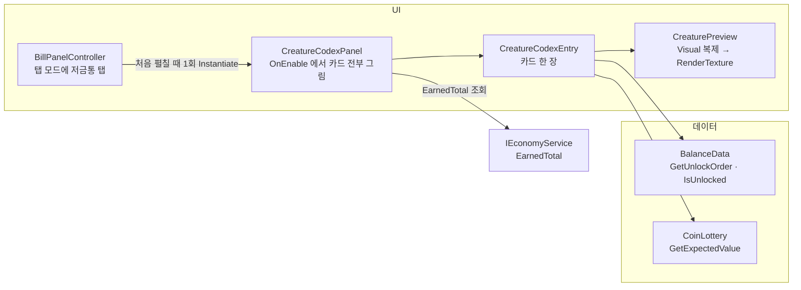

# 저금통 도감

> 관련 이슈: #299  · 최종 수정: 2026-09-23

**이 문서는 로그다.** 이 기능을 고칠 때마다 갱신한다. 새 문서를 만들지 않는다.

## 무엇을 하는가

정산 뒤 메뉴(고지서 패널 탭 모드)에 **저금통** 탭을 더해, 해금 순서대로 저금통 카드를 한 줄로 보여 준다.
해금된 칸은 3D 외형·이름·역할·HP·기대 코인을, 잠긴 칸은 검은 실루엣과 해금 기준 누적 수입·진행률을 보여 준다.
해금 규칙 자체는 [타격 대상](hit-targets.md) 문서에 있다 — 이 탭은 그 규칙을 **읽기만** 한다.

## 왜 이 방법인가

| 검토한 방법 | 채택 | 이유 |
|---|---|---|
| 외형을 기존 `CreaturePreview` 로 찍는다 | ✅ | 결과 화면 "다음 해금" 칸이 이미 쓰는 컴포넌트다. 이슈 DoD 도 재사용을 요구한다. 코드를 고치지 않고 카드마다 하나씩 붙였다 |
| 카드용 아이콘 이미지를 따로 만든다 | ❌ | 스프라이트를 쓰지 않는 프로젝트다(AGENTS 폴더 규칙). 모델을 바꾸면 아이콘도 다시 찍어야 한다 |
| 잠긴 칸 실루엣 = `RawImage.color` 를 검정으로 | ✅ | RGB 에 0 을 곱하고 알파는 남으므로 모델 윤곽만 남는다. 셰이더·머티리얼이 필요 없다 |
| 실루엣 전용 셰이더·머티리얼 교체 | ❌ | 한 줄로 되는 일에 에셋이 늘어난다 |
| 역할 문구를 수치에서 만든다 (`GetRoleText`) | ✅ | CSV 에 문구 열을 더하면 **공용 계약(CSV 스키마) 변경**이라 이슈부터 발의해야 한다. 수치에서 만들면 수치를 바꿀 때 문구도 따라온다 |
| targets.csv 에 `role_text` 열 추가 | ❌ | 위와 같은 이유. 문구가 수치와 어긋날 수도 있다 |
| 기대 코인 = `count × 후보 액면 가중 평균` (`CoinLottery.GetExpectedValue`) | ✅ | `Draw` 와 같은 후보 규칙을 쓰는 해석해라 매번 같은 값이 나온다. UnlockChecks 가 10만 회 추첨 평균과 5% 안인지 대조한다 |
| 이벤트를 구독해 실시간 갱신 | ❌ | 누적 수입은 정산 때만 바뀌고 탭은 그 뒤 메뉴에서만 열린다. `OnEnable` 에서 한 번 그리면 된다 (`RingShopPanel` 과 같은 이유) |
| 한글 줄바꿈: 어절을 `<nobr>` 로 묶는다 | ✅ | TMP 는 한글을 글자마다 끊어 "회/복" 처럼 갈라졌다. TMP Settings 의 한글 줄바꿈 규칙은 프로젝트 전역 설정이라 건드리지 않았다 |

## 구조

| 클래스 | 경로 | 하는 일 |
|---|---|---|
| `CreatureCodexPanel` | `Assets/Scripts/Runtime/UI/CreatureCodexPanel.cs` | 켜질 때 누적 수입을 읽어 카드마다 `Render` 를 부르고 "이번 회차 누적" 을 표시 |
| `CreatureCodexEntry` | `Assets/Scripts/Runtime/UI/CreatureCodexEntry.cs` | 카드 한 장. 해금 판정, 실루엣, 역할 문구(`GetRoleText`), 진행률(`GetUnlockPercent`) |
| `CoinLottery.GetExpectedValue` | `Assets/Scripts/Runtime/Economy/CoinLottery.cs` | 한 번 부술 때 기대 금액. 역할 효과(즉시 파괴·분노)는 넣지 않는다 |
| `BillPanelController` | `Assets/Scripts/Runtime/UI/BillPanelController.cs` | `Tab.Codex`, `TabCodexButton`, `CodexTabRoot`. 도감 프리팹은 처음 펼칠 때 한 번 만들고 이후 켜고 끈다 |
| `CreatureCodexPrefabCreator` | `Assets/Scripts/Editor/CreatureCodexPrefabCreator.cs` | 메뉴 `NCAI/UI/저금통 도감 프리팹 생성`. 카드 목록을 `GetUnlockOrder` 로 만든다 |
| `UnlockChecks.RunCodexChecks` | `Assets/Scripts/Editor/UnlockChecks.cs` | 카드 수·순서, 미리보기 프리팹, 미리보기 좌표 중복, 기대 코인 대 추첨 평균, 역할 문구 |

- 프리팹: `Assets/Prefabs/UI/CreatureCodexPanel.prefab` (고지서 패널 `Assets/Prefabs/Resources/UI/BillPanel.prefab` 의 `CodexTabRoot` 에 들어간다)
- **생성 순서**: 도감 프리팹 → 고지서 패널 프리팹. 반대로 돌리면 `_codexPrefab` 이 비어 탭이 빈 칸이 된다.
- 미리보기 좌표: 카드 i 는 `(40 × (i+1), -500, 0)`. 결과 화면 미리보기가 `(0, -500, 0)` 을 쓰고, 미리보기 카메라 far clip 이 10 이라 40 간격이면 옆 모델이 찍히지 않는다.

### 진행률

직전 해금 기준액부터 이 종류 기준액까지 구간에서 누적 수입이 온 비율(0~99). 정산창 "다음 해금" 칸과 같은 셈이라 두 화면의 % 가 어긋나지 않는다.

### 이벤트

없다. 구독도 발행도 하지 않는다.

### 읽는 밸런스 값

| CSV | 열 | 쓰는 곳 |
|---|---|---|
| `targets.csv` | `unlock_earned`, `spawn_weight`(0 이면 도감에서 빠짐) | 카드 순서·해금 판정·진행률 |
| `targets.csv` | `display_name`, `hp`, `coin_count`, `min_denom_id` | 이름·HP·기대 코인 |
| `targets.csv` | `instant_break_chance`, `charge_speed`, `stamina_restore`, `move_speed` | 역할 문구 |
| `coins.csv` | `value`, `weight` | 기대 코인 |

## 검증

2026-09-23, Unity 6000.3.21f1 에디터.

- [x] `NCAI > 전체 검증 실행` 통과 29 / 실패 0. `UnlockChecks` PASS 5 (도감 검사 포함). UiGuidelineChecks 권장 32건은 모두 기존 프리팹 것이고 도감 항목은 없음
- [x] Play (Game 씬): 누적 3000 → 철광석·구리광석·은광석 해금(3D), 나머지 2칸 실루엣 + "누적 $6,000 해금 28%", "누적 $12,000 해금 0%"
- [x] Play: 누적 7000 → 금광석까지 해금, 마지막 칸 16%. 역할 문구가 어절 단위로 줄바꿈됨
- [x] Play: 저금통 → 고지서 → 업그레이드 → 저금통 → 모달 전환 시 도감 루트가 저금통 탭에서만 켜지고, 인스턴스는 1개로 유지
- [x] 기대 코인 표시값이 CSV 메모와 일치 (normal $44, tourist $220, pinata $734)
- [x] Play: 고지서 탭에서 `TabCodexButton.onClick` 을 호출하면 저금통 탭으로 바뀜 (버튼 배선 확인)
- [ ] 실제 한 판을 끝까지 돌고 메뉴에서 탭 버튼을 마우스로 누르는 경로 — 미검증 (누적 수입은 `RestoreEarnedTotal` 로 넣고 패널은 `ShowAsTab` 으로 직접 띄웠다)

## 알려진 한계

- targets.csv 에 종류를 더하거나 해금 순서를 바꾸면 **도감 프리팹을 다시 생성해야 한다.** 잊으면 `UnlockChecks` 가 실패로 알려 준다.
- 카드 폭이 196 이라 6종 이상이면 선반(1060) 을 넘는다. 그때는 스크롤이나 2줄 배치가 필요하다.
- 기대 코인은 역할 효과를 넣지 않은 값이다. 금광석의 즉시 파괴는 코인이 아니라 타격 수를 줄이는 효과라 기대 코인 자체는 맞다.
- 역할 문구 분기의 거치형 경계(`move_speed < 0.1`)는 표시용 임의 값이다.

## 갱신 이력

| 날짜 | 이슈 | 누가 | 무엇이 바뀌었나 |
|---|---|---|---|
| 2026-09-23 | #299 | soilrist + Claude | 최초 작성. 고지서 패널 저금통 탭, 카드별 CreaturePreview, 실루엣, 기대 코인, 진행률, UnlockChecks 도감 검사 |
