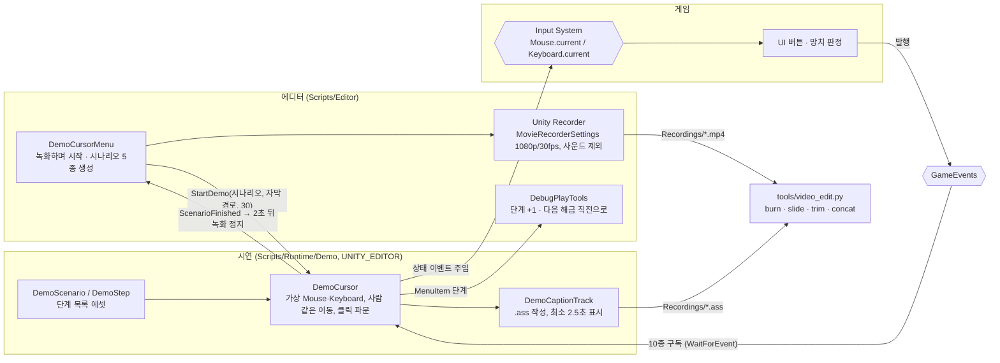

# 시연 녹화 도구 (자동 시연 커서·자막·편집)

> 관련 이슈: #45 · #344 (PR #340 · #341 · #345) · 최종 수정: 2026-09-26

**이 문서는 로그다.** 이 기능을 고칠 때마다 갱신한다. 새 문서를 만들지 않는다.

## 무엇을 하는가

제출 영상용 **에디터 전용** 도구. 시나리오 에셋에 적은 단계대로 가상 마우스·키보드가 게임을 조작하고,
Recorder 로 1080p 영상을 찍으면서 같은 이름의 자막 파일(.ass)을 남긴다. `tools/video_edit.py` 가
자막 입히기·슬라이드·자르기·이어 붙이기를 한다. 런타임 코드는 전부 `#if UNITY_EDITOR` 라 빌드에 없다.
장면 구성과 자막 문구는 [SUBMISSION_VIDEO.md](../SUBMISSION_VIDEO.md) 가 정본이다.

## 왜 이 방법인가

| 검토한 방법 | 채택 | 이유 |
|---|---|---|
| Unity Recorder 패키지로 녹화 (#340) | ✅ | Play 중 Game 뷰를 고정 프레임레이트로 찍는다. 에디터가 포커스를 잃어도 끊기지 않는다 |
| `ScreenCapture` PNG 연속 캡처 + ffmpeg | ❌ | 실제로 시도했다. 에디터 창이 포커스를 잃으면 Play 프레임이 멈춰 **파일이 0장** 나왔다 |
| **가상 Mouse 장치를 추가**하고 시연 중 실제 마우스를 끈다 | ✅ | 망치 판정(`HammerSwingController`)·UI 모두 `Mouse.current` 를 읽으므로 게임 코드를 안 고친다 |
| 실제 `Mouse.current` 에 상태 이벤트를 넣기 | ❌ | 시도했다. OS 커서 이벤트가 매 프레임 덮어써 위치가 (4970, 407) 같은 화면 밖 값으로 돌아갔다 |
| `Mouse.WarpCursorPosition` 으로 OS 커서 이동 | ❌ | 사용자가 PC 를 쓰는 동안 녹화할 수 없고, 창 좌표 변환이 에디터·빌드에서 다르다 |
| 입력 포커스 설정을 **시연 중에만** 바꾸고 복원 | ✅ | 에디터는 Game 뷰·앱 포커스가 없으면 입력을 게임에 넘기지 않는다. 이 프로젝트엔 InputSettings 에셋이 없어 메모리 값만 바뀐다 |
| 자막을 **.ass 파일로 따로** 남긴다 | ✅ | 문구만 고칠 때 다시 녹화하지 않고 `burn` 만 다시 돌린다 |
| 자막을 게임 화면(Canvas)에 그려 함께 녹화 | ❌ | 오탈자 하나에 재녹화가 필요하고, 원본을 다른 용도로 못 쓴다 |
| 자막 시각을 **녹화 프레임 수 ÷ 프레임레이트**로 잰다 | ✅ | Recorder 가 고정 프레임레이트로 찍으므로 영상 시각과 정확히 맞는다 |
| 자막 시각을 실제 경과 시간으로 잰다 | ❌ | 녹화 부하로 프레임이 밀리면 영상 시각과 어긋난다. 녹화하지 않을 때만 대체값으로 쓴다 |
| `WaitForEvent` 기준을 **직전 동작 단계**로 잡는다 | ✅ | 처음엔 대기 단계 시작 시점을 기준으로 했다. 피버를 기다리는 사이 하루가 끝나자 뒤의 "스태미나 소진" 대기가 영원히 멈췄다 |
| 버튼을 이름·라벨·부모 이름으로 찾고 레이캐스트 최상단인지 확인 | ✅ | 해금 카드(`Backdrop`)가 결과창을 덮으면 가려진 버튼을 누르지 않고 기다린다 |
| 좌표를 시나리오에 박아 두기 | ❌ | UI 배치가 바뀌면 전부 틀어진다 |

## 구조

| 클래스 | 경로 | 하는 일 |
|---|---|---|
| `DemoCursor` | `Assets/Scripts/Runtime/Demo/DemoCursor.cs` | 가상 입력 장치 관리, 단계 실행 코루틴, 버튼 찾기, 크리처 추적, 이벤트 계수, 자막 기록 |
| `DemoScenario` | `Assets/Scripts/Runtime/Demo/DemoScenario.cs` | 단계 목록 ScriptableObject |
| `DemoStep` / `DemoStepKind` | `Assets/Scripts/Runtime/Demo/DemoStep.cs`, `DemoStepKind.cs` | 단계 하나 (종류·라벨·초·순번·화면 비율 좌표) |
| `DemoCaptionTrack` | `Assets/Scripts/Runtime/Demo/DemoCaptionTrack.cs` | 자막 모음 → ASS 파일 (나눔고딕, 하단 중앙 반투명 띠) |
| `DemoCursorMenu` | `Assets/Scripts/Editor/DemoCursorMenu.cs` | `NCAI > 시연` 메뉴, Recorder 연동, 시나리오 5종 생성 |
| `video_edit.py` | `tools/video_edit.py` | ffmpeg 로 자막 입히기·슬라이드·구간 자르기·이어 붙이기 |

### 단계 종류 (`DemoStepKind`)

| 종류 | 라벨 | 초 / 순번 |
|---|---|---|
| `ClickButton` · `ClickIndex` | 버튼 이름·라벨·부모 이름 (`\|` 로 후보 나열) | 최대 대기 / n번째 |
| `HuntCreatures` | 이 버튼이 뜨면 끝 | 최대 시간 |
| `StartHunting` · `StopHunting` | — | 뒤에서 계속 추적 (자막·이벤트 대기와 동시에) |
| `WaitUntilButton` · `Wait` · `MoveTo` | 버튼 / — / — | 대기 / 시간 / 화면 비율 좌표 |
| `Caption` | 문구 (`\n` 줄바꿈) | 표시 시간 / 순번 1이면 직전 이벤트 대기가 성공했을 때만 |
| `WaitForEvent` | 이벤트 이름 (`FeverStart` 등) | 최대 대기 |
| `MenuItem` | 에디터 메뉴 경로 | — |
| `PressKey` | Input System `Key` 이름 (`Escape`) | — |

### 시나리오 (`Assets/GameData/Demo/`)

| 에셋 | 콘티 | 흐름 |
|---|---|---|
| `DefaultDemoScenario` | 5장 | 새 회차 → 사냥 → 정산 → 납부 → 퍼크 → 업그레이드 |
| `DemoFeatures` | 6장 | 설정 → 자동 망치 구매 → ESC 일시정지 → 해금 카드 ×4 → 도감 → 다이아몬드 필드 |
| `DemoLoan` | 6장 | 단계 +3 → 둘째 고지서가 잔액보다 커짐 → 부족분 대출 → 다음 정산 |
| `DemoBankruptcyCycle` | 6장 | 3일 납부로 포인트 → 파산 선고 → 반지 구매 → 사이클 2 |
| `DemoEnding` | 6장 | 단계 +10 → 첫 고지서 납부 → 엔딩 |

### 이벤트

| 이벤트 | 발행/구독 | 언제 |
|---|---|---|
| `GameEvents.OnFeverStart` · `OnBankrupt` · `OnBillPaid` · `OnBillIssued` · `OnTargetBroken` · `OnStaminaDepleted` · `OnPerkOffered` · `OnCreatureUnlocked` · `OnDayEnded` · `OnStageGoalReached` | 구독 (`OnEnable`/`OnDisable` 쌍) | 횟수만 센다. `WaitForEvent` 가 직전 동작 단계 때 찍어 둔 기준과 비교 |
| `DemoCursor.ScenarioFinished` | 발행 (`OnScenarioFinished`) | 시나리오 끝. `DemoCursorMenu` 가 2초 뒤 녹화를 멈춘다 |

### 읽는 밸런스 값

직접 읽지 않는다. 다만 시나리오가 아래 값에 기대므로 CSV 가 바뀌면 시나리오를 다시 맞춘다.

| CSV | 열 | 기대는 곳 |
|---|---|---|
| `bills.csv` | `loan_unlock_bill_index` | `DemoLoan` — 둘째 고지서부터 대출 |
| `economy.csv` | `legacy_point_per_amount` | `DemoBankruptcyCycle` — 셋째 고지서까지 내야 반지(3 LP) 구매 |
| `stages.csv` | 행 수 (11) | `DemoEnding` — 단계 +10 |
| `targets.csv` | `unlock_earned` | `DemoFeatures` — 해금 4번(구리·은·금·다이아몬드) |

## 검증

2026-09-25~26, Windows 에디터 Play Mode 에서 실제로 돌려 확인했다.

- [x] 시나리오 5종 모두 녹화 + 자막 생성 + 자동 정지까지 무인 완주 (건너뛴 단계는 선택 단계인 `Backdrop` 뿐)
- [x] 가상 입력으로 망치 적중·UI 클릭·ESC 일시정지가 실제 조작과 같게 동작
- [x] 에디터가 포커스를 잃은 상태에서도 녹화·입력이 이어짐
- [x] Play 종료 후 실제 마우스·`runInBackground`·입력 포커스 설정이 원래대로 돌아옴
- [x] `burn` 결과 프레임에서 자막 시각이 게임 장면과 맞음 (하루 시작 자막 ↔ 하루 시작 화면)
- [x] `slide`·`trim`·`concat` 으로 6분 38초 제출본 조립
- [ ] macOS 에서 실행 — 미검증 (ffmpeg·나눔고딕 경로는 OS 무관하게 짰다)

## 알려진 한계

- **피버가 녹화 중에 한 번도 뜨지 않았다.** 5장의 피버 자막은 이벤트가 없어 빠진다. 필요하면 피버 전용 시나리오가 있어야 한다.
- 시나리오는 **버튼 오브젝트 이름**(`PayButton`·`CardRow`·`BuyRow` 등)에 기댄다. 프리팹 생성 코드에서 이름을 바꾸면 해당 단계가 조용히 건너뛰어진다 (콘솔에 "건너뜁니다" 로그).
- 결과창의 `PayButton` 을 누르면 고지서 탭이 열리고 거기에도 `PayButton` 이 있어 **두 번** 누른다. 마감일이 아니면 두 번째는 건너뛴다.
- `DemoEnding` 은 디버그로 단계를 건너뛰어 엔딩 화면의 걸린 날·총 납부액이 실제 플레이와 다르다.
- 시연 중 실제 마우스가 꺼져 있다. 멈추려면 `NCAI > 시연 > 중지` 또는 Play 종료.
- 녹화본은 `Recordings/` (git 제외). 영상은 저장소에 올리지 않는다.
- 게임 쪽 관찰 (이 도구에서 고치지 않음): 레거시 포인트가 고지서마다 $50당 1점 버림이라 $20·$45 고지서는 0점, 대출 다음 날 정산의 징수 칸이 `—` 로 보임.

## 갱신 이력

| 날짜 | 이슈 | 누가 | 무엇이 바뀌었나 |
|---|---|---|---|
| 2026-09-26 | #45 · #344 | 김성훈 (Claude Code) | 최초 작성 — 시연 커서(#341), 자막·이벤트 대기·녹화 연동·시나리오 5종·편집 스크립트(#345) |
