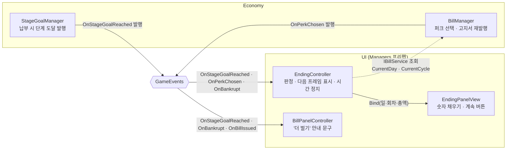

# 엔딩 화면

> 관련 이슈: #271 · 최종 수정: 2026-09-23

**이 문서는 로그다.** 이 기능을 고칠 때마다 갱신한다. 새 문서를 만들지 않는다.

## 무엇을 하는가

마지막 단계 고지서를 내고 퍼크를 고르면, 통계(걸린 날·회차·총 납부액)를 담은 엔딩 패널을
회차당 한 번 띄운다. 닫으면 마지막 단계 고지서가 계속 재발행되는 "더 벌기" 로 이어진다.
규칙은 [GDD](../GDD.md) 5절, 원작 근거는 [REFERENCE_ANALYSIS](../REFERENCE_ANALYSIS.md) 6절 엔딩 흐름.

## 왜 이 방법인가

| 검토한 방법 | 채택 | 이유 |
|---|---|---|
| `OnStageGoalReached(n)` 에서 `n >= Stages.Count` 로 판정 | ✅ | 도달한 단계 번호를 직접 받으므로 구독 순서와 무관하다 |
| DoD 문구대로 `OnBillPaid && IsMaxStage` | ❌ | StageGoalManager 가 납부 직후 단계를 올리므로 **2단계를 낸 순간 이미 IsMaxStage 가 참**이다. 한 단계 일찍 뜬다 |
| `IsMaxStage && IsStageCleared` | ❌ | `_isStageCleared` 는 BeginRun·RestoreStage 에서 풀려 다음 런이면 사라진다 |
| 퍼크 선택(`OnPerkChosen`) 안에서 바로 띄우기 | ❌ | PerkChoiceController 가 TryChoosePerk 뒤에 ResumeTime 을 부른다. 여기서 멈추면 0 을 원래 값으로 기억해 닫을 때 게임이 굳는다 |
| 플래그만 세우고 **다음 Update** 에서 띄우기 | ✅ | 퍼크 쪽 시간 복원이 끝난 뒤라 원래 timeScale 을 바르게 기억한다. Update 는 timeScale 0 에서도 돈다 |
| 총 납부액을 따로 누적 | ❌ | 끝까지 온 회차는 단계마다 한 장씩 냈으므로 늘 Σ `bill_amount` 다. 상태를 늘릴 이유가 없다 |
| 엔딩 플래그 저장(SaveData) | ❌ | DoD 가 메모리 플래그로 한정했다. 스키마 변경은 계약 이슈 몫 |
| BillPanelController 가 `EndingController.IsRunCleared` 를 읽기 | ❌ | UI 끼리 구현 클래스를 직접 참조한다(convention-checker 지적). 같은 이벤트를 듣는 자체 플래그로 바꿨다 |

## 구조

| 클래스 | 경로 | 하는 일 |
|---|---|---|
| `EndingController` | `Assets/Scripts/Runtime/UI/EndingController.cs` | 판정, 다음 프레임 표시, timeScale 정지·복원, 파산 시 초기화 |
| `EndingPanelView` | `Assets/Scripts/Runtime/UI/EndingPanelView.cs` | 통계 세 칸 채우기, 계속 버튼 콜백 |
| `BillPanelController` | `Assets/Scripts/Runtime/UI/BillPanelController.cs` | 엔딩 뒤 고지서 안내 문구를 "고지서는 다 냈다 · 이제부터는 더 벌기" 로 |
| `EndingPanelPrefabCreator` | `Assets/Scripts/Editor/EndingPanelPrefabCreator.cs` | 메뉴 `NCAI/UI/엔딩 패널 프리팹 생성` → `Assets/Prefabs/UI/EndingPanel.prefab` |
| `EndingChecks` | `Assets/Scripts/Editor/EndingChecks.cs` | 프리팹 배선 + 판정·시간·1회성 흐름 검증 |

- Canvas 정렬: HUD·고지서 0, 일시정지 90, 퍼크 100, **엔딩 110** — 퍼크 뒤 새 고지서 모달 위에 뜬다.
- Game 씬에 EventSystem 이 없을 때를 대비해 꺼진 `FallbackEventSystem` 을 패널이 들고 다닌다
  (PerkChoicePanel 과 같은 방식). 이미 있으면 켜지 않는다.

### 이벤트

| 이벤트 | 발행/구독 | 언제 |
|---|---|---|
| `GameEvents.OnStageGoalReached` | EndingController·BillPanelController 구독 | 마지막 단계 번호가 오면 "마지막 납부" 표시 |
| `GameEvents.OnPerkChosen` | EndingController 구독 | 표시가 있으면 클리어 확정, 다음 프레임에 패널 |
| `GameEvents.OnBankrupt` | EndingController·BillPanelController 구독 | 새 회차 — 플래그·패널·문구를 내린다 |
| `GameEvents.OnBillIssued` | BillPanelController 구독 (기존) | 클리어 뒤면 안내 문구를 바꾼다 |

새 이벤트·인터페이스는 없다.

### 읽는 밸런스 값

| CSV | 열 | 쓰는 곳 |
|---|---|---|
| `Assets/GameData/Balance/stages.csv` | 행 수 | 마지막 단계 판정 |
| `Assets/GameData/Balance/stages.csv` | `bill_amount` | 총 납부액 = 전 행 합 |

## 검증

- [x] `EndingChecks` (Edit Mode, 검증 하네스) PASS — 마지막 직전 단계에선 안 뜸 / 퍼크 전엔 안 뜸 /
      퍼크 뒤 다음 Update 에 뜨고 timeScale 0 / 계속하기 뒤 원래 timeScale / 재발행 고지서를 또 내도 안 뜸 / 파산 시 플래그 해제
- [x] `UiGuidelineChecks` — EndingPanel 경고 0
- [x] Play Mode (2026-09-23): 3단계로 옮겨 정산창 → 고지서 납부 → 퍼크 선택 →
      다음 프레임에 패널 활성, timeScale 0, "2일 · 1회차 · $360"(35+90+235) 표시 →
      "계속 부수기" 버튼 onClick → 패널 닫힘, timeScale 1, 새 고지서 모달 뜸, 안내 문구 "고지서는 다 냈다 · 이제부터는 더 벌기"
- [x] Develop(#302, 5단계로 확장) 리베이스 뒤 `EndingChecks`·`UiGuidelineChecks` 재실행 PASS. 총 납부액은 $5,865 가 된다 — 위 Play 값은 3단계 시절 기준이다
- [ ] 마우스로 실제 클릭 — 미검증 (버튼 onClick 을 코드로 호출했다)

## 알려진 한계

- 마지막 납부 뒤 **퍼크를 고르기 전에** 앱을 끄면 엔딩이 뜨지 않는다. 도달 이벤트가 다시 오지 않기 때문이다 (DoD 가 허용한 범위, 저장 안 함의 대가).
- 퍼크를 고른 뒤 재실행하면 같은 회차라도 플래그가 없어 마지막 고지서를 또 내면 한 번 더 뜬다 (DoD 가 감수).
- 안내 문구 칸(`_payCaptionText`)은 원래 경고색 18px 이라 "더 벌기" 가 경고처럼 읽힐 수 있다.
- 걸린 날은 `CurrentDay` 그대로다. 원작처럼 회차를 넘어 누적한 일수가 아니다.

## 갱신 이력

| 날짜 | 이슈 | 누가 | 무엇이 바뀌었나 |
|---|---|---|---|
| 2026-09-23 | #271 | soilrist | 최초 작성 |
