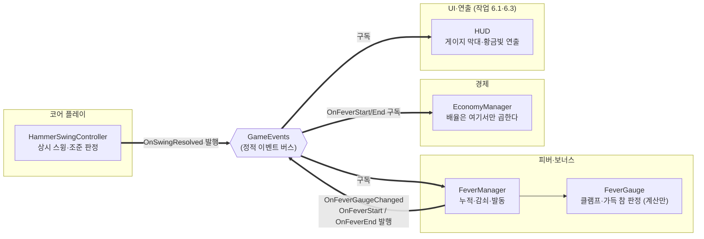

# 피버 게이지

> 관련 이슈: #31, #32 · 최종 수정: 2026-09-17

**이 문서는 로그다.** 이 기능을 고칠 때마다 갱신한다. 새 문서를 만들지 않는다.

## 무엇을 하는가

적중으로 피버 게이지를 채우고, 타격이 끊기면 감쇠시키며, 가득 차면 피버를 발동해 정해진 시간 뒤
끝낸다. 발동·종료를 알리기만 하고 **코인 배율은 여기서 곱하지 않는다** — 배율은 EconomyManager
안에서만 적용한다 (ARCHITECTURE 코인 계약 4번). 그래서 `fever.csv` 의 `coin_multiplier` 는
이 기능이 읽지 않는 유일한 열이다.

**발동이 실제로 지급액을 바꾸는지는 #32 에서 두 매니저를 함께 돌려 확인했다.** 경계가 이벤트
하나뿐이라 그전까지는 양쪽이 각자 절반씩만 보고 있었다 (아래 검증).

## 왜 이 방법인가

| 검토한 방법 | 채택 | 이유 |
|---|---|---|
| 계산부(`FeverGauge`)와 컴포넌트(`FeverManager`) 분리 | ✅ | Edit Mode 는 `OnEnable`·`Update` 를 부르지 않아, 계산을 MonoBehaviour 안에 두면 검증할 방법이 없다. `CoinWallet`·`StaminaPool` 과 같은 이유다 |
| `Update` 가 직접 `Time.deltaTime` 을 소비 | ❌ | 검증에서 유예·지속 시간을 재현할 수 없다. `Tick(float)` 으로 분리해 경과 시간을 주입한다 |
| **발동 순간** 게이지를 0으로 | ✅ | 밸런스 모델(`.github/scripts/simulate_balance.py`)이 그렇게 센다. 모델과 다르게 만들면 `fever.csv` 에 적힌 런당 발동 빈도가 그대로 틀린 값이 된다 |
| 종료 시점에 0으로 (피버 중에도 누적) | ❌ | GDD 문장("피버 종료 후 게이지는 0으로 초기화된다")만 보면 이쪽도 읽히지만, 피버 중 적중이 다음 피버를 앞당겨 발동 간격이 짧아진다. 밸런스를 다시 잡아야 한다 |
| 자동 망치 적중도 게이지에 포함 | ✅ | BALANCE 5절이 "호버·자동 망치의 적중 여부를 함께 전달하고 **정확도는 호버만** 집계한다"고 정했다. 소스를 가리는 것은 정확도 쪽이다 |
| 피버 배율 업그레이드를 `FeverManager` 가 계산해 넘긴다 | ❌ | 배율은 EconomyManager 안에서만 적용한다는 계약을 깬다. 업그레이드 레벨도 그쪽에 있으므로 실효 배율을 꺼내려고 매니저 경계를 넘을 이유가 없다 (#32) |
| 감쇠를 `BeginRun()` 뒤에만 (런 게이트) | ✅ | 게이트가 없으면 MainMenu 에서도 게이지가 쌓인다. 매니저는 `DontDestroyOnLoad` 라 씬을 가리지 않는다 |

### 헛스윙을 세지 않는 것이 핵심이다

망치는 대상이 있든 없든 계속 스윙한다 (작업 2.3). `OnSwingResolved` 의 `bool` 을 무시하고
스윙마다 채우면 **빈 책상에 커서를 올려 두기만 해도 피버가 찬다.** 조준이 이 게임의 유일한
실력 지표라는 GDD 의 전제가 무너지므로, 적중만 센다.

## 구조

| 클래스 | 경로 | 하는 일 |
|---|---|---|
| `FeverGauge` | `Assets/Scripts/Runtime/Fever/FeverGauge.cs` | 누적·감쇠·상한 판정. Unity 의존도 이벤트도 없다 |
| `FeverManager` | `Assets/Scripts/Runtime/Fever/FeverManager.cs` | `Managers` 프리팹에 붙는 MonoBehaviour. 시간을 먹이고 이벤트를 발행한다 |
| `FeverChecks` | `Assets/Scripts/Editor/FeverChecks.cs` | 게이지와 이벤트 배선의 Edit Mode 검증 23건 |
| `FeverPayoutChecks` | `Assets/Scripts/Editor/FeverPayoutChecks.cs` | 발동부터 코인 지급까지 매니저를 **함께** 돌리는 Edit Mode 검증 12건 |

### 이벤트

| 이벤트 | 발행/구독 | 언제 |
|---|---|---|
| `GameEvents.OnSwingResolved` | 구독 | **적중일 때만** 누적한다. 헛스윙은 유예 시각도 갱신하지 않는다 |
| `GameEvents.OnFeverGaugeChanged` | 발행 | 적중·발동·런 시작 시 즉시, 지속 감쇠는 묶어서 |
| `GameEvents.OnFeverStart` | 발행 | 게이지가 가득 찬 순간 |
| `GameEvents.OnFeverEnd` | 발행 | 지속 시간이 끝났을 때, 그리고 피버 중에 `EndRun()`·`BeginRun()` 이 불렸을 때 |

`EndRun()` 이 피버 종료를 알리는 것이 중요하다. 안 알리면 **EconomyManager 의 배율이 켜진 채로
다음 런까지 남는다.**

### 공개 API

| 멤버 | 계약 | 누가 부르나 |
|---|---|---|
| `BeginRun()` | **`IRunScoped`** | GameManager — 런 시작. 게이지를 비우고 누적을 켠다 |
| `EndRun()` | 없음 | GameManager — 누적·감쇠를 멈추고, 피버 중이었으면 종료를 알린다 |
| `CurrentGauge` / `MaxGauge` / `IsFeverActive` / `IsRunning` | 없음 | 조회 |

`IRunScoped` 는 #71 이 `IEconomyService` 에서 런 경계를 떼어내며 만든 계약이다. 피버도 같은
경계를 쓰므로 그대로 구현한다 — GameManager 가 구현 클래스를 잡지 않아도 런을 시작시킬 수 있다.

**`EndRun()` 과 조회 멤버는 아직 계약 밖이다.** 런 종료를 부르려면 결국 `FeverManager` 를 직접
잡아야 한다. 스태미나도 같은 상태이고, 넓힐지는 [#111](https://github.com/KDNA-Gwangju-1/NCAIClicker/issues/111) 에서 정한다.

### 읽는 밸런스 값

| CSV | 열 | 쓰는 곳 |
|---|---|---|
| `fever.csv` | `gauge_max` | `BeginRun()` 이 정하는 최대치 |
| `fever.csv` | `gauge_per_hit` | 적중 1회 누적량 |
| `fever.csv` | `gauge_decay_per_sec` | 유예 후 초당 감쇠량 |
| `fever.csv` | `decay_grace_sec` | 마지막 **적중** 이후 감쇠까지 기다리는 시간 |
| `fever.csv` | `duration_sec` | 피버 지속 시간 |
| `fever.csv` | `coin_multiplier` | **읽지 않는다** — EconomyManager 의 몫 |

## 검증

Edit Mode 에서 `FeverChecks.RunBatch()` 로 확인했다 (**23건 PASS**). 연속 3회 실행 후
`GameEvents` 의 4개 이벤트 구독자 수가 전부 0인 것도 확인했다 — 구독이 새면 적중 하나가
두 번 쌓인다. 기대값은 코드에 적지 않고 생성된 `BalanceData.asset` 에서 읽는다.

- [x] 런 시작 게이지는 비어 있다 (스태미나와 반대)
- [x] 적중만 누적하고 헛스윙은 무시한다
- [x] 유예 시간 안에는 감쇠하지 않고, 넘기면 감쇠하며, 적중하면 유예가 다시 시작된다
- [x] 감쇠는 0 에서 멈춘다
- [x] 가득 차면 `OnFeverStart` 가 한 번 나가고 게이지가 즉시 비워진다
- [x] 피버 중에는 적중해도 쌓이지 않는다
- [x] 지속 시간이 지나면 `OnFeverEnd` 가 한 번만 나가고, 그 뒤 계속 `Tick` 해도 반복되지 않는다
- [x] 종료 후 다시 채워 **두 번째 발동**이 된다 (런당 여러 번의 전제)
- [x] `EndRun()` 이 피버 중이면 종료를 알린다
- [x] 구독 해제 후 무반응, 재구독해도 중복 없음
- [x] 지속 감쇠 발행이 프레임 수보다 적다 (묶기 동작)
- [x] `fever.csv` 변경 후 기존 검증 61건(스태미나·지갑·경제)도 그대로 통과

**런당 발동 횟수는 이 검증이 보지 않는다.** 완료 기준의 정본은 밸런스 모델이며 결과는
[BALANCE.md 5절](../BALANCE.md)에 있다. 그 과정에서 **기존 `gauge_per_hit` 로는 피버가 사실상
발동하지 않는다는 것을 발견해 값을 올렸다.**

### 발동 → 지급 교차 검증 (2026-09-17, #32)

`FeverPayoutChecks.RunBatch()` 로 확인했다 (**12건 PASS**). 여기서는 `OnFeverStart` 를 손으로
쏘지 않고 **실제로 적중을 쌓아 발동시킨 뒤** 파괴 보상을 지급해, 지갑 잔액이 배율을 따랐는지 본다.
소수 잔여가 이월되므로 한 번의 지급액이 아니라 누계로 비교한다.

- [x] 피버 밖에서는 배율이 걸리지 않는다
- [x] 적중을 쌓아 발동시키면 `coin_multiplier` 배로 지급된다
- [x] 지속 시간이 끝나기 직전까지 배율이 유지되고, 지나면 풀린다 (종료 발행 1회)
- [x] 두 번째 발동의 배율이 첫 번째와 같다 (겹쳐 곱해지지 않는다)
- [x] 피버 중에 `EndRun()` 으로 런이 끊겨도 배율이 남지 않는다
- [x] `fever_multiplier` 업그레이드 레벨이 오르면 **실효 배율로** 지급된다
- [x] 그 업그레이드가 피버 **밖** 지급액은 건드리지 않는다
- [x] 레벨을 0 으로 되돌리면 CSV 원본 배율로 돌아간다
- [x] **피버 중 스태미나 감소 속도가 평소와 같다** (이슈 #32 가 못 박은 조건)
- [x] 실행 후 `BalanceData` 가 dirty 가 아니고, 3회 연속 실행 뒤 구독자 수가 전부 0

검증이 실제로 무언가를 잡는지도 확인했다. `EconomyManager` 의 업그레이드 조회를 CSV 원본으로
되돌려 보니 업그레이드 항목이 "기대 잔액보다 실제가 적다"로 실패했다.

**미검증**: Play Mode. Unity 가 `OnEnable`·`Update` 를 실제로 그 시점에 불러 주는지는 확인하지
못했다 — 검증에서는 리플렉션으로 직접 부른다. 테스트 asmdef 가 런타임 코드(`Assembly-CSharp`)를
참조하지 못해 PlayMode 테스트를 쓸 수 없는 제약이 그대로다.

## 알려진 한계

- ~~**아무도 `BeginRun()` 을 부르지 않는다.**~~ — 이슈 #111에서 `GameManager` 가 `Running` 전이 시 `IRunScoped.BeginRun()`, `Result` 전이 시 `IRunScoped.EndRun()` 을 호출하도록 배선 완료.
- **피버 강화 업그레이드가 절반만 반영된다.** "헬스장 회원권"은 배율과 지속 시간을 함께 올리는데,
  **배율 쪽은 #32 에서 붙었다** — EconomyManager 가 업그레이드 레벨과 배율 적용 지점을 둘 다
  가지고 있어 매니저 경계를 넘지 않고 끝났다. **지속 시간 쪽은 남아 있다.** 그 값을 세는 것은
  `FeverManager` 인데, 계약(`IUpgradeStats`, #116 머지됨)은 생겼지만 **아직 아무 소비처도
  거기에 연결돼 있지 않다** — #116 스스로 소비처 배선을 범위 밖으로 두었다. `FeverManager` 가
  `IUpgradeStats` 를 주입받고 `StartFever()` 가 `GetStat(StatId.FeverDuration, duration_sec)` 을
  읽게 하면 닫힌다. 그때까지 레벨을 올려도 피버는 `duration_sec` 만큼만 간다
- **퍼크 선택 중 일시정지가 없다.** BALANCE 5절이 "퍼크 선택 중에는 피버 시간도 멈춘다"고
  정해 두었다. 퍼크는 작업 4.2 라 그때 일시정지 통로가 필요하다 — 지금 `EndRun()` 으로 멈추면
  피버가 끝나 버린다
- **런 종료는 계약에 편입되었으나 조회가 남았다.** 이슈 #111에서 `IRunScoped` 에 `EndRun()` 이 추가되어 `EndRun()` 은 공식 계약이 되었다. 런 도중 구독을 시작하는 UI 가 초기 게이지를 읽을 통로는 6.1 담당자와 맞춰야 한다
- **저장·복원이 없다.** 게이지는 런 안에서만 사는 값이라 `SaveData` 에 필드가 없다

## 갱신 이력

| 날짜 | 이슈 | 누가 | 무엇이 바뀌었나 |
|---|---|---|---|
| 2026-09-17 | #31 | twins6375-art | 최초 작성 (적중 누적, 유예 후 감쇠, 발동·종료, 발동 빈도 재조정) |
| 2026-09-17 | #111 | saltlake00 | `IRunScoped.EndRun()` 계약 편입 및 `GameManager` 배선 완료 반영 |
| 2026-09-17 | #32 | twins6375-art | 발동 → 코인 지급 교차 검증 추가, `fever_multiplier` 업그레이드 반영 |
