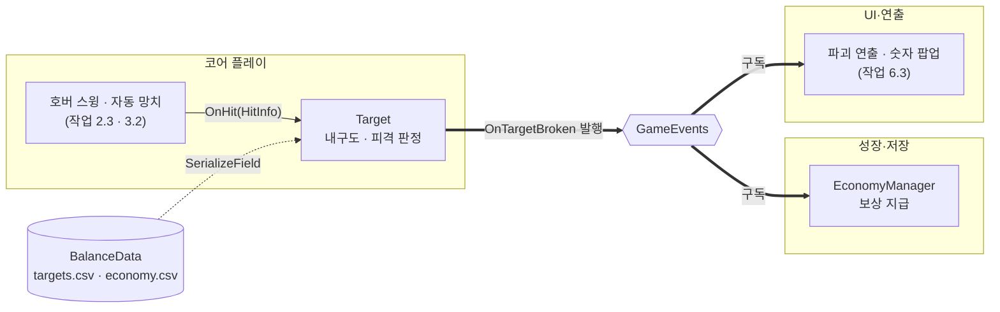

# 타격 대상

> 관련 이슈: #16 · 최종 수정: 2026-09-16

**이 문서는 로그다.** 이 기능을 고칠 때마다 갱신한다. 새 문서를 만들지 않는다.

## 무엇을 하는가

커서가 조준하는 대상의 **내구도와 피격**을 담당한다. 타격은 내구도만 깎고, 다 깎이는 순간
`OnTargetBroken` 을 한 번 발행해 보상을 넘긴다. 코인 지급은 여기서 하지 않는다.

4종(일반·거치·고속·회복)은 **같은 스크립트에 `targets.csv` 의 다른 행**을 물린 것이다.
종류마다 클래스를 만들지 않는다.

이동·상태 전이·스폰은 작업 2.2, 파괴 연출은 작업 6.3 이다. 이 문서는 그때 함께 갱신한다.

## 왜 이 방법인가

| 검토한 방법 | 채택 | 이유 |
|---|---|---|
| 한 스크립트 + `targets.csv` 행으로 4종 구분 | ✅ | 4종의 차이는 수치뿐이다. 종류별 클래스를 만들면 CSV 를 고칠 때 코드도 같이 고쳐야 한다 |
| 종류별 파생 클래스 (`NormalTarget` 등) | ❌ | 상속 계층만 늘고 얻는 게 없다. 회복형도 `stamina_restore` 가 0 보다 큰 것뿐이다 |
| 피격 반경을 메시 크기에서 잰다 | ❌ | **처음에 이렇게 만들었다가 되돌렸다.** 작업 6.6 에서 모델을 갈아끼우면 판정 크기가 따라 변해 밸런스가 흔들린다 (ASSET_PIPELINE 1절) |
| 피격 반경을 루트의 고정값 × CSV 배율로 둔다 | ✅ | 모델과 무관하다. 확대 비율만 `economy.csv` 에서 읽는다 |
| 내구도를 `int` 로 둔다 | ❌ | 자동 망치 1회 피해가 0.6 이라 정수로 깎으면 버려진다 |
| 내구도를 `float` 로 둔다 | ✅ | 작은 피해도 누적된다 (ARCHITECTURE 코인 계산·정산 계약 1번) |
| 파괴 보상을 남은 내구도로 계산 | ❌ | 계약 2번이 **초기 최대 내구도** 기준이라고 못박았다. 남은 값으로 하면 마지막 타격 크기에 따라 보상이 달라진다 |

## 구조



프리팹은 **3단**이다. 이 구조가 작업 6.6 에셋 교체를 코어 담당자의 작업과 분리한다.

```
TargetNormal (루트)          ← 로직: Target, SphereCollider
└─ Visual (빈 GameObject)    ← 연출이 스쿼시·스트레치로 여기를 스케일한다
   └─ Mesh                   ← 그레이박스 프리미티브. 교체는 이것만 갈아끼운다
```

| 클래스 | 경로 | 하는 일 |
|---|---|---|
| `Target` | `Assets/Scripts/Runtime/Targets/Target.cs` | `IHittable` 구현. 내구도, 피격, 파괴 1회 발행, 피격 반경 적용 |
| `TargetChecks` | `Assets/Scripts/Editor/TargetChecks.cs` | 구조·동작 검증 25건 |

프리팹 4종은 `Assets/Prefabs/Targets/`, 머티리얼 4종은 `Assets/Materials/` 다.

| 프리팹 | `_targetId` | 그레이박스 | 색 |
|---|---|---|---|
| `TargetNormal` | `normal` | Cube | 청회색 |
| `TargetAnchor` | `anchor` | Cylinder | 갈색 |
| `TargetRunner` | `runner` | Sphere | 노랑 |
| `TargetTourist` | `tourist` | Capsule | 초록 |

높이는 4종 모두 **0.4 유닛**이고 바닥이 `y=0` 에 닿는다. 기준은 [ASSET_PIPELINE](../ASSET_PIPELINE.md) 2절.

### 이벤트

| 이벤트 | 발행/구독 | 언제 |
|---|---|---|
| `GameEvents.OnTargetBroken` | **발행** | 내구도가 0 이하로 떨어지는 순간. 살아 있음 → 부서짐 전이에서 **한 번만** |

구독하는 이벤트는 없다. `OnEnable`/`OnDisable` 쌍이 필요 없는 이유다.

### 읽는 밸런스 값

| CSV | 열 | 쓰는 곳 |
|---|---|---|
| `targets.csv` | `hp` | 초기 내구도, 원시 보상 계산 |
| `targets.csv` | `coin_mult`, `break_bonus` | `BreakInfo.RawCoin` |
| `targets.csv` | `stamina_restore` | `BreakInfo.StaminaRestore`. 회복형만 0 보다 크다 |
| `economy.csv` | `hit_radius_bonus` | 피격 반경 확대 비율 |

`move_speed` 와 `turn_interval_sec` 는 이 문서 범위가 아니다 — 작업 2.2 가 쓴다.

## 검증

Unity 6000.3.21f1, Edit Mode, 2026-09-16.

- [x] `TargetChecks.RunBatch()` **25건 통과, 연속 2회**
  - 구조: 루트에 `Target`+`SphereCollider`, `Visual` 이 비어 있고 스케일 1, 그 아래 `Mesh`, `Visual` 하위 콜라이더 없음
  - 높이 0.4 유닛, 바닥이 `y=0`
  - 내구도가 남았을 때는 발행하지 않고, 마지막 타격에 **정확히 1회** 발행
  - `RawCoin` 이 초기 최대 내구도 기준과 일치, `StaminaRestore` 일치
  - **부서진 뒤 추가 타격에 재지급 없음**
  - **메시를 2배로 키우고 재초기화해도 피격 반경 불변** — 작업 6.6 교체 가드
  - 회복형만 `stamina_restore` > 0
- [x] 실제 연결 확인 — 일반형 3타 파괴 → `OnTargetBroken` → `EconomyManager` → 지갑 4코인 / `RunCoin` 4
- [x] 컴파일 에러·경고 0건
- [ ] **Play Mode 미검증** — Unity 가 `Awake` 를 부르는 경로. 테스트 asmdef 가 런타임 코드를 참조하지 못한다
- [ ] **화면에서 실제로 조준해 본 적 없다** — 0.4 유닛이 조준하기 적당한지는 작업 2.3 이후 사람이 판단해야 한다

## 알려진 한계

- **이동하지 않는다.** 스폰·이동·FSM 은 작업 2.2 다. 지금은 놓인 자리에 가만히 있다.
- **파괴 연출이 없다.** 부서져도 오브젝트가 그대로 남는다. 숨기거나 파편을 띄우는 것은 작업 6.3 이다.
- **피격 반경이 업그레이드를 반영하지 않는다.** `upgrade_effects.csv` 에 `strong_hammer → hit_radius +2%/레벨`
  이 있는데, 반경은 `Initialize()` 때 한 번 정해진다. 업그레이드 적용 시점에 다시 계산할 경로를
  작업 3.3 에서 정해야 한다.
- **그레이박스 크기가 `Mesh` 의 로컬 스케일에 들어 있다.** 루트와 `Visual` 은 스케일 1 이다.
  작업 6.6 에서 실제 모델로 갈아끼울 때 이 스케일을 임포트 설정의 Scale Factor 로 옮길지
  `Mesh` 에 그대로 둘지 정해야 한다 ([ASSET_PIPELINE](../ASSET_PIPELINE.md) 2절이 전자를 권한다).
- `_baseHitRadius` 는 프리팹에 박힌 값이고 CSV 열이 없다. 종류마다 판정 크기를 다르게 하고 싶어지면
  그때 `targets.csv` 열로 올린다 — 지금은 4종이 같은 값이라 열을 만들 이유가 없다.
- Edit Mode 에서는 `Awake` 가 돌지 않아 검증이 `Initialize()` 를 직접 부른다. 이 메서드는 풀 재사용을
  위해 공개해 둔 것이라 리플렉션은 쓰지 않는다.

## 갱신 이력

| 날짜 | 이슈 | 누가 | 무엇이 바뀌었나 |
|---|---|---|---|
| 2026-09-16 | #16 | twins6375-art | 최초 작성 (그레이박스 4종, 내구도·피격, 파괴 발행) |
