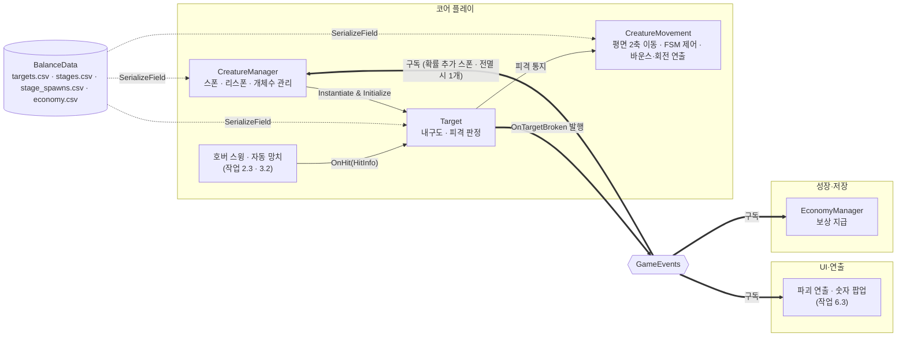

# 타격 대상 (크리처)

> 관련 이슈: #16, #17, #141, #148, #161, #37, #156 · 최종 수정: 2026-09-21

**이 문서는 로그다.** 이 기능을 고칠 때마다 갱신한다. 새 문서를 만들지 않는다.

## 무엇을 하는가

커서가 조준하는 대상의 **내구도와 피격**, 그리고 책상 평면 2축(XZ) **배회 이동·FSM 상태 머신·스폰 관리**를 담당한다.
타격은 내구도만 깎고, 다 깎이는 순간 `OnTargetBroken` 을 한 번 발행해 보상을 넘긴다.
평상시 크리처는 멈춰 서서 대기(Idle)와 짧은 배회(Moving)를 반복하며 책상 안전 경계 안을 배회한다.
피격 시에는 타격 지점 반대 방향으로 도망(Fleeing)치며, 연속 타격이 누적될수록 공포(패닉)가 누적되어 도망 속도가 가속된다.
파괴된 자리는 **시간이 지나도 자동으로 채워지지 않는다** (#156). 파괴할 때마다 확률적으로
즉시 1개가 추가되고, 책상 위가 완전히 비면(0마리) 그때만 1개가 즉시 채워진다.

4종(일반·거치·고속·회복)은 **같은 스크립트에 `targets.csv` 의 다른 행**을 물린 것이다.
종류마다 클래스를 만들지 않는다.

파괴 연출은 작업 6.3 이다. 이 문서는 그때 함께 갱신한다.

## 왜 이 방법인가

| 검토한 방법 | 채택 | 이유 |
|---|---|---|
| 한 스크립트 + `targets.csv` 행으로 4종 구분 | ✅ | 4종의 차이는 수치뿐이다. 종류별 클래스를 만들면 CSV 를 고칠 때 코드도 같이 고쳐야 한다 |
| 종류별 파생 클래스 (`NormalTarget` 등) | ❌ | 상속 계층만 늘고 얻는 게 없다. 회복형도 `stamina_restore` 가 0 보다 큰 것뿐이다 |
| 피격 반경을 메시 크기에서 잰다 | ❌ | **처음에 이렇게 만들었다가 되돌렸다.** 작업 6.6 에서 모델을 갈아끼우면 판정 크기가 따라 변해 밸런스가 흔들린다 (ASSET_PIPELINE 1절) |
| 피격 반경을 루트의 고정값 × CSV 배율로 둔다 | ✅ | 모델과 무관하다. 확대 비율만 `economy.csv` 에서 읽는다 |
| 내구도를 `int` 로 둔다 | ❌ | 자동 망치 1회 피해가 0.6 이라 정수로 깎으면 버려진다 |
| 내구도를 `float` 로 둔다 | ✅ | 작은 피해도 누적된다 (ARCHITECTURE 코인 계산·정산 계약 1번) |
| 파괴 보상을 남은 내구도로 계산 | ❌ | 계약 2번이 **초기 최대 내구도** 기준이라고 못박았다. 남은 값으로 하면 마지막 타격 크기에 따라 보상이 달라진다 |
| FSM 대신 행동 트리(BT) 사용 | ❌ | 타격 대상의 상태는 Idle, Moving, BeingHit, Fleeing 의 단순 순환뿐이라 FSM으로 충분하다 (ARCHITECTURE 4절) |
| 이동과 스폰 수치를 코드 상수로 하드코딩 | ❌ | 밸런스 CSV 및 저금통 수집벽 업그레이드로 수치가 변하므로 BalanceData와 업그레이드 연동 구조로 계산한다 |
| 부서진 자리를 슬롯별 타이머로 시간 기반 자동 리스폰 (#141 당시 구조) | ❌ | 원작 재관찰 결과 원작 기본 규칙이 아니었다 — `docs/REFERENCE_ANALYSIS.md` 9절. 등급 A 플레이 영상에서 시간 기반 스폰은 "Piggy Timer"라는 별도 가젯 효과로만 확인됐다 (#156) |
| 파괴 시 확률로 즉시 추가 스폰 + 전멸(0마리) 시 1개만 즉시 스폰 | ✅ | 같은 재관찰에서 확인한 원작 규칙. *"when you break all pigs on the table, one will immediately spawn"* (`sYyTekFrgvc` 1:18:39). 확률은 저금통 수집벽 업그레이드로만 열린다 (#156) |
| Edit Mode 에서 DestroyImmediate 로 분기 (SafeDestroy) | ✅ | 에디트 모드 검증 하네스에서 Destroy 호출 시 오류 발생 및 씬 잔류를 방지하고 리스폰 회계를 온전히 검증한다 (#161) |
| 검증 하네스 쪽에서만 스텁을 우회 파괴 | ❌ | CreatureManager 의 RemoveDeadCreatures 실제 동작과 쿨다운 예약 회계가 온전히 검증되지 않는다 |

## 구조



프리팹은 **3단**이다. 이 구조가 작업 6.6 에셋 교체를 코어 담당자의 작업과 분리한다.

```
TargetNormal (루트)          ← 로직: Target, CreatureMovement, SphereCollider
└─ Visual (빈 GameObject)    ← 연출이 스쿼시·스트레치로 여기를 스케일한다
   └─ Mesh 또는 실물 에셋      ← 교체는 이것만 갈아끼운다
```

**작업 6.6(#37)에서 저금통(피기) 테마를 포기하고 4종 전부를 광물 크리처로 교체했다.** 최초에는
`TargetNormal` 만 [저금통 일반형 3D 에셋](piggy-normal-asset.md)으로 교체했으나, 팀 논의 결과 피기
방향을 접고 광물(구리·은·금·다이아몬드) 크리처 4종으로 통일하기로 했다 — 자세한 경위와 수치는
[광물 크리처 에셋](mineral-creature-assets.md) 참고. `Visual` 자식의 그레이박스/피기 메시를 지우고
`MineralCreature{Copper,Silver,Gold,Diamond}Visual.prefab` 을 nested prefab instance 로 끼웠다.
매핑은 내구도(`hp`) 기준 약함→강함 순: `runner`(1)→Copper, `normal`(3)→Silver, `tourist`(10)→Gold,
`anchor`(12)→Diamond. `Target._visual` 필드는 여전히 `Visual` GameObject 를 가리키므로 로직 참조는
바뀌지 않는다.

| 클래스 | 경로 | 하는 일 |
|---|---|---|
| `Target` | `Assets/Scripts/Runtime/Targets/Target.cs` | `IHittable` 구현. 내구도, 피격, 파괴 1회 발행, 피격 반경 적용 |
| `CreatureState` | `Assets/Scripts/Runtime/Targets/CreatureState.cs` | 크리처 FSM 상태 열거형 (Idle, Moving, BeingHit, Fleeing) |
| `CreatureMovement` | `Assets/Scripts/Runtime/Targets/CreatureMovement.cs` | 평면 2축(XZ) 배회 이동, FSM 전이, 책상 평면 안전 경계 이탈 방지, `Visual` 상하 바운스·이동 방향 회전 연출 (#267) |
| `CreatureManager` | `Assets/Scripts/Runtime/Core/CreatureManager.cs` | 크리처 4종 스폰, 동시 출현 수 유지, 파괴 후 리스폰 관리 |
| `CreatureHpDisplay` | `Assets/Scripts/Runtime/Targets/CreatureHpDisplay.cs` | 크리처 머리 위 실시간 HP 숫자 표시 및 피격 시 펀치 스케일 연출 |
| `DamagePopup` | `Assets/Scripts/Runtime/Targets/DamagePopup.cs` | 타격 시 피해량을 공중에 띄우고 서서히 페이드아웃 후 소멸하는 연출 |
| `TargetChecks` | `Assets/Scripts/Editor/TargetChecks.cs` | 프리팹 구조·동작 검증 25건 |
| `CreatureMovementChecks` | `Assets/Scripts/Editor/CreatureMovementChecks.cs` | 이동, FSM 전이, 경계 클램프, 바운스·회전, 피격 반응, 스폰, HP표시 검증 19건 |

프리팹 4종은 `Assets/Prefabs/Targets/`, 머티리얼 4종은 `Assets/Materials/` 다.

| 프리팹 | `_targetId` | Visual 자식 | HP |
|---|---|---|---|
| `TargetRunner` | `runner` | `MineralCreatureCopperVisual.prefab` (실물, #37) | 1 |
| `TargetNormal` | `normal` | `MineralCreatureSilverVisual.prefab` (실물, #37) | 3 |
| `TargetTourist` | `tourist` | `MineralCreatureGoldVisual.prefab` (실물, #37) | 10 |
| `TargetAnchor` | `anchor` | `MineralCreatureDiamondVisual.prefab` (실물, #37) | 12 |

높이는 4종 모두 **0.8 유닛**이고 바닥이 `y=0` 에 닿는다. 기준은 [ASSET_PIPELINE](../ASSET_PIPELINE.md) 2절
(조준 원 지름 0.9유닛 대비 70~85% 를 채우도록 6.6 후반부에 0.4 → 0.8로 재조정).

### 이벤트

| 이벤트 | 발행/구독 | 언제 |
|---|---|---|
| `GameEvents.OnTargetBroken` | **발행** | 내구도가 0 이하로 떨어지는 순간. 살아 있음 → 부서짐 전이에서 **한 번만** |
| `GameEvents.OnTargetBroken` | **구독** | `CreatureManager` 가 수신하여 **실제로 치운 개체 수만큼** 추가 생성 확률을 굴리고, 필드가 완전히 비면 1개를 즉시 스폰한다 (#141, #156) |
| `Target.HitReceived` (인스턴스) | **발행** | `Target.OnHit` 호출 시 `OnHitReceived` 메서드를 통해 피격 정보 통지 (#148) |
| `Target.HitReceived` (인스턴스) | **구독** | `CreatureMovement` (피격 상태 전이 및 도망), `CreatureHpDisplay` (HP 갱신 및 펀치 연출) |

`CreatureManager`, `CreatureMovement`, `CreatureHpDisplay` 는 `OnEnable` 구독 / `OnDisable` 해제 쌍을 준수한다.

### 읽는 밸런스 값

| CSV | 열 | 쓰는 곳 |
|---|---|---|
| `targets.csv` | `hp` | 초기 내구도, 원시 보상 계산 |
| `targets.csv` | `coin_count`, `min_denom_id` | `CoinLottery.Draw` → `BreakInfo.Coins`·`RawCoin` (#178). 예전 `coin_mult`·`break_bonus` 는 #241 에서 제거 |
| `targets.csv` | `stamina_restore` | `BreakInfo.StaminaRestore`. 회복형만 0 보다 크다 |
| `targets.csv` | `move_speed`, `turn_interval_sec` | `CreatureMovement` 배회 이동 속도 및 방향 전환 주기 |
| `stages.csv` | `spawn_count` | `CreatureManager` 동시 출현 목표 수 |
| `stage_spawns.csv` | `stage`, `target_id`, `ratio` | `CreatureManager` 단계별 종류 등장 가중치. 행이 없는 종류는 그 단계에 안 나온다 (#293) |
| `targets.csv` | `instant_break_chance` | `Target.OnHit` 타격마다 즉시 파괴 확률 (#293). 피냐타형만 0 보다 크다 |
| `targets.csv` | `charge_speed`, `charge_damage_ratio` | `CreatureMovement` 분노 돌진 속도와 충돌 피해 비율 (#297). 화난 저금통만 0 보다 크다 |
| `economy.csv` | `hit_radius_bonus` | 피격 반경 확대 비율 |
| `economy.csv` | `spawn_interval_sec` | **미사용 호환 필드** (#156 이후 0 고정, 되돌릴 경우를 대비해 남김) |
| `economy.csv` | `extra_spawn_chance_on_destroy` | `CreatureManager` 파괴 시 즉시 추가 스폰될 확률(%). 기본 0, 저금통 수집벽이 올림 (#156) |

## 검증

Unity 6000.3.21f1, Edit Mode, 2026-09-17.

* [x] `TargetChecks.RunBatch()` **25건 통과**
* [x] `CreatureMovementChecks.RunBatch()` **11건 통과**
  * FSM 상태 정의 4종 일치
  * `CreatureMovement` 초기화 및 normal 속도(2.0), 방향전환주기(1.5초) 일치
  * 피격 시 BeingHit 전이, 경직 종료 후 Fleeing 전이, 도망 종료 후 Moving 전이 사이클 확인
  * 책상 평면 경계 초과 좌표 클램프 및 반사 방향 벡터 확인
  * 4종 크리처 move_speed 수치 파싱 일치 확인
  * 1단계 기준 spawn_count 6개 및 desk_expand 업그레이드 확장 반영 계산 확인
  * (2026-09-21 갱신, #156) 기본 추가 생성 확률 0% 및 desk_expand 업그레이드 확률 증가 계산 확인 — 아래 #156 절 참고
* [x] 컴파일 에러·경고 0건

### #141 리스폰 회계 (2026-09-17)

`HandleTargetBroken` 은 정리 루프 결과와 무관하게 무조건 타이머를 하나 추가했다. 목록에 없는
대상의 파괴 이벤트가 들어오면 치운 것이 없는데도 예약이 쌓여 목표 동시 출현 수를 넘겼다.

에디터 배치로 실측한 값이다.

| 상황 | 수정 전 | 수정 후 |
|---|---|---|
| 정상 파괴 2건 | 목록 4 + 예약 2 = 6 (목표 6) | 같음 |
| 목록 밖 파괴 이벤트 2건 | 목록 6 + 예약 2 = 8 → 대기 후 **8마리** | 예약 0 → **6마리 유지** |

* [x] 검증 3건 추가 (목록 밖 이벤트가 예약을 만들지 않음 / 목표치 초과 스폰 없음 / 정상 파괴에서 필드+예약 합 = 목표치)
* [x] **수정 전 코드에서 검증이 실제로 실패하는 것을 확인했다** — 통과만 보면 아무것도 잡지 않는 검증일 수 있다
* [x] Edit Mode 검증 14건 통과

**타이머 리스트 구조는 유지했다.** 밸런스 시뮬레이터(`.github/scripts/simulate_balance.py`)가
"슬롯별 파괴 후 재등장 대기" 로 모델링하므로, 공용 타이머 하나로 바꾸면 N 마리 복구에 N 배
시간이 걸려 모델과 어긋난다.

> **2026-09-21 뒤집힘 (#156).** 이 절의 "타이머 리스트 구조 유지" 결정은 원작 재관찰로 뒤집혔다.
> 타이머 자체가 없어졌으므로 아래 #156 절 참고.

**최초 이슈 본문의 전제("동시 파괴 시 개체 수 감소")는 재현되지 않아 정정했다.** `Target.OnHit`
이 죽는 순간 동기적으로 이벤트를 발행하고 같은 대상이 두 번 발행하지 않으므로, 첫 핸들러가
볼 때 죽어 있는 것은 언제나 한 마리뿐이다.

### #161 에디트 모드 검증 Destroy 오류 및 잔류 해결 (2026-09-18)

에디트 모드에서 검증 하네스(`CreatureMovementChecks`)가 돌 때 `Destroy(creature)` 가 에디트 모드에서
동작하지 않아 `Destroy may not be called from edit mode` 오류가 발생하고 오브젝트가 씬에 잔류하던 문제를
`SafeDestroy` (`Application.isPlaying ? Destroy : DestroyImmediate`) 로 해결했다.

* [x] `NCAI > 전체 검증 실행` 시 `Destroy may not be called from edit mode` 콘솔 에러 0건
* [x] `CreatureMovementChecks` 18건 전체 통과 (파괴된 크리처의 씬 즉시 파괴 단언 추가)
* [x] 검증 실행 후 씬에 임시 크리처 오브젝트 잔류 0건
* [x] 컴파일 에러·경고 0건

### #148 크리처 비율 폴백 제거 및 Target 이벤트 명명 정정 (2026-09-18)

* `CreatureManager.PickPrefabByStageRatio()` 에서 `stages.csv` 를 복제하던 4종 리터럴을 제거하고, `stageDef` 가 없거나 총합이 0 이하면 임의의 비율을 만들지 않고 스폰하지 않음 (`null` 반환)
* `Target.OnHitReceived` 이벤트를 `HitReceived` 로 변경하고 발행부 `OnHitReceived(HitInfo)` 메서드를 분리하여 `AGENTS.md` 명명 규칙 준수
* 구독자 2곳(`CreatureHpDisplay`, `CreatureMovement`)의 이벤트 구독 및 해제 코드 동기화
* [x] `CreatureMovementChecks` 에 `stageDef == null` 시 스폰 미수행 검증 추가 통과
* [x] `TargetChecks` 에 매 타격 시 `HitReceived` 이벤트 정상 발행 및 구독 해제 단언 검증 추가 통과
* [x] 전체 검증 하네스 15종 전수 통과
* [x] `convention-checker` 9대 규칙 전수 점검 통과 (위반 0건)

### #37 TargetNormal 그레이박스 → 실물 에셋 교체 (2026-09-21)

`Visual` 자식의 그레이박스 `Mesh`(Cube)를 지우고 `PiggyNormalVisual.prefab` 을 nested prefab
instance 로 끼웠다. `TargetAnchor`/`Runner`/`Tourist` 는 대응하는 3D 에셋이 없어 이번 범위에서
제외했다 — 위 "구조" 절 참고.

* [x] `manage_prefabs get_hierarchy` 로 `TargetNormal.prefab` 구조 확인 — `Visual` 자식이
  `PiggyNormalVisual` 하나뿐이고 그레이박스 `Mesh` 는 제거됨
* [x] Play Mode(Game 씬)에서 `TargetNormal(Clone)` 6개가 새 프리팹으로 스폰, 콘솔 오류·경고 0건
  (MCP 포트 재연결 로그만 존재) 확인 후 Play 종료, 씬 저장 안 함
* [x] `Target._visual` 필드가 `Visual` GameObject 를 그대로 가리켜 로직 참조 안 깨짐 확인

### #37 피기 방향 철회 → 광물 크리처 4종 전면 교체 (2026-09-21)

위 항목 직후, 팀이 저금통(피기) 테마를 접고 광물 크리처(구리·은·금·다이아몬드) 4종으로 통일하기로
했다. 같은 브랜치에서 4종 전부를 다시 교체했다 — PR을 머지하지 않고 수정.

`TargetNormal` 의 `PiggyNormalVisual` 인스턴스를 제거하고 `MineralCreatureSilverVisual` 로,
`TargetAnchor`/`Runner`/`Tourist` 의 그레이박스 프리미티브를 각각 Diamond/Copper/Gold 로 교체했다.
모델별 스케일·바닥 오프셋은 `Renderer.bounds` 를 직접 측정해 산출했다 — 전 기종 공통 0.4762 배율을
가정한 피기 때와 달리, 모델마다 원본 크기·피벗이 달라 개별 계산이 필요했다. 상세 수치와 발견한
버그(피기 스케일 오버라이드)는 [광물 크리처 에셋](mineral-creature-assets.md) 참고.

* [x] `manage_prefabs get_hierarchy` 로 4개 프리팹 전부 Visual 자식이 해당 `MineralCreature*Visual`
  하나뿐임을 확인
* [x] Play Mode 에서 일시정지해 스폰된 크리처 스크린샷 확인 — Silver/Gold/Diamond 3종은 직접 육안
  확인(올바른 스케일, 바닥 밀착, 정상 머티리얼), Copper 는 해당 짧은 런에서 스폰되지 않아 구조
  검증만 완료(다른 3종과 동일한 방식으로 생성·배선했으므로 동일하게 동작할 것으로 판단)
* [x] 콘솔 오류·경고 0건(MCP 포트 재연결 로그만 존재), `Running -> Result` 까지 정상 진행 확인
* [x] `Target._visual` 필드가 `Visual` GameObject 를 그대로 가리켜 로직 참조 안 깨짐 확인

### #37 스케일 0.4 → 0.8 재조정 — 조준 원 대비 너무 작다는 피드백 (2026-09-21)

위 스크린샷을 본 사용자가 "망치 조준 원 안에 대상이 들어와야 하는데 지금은 너무 작다"고 지적했다.
계산해 보니 근거가 있었다 — 조준 원 지름은 `economy.csv` 의 `reticle_radius`(0.45) × 2 = 0.9유닛인데
0.4유닛 높이 기준 대상의 밑변 폭은 약 0.3~0.37유닛으로 원의 40% 밖에 못 채웠다.

높이 기준을 0.4 → **0.8유닛**으로 올리고 4종 전부 `Renderer.bounds` 재실측으로 스케일·오프셋을
다시 산출했다(스케일은 정확히 2배, 오프셋도 선형이라 2배 — `Transform.localScale` 이 원점 기준
선형 변환이므로 이론과 실측이 정확히 일치했다). Play Mode 에서 다시 측정한 밑변 폭은
0.746×0.600유닛으로 원 지름의 약 83% — 원 안에 들어오는 크기가 됐다.

* [x] `Renderer.bounds` 재측정으로 4종 스케일 재산출 (Copper 0.8809, Silver 0.8001, Gold 0.8212,
  Diamond 0.7868 — 전부 기존 값의 정확히 2배)
* [x] Play Mode 스크린샷으로 크기 확대 육안 확인, 콘솔 오류 0건
* [x] `execute_code` 로 실제 스폰된 `TargetNormal(Clone)` 의 `Renderer.bounds` 를 직접 측정해
  밑변 0.746×0.600, 높이 0.800 확인 — 조준 원 지름(0.9) 대비 약 83%

### #156 스폰 규칙 B안 채택 — 슬롯 타이머 폐기 (2026-09-21)

원작([Bills Must Be Paid](https://store.steampowered.com/app/4421010/_Bills_Must_Be_Paid/)) 등급 A
플레이 영상 자막을 재관찰한 결과, "부서진 자리가 고정 시간 뒤 자동으로 채워진다"는 기존 규칙은
원작 기본 규칙이 아니었다. 근거와 인용은 `docs/REFERENCE_ANALYSIS.md` 9절.

**바뀐 것**:

- `_respawnTimers` 리스트와 `GetSpawnIntervalSec()`/`UpdateRespawnTimers()`/`Update()` 를 전부
  제거했다. 부서진 자리는 더 이상 시간이 지나도 자동으로 채워지지 않는다.
- `HandleTargetBroken` 이 파괴 개수만큼 `GetExtraSpawnChancePercent()`(신규, 기본 0%) 확률을
  굴려 성공 시 즉시 `SpawnRandomCreature()` 를 부르고, 그 뒤 필드가 완전히 비었으면(0마리)
  1개를 추가로 즉시 스폰한다.
- `economy.csv` 의 `spawn_interval_sec` 는 미사용 호환 필드로 0에 고정했다(삭제하지 않음 —
  되돌릴 경우를 대비). 신규 `extra_spawn_chance_on_destroy`(기본 0)를 추가했다.
- `BalanceData.StatId` 에 `ExtraSpawnChance` 를 추가하고, `upgrade_effects.csv` 의
  `desk_expand`(저금통 수집벽) 두 번째 효과를 `spawn_interval_sec percent -6` 에서
  `extra_spawn_chance add 2` 로 바꿨다 — 레벨당 파괴 시 추가 생성 확률 +2%p (잠정값, 7.2 실측 전).
- `.github/scripts/simulate_balance.py` 를 같은 모델로 재작성했다. 업그레이드 없는 1단계
  기준으로 재검증한 결과 이전 모델과 수치 차이가 거의 없었다 — 짧은 런(17.85초)에서는 책상이
  완전히 비는 일이 드물어 "전멸 시 1개" 규칙이 거의 발동하지 않기 때문이다. `stages.csv` 의
  `bill_amount` 는 이번엔 바꾸지 않았다 (`docs/BALANCE.md` 3절).

**검증 (Unity 6000.3.21f1, Edit Mode, 2026-09-21)**:

* [x] `CreatureMovementChecks.RunBatch()` **17건 통과** — 확률 0% 에서 부순 자리가 채워지지
  않는지, 유령 파괴 이벤트가 아무 것도 하지 않는지, 전멸 후 정확히 1개만 채워지는지, desk_expand
  업그레이드가 추가 생성 확률을 올리는지 각각 단언 추가
* [x] `NCAI > 전체 검증 실행` — 통과 21 / 실패 1 (전체 22). 실패 1건(`TargetChecks: TargetNormal
  Visual 아래 Mesh 자식이 없음`)은 이번 변경과 무관한 기존 이슈 (#37 3D 에셋 교체 관련, 별도 확인 필요)
* [x] `convention-checker` 9대 규칙 전수 점검 — 위반 0건
* [x] `python -B .github/scripts/simulate_balance.py --runs 2000 --seed 46 --uptime 0.6` 재실행,
  random/value 두 정책 모두 확인 (`docs/BALANCE.md` 참고)

### #267 바운스 이동·이동 방향 회전 — 원작 동작 재현 (2026-09-22)

**증상**: 크리처가 프리팹 초기 방향(화면 상단)을 바라본 채 미끄러지듯 움직였다. 원작은 인트로 문구
*"piggy banks are jumping on your desk"* 대로 통통 튀며 이동하고 이동 방향을 바라본다.

**원인**: `MoveStep` 이 `transform.position` 을 직선으로 밀고 y 를 고정했으며, 회전을 건드리는 코드가 없었다.

**해결** — 이동 방향·거리·FSM·CSV 는 그대로 두고 연출만 얹었다. 물리(Rigidbody·중력)는 쓰지 않는다.

| 항목 | 어디에 | 내용 |
|---|---|---|
| 상하 바운스 | `Target.Visual` 자식의 `localPosition.y` | Moving/Fleeing 이면 `_hopHeight × \|sin(위상·π)\|`. 착지가 뾰족한 포물선. Idle/BeingHit 이면 원위치 |
| 도망 시 주기 단축 | 같은 곳 | Fleeing 은 `_fleeHopPeriodSec` 로 더 촘촘히 튄다 |
| 이동 방향 회전 | 루트 `transform.rotation` | `_currentDirection` 을 향해 `RotateTowards`(도/초). `_facingOffsetDeg` 로 모델 정면 축 보정 |

- 루트 y 는 바뀌지 않으므로 타격 판정·HP 표시·경계 반사에 영향이 없다 (검증 6-1 이 루트 y 불변을 단언).
- 바운스 높이·주기·회전 속도는 **연출 파라미터**라 `[SerializeField]` 에 두었다. `targets.csv` 의
  `move_speed`·`turn_interval_sec` 의미는 그대로다. 크리처별 차등이 필요해지면 CSV 열 추가는 계약 변경 이슈로 낸다.
- `UpdateVisual(deltaTime)` 은 `UpdateFSM` 과 같은 이유로 public — 에디트 모드 검증이 프레임 없이 호출한다.
  `_target` 은 Awake 를 거치지 않은 경우를 위해 지연 조회한다.

**범위 밖으로 남긴 것**: 수평 이동을 점프 위상에 맞춰 끊는 "점프 단위 이동"(착지 순간 정지). 필요하면
`MoveStep` 속도에 위상 배율을 곱하는 한 줄로 얹을 수 있다. 스쿼시&스트레치·착지 효과음은 6.3 계열.

**2차 조정 — 속도·상태 전환·피격 반응 (같은 이슈)**: 플레이해 보니 이동이 너무 빠르고 상태 전환이
잦았으며, 매 타격마다 도망치는 것도 원작과 달랐다. 원작 프레임 실측(근거는 [BALANCE.md](../BALANCE.md)
"크리처 이동 속도" 절)으로 `targets.csv` 의 `move_speed`·`turn_interval_sec` 를 재조정하고, 코드에서는

| 파라미터 | 전 | 후 |
|---|---|---|
| `_idleChance` (방향 전환 시 정지 확률, 기존 하드코딩 0.6) | 60% | 25% |
| `_fleeChance` (피격 시 도망 확률, 신규) | 항상 | 35% — 아니면 경직 후 방향 유지한 채 Moving 복귀 |
| `_fleeSpeedMultiplierMax` (기존 하드코딩 2.6) | 2.6 | 1.8 |
| `_fleeDuration` | 0.8초 | 0.5초 |
| `_turnSpeedDegPerSec` | 540 | 240 |

도망 여부는 `HandleHitReceived` 에서 한 번 굴려 `_shouldFleeAfterHit` 에 담고 BeingHit 종료 시 읽는다.
검증은 확률에 기대지 않도록 `SetFleeAfterHit` 로 고정한다 (검증 5-1).

**확인할 것**: 광물 크리처 4종 모델의 정면 축이 +Z 가 아니면 프리팹의 `_facingOffsetDeg` 를 맞춘다.

## 알려진 한계

* **파괴 연출이 없다.** 부서져도 오브젝트가 그대로 남거나 숨겨지는 연출은 작업 6.3 이다.
* **피격 반경 퍼크는 `CreatureManager` 가 넘겨 준다.** `Target` 이 `OnPerkChosen` 을 직접
  구독하지 않는 이유는 인스턴스가 여럿이라 구독자가 크리처 수만큼 늘기 때문이다
  ([퍼크 효과](perks.md)).
* ~~**피격 반경이 업그레이드를 반영하지 않는다.**~~ — #131 에서 `IUpgradeStats` 를 받아
  `Initialize()` 가 실효 비율로 반경을 잡는다. 스폰하는 쪽(`CreatureManager`)이 **`Initialize()`
  보다 먼저** `SetUpgradeStats` 를 불러야 반영된다. 반경이 스폰 시점에 정해지는 것은 그대로다 —
  런 도중 레벨이 오르지 않으므로 문제가 되지 않는다 ([업그레이드](upgrades.md) "다음 런부터").
* Play Mode 에서 타격 시 시각적 경직 모션 및 이펙트는 작업 6.3 에서 파티클 및 애니메이션과 함께 연출된다.
* ~~**`TargetAnchor`/`TargetRunner`/`TargetTourist` 는 아직 그레이박스다.**~~ — #37 에서 4종 전부
  광물 크리처로 교체 완료.
* **TargetRunner/Copper 는 이번 Play Mode 검증에서 실제 스폰 장면을 직접 보지 못했다.** 구조
  검증(`get_hierarchy`)은 통과했고 나머지 3종과 동일한 방식으로 생성했으나, 더 긴 Play 세션으로
  실제 스폰까지 육안 확인하는 것이 안전하다.
### #293 종류별 출현 비율의 행 단위 분리와 즉시 파괴 (2026-09-23)

* `stages.csv` 의 `*_ratio` 4열을 새 파일 `stage_spawns.csv`(`stage,target_id,ratio`)로 옮겼다. 값은 그대로라 게임 동작은 바뀌지 않는다 — 밸런스 시뮬레이터 random 정책 결과가 변경 전과 동일
* `CreatureManager` 의 종류별 프리팹 필드 4개를 `target_id` 키 목록 `_targetPrefabs` 하나로 바꿨다. 종류를 늘릴 때 코드는 건드리지 않고 목록에 한 줄, CSV 에 행만 더한다. 프리팹이 연결되지 않은 종류는 **다른 종류로 대체하지 않고** 추첨에서 빼고 경고를 남긴다 — 대체하면 비율이 조용히 틀어진다
* `Managers.prefab` 에 5종(피냐타 포함)을 연결했다. 피냐타는 `stage_spawns.csv` 행이 없어 아직 나오지 않는다 (#247)
* `Target.OnHit` 에 즉시 파괴 판정 추가. 액면 추첨과 다른 공유 난수기를 쓴다
* 임포터 검증: `target_id`·`stage` 존재, 음수 비율, 단계별 합 1, 단계당 최소 1행, 중복 행, `instant_break_chance` 0~1. `BalanceImporterChecks` 에 거부 사례 4건 추가
* [x] `NCAI > 전체 검증 실행` 26/26 통과
* [x] 확률 1/0 에서 즉시 파괴 발생·미발생을 에디터에서 직접 확인

### #297 화난 저금통 분노·돌진 (2026-09-23)

* `HitSource.Charge`, `CreatureState.Charging` 추가. 규칙은 [ARCHITECTURE 4절](../ARCHITECTURE.md) "분노·돌진"
* `CreatureMovement` 가 목표 후보로 `CreatureManager.ActiveCreatures` 를 `Initialize` 인자로 받는다. 기존 호출(인자 3개)은 그대로 동작하며 돌진하지 않는다
* 충돌 판정은 물리 없이 XZ 거리(`_chargeContactDistance` 0.6 — 연출·판정 파라미터라 `[SerializeField]`)로 한다. 이동 코드가 원래 물리를 쓰지 않기 때문이다
* 방금 부딪힌 대상은 다른 후보가 있으면 다음 목표에서 피한다 — 한 대상만 연달아 들이받지 않게
* 이 PR 에서는 모든 종류가 `charge_speed` 0 이라 게임 동작은 바뀌지 않는다. `angry` 행·프리팹은 #247
* [x] `ChargeChecks` 7건 추가 — Charge 로는 분노 안 함, 호버로 분노·피해 ×0.7, 경직 후 최근접 돌진·충돌 피해 1회, 스윙 이벤트 미발행, 비돌진 종류 무반응, 분노끼리 반격
* [x] `NCAI > 전체 검증 실행` 27/27 통과

### #247 크리처 단계별 해금 (2026-09-23)

* 5종을 5단계에 하나씩 해금 — `stage_spawns.csv` 행으로만 표현한다 (#293 구조). 고속형은 행이 없어 나오지 않는다
* `TargetAngry.prefab` 추가 (`TargetAnchor` 복제, `_targetId: angry`), `Managers.prefab` 목록에 등록
* 외형 재배정은 [광물 크리처 에셋](mineral-creature-assets.md) 참고
* `TargetChecks` 에 pinata·angry 추가. 피냐타의 즉시 파괴는 확률이라 "HP 만큼 때려야 부서진다" 구간에서만 메모리 값을 0 으로 둔다
* `StaminaChecks` 회복 검증이 회복량 70 에서 최대치에 잘리던 준비 단계를 고침 (먼저 비운 뒤 회복)
* `BalanceData.GetUnlockStage` / `GetUnlockedTargets` / `GetNextUnlockTarget` 추가 — 해금은 `stage_spawns.csv` 로만 판정한다
* 결과 화면: 종류별 파괴 칩을 `targets.csv` 앞 3행 대신 **해금된 종류**(칸이 모자라면 최근 3종)로, "다음 저금통 해금까지" 패널에 다음 종류 이름(마지막 단계는 "모두 해금")을 연결. 도감 탭·최초 해금 카드는 #299·#300
* 크리처 이름을 광물 이름으로 (철광석·구리광석·은광석·금광석·다이아몬드, `targets.csv` display_name)
* 결과 화면 "다음 해금" 칸: 다음 크리처를 `CreaturePreview`(Visual 만 복제 → 화면 밖 전용 카메라 → RenderTexture → RawImage, 천천히 회전)로 보여 주고, 캡션에 해금 조건과 진행률(보유 코인 ÷ 고지서, 최대 100%)을 표시. 미리보기 프리팹 목록은 `ResultUIPrefabCreator.AttachCreaturePreview` 가 Managers 목록에서 복사한다
* [x] `UnlockChecks` 4건 추가(미리보기·스포너 목록 일치 포함), `NCAI > 전체 검증 실행` 28/28 통과

## 갱신 이력

| 날짜 | 이슈 | 누가 | 무엇이 바뀌었나 |
|---|---|---|---|
| 2026-09-16 | #16 | twins6375-art | 최초 작성 (그레이박스 4종, 내구도·피격, 파괴 발행) |
| 2026-09-17 | #17 | saltlake00 | 크리처 평면 2축 이동, FSM(Idle/Moving/BeingHit/Fleeing), CreatureManager 스폰·리스폰 구현 |
| 2026-09-17 | #141 | saltlake00 | 치운 개수만큼만 재등장을 예약하고 목표치 초과 스폰을 막는다. 검증 3건 추가 |
| 2026-09-18 | #161 | saltlake00 | SafeDestroy 도입으로 에디트 모드 검증 시 Destroy 오류 제거 및 씬 잔류 방지 (#161) |
| 2026-09-18 | #148 | saltlake00 | 크리처 스폰 비율 폴백 하드코딩 제거 및 Target.HitReceived 명명 규칙 정정, 검증 보강 |
| 2026.09.18 | #197 | saltlake00 | 씬 재로드 후 이펙트 풀 파괴 객체 접근 방어 및 Target 예외 격리 (2.12) |
| 2026-09-21 | #37 | Claude | `TargetNormal` 의 그레이박스 `Visual` 자식을 `PiggyNormalVisual.prefab` 로 교체 (6.6). `Anchor`/`Runner`/`Tourist` 는 3D 에셋 미확보로 그레이박스 유지 |
| 2026-09-21 | #37 | Claude | 피기 방향 철회, 광물 크리처 4종(Copper/Silver/Gold/Diamond)으로 전면 교체. HP 기준 매핑, 모델별 스케일 실측 산출. 자세한 내용은 [광물 크리처 에셋](mineral-creature-assets.md) |
| 2026-09-21 | #37 | Claude | 조준 원(지름 0.9유닛) 대비 너무 작다는 사용자 피드백으로 높이 기준 0.4 → 0.8유닛 재조정, 4종 재실측 |
| 2026-09-21 | #215 | Claude | `CreatureHpDisplay._offset.y` 가 저금통 시절 0.4유닛 높이 기준(0.55)에 머물러 있어 #37 의 0.8유닛 재조정 이후 HP 숫자가 몸통에 파묻힘. 1.0으로 조정 |
| 2026-09-21 | #156 | Claude | 원작 재관찰로 슬롯 타이머 기반 자동 리스폰을 폐기. "파괴 시 확률로 즉시 추가 스폰 + 전멸 시 1개 즉시 스폰" 모델로 교체. `economy.csv`·`upgrade_effects.csv`·`BalanceData.StatId` 갱신, 밸런스 시뮬레이터 재작성 |
| 2026-09-22 | #267 | saltlake00 | `Visual` 상하 바운스·이동 방향 회전 연출 추가 (6.29). 이어서 원작 실측으로 `targets.csv` 속도·주기 재조정, 정지·도망 확률 도입. 검증 2건 추가 |
| 2026-09-23 | #293 | saltlake00 | 출현 비율을 `stage_spawns.csv` 로 분리, 프리팹 목록을 `target_id` 키로, `instant_break_chance` 즉시 파괴 추가 |
| 2026-09-23 | #297 | saltlake00 | 화난 저금통 분노·돌진 — `HitSource.Charge`, `CreatureState.Charging`, `targets.csv` 돌진 열 2개 |
| 2026-09-23 | #247 | saltlake00 | 크리처 5종 단계별 해금, `TargetAngry` 추가, 외형 재배정, 검증 2건 보정 |
