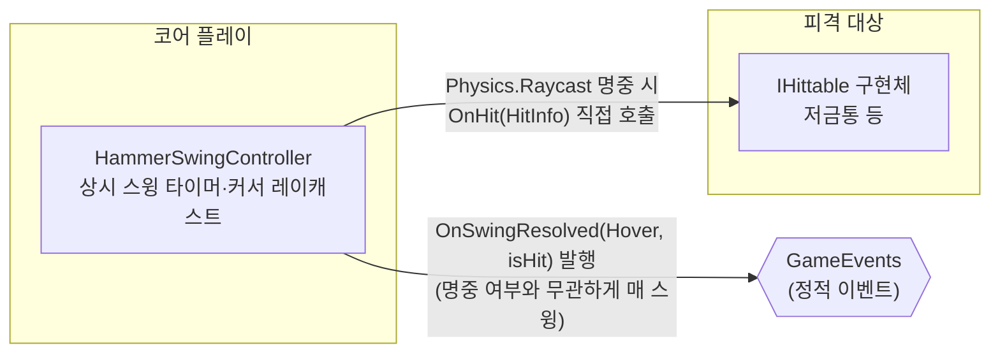

# 커서 조준 및 상시 자동 스윙

> 관련 이슈: #18, #109, #132, #151, #256 · 최종 수정: 2026.09.22

**이 문서는 로그다.** 이 기능을 고칠 때마다 갱신한다. 새 문서를 만들지 않는다.

## 무엇을 하는가

호버 망치는 대상 유무와 무관하게 `economy.csv`의 `hover_swing_interval_sec` 주기로 항상 스윙한다. 스윙 시점에 커서 스크린 좌표를 책상 평면으로 투영하여 커서 위치를 구하고, 레티클 반경 구체 판정(`Physics.OverlapSphereNonAlloc`)으로 반경 안의 살아있는 피격 대상(`IHittable`) **전부**를 타격한다 — 대상마다 개별 `OnHit`을 호출하며 데미지 분할은 없다 (#256). 게임 규칙은 [GDD](../GDD.md) 4절에 있으니 여기서 반복하지 않는다.

## 왜 이 방법인가

| 검토한 방법 | 채택 | 이유 |
|---|---|---|
| 3D `Physics.OverlapSphere`로 레티클 반경 내 `IHittable` 탐색 | ✅ | 커서 단일 레이캐스트 시 크리처 콜라이더가 바닥에 위치해 빗나가는 버그(#109)를 해결하며, 시각적 레티클 원 반경과 실제 판정 범위를 일치시킨다 |
| 3D `Collider` + `Physics.Raycast` 단일 광선 판정 | ❌ | 카메라가 47도 기울어져 있어 크리처 몸통 위를 조준해도 바닥 콜라이더를 빗나가거나 흰 원 안에 있어도 안 맞는 문제가 발생함(#109) |
| 스크린 좌표 거리 기반 판정 (`REFERENCE_ANALYSIS.md` 98행 대안) | ❌ | 별도의 스크린과 월드 좌표 변환 및 거리 계산 로직이 새로 필요하고 3D 오브젝트 크기나 카메라 각도가 바뀔 때마다 판정 반경을 따로 튜닝해야 함 |
| 스윙 타이머: 잔여시간 이월(`while (_swingTimer >= interval) { _swingTimer -= interval; ... }`) | ✅ | 프레임이 밀려도(예: 순간 랙) 스윙 박자가 누적 오차 없이 유지된다. 한 프레임에 두 번 이상 스윙이 밀려도 모두 처리한다 |
| 스윙 타이머: 초과 시 0으로 리셋 | ❌ | 프레임 드랍이 반복되면 실제 초당 스윙 횟수가 설계값보다 줄어들며, 그 오차가 보정되지 않고 누적된다 |
| Input System `Mouse.current.position` | ✅ | 프로젝트 Player Settings의 Active Input Handling이 Input System으로 설정되어 있다. Play Mode에서 실제로 확인함 |
| 레거시 `UnityEngine.Input.mousePosition` | ❌ | 위 설정에서 `InvalidOperationException`을 던진다. Play Mode 실행 중 실제로 발생해 수정한 이력이 있다 |
| 마우스 디바이스가 없을 때도 "미스"로 스윙을 계속 발행 | ✅ | 완료 기준이 "대상 유무와 무관한 상시 스윙"이다. 입력 장치 부재를 이유로 스윙 자체를 멈추면 이 기준을 어긴다 |
| 마우스 디바이스가 없으면 해당 프레임 스윙 스킵 | ❌ | 스윙 박자가 장치 상태에 좌우되게 되어 "상시" 요구사항과 충돌한다 |
| 조준 반경을 `economy.csv` 의 `reticle_radius` 에서 읽기 (#132) | ✅ | 난이도를 직접 정하는 값이라 CSV가 원본이어야 한다 (AGENTS.md). `[SerializeField]` 도 함께 지웠다 — 남겨 두면 씬·프리팹에 저장된 값이 CSV를 조용히 덮는다 |
| 조준 반경에도 `hit_radius` 업그레이드를 적용 | ❌ | 대상 콜라이더 축에 이미 적용된다 (BALANCE 6절, #131). 두 축에 걸면 효과가 두 번 곱해져 7.2 실측에서 기여도가 분리되지 않는다 |
| 연출의 원 크기를 `HammerSwingController.HitRadius` 하나에서 유도 (#132) | ✅ | 이전에는 금색 실선 링이 반경 0.259, 판정이 0.45 로 갈라져 있었다 — "보이는 원 밖인데 맞는" #109 가 형태만 바꿔 남아 있던 셈이다 |
| `Physics.OverlapSphereNonAlloc` + 고정 버퍼 (#132) | ✅ | 스윙마다 `Collider[]` 를 새로 만들면 런 내내 GC 쓰레기가 쌓인다. 자동 망치까지 붙으면 7.1 프로파일링에서 잡힐 종류라 미리 없앴다 |
| 런타임에만 쓰는 셰이더를 Always Included Shaders 에 등록 (#151) | ✅ | `Shader.Find` 는 **빌드에 포함된** 셰이더만 찾는다. URP/Unlit 은 어느 에셋도 참조하지 않아 스트립됐고, 이 목록이 유일한 보장 수단이다 |
| 셰이더를 못 찾으면 빌트인 셰이더로 폴백 (#151) | ❌ | `Unlit/Transparent`·`Sprites/Default` 는 URP 패스가 없어 마젠타로 렌더된다. 크래시가 나면 바로 고치지만 색만 틀리면 아무도 모른다 — **고장을 감추는 폴백은 고장보다 나쁘다** |
| 셰이더를 못 찾으면 `LogError` 후 비주얼 생성 생략 (#151) | ✅ | 원인과 조치(Always Included 등록)를 로그에 적어 둔다. `new Material(null)` 로 터지는 것보다 읽을 수 있는 실패다 |

## 구조

<!-- OnHit 은 IHittable 계약상의 직접 호출이라 이벤트 노드를 거치지 않는다. OnSwingResolved 는 GameEvents 를 거치므로 이벤트 노드를 경유해 그렸다 -->

| 클래스 | 경로 | 하는 일 |
|---|---|---|
| `HammerSwingController` | `Assets/Scripts/Runtime/Core/HammerSwingController.cs` | 상시 스윙 타이머 관리, 커서 스크린 좌표 책상 평면 투영, Physics.OverlapSphere 기반 레티클 반경 판정, OnHit 호출 및 OnSwingResolved 발행 |
| `HammerSwingVisual` | `Assets/Scripts/Runtime/Core/HammerSwingVisual.cs` | 바닥 레티클·쿨타임 세그먼트·허공 망치 연출, 마우스 위치 흰 점 커서(최상단 Screen Space Overlay 캔버스) |

### 이벤트

| 이벤트 | 발행/구독 | 언제 |
|---|---|---|
| `GameEvents.OnSwingResolved(HitSource, bool)` | 발행 | 매 스윙마다 (명중 여부와 무관하게 `HitSource.Hover`로 발행) |

### 읽는 밸런스 값

| CSV | 열 | 쓰는 곳 |
|---|---|---|
| `Assets/GameData/Balance/economy.csv` | `hover_swing_interval_sec` | 스윙 주기 계산 (기본 0.5초 = 초당 2회) |
| `Assets/GameData/Balance/economy.csv` | `base_hit_power` | 명중 시 `HitInfo.Power`로 전달해 `IHittable.OnHit`에 사용 |
| `Assets/GameData/Balance/economy.csv` | `reticle_radius` | 조준 판정 반경. 연출(`HammerSwingVisual`)이 그리는 원도 이 값에서 유도한다 |

## 검증

Unity 6000.3.21f1 에디터 Edit Mode 및 Play Mode, 2026.09.17.

* [x] `HammerSwingChecks.RunBatch()` 4건 전체 통과 (#109, #132)
  * `economy.csv` 의 `reticle_radius` 가 BalanceData 에 실려 있는지 확인
  * `HitRadius` 가 CSV 값과 일치하는지 확인 (코드 상수로 돌아가지 않았는지)
  * 반경 내 크리처 감지 및 반경 밖 크리처 미감지 확인 (거리도 CSV 반경에서 유도)
  * 개별 `OnHit` 호출 시 체력 감소 확인 (`ResolveSwing()`의 선택 로직은 거치지 않음 — 아래 #256 절 참고)
* [x] Play Mode 실행 후 콘솔 에러 없음 확인 (이슈 #18)
* [x] `hover_swing_interval_sec` 0.15에서 0.5로 수정 후 BalanceData.asset 반영 확인

### #151 셰이더 스트립·비주얼 미생성 (2026-09-17)

* [x] 프로젝트 안 참조 수 대조 — URP/Lit 5개, URP/**Unlit 0개**. 참조가 없으면 빌드에서 스트립된다
* [x] 빌드 산출물의 셰이더 이름 문자열 대조 — 등록 **전** 빌드에는 `Universal Render Pipeline/Unlit` 이 없고, Always Included Shaders 등록 **후** 빌드에는 `globalgamemanagers`·`globalgamemanagers.assets` 에 있다. 같은 방법으로 두 번 재서 뒤집혔다
* [x] Edit Mode 검증 14건 통과, 빌드 오류 0건
* [x] **패키징된 빌드를 사람이 실행해 눈으로 확인** — `새 회차 시작` 이후 레티클과 망치가 **보이고**, 색이 **마젠타가 아니다**. `Player.log` 에 `[HammerSwingVisual] 셰이더 … 찾지 못했다` 없음, 오류·경고 0건
* [x] 같은 실행에서 크리처 스폰·리스폰도 정상 (#140 과 합친 검증 빌드)

### #256 반경 내 다중 타격 전환 (2026-09-22)

`ResolveSwing()`의 최근접-하나-선택 로직(#109/#132 의도된 설계)을 팀 논의로 뒤집었다.
`OverlapSphereNonAlloc` 결과를 전부 순회하며 살아있는 `IHittable` 각각에 `_runHitPower` 전액을
개별 `OnHit`으로 넣는다 — 여러 대상이 걸려도 데미지를 나누지 않는다.

* [x] Play Mode에서 `TargetNormal` 2개를 반경 안(0.3배·−0.3배 지점)에, 1개를 반경 밖(6배 지점)에
  배치하고 실제 `ResolveSwing()`을 리플렉션으로 1회 호출 — 반경 안 2개 모두 HP 3→−5로 동시 감소,
  반경 밖 1개는 3→3 유지 확인
* [x] 콘솔 오류 0건 (MCP 브릿지 포트 재연결 경고만 있었고 무관)
* [x] `convention-checker` 점검 통과 — 공용 계약(GameEvents 구독쌍·매니저 참조·네이밍) 위반 없음

## 알려진 한계

* 스킬 해금에 따라 스윙 속도가 빨라지는 기능은 이번 범위에서 제외했다. 밸런스 값을 코드가 아닌 별도 승수로 다루려면 공용 계약 변경 이슈로 별도 처리해야 한다.
* 반경 안 콜라이더가 버퍼(16개)를 넘으면 넘친 것은 판정에서 빠진다. 범위 전체를 때리는 판정이라 잘린 대상은 조용히 맞지 않게 되므로, 가득 차면 경고를 한 번 남긴다. 동시 출현 수가 크게 늘면 `HitBufferSize` 를 올린다.
* `HammerSwingVisual._swingInterval` 은 `#if UNITY_EDITOR` 안에서만 BalanceData 를 읽는다. 이 컴포넌트는 코드가 스스로 만들어 붙어 인스펙터 오버라이드도 없으므로 **빌드에서는 0.85 가 고정**이다. `hover_swing_interval_sec` 를 바꾸면 게이지와 실제 스윙 박자가 어긋난다 (#132 범위 밖).
* `Game.unity` 에 저장된 `HammerSwingController` 에 현재 스크립트에 없는 `_maxRayDistance` 가 남아 있다. 동작에는 영향이 없지만 씬이 옛 버전 스크립트로 저장된 흔적이다 — 씬 소유자가 정리한다.
* 레티클·망치 머티리얼은 여전히 런타임에 `Shader.Find` 로 만든다. 셰이더 이름이 문자열이라 URP 버전이 올라가 이름이 바뀌면 컴파일은 통과하고 실행에서만 깨진다. 근본적으로는 머티리얼을 에셋으로 두고 참조하는 편이 맞지만, 이 컴포넌트가 코드로 스스로 붙어 인스펙터 배선이 없어 미뤘다 — 3D 에셋 교체(6.6)에서 비주얼을 프리팹으로 옮길 때 같이 정리한다.
* 레티클은 투명 큐(3000)에서 깊이 테스트를 받으므로 같은 큐나 더 늦은 큐의 불투명하지 않은 바닥에 가려질 수 있다. 바닥 머티리얼은 2999 이하로 둔다 (#316). 마우스 위치 자체는 오버레이 캔버스의 흰 점이라 무엇에도 가려지지 않는다.
* `_hittableLayerMask` 기본값이 전체 레이어라 프로젝트에 레이어가 세분화되면 과잉 판정될 수 있다. 대상 레이어가 정해지면 인스펙터에서 좁혀야 한다.

## 갱신 이력

| 날짜 | 이슈 | 누가 | 무엇이 바뀌었나 |
|---|---|---|---|
| 2026.09.16 | #18 | Claude | 최초 작성 |
| 2026.09.17 | #109 | saltlake00 | Raycast 단일 광선 판정을 OverlapSphere 레티클 반경 판정으로 개선 및 비주얼 반경 상수 일원화 |
| 2026.09.17 | #132 | saltlake00 | 조준 반경을 `economy.csv` 로 이관, 연출 원을 같은 출처에서 유도, `OverlapSphereNonAlloc` 전환 |
| 2026.09.17 | #151 | saltlake00 | URP/Unlit 이 빌드에서 스트립돼 레티클이 마젠타로 렌더되던 것을 Always Included Shaders 등록으로 수정, 빌트인 셰이더 폴백 제거 |
| 2026.09.22 | #256 | Claude | 최근접 하나만 때리던 판정을 반경 내 전체 타격으로 전환 (데미지 분할 없음) |
| 2026.09.23 | #316 | saltlake00 | 바닥 머티리얼 큐 2999 로 레티클 가림 해결, 마우스 위치 흰 점 커서 추가 |
