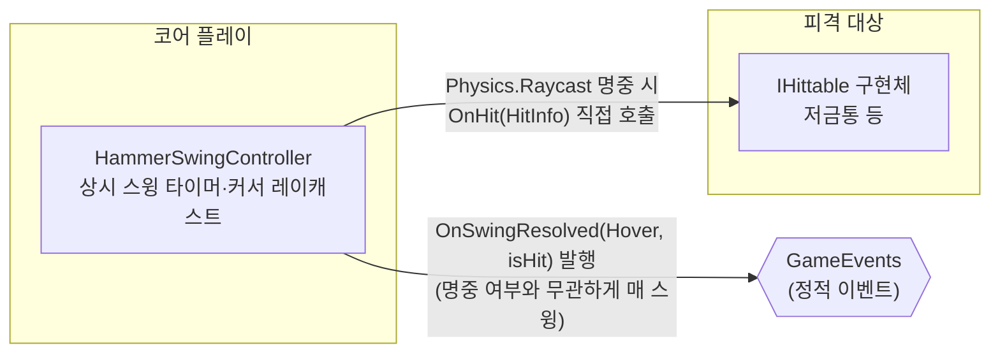

# 커서 조준 및 상시 자동 스윙

> 관련 이슈: #18, #109 · 최종 수정: 2026.09.17

**이 문서는 로그다.** 이 기능을 고칠 때마다 갱신한다. 새 문서를 만들지 않는다.

## 무엇을 하는가

호버 망치는 대상 유무와 무관하게 `economy.csv`의 `hover_swing_interval_sec` 주기로 항상 스윙한다. 스윙 시점에 커서 스크린 좌표를 책상 평면으로 투영하여 커서 위치를 구하고, 레티클 반경 구체 판정(`Physics.OverlapSphere`)으로 살아있는 피격 대상(`IHittable`) 중 가장 가까운 하나를 타격한다. 게임 규칙은 [GDD](../GDD.md) 4절에 있으니 여기서 반복하지 않는다.

## 왜 이 방법인가

| 검토한 방법 | 채택 | 이유 |
|---|---|---|
| 3D `Physics.OverlapSphere`로 레티클 반경 내 `IHittable` 탐색 | ✅ | 커서 단일 레이캐스트 시 크리처 콜라이더가 바닥에 위치해 빗나가는 버그(#109)를 해결하며, 시각적 레티클 원 반경(0.45)과 실제 판정 범위를 일치시킨다 |
| 3D `Collider` + `Physics.Raycast` 단일 광선 판정 | ❌ | 카메라가 47도 기울어져 있어 크리처 몸통 위를 조준해도 바닥 콜라이더를 빗나가거나 흰 원 안에 있어도 안 맞는 문제가 발생함(#109) |
| 스크린 좌표 거리 기반 판정 (`REFERENCE_ANALYSIS.md` 98행 대안) | ❌ | 별도의 스크린과 월드 좌표 변환 및 거리 계산 로직이 새로 필요하고 3D 오브젝트 크기나 카메라 각도가 바뀔 때마다 판정 반경을 따로 튜닝해야 함 |
| 스윙 타이머: 잔여시간 이월(`while (_swingTimer >= interval) { _swingTimer -= interval; ... }`) | ✅ | 프레임이 밀려도(예: 순간 랙) 스윙 박자가 누적 오차 없이 유지된다. 한 프레임에 두 번 이상 스윙이 밀려도 모두 처리한다 |
| 스윙 타이머: 초과 시 0으로 리셋 | ❌ | 프레임 드랍이 반복되면 실제 초당 스윙 횟수가 설계값보다 줄어들며, 그 오차가 보정되지 않고 누적된다 |
| Input System `Mouse.current.position` | ✅ | 프로젝트 Player Settings의 Active Input Handling이 Input System으로 설정되어 있다. Play Mode에서 실제로 확인함 |
| 레거시 `UnityEngine.Input.mousePosition` | ❌ | 위 설정에서 `InvalidOperationException`을 던진다. Play Mode 실행 중 실제로 발생해 수정한 이력이 있다 |
| 마우스 디바이스가 없을 때도 "미스"로 스윙을 계속 발행 | ✅ | 완료 기준이 "대상 유무와 무관한 상시 스윙"이다. 입력 장치 부재를 이유로 스윙 자체를 멈추면 이 기준을 어긴다 |
| 마우스 디바이스가 없으면 해당 프레임 스윙 스킵 | ❌ | 스윙 박자가 장치 상태에 좌우되게 되어 "상시" 요구사항과 충돌한다 |

## 구조

<!-- OnHit 은 IHittable 계약상의 직접 호출이라 이벤트 노드를 거치지 않는다. OnSwingResolved 는 GameEvents 를 거치므로 이벤트 노드를 경유해 그렸다 -->

| 클래스 | 경로 | 하는 일 |
|---|---|---|
| `HammerSwingController` | `Assets/Scripts/Runtime/Core/HammerSwingController.cs` | 상시 스윙 타이머 관리, 커서 스크린 좌표 책상 평면 투영, Physics.OverlapSphere 기반 레티클 반경 판정, OnHit 호출 및 OnSwingResolved 발행 |

### 이벤트

| 이벤트 | 발행/구독 | 언제 |
|---|---|---|
| `GameEvents.OnSwingResolved(HitSource, bool)` | 발행 | 매 스윙마다 (명중 여부와 무관하게 `HitSource.Hover`로 발행) |

### 읽는 밸런스 값

| CSV | 열 | 쓰는 곳 |
|---|---|---|
| `Assets/GameData/Balance/economy.csv` | `hover_swing_interval_sec` | 스윙 주기 계산 (기본 0.5초 = 초당 2회) |
| `Assets/GameData/Balance/economy.csv` | `base_hit_power` | 명중 시 `HitInfo.Power`로 전달해 `IHittable.OnHit`에 사용 |

## 검증

Unity 6000.3.21f1 에디터 Edit Mode 및 Play Mode, 2026.09.17.

* [x] `HammerSwingChecks.RunBatch()` 4건 전체 통과 (#109)
  * DefaultReticleRadius 상수(0.45f) 일치 확인
  * HammerSwingController 기본 HitRadius 일치 확인
  * 반경 내 크리처 감지 및 반경 밖 크리처 미감지 확인
  * 최근접 대상 피격 및 체력 감소 확인
* [x] Play Mode 실행 후 콘솔 에러 없음 확인 (이슈 #18)
* [x] `hover_swing_interval_sec` 0.15에서 0.5로 수정 후 BalanceData.asset 반영 확인

## 알려진 한계

* 스킬 해금에 따라 스윙 속도가 빨라지는 기능은 이번 범위에서 제외했다. 밸런스 값을 코드가 아닌 별도 승수로 다루려면 공용 계약 변경 이슈로 별도 처리해야 한다.
* `_hittableLayerMask` 기본값이 전체 레이어라 프로젝트에 레이어가 세분화되면 과잉 판정될 수 있다. 대상 레이어가 정해지면 인스펙터에서 좁혀야 한다.

## 갱신 이력

| 날짜 | 이슈 | 누가 | 무엇이 바뀌었나 |
|---|---|---|---|
| 2026.09.16 | #18 | Claude | 최초 작성 |
| 2026.09.17 | #109 | saltlake00 | Raycast 단일 광선 판정을 OverlapSphere 레티클 반경 판정으로 개선 및 비주얼 반경 상수 일원화 |
