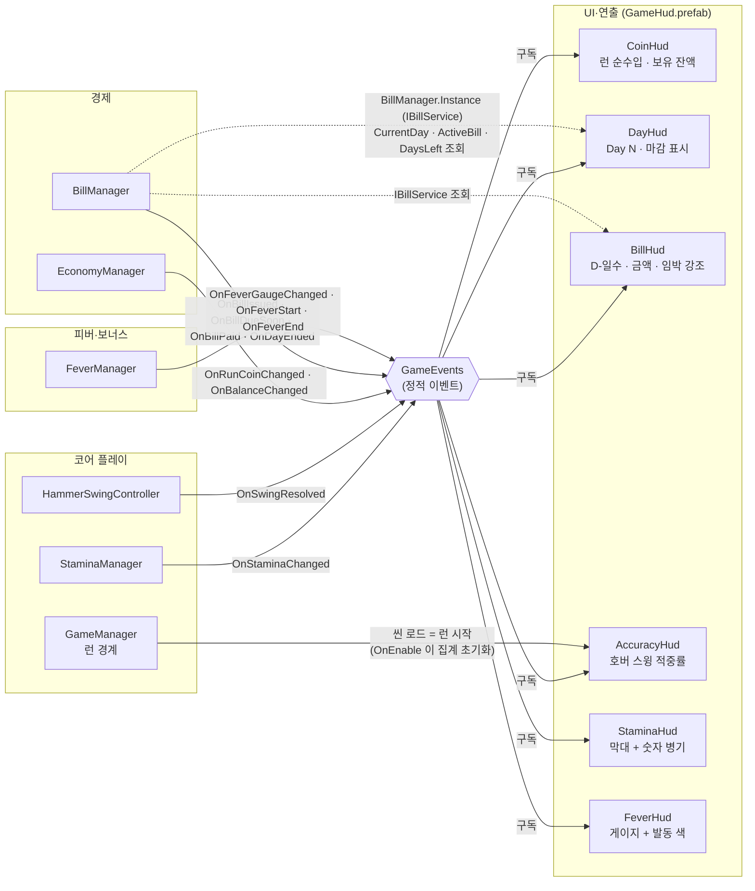

# 인게임 HUD

> 관련 이슈: #33, #171 · 최종 수정: 2026-09-18

**이 문서는 로그다.** 이 기능을 고칠 때마다 갱신한다. 새 문서를 만들지 않는다.

## 무엇을 하는가

`Game` 씬에서 이번 런의 상태를 화면에 상시 표시한다 — 코인(런 순수입·보유 잔액), 날짜,
고지서 잔여일과 금액, 정확도, 스태미나(숫자 병기), 피버 게이지. 읽기 전용이며 게임 상태를
바꾸지 않는다. 게임 규칙은 [GDD](../GDD.md) 에 있으니 여기서 반복하지 않는다.

## 왜 이 방법인가

| 검토한 방법 | 채택 | 이유 |
|---|---|---|
| 위젯 하나 = 컴포넌트 하나 (`StaminaHud`, `CoinHud` …) | ✅ | #27 이 만든 `BillHud` 가 이미 그 형태다. 단일 `GameHud` 로 몰면 기존 `BillHud` 가 붕 뜨거나 중복된다. 위젯을 캔버스에서 따로 옮기고 끄는 것도 쉬워진다 |
| 단일 `GameHud` 컴포넌트가 모든 라벨을 들고 갱신 | ❌ | 구독/해제가 한 곳에 몰려 짧아지는 대신, 위젯 하나를 빼려면 코드를 고쳐야 한다. `BillHud` 를 흡수하거나 남기거나 둘 다 지저분하다 |
| 위젯마다 `Update()` 에서 매 프레임 폴링 | ❌ | ARCHITECTURE 3절 "UI는 구독 후 공용 조회 인터페이스로 초기 상태를 한 번 읽는다". 게이지 발행은 이미 발행측에서 0.1초로 묶여 있다(`StaminaManager`·`FeverManager` 의 `_publishIntervalSec`) |
| 정확도 집계를 `IRunScoped` 로 런 경계에 맞춰 초기화 | ❌ | 씬에 사는 `IRunScoped` 구현체는 `GameManager.WireSceneConsumers()` 의 배열에 **이름이 박혀 있다.** HUD 를 넣으려면 코어 플레이 모듈 파일을 고쳐야 한다 |
| 정확도 집계를 위젯의 `OnEnable` 에서 초기화 | ✅ | `Game` 씬이 런마다 새로 로드되므로(`GameManager.StartNewRun`/`ContinueRun` 이 `LoadScene`) `OnEnable` 이 곧 런의 시작이다. 남의 모듈을 건드리지 않고 같은 결과를 얻는다 |
| 정확도 분모에 자동 망치를 포함 | ❌ | BALANCE 5절·[fever-gauge.md](fever-gauge.md) 가 "정확도는 호버만" 으로 정했다. 자동 망치는 항상 적중으로 발행되므로 섞으면 플레이어 실력이 아니라 업그레이드 레벨을 보여주게 된다 |
| 날짜를 `OnDayEnded` 로 세어 올림 | ❌ | `OnDayEnded(completedDay)` 는 **방금 끝난 날**이다. 이걸로 올리면 하루씩 밀린다 |
| 날짜를 `OnBillDueSoon` 신호에 `IBillService.CurrentDay` 재조회 | ✅ | #150(3.7) 이후 날짜가 실제로 올라가는 곳은 `BillManager.BeginRun()` 인데 그쪽은 날짜 이벤트를 발행하지 않고 `OnBillDueSoon` 만 낸다. `BillManager.BeginRun` 주석이 이 방식을 가리킨다. 날짜는 단일 출처에서 읽으므로 세다가 어긋날 일이 없다 |
| 보유 잔액을 `EconomyManager` 조회로 초기화 | ✅ (#171) | #33 시점에는 조회 통로가 없어 `—` 로 뒀다. 공용 계약 변경이라 이슈를 먼저 세웠고(#171), 거기서 `EconomyManager.Instance`(`IEconomyService`)가 열리면서 `OnEnable` 에서 한 번 읽게 됐다 |
| `Game.unity` 에 HUD 를 손으로 만들어 넣기 | ❌ | `Game.unity` 는 코어 플레이 모듈 소유 씬이다(ARCHITECTURE 0절). `GameHud.prefab` 을 만들고 씬에는 **프리팹 인스턴스**로 넣어, 이후 수정이 프리팹 한 곳으로 모이게 했다 |
| 게이지 `Image` 에 스프라이트를 비워 둠 | ❌ | **`sprite` 가 null 이면 `Type=Filled` 가 `fillAmount` 를 무시하고 사각형을 통째로 그린다.** 게이지가 항상 가득 찬 것처럼 보였다 — Play 로 보기 전에는 드러나지 않았다 |
| 내장 `UI/Skin/UISprite` 를 게이지에 사용 | ❌ | 모서리가 둥근 이미지라 높이 18~28px 막대에서 알약/타원으로 보인다 |
| 8×8 순백 사각형(`Assets/Materials/HudBar.png`)을 만들어 사용 | ✅ | 모서리가 없어 각진 게이지가 나온다. 색은 `Image.color` 로 입히므로 흰색 한 장이 막대 전부를 커버한다. 79바이트, 밉맵 없음, 압축 없음 |

## 구조



<!-- GameEvents 를 거치는 관계는 이벤트 노드를 경유해 그렸다. 점선은 공용 인터페이스 조회(직접 호출)라 이벤트 노드를 거치지 않는다 -->

| 클래스 | 경로 | 하는 일 |
|---|---|---|
| `StaminaHud` | `Assets/Scripts/Runtime/UI/StaminaHud.cs` | `Image.fillAmount` 와 `75/120` 라벨 갱신. 현재값은 올림 표시하되 실제 0 이면 0 |
| `FeverHud` | `Assets/Scripts/Runtime/UI/FeverHud.cs` | 게이지 막대 갱신, 발동 중 막대 색 전환 |
| `CoinHud` | `Assets/Scripts/Runtime/UI/CoinHud.cs` | 런 순수입과 보유 잔액을 별도 라벨로 표시. 초기값은 `EconomyManager.Instance`(`IEconomyService`)로 한 번 읽는다(#171). 매니저가 없으면 `—` |
| `DayHud` | `Assets/Scripts/Runtime/UI/DayHud.cs` | `회차 Day N` 표시. 하루가 시작되면 `IBillService.CurrentDay` 재조회, 마감되면 접미사 |
| `AccuracyHud` | `Assets/Scripts/Runtime/UI/AccuracyHud.cs` | 호버 스윙만 집계해 `정확도 N% (적중/전체)` 표시. `OnEnable` 에서 0 으로 초기화 |
| `BillHud` | `Assets/Scripts/Runtime/UI/BillHud.cs` | (#27 에서 만든 것) `고지서 D-일수  $금액`. #33 에서 임박 강조와 `OnBillPaid` 구독 추가 |
| (프리팹) | `Assets/Prefabs/UI/GameHud.prefab` | Canvas(ScreenSpaceOverlay, ScaleWithScreenSize 1920×1080, match 0.5) + 위젯 6개 |
| (스프라이트) | `Assets/Materials/HudBar.png` | 게이지용 8×8 순백 사각형 |

### 프리팹 배치

```
GameHud                     Canvas · CanvasScaler · GraphicRaycaster
├ CoinGroup                 CoinHud            (좌상단)
│ ├ RunCoinLabel            TMP 44pt
│ └ BalanceLabel            TMP 26pt, 회색
├ InfoGroup                                    (우상단)
│ ├ DayLabel                TMP 36pt + DayHud
│ ├ BillLabel               TMP 30pt + BillHud
│ └ AccuracyLabel           TMP 26pt + AccuracyHud
└ BarsGroup                                    (좌하단)
  ├ StaminaGroup            StaminaHud
  │ ├ StaminaBarBg / BarFill  Image(Simple / Filled·Horizontal)
  │ └ StaminaLabel          TMP 26pt
  └ FeverGroup              FeverHud
    ├ FeverBarBg / BarFill  Image(Simple / Filled·Horizontal)
    └ FeverCaption          TMP 22pt
```

`Game` 씬 루트에 **프리팹 인스턴스**로 들어가 있다. 레이아웃을 고칠 때는 프리팹을 고친다 —
씬 인스턴스를 직접 고치면 코어 플레이 소유 씬 파일에 오버라이드가 쌓인다.

### 이벤트

전부 **구독만** 한다. 이 기능은 이벤트를 발행하지 않는다.

| 이벤트 | 발행/구독 | 언제 |
|---|---|---|
| `GameEvents.OnStaminaChanged` | `StaminaHud` 구독 | 스태미나가 바뀔 때(0.1초로 묶임). `StaminaManager.BeginRun()` 이 런 시작에도 한 번 발행해 초기값이 들어온다 |
| `GameEvents.OnFeverGaugeChanged` | `FeverHud` 구독 | 피버 게이지가 바뀔 때(0.1초로 묶임). 런 시작 발행도 같다 |
| `GameEvents.OnFeverStart` / `OnFeverEnd` | `FeverHud` 구독 | 발동·종료. 막대 색만 바꾼다 |
| `GameEvents.OnRunCoinChanged` | `CoinHud` 구독 | 런 순수입 변동. `EconomyManager.BeginRun()` 이 0 을 발행해 초기값이 들어온다 |
| `GameEvents.OnBalanceChanged` | `CoinHud` 구독 | 지갑 잔액 변동. **런 시작에는 발행되지 않는다** — 아래 "알려진 한계" |
| `GameEvents.OnBillIssued` | `BillHud` 구독 | 새 고지서 발행. 금액을 받는다 |
| `GameEvents.OnBillDueSoon` | `BillHud`·`DayHud` 구독 | 하루가 시작될 때마다. `BillHud` 는 남은 일수를, `DayHud` 는 "하루가 시작됐다" 신호로 쓴다 |
| `GameEvents.OnBillPaid` | `BillHud` 구독 | 납부 성공. 표시를 "고지서 없음" 으로 되돌리고 강조를 거둔다 |
| `GameEvents.OnDayEnded` | `DayHud` 구독 | 하루 마감. 날짜 뒤에 접미사를 붙인다 |
| `GameEvents.OnSwingResolved` | `AccuracyHud` 구독 | 스윙마다. **`HitSource.Hover` 만** 집계하고 `AutoHammer` 는 버린다 |

구독은 `OnEnable`, 해제는 `OnDisable` 로 6개 컴포넌트 전부 쌍을 맞췄다.

### 읽는 밸런스 값

없다. HUD 는 CSV 를 직접 읽지 않고 발행된 값만 표시한다.

`BillHud._emphasisDaysLeft` 의 기본값 `2` 는 밸런스 수치가 아니라 연출 임계값이다 —
`DaysLeft` 가 마감일을 포함해 세므로(`max(0, DueDay - CurrentDay + 1)`) 마감 당일이 1,
그 하루 전이 2 다. 완료 기준의 "마감 하루 전부터"를 숫자로 옮긴 값이며 `[SerializeField]` 다.

## 검증

Play Mode 에서 실제로 확인한 것만 적는다.

- [x] 스태미나: `120/120` 숫자 병기와 막대 동시 갱신. 플레이 중 `109/120`, `111/120` 로 줄어드는 것 확인
- [x] 정확도: 직접 플레이 중 `정확도 62% (5/8)` 표시. 이벤트로 Hover 10회(적중 8) + AutoHammer 20회를 쏴서 **swings=10, hits=8** — 자동 망치가 분모에 섞이지 않음을 확인
- [x] 고지서 임박 강조: `OnBillDueSoon` 을 3→2→1 로 발행해 **D-3 흰색 → D-2 빨강 → D-1 빨강** 전환 확인
- [x] 납부 후 강조 해제: `OnBillPaid` 발행 시 "고지서 없음" + 흰색 복귀 확인
- [x] 피버 색 전환: `OnFeverStart` 로 파랑(0.36,0.62,0.95) → 주황(1,0.55,0.1) 확인
- [x] 코인: 대상 파괴 시 런 순수입·보유 잔액이 함께 `4` 로 갱신됨을 확인
- [x] (#171) 초기값 조회: 잔액 600 인 상태에서 씬을 다시 로드해도 HUD 가 `—` 가 아니라 `600` 으로
  시작함을 확인. 서비스 값(`CurrentCoin`/`RunCoin`)과 라벨이 일치한다
- [x] 게이지 `fillAmount`: 스프라이트 교체 후 스태미나 42%·피버 70% 로 부분 표시됨을 확인
- [x] 컴파일: 에디터 콘솔 에러 0건
- [x] `convention-checker` 점검 통과 (구독/해제 쌍, 직접 참조, 배율 재적용, 네이밍, 배치, 인코딩)
- [x] **하루 진행 전체 사이클** — #164(4.8) 배선 위에서 확인했다. 런 종료(`OnStaminaDepleted`) →
  씬 재로드를 반복하며 날짜를 넘겼다

  | 날 | `IBillService` | HUD 표시 |
  |---|---|---|
  | 1일차 | `CurrentDay=1 DaysLeft=5` 450원 | `Day 1` · `D-5  450원` 흰색 |
  | 런 종료 | `OnDayEnded(1)` | `Day 1 마감` |
  | 2일차 | `CurrentDay=2 DaysLeft=4` | `Day 2` · `D-4  450원` 흰색 |
  | 3일차 | `DaysLeft=3` | `Day 3` · `D-3  450원` 흰색 |
  | 4일차 | `DaysLeft=2` | `Day 4` · **`D-2` 빨강** |
  | 5일차(마감) | `DaysLeft=1` | `Day 5` · **`D-1` 빨강** |
  | 마감 미납 종료 | 파산 → 1일차 재시작, 고지서 재발행 | `Day 1` · `D-5  450원` **흰색 복귀** |

  날짜가 정확히 하나씩 오르고, 강조 경계가 `DaysLeft <= 2` 에서 정확히 켜지고 꺼진다.
  에디터 콘솔 오류·경고 0건
- [ ] **미검증** — 런 종료 후 결과 화면의 거동. 화면(6.2, #34)이 아직 없어 `Result` 상태에서
  HUD 만 남는다. 위 확인은 `ContinueRun()` 을 직접 불러 다음 날로 넘긴 것이다
- [ ] **미검증** — 1280×720 이하 저해상도 가독성

## 알려진 한계

- ~~날짜와 고지서가 움직이지 않는다.~~ — #164(4.8)가 `BillManager` 를 `IRunScoped` 에 붙이면서
  풀렸다. 위 "검증"의 하루 진행 사이클이 그 위에서 돈 것이다.
- ~~보유 잔액이 매 런 시작마다 `—` 로 비어 보인다.~~ — #171 에서 `EconomyManager.Instance`
  (`IEconomyService`)를 열고 `CoinHud.OnEnable` 이 잔액·런 순수입을 한 번 읽도록 고쳐 풀었다.
  `BeginRun()` 이 잔액을 발행하지 않는 것은 그대로지만, 조회 통로가 생겨 UI 가 발행을 기다릴
  이유가 없어졌다.
* ~~**`Assets/Prefabs/UI/BillHud.prefab` 과 역할이 겹친다.**~~ #173 (1.25)에서 중복을 해소하기 위해 `BillHud.prefab` 에셋을 삭제하고 `GameHud.prefab` 으로 단일화했다.
- 저해상도에서 글자 크기를 실측하지 않았다. `CanvasScaler` match 0.5, 기준 1920×1080 이라
  창이 작으면 우상단 정보가 작아진다.
- ~~스태미나가 낮을 때의 경고 연출(색 전환·깜빡임)은 넣지 않았다.~~ — **#225(6.19)** 에서 `StaminaHud` 에
  `_lowStaminaThreshold01`(기본 0.2) 이하일 때 `_fill.color` 를 경고색으로 바꾸는 상태 기반 전환을
  추가해 풀었다. 임계값·색상은 `BillHud._emphasisDaysLeft` 와 같은 이유로 밸런스 CSV가 아니라
  `[SerializeField]` 연출 값으로 뒀다. 단계 달성·파산 전환 연출은 이번에 다루지 않았다 — DoD가
  셋 중 최소 하나만 요구했고 스태미나 경고가 우선순위였다.

## 갱신 이력

| 날짜 | 이슈 | 누가 | 무엇이 바뀌었나 |
|---|---|---|---|
| 2026-09-18 | #33 | yahoo-afk | 최초 작성 — `StaminaHud`/`FeverHud`/`CoinHud`/`DayHud`/`AccuracyHud` 신규, `BillHud` 에 임박 강조·`OnBillPaid` 추가, `GameHud.prefab` 생성 및 `Game` 씬 배치, 게이지 스프라이트 `HudBar.png` 추가 |
| 2026-09-18 | #171 | yahoo-afk | `CoinHud` 가 `EconomyManager.Instance`(`IEconomyService`)로 잔액·런 순수입 초기값을 한 번 읽는다. "매 런 시작마다 `—`" 한계 해소 |
| 2026.09.18 | #173 | saltlake00 | 1.25 HUD 프리팹 중복 정리. BillHud.prefab 에셋 삭제 반영 |
| 2026-09-22 | #225 | hunil58 | 6.19 `StaminaHud` 저잔량 경고 색 전환 추가. 알려진 한계 항목 해소 |
| 2026-09-23 | #322 | soilrist | 7.12 날짜와 고지서 마감이 같은 기준으로 읽히던 문제 — `DayHud` 를 `회차 Day N`, `BillHud` 를 `고지서 D-N  $금액`(원 → $, 다른 화면과 통일)으로 바꿔 기준 단어를 붙였다. 표시 문자열만 변경 |
