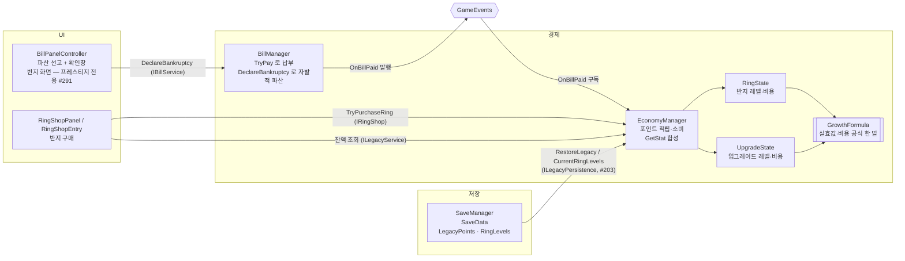

# 레거시 포인트와 반지

> 관련 이슈: #175, #183, #203, #261, #291 · 최종 수정: 2026-09-23
**이 문서는 로그다.** 이 기능을 고칠 때마다 갱신한다. 새 문서를 만들지 않는다.

## 무엇을 하는가

고지서를 납부하면 **레거시 포인트**가 쌓이고, 그 포인트로 **반지**를 산다. 반지 효과는 **파산해도 남는다.**

이것이 파산의 의미를 바꾼다. 파산은 "다 잃는 것"이 아니라 **영구 성장을 정산하는 행위**가 되고, 고지서는 벌금이 아니라 투자가 된다. 플레이어가 고지서 화면에서 **스스로 파산을 선언**할 수도 있다.

게임 규칙은 [GDD](../GDD.md) 4·9절, 원작 대조는 [REFERENCE_ANALYSIS](../REFERENCE_ANALYSIS.md) 7절에 있다.

## 왜 이 방법인가

| 검토한 방법 | 채택 | 이유 |
|---|---|---|
| `OnBillPaid` 를 구독해 적립 | ✅ | 이벤트가 `Bill` 을 통째로 실어 주므로 금액을 읽을 수 있다. **`BillManager` 를 한 줄도 건드리지 않는다** — 같은 시기에 고지서 쪽을 손대는 작업과 파일이 겹치지 않는다 |
| `BillManager.TryPay` 안에서 직접 적립 | ❌ | 코인 차감과 포인트 적립이 한 메서드에 섞이고, 고지서 모듈이 화폐를 하나 더 알게 된다 |
| 반지를 `upgrades.csv` 에 한 축으로 합치기 | ❌ | 회차 성장과 영구 성장이 **같은 축에 얹히는 것이 원래 문제**였다 (#183). 합치면 그대로다 |
| 반지 데이터를 업그레이드와 같은 모양으로 복제 | ✅ | `rings.csv` + `ring_effects.csv` 가 `upgrades.csv` + `upgrade_effects.csv` 와 열 구성이 같다. 소비처는 이미 `IUpgradeStats.GetStat` 으로 읽고 있어 **코드가 한 줄도 바뀌지 않았다** |
| `RingState` 를 `UpgradeState` 복사로 작성 | ❌ | 실효값·비용 공식이 두 벌이 된다. 한쪽만 고쳐졌을 때 서로 다른 답을 내놓고 어느 쪽이 맞는지 알 수 없다 |
| 공식만 `GrowthFormula` 로 뽑아 공유 | ✅ | 규칙은 한 벌, 레벨 보관은 각자. `UpgradeState` 도 이 공식을 쓰도록 바꿨고 기존 검증이 그대로 통과한다 |
| `IRingShop` 을 `IUpgradeShop` 과 합치기 | ❌ | 쓰는 화폐가 다르다. 합치려면 화폐를 인자로 받아야 하고, 이미 머지된 업그레이드 구매 화면(6.8)의 계약을 깨야 한다 |
| 자발적 파산을 결과 화면에 두기 | ❌ | 원작은 **고지서 화면**이다. 게다가 그 자리에 잠긴 버튼이 이미 있었다 (#34 가 "#175 범위라 잠근 채 자리만 둔다"고 남겨 뒀다) |
| 반지 상점을 `MainMenu` 씬에 두기 | ❌ | `MainMenu` 는 다른 담당의 씬이라 고칠 수 없다. 고지서 패널의 탭이 자기 배선이면서 맥락도 맞다 — 포인트를 얻는 화면에서 쓴다 |
| (#291) 반지를 매일 여는 투자 메뉴 탭에서도 판다 | ❌ | 처음엔 그렇게 만들었다. 그런데 아무 때나 살 수 있으면 파산이 **영구 성장을 정산하는 계기**(GDD 파산 절)가 아니라 그냥 초기화가 된다. 이제 파산 뒤 프레스티지 화면에서만 판다 |
| (#291) 구매 창을 UI 에서만 막는다 | ❌ | 규칙이 화면에만 있으면 반지 상점이 다른 화면에 생길 때 다시 샌다 (#220 에서 같은 확인창이 두 프리팹에 따로 복제돼 있어 한쪽만 고쳤다가 놓쳤다). `EconomyManager.TryPurchaseRing` 이 `IBillService.IsPrestigeWindowOpen` 을 본다 |
| (#291) 구매 창을 저장에 올린다 | ❌ | 프레스티지 화면이 원래 저장에 흔적이 없어, 올리면 "재시작해도 창이 남는다"는 **새 동작**이 되고 저장 버전을 올려야 한다. 배포 후보 빌드 직전이라 범위보다 크다고 봤다. 대가로 그 화면에서 앱을 끄면 다음 파산까지 못 산다 |

## 구조

| 클래스 | 경로 | 하는 일 |
|---|---|---|
| `ILegacyService` | `Runtime/Interfaces/IEconomyService.cs` | 포인트 적립·조회·소비 |
| `IRingShop` | 〃 | 반지 레벨·비용·구매 |
| `ILegacyPersistence` | 〃 | 포인트·반지 레벨 저장 복원. `SaveManager` 만 쓴다 (배선은 #203, [저장·불러오기](save-load.md)) |
| `EconomyManager` | `Runtime/Economy/EconomyManager.cs` | 위 세 계약의 구현. `OnBillPaid` 를 구독해 적립하고 `GetStat` 에서 반지를 얹는다 |
| `BillManager` | `Runtime/Economy/BillManager.cs` | `DeclareBankruptcy()` 를 열어 자발적 파산 진입점을 만든다 |
| `BillPanelController` | `Runtime/UI/BillPanelController.cs` | 파산 선고 버튼·확인창과 반지 화면. 반지는 파산 뒤 프레스티지 모드에서만 보이고, 매일 여는 탭 모드에서는 반지 탭 버튼을 숨긴다 (#291) |
| `SaveManager` | `Runtime/SaveManager.cs` | `SaveData` v3 마이그레이션. 포인트·반지 수집·복원 (#203) |
| `IBillService.DeclareBankruptcy` | `Runtime/Interfaces/IBillService.cs` | 자발적 파산 진입점 |
| `GrowthFormula` | `Runtime/Economy/GrowthFormula.cs` | 실효값·비용 공식. **업그레이드와 반지가 공유한다** |
| `RingState` | `Runtime/Economy/RingState.cs` | 반지 레벨 보관과 계산 |
| `RingShopPanel` / `RingShopEntry` | `Runtime/UI/` | 반지 상점(보석함) 화면 및 슬롯 |
| `RingTooltip` | `Runtime/UI/RingTooltip.cs` | 마우스 오버 시 표시되는 상세 정보 툴팁 |
| `RingShopPrefabCreator` | `Editor/RingShopPrefabCreator.cs` | 보석함 8종 슬롯 및 툴팁 프리팹 생성 도구. #184: 제목을 탭 이름과 맞춰 "반지 — 영구 성장", 우상단 포인트를 `PointBox`(Surface 면 + 금색 선, "LP" 접두) 로 감싸고 그 아래 `PointHintPanel` 을 둔다. #261: 슬롯·툴팁의 `VerticalLayoutGroup` 은 **`childControlHeight = true`** 여야 한다 — false 면 `LayoutElement.preferredHeight` 가 무시되고 RectTransform 기본 높이(100)가 쓰여 슬롯 합이 셀을 넘고(구매 버튼이 다음 행에 가려짐) 툴팁 구분선(2px)이 100px 빈 상자로 그려진다. 슬롯 셀 156×304, 자식 높이 이름 32 · 아이콘 96 · 레벨 32 · 사유 28 · 버튼 56, 글자 24/24/20/24 (UI_GUIDE 계층·4배수). 구매 버튼 문구는 `Label` 자식 하나로 `구매 · N LP` 를 쓰며 `RingShopEntry._costLabel` 이 그 라벨을 통째로 갱신한다 |
| `LegacyPointHint` | `Runtime/UI/LegacyPointHint.cs` | `PointBox` 에 마우스를 올리는 동안 규칙을 설명한다 (#184). `고지서 납부액 $N당 1 LP` 의 N 은 `BalanceData.Economy.LegacyPointPerAmount`(economy.csv) 에서 읽고, `RingShopPanel` 이 `OnEnable` 에서 `Bind` 로 넣어 준다. 표시만 하며 매니저를 부르지 않는다 |

### 이벤트

| 이벤트 | 발행/구독 | 언제 |
|---|---|---|
| `GameEvents.OnBillPaid` | 구독 (`EconomyManager`) | 납부 직후. 금액에 비례해 포인트를 적립한다 |
| `GameEvents.OnBankrupt` | — | 자발적 파산도 미납 파산과 **같은 경로**라 `BillManager` 가 발행한다 |

**포인트 변동 이벤트를 새로 만들지 않았다.** 포인트는 고지서를 낼 때와 반지를 살 때만 바뀌는데, 상점 화면은 살아날 때 한 번 읽고 구매는 콜백으로 받는다. 이벤트를 늘릴 이유가 없었다.

### 읽는 밸런스 값

| CSV | 열 | 쓰는 곳 |
|---|---|---|
| `economy.csv` | `legacy_point_per_amount` | 납부액 이만큼당 1점 |
| `rings.csv` | `display_name`·`description`·`init_cost`·`cost_growth`·`max_level`·`sort_order` | 반지 정의와 비용 |
| `ring_effects.csv` | `stat`·`effect_type`·`value_per_level` | 반지 효과 |

**수치는 문서에 적지 않는다.** 전부 잠정값이고 3.8(#176) 재계산 뒤 확정한다 — 각 CSV 행의 `note` 에 그렇게 적혀 있다.

### 합성 순서 — 업그레이드 먼저, 반지 나중

`GetStat` 은 업그레이드를 얹은 값 위에 반지를 얹는다. 영구 층이 회차 층 위에 온다는 3층 구조를 순서로 못 박은 것이다.

지금은 반지 효과가 전부 `add` 라 **순서를 바꿔도 값이 같다.** `percent` 효과가 생기는 순간 갈리므로 규칙을 미리 정하고 검증으로 고정했다.

### 저장

`SaveData` 를 v2 → v3 으로 올리며 필드를 먼저 만들어 두었고, **배선은 #203 에서 붙였다** —
`IUpgradePersistence` 와 **같은 방식으로** 함께 연결했다. 한쪽만 연결하면 방식이 두 벌 생기기
때문에 한 이슈로 묶었다. 실제 경로와 시점은 [저장·불러오기](save-load.md)가 정본이다.

요약하면 복원은 앱이 켜질 때 `ManagerBootstrap` 이 한 번, 저장은 `GameManager` 가 고지서 화면을
떠날 때와 하루가 끝날 때다. **반지는 파산 뒤 프레스티지 화면에서만 사고(#291), 그 화면의
"사이클 N 시작"을 누르면 구매가 저장에 실린다** (`ContinueRun` 이 떠나기 전에 저장한다).

`SaveData` 를 v2 → **v3** 으로 올리고 `LegacyPoints`·`RingLevels` 를 더했다. 마이그레이션 분기는 지우지 않고 누적한다.

**v2 저장에서 `RingLevels` 는 `null` 로 온다.** JsonUtility 는 없는 배열 필드를 빈 배열이 아니라 `null` 로 되살린다 (`OfferedPerkIds` 와 같다). 실제로 확인했고, 복원하는 쪽이 `null` 과 길이 부족을 모두 감당한다.

## 검증

### Edit Mode (2026-09-21)

`LegacyPointChecks.RunBatch()` — **22건 PASS**. `ValidationRunner.RunAll()` 전체 **21/21, 실패 0**.

- [x] 계수 3배를 내면 3점. **계수보다 작은 납부는 0점이고 나머지를 이월하지 않는다** (반쪽 납부 두 번에도 0점)
- [x] 소비 성공/실패/0, 실패한 소비가 잔액을 건드리지 않는다
- [x] `OnDisable` 뒤에는 적립되지 않는다 (구독 쌍)
- [x] 반지: 포인트 없이 실패, 없는 id, 첫 비용 = `init_cost`, 차감액 일치, **코인 불변**, 최대 레벨 정지
- [x] **파산해도 포인트와 반지 레벨이 남는다** — 파산이 실제로 부르는 `RestoreWallet(0)` 경로와 런 경계 양쪽
- [x] 저장 왕복, `null` 복원, 음수 포인트 차단
- [x] 합성 순서 (업그레이드 → 반지)
- [x] `rings.csv` 가 `sort_order` 로 정렬 (어긋나면 저장이 다른 반지에 실린다)

`ContractsValidationChecks` 에 저장 마이그레이션 검증을 더했다 — **1부터 현재 버전까지 모든 저장이 통과하는지** 본다.

**변이 테스트로 실제로 잡는지 확인했다.**

| 심은 결함 | 잡은 메시지 |
|---|---|
| 파산이 포인트를 지우게 함 | "파산 경로가 레거시 포인트를 지웠습니다. 영구 성장이 사라집니다." |
| 합성 순서 반전 | "22 인데 12 입니다. 12 라면 순서가 반대입니다." |
| 버전만 올리고 마이그레이션 분기 누락 | "저장 버전 3 의 마이그레이션 분기가 없다." |

합성 순서는 **실제 CSV 로는 관측되지 않아** `percent` 를 섞은 임시 `BalanceData` 를 만들어 본다.

### 화면 (2026-09-21)

- [x] 고지서 패널에 반지 탭이 붙고 참조가 모두 물렸다 — `BillPanelChecks` 가 `_ringTabRoot` 미배선을 잡아 주었다
- [x] 파산 선고 버튼이 **바로 파산시키지 않고 확인창을 띄운다.** "돌아간다"로 취소된다
- [x] 파산 확정 시 또는 마감일 납부 실패 시 **곧바로 반지 상점 탭으로 전환**된다 (원작 레퍼런스 준수)
- [x] 반지 카드가 이름·효과·레벨·비용·보유 포인트를 채운다 (전부 CSV 와 조회에서 온다)

### Play Mode (2026-09-21)

`Game` 씬에서 사슬 전체를 돌렸다. 오류·경고 0건, 씬은 저장하지 않았다.

| 단계 | 관찰 |
|---|---|
| 납부 | 450원 → **9점** 적립. 코인은 450원만 줄었다 |
| 반지 구매 | 타격 **1 → 1.2**, 스태미나 **120 → 125**, 포인트 9 → 3. **코인 불변** |
| 자발적 파산 | 코인 4550 → **0**, 고지서 사라짐, `OnBankrupt` 1회. **포인트 3점과 반지 2개는 그대로 유지된 채 반지 상점 화면으로 직행** |
| 다음 회차 | 1일차·고지서 재발행·코인 0 — **스태미나 최대치가 125 로 시작한다** |
| 저장 | 메모리엔 3점·반지 2개인데 **저장 파일엔 0점·빈 배열** (아래 한계대로다) |

**네 번째 줄이 이 기능의 존재 이유다.** 파산 후 새 회차가 기본 120 이 아니라 125 로 시작한다 —
반지 효과가 회차를 넘어 실제 게임플레이에 적용된다는 뜻이다.

마지막 줄은 **당시** 저장이 배선되지 않았음을 확인한 것이다 — 저장 버전만 3으로 올라가고 값은
실리지 않았다. #203 이 배선을 붙여 이 상태는 해소됐고, 왕복은 `SavePersistenceChecks` 가 본다.

### 반지 구매 창 (2026-09-23, #291)

`ValidationRunner.RunAll()` — **통과 29 / 실패 0 (전체 29)**, 도메인 리로드 직후 요약 줄로 확인했다 (#297·#272·#271·#247·#301 리베이스 뒤). 그중 #272 가 `IBillService` 에 대출 멤버 셋을 더해, 이 브랜치가 새로 만든 `RingWindowStub` 에도 넣어야 컴파일됐다. 아래 Play Mode 네 단계도 그 뒤 다시 재서 같은 값이 나왔다. **컴파일이 끝난 것을 먼저 확인하고 돌렸다** — 리베이스 직후 곧바로 돌렸을 때는 옛 어셈블리로 26 개만 돌았고, 검증이 CSV 를 옛 스키마로 재임포트하면서 `BalanceData.asset` 에서 #297 의 필드를 지웠다. 생성 파일을 되돌리고 새 스키마로 다시 재니 커밋본과 같았다.
새로 넣은 검사는 `BillManagerChecks` 4건(+기존 마감 미납 흐름 안에 확인 3개), `LegacyPointChecks` 4건,
`BillPanelChecks` 1건(+프레스티지 화면 확인 1개)이다.

**변이 시험** — 넣은 결함 7종이 전부 잡혔다.

| 넣은 결함 | 잡은 검사 |
|---|---|
| `TryPurchaseRing` 의 창 검사 삭제 | `LegacyPointChecks` — "고지서 서비스 없이 반지를 샀습니다" |
| 고지서 서비스가 없으면 통과시킴 | `LegacyPointChecks` — 같음 |
| **자발적 파산에서만 창을 연다** | `BillManagerChecks` — "마감 미납 파산이 반지 구매 창을 열지 않았습니다" |
| 다음 사이클 첫 런에 창을 안 닫음 | `BillManagerChecks` |
| 저장 복원이 창을 안 닫음 | `BillManagerChecks` |
| 탭 화면에서도 반지 상점을 보여 줌 | `BillPanelChecks` — "반지 탭을 열었더니 반지 상점이 보입니다" |
| 반지 탭 버튼을 안 숨김 | `BillPanelChecks` |

세 번째 줄이 이 카드의 핵심이다. #291 코멘트가 "조건을 `DeclareBankruptcy` 쪽에만 걸면 미납 파산이 새는
반대 버그가 된다" 고 경고했고, 실제로 그렇게 고쳐 넣으면 잡힌다.

**Play Mode** — `Game` 씬. 저장에 포인트 500·반지 0 을 심고 시작.

| 단계 | 창 | 결과 |
|---|---|---|
| A. 평소 투자 메뉴(탭 화면) | 닫힘 | 반지 탭 버튼 안 보임 · 구매 실패 · 포인트 500 그대로 · 코드로 반지 탭을 억지로 열어도 상점 안 보임 |
| B. 자발적 파산 → 프레스티지 화면 | **열림** | 상점 보임 · 구매 성공 · 포인트 500 → 497 · 반지 1 |
| C. "사이클 시작" → 다음 사이클 | 닫힘 | 사이클 2 · 1일차 · 구매 실패 · 포인트 497 그대로 · **반지 1 은 남음** |
| D. 마감 당일 미납 고지서 → `TryCloseDay` | **열림** | 미납 파산 true · 구매 성공 · 반지 1 → 2 |

콘솔 오류 0건. **빌드된 실행 파일에서는 확인하지 않았다.**

## 알려진 한계

• **포인트와 반지가 저장되지 않는다.** — #203 에서 배선했다. 다만 저장 시점이 성기어서
  **반지를 산 직후 앱이 강제 종료되면 그 구매를 잃는다** ([저장·불러오기](save-load.md) 알려진 한계).
  정상적으로 "다음 날"을 누르거나 하루를 끝내면 저장된다
• **반지 효과는 다음 런부터 적용된다.** 지금 쓰는 두 스탯이 모두 `BeginRun` 에서 한 번 읽혀
  캐시되기 때문이다 (`StaminaManager._runMaxStamina`, `HammerSwingController._runHitPower`).
  반지는 파산 뒤 프레스티지 화면에서만 사므로(#291) 실제로는 어긋나지 않는다 — 산 반지는 다음
  사이클의 첫 런부터 먹는다. 런 도중에 살 수 있는 경로가 생기면 "샀는데 이번 판에는 안 먹는"
  상황이 된다. 구매 효과의 시점을 계약으로 못 박지
  않은 것은 [공용 계약](contracts.md)의 미결 항목(#116/#24)과 같은 뿌리다
• **퍼크 선택 화면이 떠 있는 동안 회차가 초기화되면 게임이 얼어붙는다.** 퍼크 화면은
  `timeScale` 을 0 으로 내리고 고르기 전에는 닫히지 않는데, 회차가 초기화되면 후보 목록이
  비워져 **고를 수도 닫을 수도 없다.** Play Mode 에서 실제로 재현했다(코드로 `DeclareBankruptcy`
  를 직접 불러서). **정상 플레이로는 도달하지 못한다** — 퍼크 화면이 `sortingOrder` 100 이고
  고지서 화면은 0 이라 퍼크가 떠 있는 동안 파산 선고 버튼에 클릭이 닿지 않는다. 다만
  [퍼크 3장 선택 화면](perk-choice-ui.md)이 "도달할 수 없다"고 적은 근거(런이 끝날 길이 없다)보다
  경계가 얇아졌다 — 퍼크가 뜬 상태에서 회차를 초기화하는 경로가 하나라도 더 생기면 걸린다
• **수치가 전부 잠정값이다.** 적립 계수·반지 효과·비용 모두 3.8([#176](https://github.com/KDNA-Gwangju-1/NCAIClicker/issues/176)) 재계산 뒤 확정한다.
• **저장 v3 은 되돌리기 어렵다.** 마이그레이션 분기는 누적 규칙이라 되돌리려면 버전을 또 올려야 한다 (실제로 #202 가 곧 v4 로 올렸다)
• ~~**반지가 2종뿐이다.**~~ — 8종으로 확장 완료 (타격 피해, 스태미나, 코인 배율, 피버 지속, 피버 배율, 타격 반경, 피버 충전량, 추가 스폰)
• **포인트를 얻는 경로가 고지서 납부 하나뿐이다.** 원작도 그렇지만, 우리는 파산 후 첫 고지서를 내기 전까지 포인트가 전혀 늘지 않는다
• **자발적 파산의 득실이 화면에 안 보인다.** 확인창이 "코인과 진행이 사라지고 반지는 남는다"고 글로만 적는다. 지금 몇 점을 들고 있는지, 이번 회차에 몇 점을 벌었는지는 안 보여 준다
• **반지는 파산 뒤 프레스티지 화면에서만 산다** (#291). 이전 한계("반지 상점이 게임 안에만 있다")는
  반대 방향 — 더 열어야 한다는 쪽 — 이었는데 규칙이 그 반대로 정해졌다. 매일 여는 투자 메뉴에서는
  반지 탭 버튼 자체가 숨겨져 있어, 원래 있던 탭이 사라진 것처럼 보일 수 있다. 안내 문구는 없다
• **프레스티지 화면에서 앱을 끄면 다음 파산까지 반지를 못 산다** (#291). 구매 창을 저장하지 않기
  때문이다. 포인트는 남으므로 영구 손실은 아니다

## 갱신 이력

| 날짜 | 이슈 | 누가 | 무엇이 바뀌었나 |
|---|---|---|---|
| 2026-09-21 | #175 · #183 | twins6375-art | 최초 작성. 계약 3종과 저장 v3, 납부 적립, 반지 데이터·구매·상점 화면, 자발적 파산. `GrowthFormula` 로 업그레이드와 공식 공유. `LegacyPointChecks` 22건 |
| 2026-09-21 | #175 · #183 | twins6375-art | Play Mode 로 납부→적립→구매→자발적 파산→다음 회차까지 확인하고 검증 절에 반영. 반지 효과가 다음 런부터 적용되는 것과, 퍼크 화면이 떠 있을 때 회차가 초기화되면 얼어붙는 것을 한계에 추가 |
| 2026-09-21 | #203 | twins6375-art | 저장 배선이 붙어 "저장되지 않는다" 한계를 닫았다. 구조 도식의 점선을 실선으로 바꾸고, 시점(앱 시작 1회 복원 / 고지서 화면을 떠날 때·하루 종료 시 저장)을 명시 |
| 2026-09-21 | #211 | saltlake00 | 파산 판정 시점 분리 및 파산 확정 후 프레스티지(반지 상점) 탭 직행 배선 (#211) |
| 2026-09-21 | #211 | saltlake00 | 파산 전용 보석함 단일 화면(PrestigeOnly, 100% 불투명 배경) 전환, 사이클 번호 추적 및 [사이클 N 시작] 버튼 연동, 반지 8종 확장 및 마우스 오버 툴팁 시스템(RingTooltip) 구현 |
| 2026-09-22 | #261 | saltlake00 | 슬롯·툴팁 `VerticalLayoutGroup` 을 `childControlHeight = true` 로 — 구매 버튼이 셀 밖으로 밀려 다음 행에 가려지고 툴팁 구분선이 100px 상자로 그려지던 버그 수정. 구매 버튼에 문구(`구매 · N LP`) 추가(전에는 숫자만 있었다), 글자 크기를 UI_GUIDE 계층(24/20)으로, 툴팁 효과 줄을 현재값/다음값 두 줄로 분리. 프리팹 재생성, `UiGuidelineChecks` RingShopPanel 경고 0건 |
| 2026-09-22 | #184 | saltlake00 | 패널 제목을 "반지 — 영구 성장" 으로(탭 이름과 통일). 우상단 포인트에 배경 박스(`PointBox`) 와 호버 힌트(`LegacyPointHint` 신규) 추가 — 납부액당 포인트 규칙을 CSV 값으로 설명한다. 프리팹 재생성 |
| 2026-09-23 | #291 | twins6375-art | 반지 구매를 파산 뒤 프레스티지 구간으로 제한. `IBillService.IsPrestigeWindowOpen` 신설, `TryPurchaseRing` 이 도메인에서 막고 탭 화면에서는 반지 탭을 숨긴다. 구매 창은 저장하지 않는다 |
