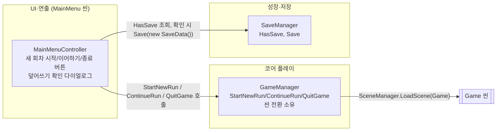

# 메인 메뉴

> 관련 이슈: #90, #139, #142, #203 · 최종 수정: 2026-09-21
**이 문서는 로그다.** 이 기능을 고칠 때마다 갱신한다. 새 문서를 만들지 않는다.

## 무엇을 하는가

`MainMenu` 씬에서 새 회차 시작 / 이어하기 / 종료를 고르면 `Game` 씬으로 전환하거나(시작·이어하기)
플레이를 종료한다(종료). 저장이 없으면 이어하기를 비활성화하고, 저장이 있는 상태에서 새 회차를
시작하면 덮어쓴다는 확인을 받는다. 게임 규칙은 [GDD](../GDD.md) 에 있으니 여기서 반복하지 않는다.

## 왜 이 방법인가

| 검토한 방법 | 채택 | 이유 |
|---|---|---|
| 버튼이 `GameManager.Instance.StartNewRun()`/`ContinueRun()`/`QuitGame()` 호출 | ✅ | 이슈 #90 완료 기준이 "씬 전환은 GameManager가 조정한다. 버튼이 SceneManager.LoadScene을 직접 부르지 않는다"고 못 박았다. `run-state.md`가 #20에서 "존재하지 않는 소비자를 위해 API 형태를 먼저 확정하면 과설계"라며 미뤄둔 그 public 메서드를, 실제 소비자(이 메뉴)가 생긴 지금 추가한다 |
| 버튼이 `SceneManager.LoadScene`을 직접 호출 | ❌ | 이슈 요구사항 위반. GameManager가 씬 이름을 알고 있는 유일한 곳이어야 나중에 로딩 화면·페이드 등을 끼워 넣을 때 한 곳만 고치면 된다 |
| `GameManager.Instance`를 구체 클래스 타입으로 직접 참조 | ❌ | convention-checker가 발견: `SaveManager.Instance`(`ISaveService`)·`BillManager.Instance`(`IBillService`)와 달리 인터페이스 타입이 아니라 AGENTS.md "다른 매니저 구현 클래스를 직접 참조하지 않는다"를 어긴다. `run-state.md`가 "실제 소비자가 생기면 그때 인터페이스를 먼저 발의한다"고 예견해 둔 상황이 실제로 발생했다 — 계약 변경 #142로 정정 |
| 신규 `IGameFlowService`(`StartNewRun`/`ContinueRun`/`QuitGame`) 발의 후 `GameManager.Instance`를 그 타입으로 노출 | ✅ | `SaveManager`/`BillManager`가 이미 쓰는 "Instance를 인터페이스 타입으로 노출" 컨벤션과 일치시킨다. `CurrentState`는 아직 소비자가 없어 이 인터페이스에 넣지 않는다(run-state.md 알려진 한계 유지) |
| `StartNewRun()`이 확인 직후 `SaveManager.Instance.Save(new SaveData())`로 즉시 덮어쓰기 | ✅ | "덮어쓴다는 확인"이 실제로 덮어쓰지 않으면 거짓 확인이다. 자동 저장 배선(당시엔 없었다)에 기대면 "다음 저장 시점에 덮어써진다"가 되어 확인이 거짓이 된다. #203 이 이것을 `ResetAndDistribute()` 한 줄로 바꿨다 — 파일만 비우면 매니저가 `DontDestroyOnLoad` 라 성장이 메모리에 남고, 볼륨·창모드 같은 설정까지 함께 날아간다. 설정 초기화(#196)와 같은 메서드를 쓴다 |
| `ISaveService`에 `bool HasSave` 추가 | ✅ | [contracts.md](contracts.md) #139 항목 참고. `Load()`는 파일이 없어도 기본값 `SaveData`를 반환해 "저장 없음"과 구분이 안 된다 |
| 이어하기 클릭 시 `SaveManager.Load()` → `EconomyManager.RestoreWallet()` 등 실제 데이터 복원까지 배선 | ❌ | 이슈 #90 완료 기준은 "Game 씬으로 넘어간다"까지이고, 복원 배선은 그 자체로 별도 계약 변경이 필요한 큰 작업이라 범위에 넣지 않았다. **#203 에서 별도 이슈로 붙였다** — 다만 복원 시점은 이어하기 클릭이 아니라 앱 시작 1회다 ([save-load.md](save-load.md)) |
| 덮어쓰기 확인을 별도 씬(팝업 씬)으로 분리 | ❌ | ARCHITECTURE.md 0절이 씬을 MainMenu/Game 둘로 고정했고, 결과 화면도 "같은 씬의 UI 패널"로 처리하는 것과 같은 이유로 비활성 패널(`OverwriteConfirmPanel`) 토글로 처리했다 |
| EventSystem에 `InputSystemUIInputModule` 부착 | ✅ | `ProjectSettings.asset`의 `activeInputHandler: 1`(새 Input System 전용)이라 레거시 `StandaloneInputModule`(레거시 `Input` 클래스 사용)은 이 설정에서 동작하지 않는다 |

## 구조

<!-- GameEvents를 거치는 관계가 없다 — 이 기능은 새 이벤트를 발행·구독하지 않는다 -->

| 클래스 | 경로 | 하는 일 |
|---|---|---|
| `MainMenuController` | `Assets/Scripts/Runtime/UI/MainMenuController.cs` | 버튼 3개와 덮어쓰기 확인 다이얼로그를 관리. `SaveManager.Instance.HasSave`로 이어하기 활성/비활성과 확인 다이얼로그 노출 여부를 결정하고, `GameManager.Instance`(`IGameFlowService`)의 세 메서드로 위임 |
| `IGameFlowService` | `Assets/Scripts/Runtime/Interfaces/IGameFlowService.cs` | `StartNewRun`/`ContinueRun`/`QuitGame` 계약. `GameManager` 구현(이슈 #142). 상세는 [contracts.md](contracts.md) |
| `GameManager` | `Assets/Scripts/Runtime/Core/GameManager.cs` | `StartNewRun()`/`ContinueRun()`/`QuitGame()` 추가(이슈 #90), `Instance`를 `IGameFlowService` 타입으로 노출(이슈 #142). 나머지 런 상태 머신 로직은 [run-state.md](run-state.md) 참고 |
| `ISaveService` | `Assets/Scripts/Runtime/Interfaces/ISaveService.cs` | `HasSave` 추가(이슈 #139). 상세는 [contracts.md](contracts.md) |
| `SaveManager` | `Assets/Scripts/Runtime/SaveManager.cs` | `HasSave => File.Exists(SavePath)` 구현(이슈 #139) |

### 이벤트

이 기능은 `GameEvents`를 발행·구독하지 않는다. 버튼 클릭은 `GameManager`/`SaveManager`의
`Instance` 정적 프로퍼티를 직접 호출하는 커맨드다 (위 "왜 이 방법인가" 참고).

### 읽는 밸런스 값

없음 — 이 기능은 CSV 값을 읽지 않는다.

## 씬 구성

`MainMenu.unity`가 완전히 비어 있어(`Camera`/`EventSystem`/`Canvas` 전부 없음) 이번 작업에서 처음
만들었다.

- `Main Camera` (`Camera`, `AudioListener`, `UniversalAdditionalCameraData`) — `Game` 씬과 같은 구성
- `EventSystem` (`EventSystem`, `InputSystemUIInputModule`)
- `Canvas` (`RenderMode.ScreenSpaceOverlay`, `CanvasScaler` 1920×1080 기준 `ScaleWithScreenSize`,
  `matchWidthOrHeight 0.5`) — `MainMenuController` 부착
  * `Title` (TextMeshProUGUI, "NCAI Clicker")
  * `NewRunButton` (Y = 60) / `ContinueButton` (Y = -50) / `SettingsButton` (Y = -160) / `QuitButton` (Y = -270)
  * `OverwriteConfirmPanel` (기본 비활성, 전체 화면 반투명 배경, 활성화 시 SetAsLastSibling 호출로 최상단 렌더링)
    * `DialogBox` → `ConfirmText`, `YesButton`, `NoButton`
  * `SettingsPanel` (기본 비활성, 설정 버튼 클릭 시 활성화 및 SetAsLastSibling 호출로 최상단 렌더링)

## 검증

Unity 6000.3.21f1 에디터, UnityMCP `execute_code`/`manage_camera(screenshot)`로 Play Mode에서
직접 실행, 2026-09-17.

- [x] 컴파일: `refresh_unity` 후 콘솔 오류·경고 0건
- [x] 저장 파일이 없는 상태로 Play → 이어하기 버튼 `interactable == false` 확인 (스크린샷으로도 회색 처리 확인)
- [x] 저장 없는 상태에서 새 회차 시작 클릭 → 확인 다이얼로그 없이 즉시 `MainMenu -> Running` 로그, `Game` 씬 전환, `save.json` 생성 확인
- [x] 저장 있는 상태(위에서 생성된 `save.json`)로 재진입 → 이어하기 버튼 `interactable == true`
- [x] 저장 있는 상태에서 새 회차 시작 클릭 → `OverwriteConfirmPanel.activeSelf == true`(확인 다이얼로그 노출), 씬 전환은 아직 일어나지 않음
- [x] 다이얼로그에서 "아니오" 클릭 → 패널 다시 비활성화, `MainMenu`에 그대로 머무름 확인
- [x] 새 회차 시작 → 다이얼로그 "예" 클릭 → `Game` 씬 전환 확인
- [x] 이어하기 클릭(저장 있는 상태) → `Game` 씬 전환 확인
- [x] 종료 클릭 → 에디터에서 `EditorApplication.isPlaying == false`로 Play Mode 종료 확인 (빌드에서 `Application.Quit()` 경로는 코드 리뷰로만 확인, 실행 미검증)
- [x] 화면 스크린샷으로 타이틀·버튼 3개·한글 라벨(새 회차 시작/이어하기/종료)과 확인 다이얼로그 문구가 정상 렌더됨을 육안 확인
- [x] `GameManager.Instance`를 `IGameFlowService`로 재노출한 뒤(#142) 재컴파일 오류·경고 0건, 저장 있는 상태에서 새 회차 시작 클릭 → 확인 다이얼로그 정상 노출 재확인(회귀 없음)
- [ ] **빌드된 실행 파일에서의 검증은 하지 않았다** — 에디터 Play Mode에서만 확인

## 알려진 한계

- ~~**이어하기를 눌러도 실제 저장 데이터가 복원되지 않는다.**~~ — #203 이 배선을 붙였다.
  코인·소수 잔여·업그레이드 레벨·레거시 포인트·반지 레벨·단계가 앱을 켤 때 복원되고,
  **새 회차 시작과 이어하기가 이제 실제로 다르게 동작한다** — `StartNewRun` 은 빈 저장을
  분배해 성장을 지우고, `ContinueRun` 은 지우지 않는다.
- **날짜·고지서·대출은 여전히 복원되지 않는다.** `IBillService` 에 복원 통로가 없어 #203 의
  범위 밖이었다 ([save-load.md](save-load.md) 알려진 한계). 이어하기로 들어가면 고지서와 날짜는
  1일차부터 다시 시작한다.
- 확인 다이얼로그·버튼은 그레이박스 수준 UI(흰 배경 버튼, 기본 폰트 크기)다. 실제 비주얼은
  범위 밖(설정·크레딧·타이틀 연출과 같은 급)이다.
- 최고 기록·통계 표시는 추가 목표로 이번 이슈 범위 밖이라 구현하지 않았다.
- `Application.Quit()`의 실제 빌드 동작(창 종료)은 에디터에서 검증할 수 없어 코드 리뷰로만 확인했다.
- TMP 한글 폰트 아틀라스(`Assets/Materials/Fonts/NanumGothicSDF.asset`)가 이번 작업에서 쓴 글자들로
  런타임에 채워지며 에셋 파일이 커졌다 — Dynamic SDF 정상 동작이며 별도 조치 불필요 (배경은
  [ui-fonts.md](ui-fonts.md) 참고).

## 갱신 이력

| 날짜 | 이슈 | 누가 | 무엇이 바뀌었나 |
|---|---|---|---|
| 2026-09-17 | #90, #139 | hunil58 | 최초 작성. `MainMenu` 씬을 처음부터 구성(Camera/EventSystem/Canvas/버튼 3개/확인 다이얼로그), `MainMenuController` 신규, `GameManager.StartNewRun/ContinueRun/QuitGame` 추가, `ISaveService.HasSave` 계약 추가(#139) |
| 2026-09-17 | #142 | hunil58 | convention-checker가 `GameManager.Instance` 구체 클래스 직접 참조 위반을 발견. `IGameFlowService` 계약 추가, `GameManager.Instance`를 그 타입으로 재노출 |
| 2026.09.21 | #91, #192 | saltlake00 | UpgradeButton 신설 및 MainMenuController 배선, UpgradeShopPanel 기본 비활성화 적용으로 시작화면 스킬트리 상시 노출 문제 해결, 5개 버튼 105px 등간격 수직 정렬 |
| 2026.09.21 | #192 | saltlake00 | 본래 기획(인게임 고지서 화면의 업그레이드 탭)에 맞춰 시작 화면에서 UpgradeShopPanel 및 UpgradeButton 완전 제거. 메인 4개 버튼(새 회차, 이어하기, 설정, 종료) 110px 등간격 재정렬. OverwriteConfirmPanel 및 SettingsPanel 최상단(SetAsLastSibling) 정렬 처리로 팝업 창 위로 메인 버튼이 뚫고 나오는 z순서 결함 완전 해결 |
| 2026-09-21 | #203 | twins6375-art | 저장 복원 배선이 붙어 "이어하기를 눌러도 복원되지 않는다" 한계를 닫았다. 새 회차 시작과 이어하기가 실제로 달라졌고, 날짜·고지서·대출은 여전히 복원되지 않음을 별도 한계로 남김 |
| 2026-09-21 | #203 | twins6375-art | `StartNewRun` 의 `Save(new SaveData())` 를 `ResetAndDistribute()` 로 교체. 설정을 지우지 않고 메모리까지 비운다 |
