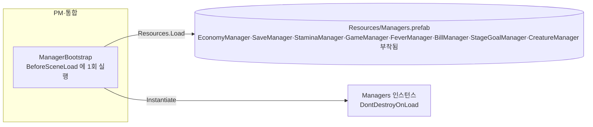

# 매니저 자동 생성

> 관련 이슈: #15, #80, #27, #26, #140 · 최종 수정: 2026-09-17

**이 문서는 로그다.** 이 기능을 고칠 때마다 갱신한다. 새 문서를 만들지 않는다.

## 무엇을 하는가

어느 씬에서 Play 를 눌러도 `Managers` 오브젝트가 정확히 하나 존재하게 한다. 씬 로드 전에 `Resources/Managers` 프리팹을 한 번 생성하고 `DontDestroyOnLoad` 로 유지한다. 매니저 컴포넌트는 모듈 담당자가 이 프리팹에 붙인다.

## 왜 이 방법인가

| 검토한 방법 | 채택 | 이유 |
|---|---|---|
| 부트스트랩 씬(`Bootstrap`)에서 매니저 생성 | ❌ | 개발 중 `Game` 씬만 열고 Play 하면 매니저가 없어 NRE 가 쏟아진다. 결국 "어느 씬에서도 생기는 장치"를 또 만들게 되고 그러면 부트스트랩 씬은 할 일이 없다 ([ARCHITECTURE 0절](../ARCHITECTURE.md)) |
| 씬마다 매니저 오브젝트 배치 | ❌ | 씬 소유자가 다른데 매니저를 양쪽 씬에 넣으면 씬 병합 충돌이 생기고, 씬 전환 시 중복 생성·이벤트 이중 구독을 막는 코드가 따로 필요하다 |
| `RuntimeInitializeOnLoadMethod(BeforeSceneLoad)` + `Resources` 프리팹 | ✅ | 씬 파일을 건드리지 않고, 첫 씬이 무엇이든 로드 전에 한 번만 생성된다. 코드 한 파일과 빈 프리팹 하나로 끝난다 |

## 구조

| 클래스 | 경로 | 하는 일 |
|---|---|---|
| `ManagerBootstrap` | `Assets/Scripts/Runtime/ManagerBootstrap.cs` | 프리팹 로드·생성·`DontDestroyOnLoad`. 정적 필드로 인스턴스를 보관해 중복 생성을 막는다 |
| (프리팹) | `Assets/Prefabs/Resources/Managers.prefab` | 매니저 컴포넌트를 붙이는 자리. 루트 하나, 자식 없음. 현재 `EconomyManager`·`SaveManager`·`StaminaManager`·`GameManager`·`FeverManager`·`BillManager`·`StageGoalManager`·`CreatureManager` 여덟 개가 붙어 있다(각 매니저의 상세는 해당 기능 기술 문서를 본다) |
| `ManagerBootstrapTests` | `Assets/Tests/PlayMode/ManagerBootstrapTests.cs` | MainMenu → Game 전환 후에도 `Managers` 가 1개·같은 인스턴스인지 확인 |

### 이벤트

없음. `GameEvents` 를 발행·구독하지 않는다.

### 읽는 밸런스 값

없음.

## 검증

Unity 6000.3.21f1 배치 실행, 2026-09-16.

- [x] 컴파일 + 프리팹 생성: `-batchmode -quit -nographics -executeMethod ...TempCreateManagersPrefab.Run` → 종료 코드 0, `error CS` 0건. 임시 스크립트는 생성 후 삭제했다.
- [x] Play Mode 테스트: `-batchmode -nographics -runTests -testPlatform PlayMode` → 종료 코드 0, 1개 중 1개 통과 (`KeepsSingleManagersAcrossScenes`). 프리팹 누락 시 나오는 `[ManagerBootstrap]` 오류 로그 없음.
- [x] 에디터에서 `MainMenu` 씬·`Game` 씬을 각각 열고 Play (2026-09-17, #80): 배치 모드에서 임시 에디터 스크립트로 씬을 `OpenScene` 한 뒤 `EnterPlaymode` → 두 씬 모두 `Managers` 루트 1개, 소속 씬 `DontDestroyOnLoad`. 종료 코드 0, `error CS` 0건, `[ManagerBootstrap]` 오류 로그 없음. 임시 스크립트는 삭제했다.
- [x] macOS 빌드 `Player.log` 확인 (2026-09-17, #110): unity-cli `unity build --target StandaloneOSX` → `Build Finished, Result: Success`, `error CS` 0건. 빌드된 앱을 40초 실행 → 첫 씬 로드 후 `[ManagerBootstrap]` 오류 로그 없음, `error`/`exception` 0건.
- [x] Windows 빌드 `Player.log` 확인 (2026-09-17, #80): Unity 6000.3.21f1 배치 빌드로 Windows StandalonePlayer(64비트) 생성 후 1회 구동. `%USERPROFILE%/AppData/LocalLow/NCAITeamTwo/NCAIClicker/Player.log` 에서 `[ManagerBootstrap] Managers 인스턴스 자동 생성 완료.` 출력 확인, `LogError` 0건, 예외 0건.
- [x] Windows 독립 빌드에 `CreatureManager` 가 살아 있는지 (2026-09-17, #140): StandaloneWindows64 빌드(오류 0, 경고 7) 후 실행해 `Player.log` 에서 `[CreatureManager] 크리처 스폰 성공` 6줄과 프리팹 4종 인스턴스화를 확인했다. 컴포넌트가 빌드에 포함되고 프리팹 참조가 런타임에 유효하다는 것이 여기서 증명된다.
- [x] 그 스폰이 **런 시작이 아니었다** (2026-09-17, #140): 같은 로그에 `[GameManager] NotifyBeginRun 실행` 도 `[CreatureManager] …단계 초기화` 도 없었다. `ManagerBootstrap` 이 씬 로드 전에 부르는 `SetUpgradeStats` 의 스폰 부수효과가 **MainMenu 씬에서** 크리처를 만든 것이었다. 부수효과를 걷어낸 뒤 다시 빌드·실행하니 MainMenu 에서 `[CreatureManager]` 로그 0줄, 오류·경고 0건.
- [x] **런 시작 시 크리처 스폰을 빌드에서 확인했다** (2026-09-17, #140): 패키징된 빌드를 실행해 사람이 `새 회차 시작` 을 누르고 플레이. `Player.log` 에 `[GameManager] MainMenu -> Running` → `[GameManager] NotifyBeginRun 실행 (6개 IRunScoped 서비스 활성화)` → `[CreatureManager] 1단계 초기화: 크리처 6마리 스폰 시작` 과 스폰 6줄이 남았고, 이어서 파괴 후 **리스폰까지 동작**했다. 오류·예외·경고 0건, 정상 종료. `NotifyBeginRun` 은 **정확히 1회** 찍혔다 — 프리팹·씬 이중 배선이 없다는 증거다.

## 알려진 한계

- 붙어 있는 매니저는 `EconomyManager`·`SaveManager`·`StaminaManager`·`GameManager`·`FeverManager`·`BillManager`·`StageGoalManager`·`CreatureManager` 여덟 개다(경제 3.1, 저장 3.4, 스태미나·피버·런 상태 각 모듈, 청구서 마감 #27, 단계 목표 3.5, 크리처 스폰 #140). 매니저 사이의 연결(`EconomyManager.SetBillService`, `CreatureManager.SetUpgradeStats` 등)은 `ManagerBootstrap`이 생성 직후 코드로 조립한다. 컴포넌트 실행 순서는 `GameManager.GetServiceOrder`를 통해 `Economy(1) -> Stamina(2) -> Fever(3) -> Creature(4)` 순으로 런 라이프사이클을 배선한다.
- 에디터에서 `Game` 씬을 직접 열어 Play 하는 경로는 배치 모드(`OpenScene` + `EnterPlaymode`)로만 확인했다 (macOS 빌드는 #110, Windows 독립 빌드 구동은 #80 에서 검증 완료).
- 테스트 asmdef 는 런타임 코드를 참조하지 않는다(런타임에 asmdef 가 없다). 테스트는 씬의 오브젝트 이름만 본다.
- `Resources.Load` 의존이라 프리팹 이름(`Managers`)이나 폴더를 바꾸면 소리 없이 실패하고 `LogError` 만 남는다.

## 갱신 이력

| 날짜 | 이슈 | 누가 | 무엇이 바뀌었나 |
|---|---|---|---|
| 2026-09-16 | #15 | Claude | 최초 작성 |
| 2026-09-16 | #22 | twins6375-art | 첫 매니저(`EconomyManager`) 부착 반영 |
| 2026-09-17 | #80 | Claude | 에디터 Play 검증 반영 |
| 2026-09-17 | #110 | Claude | macOS 빌드 `Player.log` 검증 반영 |
| 2026-09-17 | #80 | saltlake00 | Windows 독립 빌드 구동 및 Player.log 검증 반영, 생성 로그 추가 |
| 2026-09-17 | #27 | Claude | `BillManager` 부착 반영 (구조도·컴포넌트 표·알려진 한계) |
| 2026-09-17 | #26 | soilrist | `StageGoalManager` 부착 반영, 프리팹에 붙은 매니저 7종(경제·저장·스태미나·게임·피버·청구서·단계 목표)을 실제 상태로 갱신 |
| 2026-09-17 | #140 | saltlake00 | `CreatureManager` 부착 및 프리팹 4종·BalanceData 연결, `IRunScoped` 생명주기 배선, 에디터 전용 임시 코드 삭제. 빌드 실행으로 컴포넌트 생존을 확인하고, 그 과정에서 `SetUpgradeStats` 의 스폰 부수효과가 MainMenu 에서 크리처를 만들던 것을 찾아 제거 |
