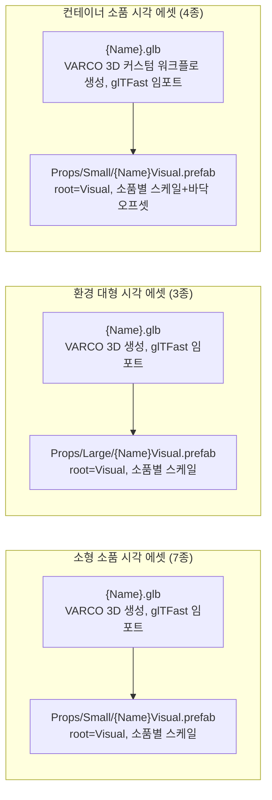

# 소품·환경 에셋 (소형 7종·대형 3종·컨테이너 4종) 및 Game 씬 배치

> 관련 이슈: #238 · #236 · #237 · #239 · 최종 수정: 2026-09-23

**이 문서는 로그다.** 이 기능을 고칠 때마다 갱신한다. 새 문서를 만들지 않는다.

## 무엇을 하는가

작업 6.25(#238)에서 씬 가장자리를 채우는 **소형 소품 7종**의 시각 에셋을 VARCO 3D로 생성했다.
랜턴·곡괭이·삽·경고 표지판·나무 팻말·밧줄·양동이 각각을
[CONCEPT_ART/README.md](../CONCEPT_ART/README.md)의 입력 이미지에서 `Generate3D` 로 `.glb` 를
뽑고, `Assets/Prefabs/Props/Small/{Name}Visual.prefab` 으로 분리 제작했다. 로직 컴포넌트가 없는
순수 시각 에셋이며, 씬 배치(6.26)에서 그대로 배치용 프리팹으로 쓰인다 — [광물 크리처 에셋](mineral-creature-assets.md)의
`MineCreatureXVisual.prefab` 과 같은 역할이다.

작업 6.23(#236)에서는 씬 가장자리를 구성하는 **환경 대형 3종**(갱도 입구·목책·자수정 군락)을
같은 방식으로 생성해 `Assets/Prefabs/Props/Large/{Name}Visual.prefab` 으로 제작했다. 이 이슈에서
소품 프리팹 폴더를 `Assets/Prefabs/Props/Small`·`Assets/Prefabs/Props/Large` 로 나누기로 정하고
(이슈 코멘트로 합의), 먼저 만들어져 있던 소형 소품 7종도 같이 옮겼다 — 자세한 내용은
[AGENTS.md](../../AGENTS.md) 폴더 표 참고.

작업 6.24(#237)에서는 씬 가장자리 **컨테이너 소품 4종**(광차·나무상자·광석 자루·나무통)을
VARCO 3D 커스텀 워크플로(Claude 도구 연동)로 생성해 `Assets/Prefabs/Props/Small/{Name}Visual.prefab`
으로 제작했다 — "씬 가장자리 소품"으로 앞선 소형 소품 7종과 같은 분류라 새 폴더 없이 기존
`Props/Small`에 넣었다. 입력 이미지 4장은 이미 [CONCEPT_ART/README.md](../CONCEPT_ART/README.md)에
등록돼 있었지만, 광차·나무상자 둘 다 image-to-3D 변환 과정에서 결함이 나와 이미지를 다시 만드는
과정을 여러 차례 거쳤다 — 자세한 경위는 아래 "반복 보정 경위" 절 참고.

## 왜 이 방법인가

| 검토한 방법 | 채택 | 이유 |
|---|---|---|
| README 원본 이미지를 그대로 `Generate3D` 에 연결 | ✅ (5종) | 랜턴·양동이를 제외한 5종은 첫 생성 결과가 사용자 검수를 그대로 통과했다 |
| 결과물이 마음에 안 들면 `EditImage` 로 반복 보정 후 재생성 | ✅ (랜턴·표지판·양동이) | ASSET_PIPELINE 2절 "이미지가 마음에 안 들면" 절차 그대로 — 사용자가 스크린샷으로 지적한 부분(느낌표 간격, 노란 판 위치, 물 색, 불꽃 표현)을 `referenceText` 로 반영해 여러 차례 재생성했다. 아래 "반복 보정 경위" 절 참고 |
| 양동이를 VARCO 3D 이미지 수정 → `Generate3D` 파이프라인으로 끝까지 진행 | ❌ | 사용자가 손잡이 제거 버전을 워크플로 밖에서 직접 만들어 별도 파일로 전달 — "워크플로에 있는 걸로 하는 게 아니다"라고 명시적으로 정정. 받은 `.glb` 를 그대로 `Bucket.glb` 로 사용 |
| `EditImage` 의 `model` 을 경제적 기본값(`nano-banana-1`)으로 사용 | ❌ → `gpt-image-2.5-flare` | 사용자가 "모델은 무조건 gpt image 2.5를 써"라고 명시적으로 지시. 자세한 내용은 세션 메모리 `feedback_varco_image_model` 참고 |
| 눕혀진 소품(곡괭이·밧줄)도 세워진 소품과 같은 Y축 높이 기준으로 스케일 | ❌ → 최대 치수 기준 | 곡괭이는 원본이 눕혀진 자세로 생성돼 `bounds.size.y` 가 0.18에 불과했다(대신 `depth` 가 1.00). Y높이만 기준 삼으면 곡괭이가 실제 크기의 1/5로 줄어든다. 눕혀진 소품은 가장 긴 치수를 기준으로 목표 크기에 맞췄다 |
| 갱도 입구를 원본 참고 이미지(레일이 안쪽 깊이 어둠 속으로 사라지는 구도) 그대로 `Generate3D` | ❌ | 6개를 반복 생성해도 매번 프레임이 뒤틀리고 바닥에 레일 파편이 흩어짐. 속이 빈 채 안쪽 깊이가 안 보이는("구멍이 있는") 형태는 사진 한 장에서 깊이를 복원하는 이 모델이 특히 취약한 케이스로 판단 |
| `EditImage` 로 안쪽 원근감만 줄이기 → 그래도 부족하면 안쪽을 완전 평면 벽으로 막기 | ✅ (최종 채택) | 원근감을 줄인 1차 보정도 여전히 옆면이 뒤틀렸다(사용자가 스크린샷에 빨간 원으로 지적). 안쪽을 깊이감 없는 완전 평평한 검은 벽 + 레일·침목 완전 삭제로 2차 보정한 뒤에야 6개 모두 안정적으로 나왔다. 자세한 경위는 아래 "반복 보정 경위" 참고 |
| 갱도 입구를 `GenerateImage` 로 완전히 새 컨셉(처음부터 통짜 블록 실루엣)으로 다시 그리기 | 검토했으나 미채택 | 사용자가 "3D 변환이 잘 되는 새 컨셉으로 만들어보라"고 요청해 시도했고 6개 모두 성공했지만, 최종적으로는 기존 사진을 보정한 "평면 막기" 버전이 채택됐다 |
| 광차: 원본 이미지 그대로 `Generate3D` 재시도만 반복 | ❌ | 바닥 4개 바퀴 방향이 제각각으로 나오는 결함이 재시도해도 반복됐다. 사용자가 VARCO 뷰어 바닥 스크린샷으로 지적 — 원본 이미지가 4개 바퀴 중 일부만 또렷이 보이는 3/4 뷰라 안 보이는 바퀴의 회전을 모델이 추측하는 것으로 판단 |
| 광차: `GenerateImage` 로 "바퀴 4개는 크기·회전·방향이 전부 동일해야 한다"를 명시해 이미지부터 재생성 | ✅ | 새 이미지로 만든 3D 결과에서 바퀴 방향 문제가 해결됨 |
| 나무상자: 코너 브래킷 이음매를 `EditImage` 로 "빈틈없이 이어진다"고 보정 | ❌ | 브래킷 근처 나무판이 비어 보이는 결함이 그대로 재현됐다(사용자가 스크린샷으로 지적). 메시가 아니라 이미지 자체의 문제가 아니었던 것으로 판단 |
| 나무상자: 디테일을 줄인 단순한 상자 이미지로 `GenerateImage` 처음부터 재생성 | ✅ (구조 문제 해결, 이후 디자인 보강) | 입체감 있는 코너 브래킷·대각선 보강재가 안 보이는 뒷면·바닥면 추측을 어렵게 만든 것으로 판단, 디테일을 줄이자 구멍 문제가 사라졌다. 다만 사용자가 "너무 단순하다"고 지적해 이후 `EditImage`로 뚜껑을 얹고, 다시 `GenerateImage`로 이음선 간격 균일화·광산 느낌(낡은 나무·녹슨 철제 밴드·경첩 통일·광석 덩어리)을 순차적으로 보강했다 |
| 자루: 원본 이미지에 박힌 곡괭이 엠블럼을 `EditImage` 로 제거 | ✅ | 소품 자체는 결함이 없었고 엠블럼만 제거하면 됐다. 1회 보정으로 해결 |

## 구조



### 소형 소품 7종

| 에셋 | 경로 | 목표 치수(유닛) | 기준 축 | `localScale` | `localPosition.y` |
|---|---|---|---|---|---|
| `LanternVisual.prefab` | `Assets/Prefabs/Props/Small/` | 0.52 | height | 0.5211 | 0.0000 |
| `PickaxeVisual.prefab` | `Assets/Prefabs/Props/Small/` | 0.68 | depth (눕혀짐) | 0.6775 | 0.0000 |
| `ShovelVisual.prefab` | `Assets/Prefabs/Props/Small/` | 0.68 | height | 0.6956 | 0.0000 |
| `WarningSignVisual.prefab` | `Assets/Prefabs/Props/Small/` | 1.20 (크리처 1.5배) | height | 1.2013 | 0.0000 |
| `SignboardVisual.prefab` | `Assets/Prefabs/Props/Small/` | 0.72 | height | 0.7175 | 0.0000 |
| `RopeCoilVisual.prefab` | `Assets/Prefabs/Props/Small/` | 0.48 | width (지름, 눕혀짐) | 0.5077 | 0.0000 |
| `BucketVisual.prefab` | `Assets/Prefabs/Props/Small/` | 0.56 | height | 0.5614 | 0.2811 |

기준 크리처 높이(0.8유닛)에 대한 비율은 ASSET_PIPELINE 2절 "스케일 기준"을 따랐다 — 표지판(경고
표지판, WarningSign)은 이슈 DoD대로 1.5배, 나머지는 0.6~1배 범위 안에서 소품별 상대 크기를 반영해
정했다. `Renderer.bounds` 를 코드로 직접 측정해 계산했으며, 곡괭이·밧줄처럼 세로가 아니라 가로로
긴 소품은 `size.y` 대신 가장 긴 치수를 기준 삼았다 (표 "기준 축" 열 참고). `BucketVisual` 만
`localPosition.y` 가 0이 아닌데, 이 파일은 VARCO 출력이 아니라 사용자가 직접 만든 별도 `.glb`
라 `pivotToBottom` 내보내기 옵션이 적용되지 않아 피벗이 물체 중간에 있었기 때문이다 — 실측
`bounds.min.y` 만큼 끌어올렸다.

### 환경 대형 3종

| 에셋 | 경로 | 목표 치수(유닛) | 기준 축 | `localScale` | `localPosition.y` |
|---|---|---|---|---|---|
| `TunnelEntranceVisual.prefab` | `Assets/Prefabs/Props/Large/` | 2.40 (크리처 3배) | height | 2.7551 | 0.0000 |
| `FenceSectionVisual.prefab` | `Assets/Prefabs/Props/Large/` | 0.80 (크리처 1배) | height | 1.5658 | 0.0000 |
| `AmethystClusterVisual.prefab` | `Assets/Prefabs/Props/Large/` | 1.20 (크리처 1.5배) | height | 1.2007 | 0.0000 |

이슈 DoD가 지정한 배율(갱도 입구 3배·목책 1배·자수정 군락 1.5배)을 그대로 크리처 높이(0.8유닛)에
곱해 목표 치수를 정했다. 셋 다 세워진 형태라 height 기준, 바닥 피벗이라 `localPosition.y = 0`.
실측 결과 목표 치수와 오차 0.005유닛 이내로 일치했다 (예: 갱도 입구 2.4006, 목책 0.8000, 자수정
군락 1.1999).

### 컨테이너 소품 4종

| 에셋 | 경로 | 목표 치수(유닛) | 기준 축 | `localScale` | `localPosition.y` |
|---|---|---|---|---|---|
| `OreCartVisual.prefab` | `Assets/Prefabs/Props/Small/` | 0.96 (크리처 1.2배) | height | 0.9695 | 0.4763 |
| `WoodenCrateVisual.prefab` | `Assets/Prefabs/Props/Small/` | 0.80 (크리처 1배) | height | 0.9187 | 0.3993 |
| `OreSackVisual.prefab` | `Assets/Prefabs/Props/Small/` | 0.80 (크리처 1배) | height | 0.7953 | 0.3994 |
| `BarrelVisual.prefab` | `Assets/Prefabs/Props/Small/` | 0.96 (크리처 1.2배) | height | 0.9582 | 0.4804 |

이슈 DoD가 지정한 배율(광차·나무통 1.2배, 상자·자루 1배)을 크리처 높이(0.8유닛)에 곱해 목표
치수를 정했다. 넷 다 세워진 형태라 height 기준.

**넷 다 `localPosition.y` 가 0이 아니다 — 이전 소형·대형 세트와 다른 점이다.** 앞선 두 세트는
VARCO 3D 편집기 UI에서 `pivotToBottom` 내보내기 옵션을 직접 켜고 만들어 바닥 피벗으로 나왔지만,
이번엔 Claude 에이전트가 VARCO 3D 커스텀 워크플로 MCP 도구로 `Generate3D` 노드를 직접 조립해
실행했다 — 이 워크플로 API의 `Generate3D` 노드에는 `pivotToBottom` 인트린식 자체가 없어(
`get_node_catalog` 로 확인) 넷 다 중심 피벗으로 나왔다. `BucketVisual` 때와 같은 방법으로
`Renderer.bounds.min.y` 만큼 `localPosition.y` 를 끌어올려 바닥 피벗처럼 보정했고, 재측정 결과
`minY = 0.0000`, 목표 치수와 오차 없이 일치했다.

### 이벤트

해당 없음 — 로직 컴포넌트가 없는 시각 에셋 프리팹.

### 읽는 밸런스 값

해당 없음.

## 반복 보정 경위

사용자가 VARCO 3D 워크플로 결과를 스크린샷으로 확인하며 다음을 지적해 `EditImage` 로 순차
보정했다 (모두 `gpt-image-2.5-flare` 모델):

- **경고 표지판**: 느낌표와 검은 테두리가 붙어 있어 간격을 띄움 → 노란 판이 기둥 맨 위에 붙어
  있어 아래로 내림 → 너무 많이 내려가서 다시 살짝 올림(3차 보정 후 확정)
- **양동이**: 물 안에 흰/모래색이 섞여 있어 파란 물로 통일 → 손잡이 그림자가 물 위에 갈색 줄로
  남아 있어 제거 → 이후 사용자가 손잡이 자체를 없앤 버전을 VARCO 3D에서 직접 만들어 파일로 전달,
  최종적으로 이 버전을 채택(워크플로 3D 산출물은 미사용)
- **랜턴**: 처음엔 유리 한쪽 면에만 불꽃이 있고 정적으로 보여 사방에 불빛이 보이도록, 더
  생동감 있게 보정 → 결과가 유리 전체를 불 텍스처로 덮어 오히려 부자연스러워, 중앙에 작은 촛불
  하나 + 사방으로 은은하게 퍼지는 빛으로 재보정 → 이 결과도 사용자가 원하던 모습이 아니라고
  판단해 워크플로에서 원본 이미지로 `Generate3D` 를 처음부터 다시 실행, 그 결과를 최종 채택
- **갱도 입구 (#236)**: 원본 이미지로 6개를 생성했지만 전부 프레임이 뒤틀리고 바닥에 레일
  파편이 흩어짐 → `EditImage` 로 "안쪽 깊이감·원근감을 줄이고 레일을 짧게 잘라 달라"고 1차
  보정 후 6개 재생성 → 사용자가 여전히 옆면이 뒤틀린 부분을 스크린샷에 빨간 원으로 짚어줌 →
  "안쪽을 깊이감 없는 완전 평평한 검은 벽으로 막고 레일·침목을 전부 지워 달라"고 2차 보정 →
  이번엔 6개 모두 안정적인 형태로 나와 3번째 결과를 최종 채택. 이 과정에서 "입구 위쪽에 곡괭이·삽
  X자 마크를 새겨 달라"는 추가 보정도 시도했고(마크 추가 버전), 별도로 처음부터 다시 그린 "새
  컨셉" 버전도 시도했지만, 최종적으로는 2차 보정(평면 막기, 마크 없음) 버전을 채택했다
- **광차 (#237)**: 원본 이미지로 만든 3D 결과를 VARCO 뷰어 바닥면에서 확인하니 4개 바퀴의 회전
  방향이 제각각이었다 → 같은 이미지로 3D만 재생성해도 문제가 재현돼, `GenerateImage` 로 "바퀴
  4개는 크기·스포크 무늬·회전각이 전부 동일하고 같은 축선에 정렬돼야 한다"를 명시해 이미지부터
  다시 만든 뒤 재생성 → 바퀴 방향 문제 해결
- **나무상자 (#237)**: 원본 이미지 3D 결과에서 코너 브래킷 주변 나무판이 비어 보임(사용자가
  스크린샷에 파란 원으로 지적) → `EditImage` 로 "브래킷 아래 나무가 빈틈없이 이어진다"고 보정 후
  재생성해도 같은 자리가 여전히 비고 오히려 바닥면 왜곡이 심해짐(2번째 스크린샷) → 사용자가
  "VARCO 3D가 깊이감 표현을 못 하는 것 같다"고 원인을 짚어, 코너 브래킷·대각선 보강재 디테일을
  대폭 줄인 단순한 상자 이미지로 `GenerateImage` 처음부터 재생성 → 구멍 문제 해결, 다만 사용자가
  "너무 단순하다"며 여닫는 뚜껑을 요청 → `EditImage` 로 얇은 뚜껑 추가 → 3D 결과에서 앞면 이음선
  4줄 중 일부가 끊기고 간격이 불균일, 뚜껑도 너무 얇다는 피드백 → `GenerateImage` 로 "이음선은
  4줄 모두 끊김 없이 동일 간격, 뚜껑은 판자 한 장 두께의 두꺼운 슬래브"로 명시해 재생성 → 이어서
  "경첩 모양이 서로 다르다", "광석 나무상자 느낌이 안 난다"는 피드백으로 "경첩 2개는 완전히 동일한
  형태로 좌우 대칭", "낡은 나무 결·녹슨 철제 밴드·뚜껑 위 작은 광석 덩어리"를 추가해 한 번 더
  `GenerateImage` 로 재생성 — 이 결과를 최종 채택
- **자루 (#237)**: 원본 이미지 자체에 곡괭이 십자 엠블럼이 인쇄돼 있어 `EditImage` 로 "엠블럼을
  지우고 민무늬 삼베 질감으로"만 보정, 1회로 해결

## 씬 배치 (6.26, #239)

Game 씬 소유자가 컨셉 이미지(`docs/CONCEPT_ART/MineWorksite/SceneConcept_MineWorksite.jpg`)를 보고
위 14종 프리팹 21개 인스턴스를 배치했다. 전부 `SceneProps` 빈 오브젝트 아래 자식으로 두었다
(프리팹 오버라이드 없이 위치·회전만 인스턴스 값으로 지정).

### 배치 기준 좌표계

- `DeskPlane_Greybox`: 중심 `(0, 0, 2)`, 6×6 유닛 → X `[-3, 3]`, Z `[-1, 5]`
- 크리처 이동/스폰 영역(`CreatureManager._deskBounds`): 중심 `(0, 0, 2)`, 4.8×4.8 유닛 →
  X `[-2.4, 2.4]`, Z `[-0.4, 4.4]` — **이 안쪽에는 소품을 두지 않는다.**
- 남는 가장자리 띠(폭 0.6유닛)와 desk 바깥 경계 쪽에 소품을 배치. 갱도 입구는 뒤쪽 벽(Z≈4.7~4.95)
  중앙에, 나머지는 좌우 가장자리와 앞뒤 코너에 나눠 배치했다.
- 컨테이너 소품 4종(광차·나무상자·자루·나무통)은 중심 피벗이라 인스턴스 배치 시 `mine-props.md`
  "구조" 절의 `localPosition.y` 값을 그대로 써야 바닥에 붙는다 — 씬에서 프리팹을 인스턴스화할 때
  위치를 명시적으로 지정하면 프리팹 기본값이 무시되므로, Y를 빠뜨리면 바닥을 뚫고 들어간다.

### 바닥에 뜨거나 파묻히는 문제 — 실측으로 고친다

배치 도중 나무상자·자루·나무통이 살짝 공중에 떠 보이는 문제가 있었다. 원인은 이 문서에 적힌
"컨테이너 소품 4종" 표의 `localPosition.y` 값이 기록 시점 이후 프리팹이 재조정되며 이미 바닥
피벗으로 바뀌어 있었는데, 그 위에 문서의 옛 오프셋을 또 더해 두 번 띄운 것이었다. **문서 값을
맹신하지 말고, 배치 후에는 항상 `Renderer.bounds.min.y`(월드 좌표 기준 실제 바닥)를 코드로
재측정해서 정확히 `0`에 맞춘다:**

```csharp
var renderers = obj.GetComponentsInChildren<Renderer>();
var bounds = renderers[0].bounds;
foreach (var r in renderers) bounds.Encapsulate(r.bounds);
obj.transform.position += new Vector3(0, -bounds.min.y, 0); // minY 만큼 끌어올림(또는 내림)
```

소품을 다른 소품 위에 쌓을 때(예: 통 위에 랜턴)도 같은 방식 — 아래 오브젝트의 `bounds.max.y`
(꼭대기 실측값)를 그대로 위 오브젝트의 Y 좌표로 쓴다.

### 바닥 재질과 배경

- `DeskPlane_Greybox`의 임시 단색 머티리얼을 VARCO 생성 텍스처(`Assets/Materials/MineDirtFloor.png`,
  머티리얼 `MineDirtFloor.mat`, URP Lit)로 교체했다.
- **가장자리 자연스럽게 흐리기**: 바닥 텍스처의 알파 채널에 중심은 불투명·네 귀퉁이로 갈수록
  투명해지는 슈퍼엘립스(둥근 사각형) 그라데이션을 구워 넣고(`n=4, inner=0.95, outer=1.15`,
  파이썬 PIL로 생성), 머티리얼을 Transparent Surface Type으로 전환했다. 바닥의 실제 메시(사각형)와
  크리처 이동 판정은 전혀 건드리지 않는 순수 시각 처리다.
- **배경(`MineCaveBackdrop`)**: 카메라가 고정이라(회전·이동 없음) 실제 동굴 벽 메시를 새로 만드는
  대신(AGENTS.md 범위 밖 규칙), VARCO로 생성한 동굴 내부 이미지를 카메라 뒤 먼 곳(거리 18유닛)에
  카메라 프러스텀 크기에 정확히 맞춘 평면(Quad) 하나로 깔았다. 크기는
  `Camera.ViewportToWorldPoint`로 프러스텀 네 모서리를 직접 구해 계산했고, 1080p 종횡비(16:9)를
  강제 지정하고 15% 여유를 둬서 에디터 창 크기 변화에도 회색 여백이 남지 않게 했다. 머티리얼은
  Unlit(`MineCaveBackdrop.mat`) — 씬 조명에 영향받지 않고 이미지에 미리 그려둔 조명 그대로 보인다.
  메시 에셋은 `Assets/Models/MineCaveBackdropQuad.asset`.

### 크리처가 소품을 뚫고 지나가는 문제 — 장애물 회피 (#239)

Play 모드로 확인해 보니 크리처가 소품 위를 그대로 지나다녔다. **콜라이더를 다는 것은 해결책이
아니다** — `CreatureMovement`의 이동은 물리 충돌이 아니라 사각형 좌표 클램프(`ClampAndBounce`)
방식이라 콜라이더가 있어도 무시한다. 대신 다음을 코드에 추가했다:

- `NCAIClicker.Targets.ObstacleCircle` (get-only 프로퍼티 `Center`/`Radius`) — 소품 하나를 원으로
  근사한 값.
- `CreatureManager.CacheObstacles()` — `SceneProps`(이름은 `_obstacleRootName`) 아래 자식마다
  `Renderer.bounds`를 실측해 장애물 원 목록을 만든다. `BeginRun()`마다 다시 만든다 — 이 매니저가
  `DontDestroyOnLoad`라 인스펙터로 씬 오브젝트를 직접 연결할 수 없기 때문이다.
- `CreatureMovement.AvoidObstacles()` — `ClampAndBounce()` 안에서 사각형 벽 클램프 다음에 호출.
  장애물 원과 겹치면 원 밖으로 밀어내고 `Vector3.Reflect`로 이동 방향을 반사한다(벽에 부딪힐 때와
  같은 느낌).
- `CreatureManager.GetRandomSpawnPosition()`도 장애물과 안 겹치는 자리가 나올 때까지 재시도한다.
- 소품이 늘거나 위치가 바뀌어도 코드를 다시 손댈 필요가 없다 — 매 런마다 실측해서 자동 반영된다.

### 크리처 크기 축소 (0.8 → 0.65유닛)

소품 배치 이후 이동 공간이 좁게 느껴진다는 피드백으로 타격 대상 통일 높이를 0.8 → 0.65유닛으로
낮췄다(조준 원 대비 83% → 약 67%). 근거와 이전 기준들의 폐기 사유는
[ASSET_PIPELINE.md](../ASSET_PIPELINE.md) "스케일 기준" 절 참고. 대상 6종(`TargetRunner`·
`TargetNormal`·`TargetTourist`·`TargetAnchor`·`TargetAngry`·`TargetPinata`) 전부
`Renderer.bounds` 실측으로 재조정했고, `TargetNormal`(`PiggyNormalVisual` 사용, 다른 5종과
달리 중심 피벗이라 `localPosition`도 스케일 비율만큼 같이 낮춰야 바닥에 붙었다.

부수적으로 `TargetAnchor`·`TargetTourist`·`TargetAngry`·`TargetPinata`·`TargetRunner` 5종이
전부터 "`Visual` 자식은 스케일이 1이어야 한다"(연출 코드가 여길 스케일하므로)는 규칙을 어기고
있었다 — 이번 작업과 무관하게 있던 문제인데, 검증(`TargetChecks`)이 이번에 처음 그 지점까지
도달하며 드러났다. 시각적 크기는 그대로 두고 스케일을 `Visual`에서 그 자식으로 옮겨 정리했다.

### 프로파일링 (6.26 DoD)

Unity 에디터 프로파일러, Game 뷰 1920×1080, Play 모드에서 크리처 다수 스폰 상태로 실측:

| 지표 | 값 |
|---|---|
| Draw Calls | 206 |
| Batches | 205 |
| SetPass Calls | 57 |
| Triangles | 234,033 |
| CPU Frame Time | 0.57ms |

PC 타겟에서 여유 있는 수준 — 프레임 저하 없음.

## 검증

Unity 6000.3.21f1, 2026-09-22 ~ 2026-09-23.

- [x] 7개 GLB 모두 glTFast 정상 임포트 확인(`manage_asset search` 로 `assetType=UnityEngine.GameObject`
  확인, 콘솔 임포트 오류·경고 0건)
- [x] `Renderer.bounds` 실측으로 7종 스케일 산출, 코드로 재측정해 목표 치수·바닥 피벗(`BucketVisual`
  제외 `minY=0.0000`) 확인
- [x] 7개 `{Name}Visual.prefab` 생성, 전부 `Shader Graphs/glTF-pbrMetallicRoughness` 셰이더 확인
  (분홍 머티리얼 아님)
- [ ] 곡괭이 손잡이가 -Z 를 향하는지 육안 확인 — 아직 스크린샷으로 확인하지 않음
- [x] 랜턴 머티리얼 Emission 켜 둠(`LanternEmissive.mat`, `emissiveTexture`=베이스 컬러 재사용, `emissiveFactor=(1, 0.65, 0.25)`) — `Object.Instantiate(srcMat)` 로 복제 후 정상 동작 확인(아래 "알려진 한계" 정정 참고). 정확한 밝기 수치 튜닝은 DoD대로 6.26에서 진행
- [x] Play Mode 렌더 캡처로 7종 동시 육안 확인 (6.26 씬 배치 후)
- [x] 환경 대형 3종 GLB 모두 glTFast 정상 임포트 확인(`manage_asset search` 로 `assetType=UnityEngine.GameObject` 확인, 콘솔 임포트 오류·경고 0건)
- [x] `Renderer.bounds` 실측으로 3종 스케일 산출, 프리팹 생성 후 재측정해 목표 치수(2.4/0.8/1.2, 오차 0.005 이내)·바닥 피벗(`minY=0.0000`) 확인
- [x] 3개 `{Name}Visual.prefab` 생성, 전부 `Shader Graphs/glTF-pbrMetallicRoughness` 셰이더 확인 (분홍 머티리얼 아님)
- [x] 자수정 군락 머티리얼 Emission 켜 둠(`AmethystClusterEmissive.mat`, `emissiveTexture`=베이스 컬러 재사용, `emissiveFactor=(0.55, 0.25, 0.85)`) — `Object.Instantiate(srcMat)` 로 복제해 `occlusionTexture`/`metallicRoughnessTexture`/`normalTexture` 슬롯 정상 유지 확인. 정확한 밝기 수치 튜닝은 DoD대로 6.26에서 진행
- [x] Play Mode 렌더 캡처로 3종 동시 육안 확인 (6.26 씬 배치 후)
- [x] 컨테이너 소품 4종 GLB 모두 glTFast 정상 임포트 확인(`manage_asset search` 로 `assetType=UnityEngine.GameObject` 확인, 콘솔 임포트 오류·경고 0건)
- [x] `Renderer.bounds` 실측으로 4종 스케일·바닥 오프셋 산출, 프리팹 생성 후 재측정해 목표 치수(0.96/0.8/0.8/0.96, 오차 0)·바닥 피벗(`minY=0.0000`) 확인
- [x] 4개 `{Name}Visual.prefab` 생성 (`Props/Small/`), 전부 `Shader Graphs/glTF-pbrMetallicRoughness` 셰이더 확인 (분홍 머티리얼 아님)
- [x] 사용자가 스크린샷으로 확인한 결함(광차 바퀴 방향, 나무상자 메시 구멍·이음선·뚜껑·경첩) 전부 재생성 후 사용자 검수 완료
- [x] Play Mode 렌더 캡처로 4종 동시 육안 확인 (6.26 씬 배치 후)
- [x] 6.26 씬 배치 시 실측 크기가 다른 소품·크리처와 시각적으로 자연스러운지 재확인 — 크리처 크기를
  0.8→0.65유닛으로 낮추며 함께 확인
- [x] 14종 프리팹 21개 인스턴스 배치, 프리팹 오버라이드 없이 위치·회전·스케일만 (6.26)
- [x] 조준 원·크리처 이동 경로(4.8×4.8)와 소품 겹침 없음 — 좌표 실측으로 배치, 장애물 회피 코드로 이중 보강
- [x] 바닥 머티리얼 교체(`MineDirtFloor.mat`), 가장자리 알파 블렌드로 사각형 경계 제거
- [x] 배경(`MineCaveBackdrop`) 추가로 카메라 프레임 안 회색 여백 제거
- [x] 1080p 기준 프로파일러 확인 — Draw Calls 206, Batches 205, 프레임 저하 없음
- [x] `NCAI/전체 검증 실행` 29/29 통과 (TargetChecks 37건 포함)

## 알려진 한계

- **곡괭이 손잡이 방향(-Z) 은 코드 실측이 아니라 육안 확인이 필요하다.** 눕혀진 자세로 생성돼
  어느 쪽이 손잡이 끝인지 `Renderer.bounds` 만으로는 판별할 수 없었다. 6.26 배치 전에 Scene 뷰에서
  확인 필요.
- **양동이(`Bucket.glb`)는 VARCO 3D 생성물이지만 이 워크플로 세션 밖에서 사용자가 직접 만들어
  전달한 파일이다.** 워크플로 그래프에는 대응하는 노드가 없다 — 재현하려면 사용자에게 문의해야 한다.
- **정정**: 이전에는 이 절에 "랜턴 머티리얼을 스크립트로 편집하면 텍스처가 깨진다"고 적었으나,
  재조사 결과 그 백색 렌더링의 **진짜 원인은 VARCO 서버가 구운 baseColor 텍스처 자체가 손상돼
  있었던 것**이었다(위 "반복 보정 경위"·갱신 이력 참고). 다만 `new Material(srcMat)` /
  `CopyPropertiesFromMaterial` 로 복제했을 때 `occlusionTexture`/`metallicRoughnessTexture` 슬롯이
  실제로 비는 현상도 관찰됐다 — **`UnityEngine.Object.Instantiate(srcMat)` 로 복제하면 모든 텍스처
  슬롯이 정상 유지된다.** `Shader Graphs/glTF-pbrMetallicRoughness` 머티리얼을 스크립트로 복제할
  땐 `new Material()`이 아니라 `Object.Instantiate()` 를 쓴다.
- **VARCO 3D 의 `Generate3D` 결과물은 가끔 텍스처가 제대로 안 구워진 채로 나올 수 있다.** 랜턴에서
  실제로 baseColor PNG가 72바이트짜리 빈 이미지로 나온 사례가 있었다 — Unity에서 `assetType`·콘솔
  오류로는 드러나지 않고 텍스처가 1×1 플레이스홀더로 조용히 임포트된다. **`.glb` 를 임포트하기 전에
  임베드 이미지의 바이트 크기를 확인하는 습관을 들인다** — 정상적인 알베도/노멀 텍스처는 최소 수백KB는
  된다. 같은 참조 이미지로 `Generate3D` 를 재실행하면 대체로 해결된다.
- 랜턴 Emission, 프리팹 크기의 최종 미세조정은 6.26(씬 배치)에서 진행한다.
- 애니메이션·리깅은 이 작업 범위 밖이다(정적 메시).
- 공개 배포·상업적 이용 시 VARCO 라이선스 약관 재확인 필요 ([THIRD_PARTY.md](../THIRD_PARTY.md) 참고).
- **속이 빈 채 안쪽 깊이가 안 보이는 형태(문·터널처럼 구멍이 있는 실루엣)는 사진 한 장에서 3D를
  복원하는 `Generate3D` 가 특히 취약하다.** 참고 이미지에 원근감이 강한 안쪽 공간(예: 어둠 속으로
  사라지는 레일)이 있으면 모델이 안 보이는 깊이를 과하게 추측하다가 프레임이 뒤틀린다. 대응법은
  참고 이미지 자체를 손봐서 "안쪽이 실제로는 평평한 벽"인 것처럼 단순화하는 것 — `polygonCount`
  등 `Generate3D` 파라미터로는 해결되지 않았다. 갱도 입구가 이 사례다.
- 자수정 군락 Emission 밝기, 갱도 입구 프리팹 크기의 최종 미세조정은 6.26(씬 배치)에서 진행한다.
- **속이 찬 형태라도 입체적인 표면 디테일(돌출된 코너 브래킷·깊게 파인 대각선 보강재 등)이 많으면
  안 보이는 뒷면·바닥면 재구성이 왜곡될 수 있다.** 나무상자가 이 사례다 — 문·터널처럼 뚫린
  실루엣이 아닌 완전히 막힌 상자인데도, 표면 디테일이 과할 때 VARCO `Generate3D` 가 안 보이는
  면의 깊이를 잘못 추측했다. 대응법은 참고 이미지의 표면 디테일 자체를 단순화하는 것 —
  `polygonCount` 등 파라미터로는 해결되지 않았다.
- **VARCO 3D 커스텀 워크플로 API로 만든 `Generate3D` 노드에는 `pivotToBottom` 옵션이 없다.**
  VARCO 3D 편집기 UI로 직접 만들면(이전 소형·대형 세트) 바닥 피벗으로 나오지만, 이 세트는 전부
  Claude 에이전트가 워크플로 API로 직접 노드를 조립해 실행해 중심 피벗으로 나왔다. 프리팹화 단계에서
  `Renderer.bounds.min.y` 만큼 `localPosition.y` 를 보정해 바닥 피벗처럼 맞췄다 — "구조" 절 참고.
- **VARCO 3D 워크플로를 브라우저에서 직접 열어 두면, MCP 도구로 조작하는 중에도 사람이 동시에
  노드 값을 바꾸거나 재실행할 수 있다.** 이번 작업 중 `polygonCount`·`textureSize` 가 에이전트가
  설정하지 않은 값으로 여러 번 바뀌고, 완료된 노드가 다시 `running` 으로 돌아가는 현상이 있었는데
  원인은 서버 오류가 아니라 사용자가 같은 워크플로 세션을 직접 편집하고 있었기 때문이었다. 진행
  상태가 설명 없이 바뀌면 먼저 "지금 브라우저에서 같이 건드리고 계신가요"를 확인한다.

## 갱신 이력

| 날짜 | 이슈 | 누가 | 무엇이 바뀌었나 |
|---|---|---|---|
| 2026-09-22 | #238 | Claude | 최초 작성 — 소형 소품 7종 VARCO 3D 생성, 사용자 피드백으로 표지판·양동이·랜턴 반복 보정, 7개 Visual 프리팹 생성 |
| 2026-09-22 | #238 | Claude | 랜턴이 여전히 마음에 안 든다는 피드백으로 원본 이미지에서 `Generate3D` 재실행, `Lantern.glb`·`LanternVisual.prefab` 교체(스케일 0.5211→0.5205, 오차 무시 가능) |
| 2026-09-22 | #238 | Claude | 사용자가 이전에 확정했던 "촛불 하나 + 사방 은은한 빛" 버전 이미지를 다시 지목 — 이미 생성해 둔 그 이미지의 3D 메쉬(`Generate3D` 재실행 없이 기존 결과 재사용)로 `Lantern.glb` 복원 |
| 2026-09-22 | #238 | Claude | Emission 시도·롤백 — `baseColorTexture` 를 `emissiveTexture` 로 재사용하는 `LanternEmissive.mat` 을 스크립트(`execute_code`)로 만들었더니 `occlusionTexture`/`metallicRoughnessTexture` 연결이 깨지며 렌더링이 새하얗게 나옴(Game 씬에서 사용자가 발견). 원인은 이 커스텀 glTF Shader Graph 머티리얼이 Material Inspector GUI가 관리하는 내부 상태에 의존해서, 스크립트로 프로퍼티만 직접 건드리면 다른 텍스처 슬롯이 깨지는 것으로 보임. `LanternEmissive.mat` 삭제하고 임포트 그대로의 원본 머티리얼으로 롤백 — Emission은 스크립트로 자동화하지 않고 6.26에서 Material Inspector로 사람이 직접 설정한다 |
| 2026-09-22 | #238 | Claude | 롤백 후에도 흰색으로 나온다는 재보고로 재조사 — `.glb` 를 바이너리로 직접 파싱해 보니 `Material Inspector` 문제가 아니라 **그 특정 3D 결과물(task `1ed4dbca`) 자체의 baseColor PNG가 VARCO 서버에서 72바이트짜리 빈 이미지로 구워져 있었다**(정상이면 수백KB~1MB대). 같은 참조 이미지로 `Generate3D` 를 한 번 더 실행(task `d4be8132`), 다운로드 직후 파이썬으로 임베드 이미지 바이트 크기를 먼저 검증한 뒤(1.38MB/0.75MB/2.5MB, 정상) `Lantern.glb`·`LanternVisual.prefab` 교체 — 이번엔 `baseColorTexture` 1024×1024, `normalTexture` 2048×2048 정상 임포트 확인 |
| 2026-09-22 | #236 | Claude | 소품 프리팹 폴더를 `Assets/Prefabs/Props/Small`·`Props/Large` 로 분리하기로 이슈 코멘트로 합의, `AGENTS.md` 폴더 표 갱신, 기존 소형 소품 7종을 `Props/Small` 로 이동 (커밋 분리) |
| 2026-09-22 | #236 | Claude | 환경 대형 3종(갱도 입구·목책·자수정 군락) VARCO 3D 생성. 갱도 입구는 원본 이미지로 6회 생성해도 계속 뒤틀려 `EditImage` 로 2차례 보정(원근감 축소 → 안쪽 완전 평면화) 후 6개 모두 안정화, 3번째 결과를 최종 채택. 목책·자수정 군락은 원본 이미지 첫 생성 결과를 그대로 채택 |
| 2026-09-22 | #236 | Claude | 3종 `{Name}Visual.prefab` 생성 (`Props/Large/`), `Renderer.bounds` 실측으로 이슈 DoD 배율(3배·1배·1.5배)에 맞춰 스케일 계산. 자수정 군락에 `AmethystClusterEmissive.mat` 적용 — 랜턴 사례의 교훈(`Object.Instantiate(srcMat)` 로 복제)을 그대로 따라 텍스처 슬롯 깨짐 없이 적용 |
| 2026-09-23 | #237 | Claude | 컨테이너 소품 4종(광차·나무상자·자루·나무통) VARCO 3D 커스텀 워크플로로 생성 시작. 자루는 원본 이미지의 곡괭이 엠블럼을 `EditImage` 로 1회 제거해 해결 |
| 2026-09-23 | #237 | Claude | 광차 3D 결과 바퀴 방향 불일치를 사용자가 스크린샷으로 지적 — 같은 이미지로 3D만 재생성해도 재현돼, 바퀴 정렬을 명시한 새 이미지로 `GenerateImage` 부터 재생성 후 해결 |
| 2026-09-23 | #237 | Claude | 나무상자 3D 결과의 코너 브래킷 주변 메시 구멍을 사용자가 스크린샷으로 지적 — `EditImage` 보정으로는 재현·악화(바닥면 왜곡 심화)만 됨. 표면 디테일을 대폭 줄인 단순 상자 이미지로 `GenerateImage` 처음부터 재생성해 구멍 문제 해결 |
| 2026-09-23 | #237 | Claude | 나무상자가 "너무 단순하다"는 피드백으로 `EditImage` 뚜껑 추가 → 이음선 불균일·뚜껑 얇음 피드백으로 `GenerateImage` 재생성(이음선 4줄 균일화, 뚜껑 두껍게) → 경첩 모양 불일치·광산 느낌 부족 피드백으로 한 번 더 `GenerateImage` 재생성(경첩 좌우 대칭 통일, 낡은 나무·녹슨 철제 밴드·광석 덩어리 추가) — 이 결과를 최종 채택 |
| 2026-09-23 | #237 | Claude | 최종 4개 `.glb` 를 `Assets/Models/` 에 저장, glTFast 정상 임포트 확인. `Renderer.bounds` 실측 결과 넷 다 중심 피벗으로 나온 것을 확인(워크플로 API `Generate3D` 노드에 `pivotToBottom` 없음) — `BucketVisual` 방식대로 `localPosition.y` 보정해 4개 `{Name}Visual.prefab` 을 `Props/Small/` 에 생성 |
| 2026-09-23 | #239 | Claude | Game 씬에 14종 프리팹 21개 인스턴스 배치(`SceneProps`). 이동 영역(4.8×4.8) 침범 없게 좌표 실측, 바닥에 뜨거나 파묻히는 문제를 `Renderer.bounds.min.y` 재실측으로 해결 |
| 2026-09-23 | #239 | Claude | VARCO로 흙바닥 텍스처 신규 생성해 바닥 머티리얼 교체, 알파 채널 그라데이션으로 사각형 가장자리를 동굴 벽에 자연스럽게 블렌드 |
| 2026-09-23 | #239 | Claude | VARCO로 동굴 내부 배경 이미지 생성 후 카메라 프러스텀에 정확히 맞춘 평면(`MineCaveBackdrop`)으로 배치 — 카메라가 고정이라 실제 벽 메시 없이 배경판만으로 처리(범위 밖 규칙 준수) |
| 2026-09-23 | #239 | Claude | 크리처가 소품을 그대로 뚫고 지나가는 문제 발견 — 콜라이더가 아니라 `CreatureMovement`/`CreatureManager`에 장애물 회피 코드(`ObstacleCircle`) 추가. `convention-checker` 점검에서 `ObstacleCircle`의 public 필드를 get-only 프로퍼티로 수정 |
| 2026-09-23 | #239 | Claude | 이동 공간이 좁다는 피드백으로 타격 대상 통일 높이를 0.8→0.65유닛으로 낮춤(6종 전부, `ASSET_PIPELINE.md` 갱신). 겸사겸사 5종 프리팹의 기존 "`Visual` 스케일=1" 규칙 위반을 정리. `NCAI/전체 검증 실행` 29/29 통과, 1080p 프로파일링(Draw Calls 206) 확인 |
