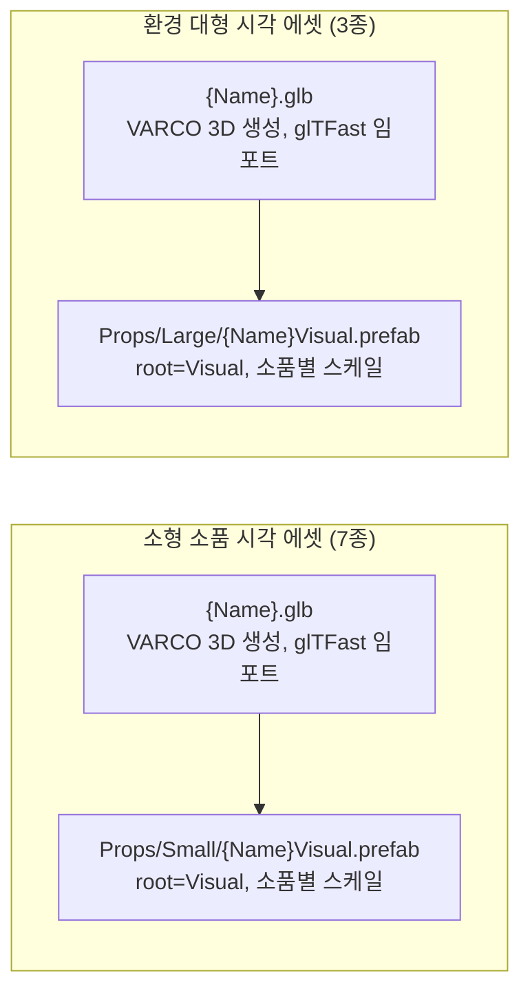

# 소품·환경 에셋 (소형 7종·대형 3종)

> 관련 이슈: #238 · #236 · 최종 수정: 2026-09-22

**이 문서는 로그다.** 이 기능을 고칠 때마다 갱신한다. 새 문서를 만들지 않는다.

## 무엇을 하는가

작업 6.25(#238)에서 씬 가장자리를 채우는 **소형 소품 7종**의 시각 에셋을 VARCO 3D로 생성했다.
랜턴·곡괭이·삽·경고 표지판·나무 팻말·밧줄·양동이 각각을
[CONCEPT_ART/README.md](../CONCEPT_ART/README.md)의 입력 이미지에서 `Generate3D` 로 `.glb` 를
뽑고, `Assets/Prefabs/Props/Small/{Name}Visual.prefab` 으로 분리 제작했다. 로직 컴포넌트가 없는
순수 시각 에셋이며, 씬 배치(6.26)에서 그대로 배치용 프리팹으로 쓰인다 — [광물 크리처 에셋](mineral-creature-assets.md)의
`MineCreatureXVisual.prefab` 과 같은 역할이다.

작업 6.23(#236)에서는 씬 가장자리를 구성하는 **환경 대형 3종**(갱도 입구·목책·자수정 군락)을
같은 방식으로 생성해 `Assets/Prefabs/Props/Large/{Name}Visual.prefab` 으로 제작했다. 이 이슈에서
소품 프리팹 폴더를 `Assets/Prefabs/Props/Small`·`Assets/Prefabs/Props/Large` 로 나누기로 정하고
(이슈 코멘트로 합의), 먼저 만들어져 있던 소형 소품 7종도 같이 옮겼다 — 자세한 내용은
[AGENTS.md](../../AGENTS.md) 폴더 표 참고.

## 왜 이 방법인가

| 검토한 방법 | 채택 | 이유 |
|---|---|---|
| README 원본 이미지를 그대로 `Generate3D` 에 연결 | ✅ (5종) | 랜턴·양동이를 제외한 5종은 첫 생성 결과가 사용자 검수를 그대로 통과했다 |
| 결과물이 마음에 안 들면 `EditImage` 로 반복 보정 후 재생성 | ✅ (랜턴·표지판·양동이) | ASSET_PIPELINE 2절 "이미지가 마음에 안 들면" 절차 그대로 — 사용자가 스크린샷으로 지적한 부분(느낌표 간격, 노란 판 위치, 물 색, 불꽃 표현)을 `referenceText` 로 반영해 여러 차례 재생성했다. 아래 "반복 보정 경위" 절 참고 |
| 양동이를 VARCO 3D 이미지 수정 → `Generate3D` 파이프라인으로 끝까지 진행 | ❌ | 사용자가 손잡이 제거 버전을 워크플로 밖에서 직접 만들어 별도 파일로 전달 — "워크플로에 있는 걸로 하는 게 아니다"라고 명시적으로 정정. 받은 `.glb` 를 그대로 `Bucket.glb` 로 사용 |
| `EditImage` 의 `model` 을 경제적 기본값(`nano-banana-1`)으로 사용 | ❌ → `gpt-image-2.5-flare` | 사용자가 "모델은 무조건 gpt image 2.5를 써"라고 명시적으로 지시. 자세한 내용은 세션 메모리 `feedback_varco_image_model` 참고 |
| 눕혀진 소품(곡괭이·밧줄)도 세워진 소품과 같은 Y축 높이 기준으로 스케일 | ❌ → 최대 치수 기준 | 곡괭이는 원본이 눕혀진 자세로 생성돼 `bounds.size.y` 가 0.18에 불과했다(대신 `depth` 가 1.00). Y높이만 기준 삼으면 곡괭이가 실제 크기의 1/5로 줄어든다. 눕혀진 소품은 가장 긴 치수를 기준으로 목표 크기에 맞췄다 |
| 갱도 입구를 원본 참고 이미지(레일이 안쪽 깊이 어둠 속으로 사라지는 구도) 그대로 `Generate3D` | ❌ | 6개를 반복 생성해도 매번 프레임이 뒤틀리고 바닥에 레일 파편이 흩어짐. 속이 빈 채 안쪽 깊이가 안 보이는("구멍이 있는") 형태는 사진 한 장에서 깊이를 복원하는 이 모델이 특히 취약한 케이스로 판단 |
| `EditImage` 로 안쪽 원근감만 줄이기 → 그래도 부족하면 안쪽을 완전 평면 벽으로 막기 | ✅ (최종 채택) | 원근감을 줄인 1차 보정도 여전히 옆면이 뒤틀렸다(사용자가 스크린샷에 빨간 원으로 지적). 안쪽을 깊이감 없는 완전 평평한 검은 벽 + 레일·침목 완전 삭제로 2차 보정한 뒤에야 6개 모두 안정적으로 나왔다. 자세한 경위는 아래 "반복 보정 경위" 참고 |
| 갱도 입구를 `GenerateImage` 로 완전히 새 컨셉(처음부터 통짜 블록 실루엣)으로 다시 그리기 | 검토했으나 미채택 | 사용자가 "3D 변환이 잘 되는 새 컨셉으로 만들어보라"고 요청해 시도했고 6개 모두 성공했지만, 최종적으로는 기존 사진을 보정한 "평면 막기" 버전이 채택됐다 |

## 구조

### 소형 소품 7종

| 에셋 | 경로 | 목표 치수(유닛) | 기준 축 | `localScale` | `localPosition.y` |
|---|---|---|---|---|---|
| `LanternVisual.prefab` | `Assets/Prefabs/Props/Small/` | 0.52 | height | 0.5211 | 0.0000 |
| `PickaxeVisual.prefab` | `Assets/Prefabs/Props/Small/` | 0.68 | depth (눕혀짐) | 0.6775 | 0.0000 |
| `ShovelVisual.prefab` | `Assets/Prefabs/Props/Small/` | 0.68 | height | 0.6956 | 0.0000 |
| `WarningSignVisual.prefab` | `Assets/Prefabs/Props/Small/` | 1.20 (크리처 1.5배) | height | 1.2013 | 0.0000 |
| `SignboardVisual.prefab` | `Assets/Prefabs/Props/Small/` | 0.72 | height | 0.7175 | 0.0000 |
| `RopeCoilVisual.prefab` | `Assets/Prefabs/Props/Small/` | 0.48 | width (지름, 눕혀짐) | 0.5077 | 0.0000 |
| `BucketVisual.prefab` | `Assets/Prefabs/Props/Small/` | 0.56 | height | 0.5614 | 0.2811 |

기준 크리처 높이(0.8유닛)에 대한 비율은 ASSET_PIPELINE 2절 "스케일 기준"을 따랐다 — 표지판(경고
표지판, WarningSign)은 이슈 DoD대로 1.5배, 나머지는 0.6~1배 범위 안에서 소품별 상대 크기를 반영해
정했다. `Renderer.bounds` 를 코드로 직접 측정해 계산했으며, 곡괭이·밧줄처럼 세로가 아니라 가로로
긴 소품은 `size.y` 대신 가장 긴 치수를 기준 삼았다 (표 "기준 축" 열 참고). `BucketVisual` 만
`localPosition.y` 가 0이 아닌데, 이 파일은 VARCO 출력이 아니라 사용자가 직접 만든 별도 `.glb`
라 `pivotToBottom` 내보내기 옵션이 적용되지 않아 피벗이 물체 중간에 있었기 때문이다 — 실측
`bounds.min.y` 만큼 끌어올렸다.

### 환경 대형 3종

| 에셋 | 경로 | 목표 치수(유닛) | 기준 축 | `localScale` | `localPosition.y` |
|---|---|---|---|---|---|
| `TunnelEntranceVisual.prefab` | `Assets/Prefabs/Props/Large/` | 2.40 (크리처 3배) | height | 2.7551 | 0.0000 |
| `FenceSectionVisual.prefab` | `Assets/Prefabs/Props/Large/` | 0.80 (크리처 1배) | height | 1.5658 | 0.0000 |
| `AmethystClusterVisual.prefab` | `Assets/Prefabs/Props/Large/` | 1.20 (크리처 1.5배) | height | 1.2007 | 0.0000 |

이슈 DoD가 지정한 배율(갱도 입구 3배·목책 1배·자수정 군락 1.5배)을 그대로 크리처 높이(0.8유닛)에
곱해 목표 치수를 정했다. 셋 다 세워진 형태라 height 기준, 바닥 피벗이라 `localPosition.y = 0`.
실측 결과 목표 치수와 오차 0.005유닛 이내로 일치했다 (예: 갱도 입구 2.4006, 목책 0.8000, 자수정
군락 1.1999).

### 이벤트

해당 없음 — 로직 컴포넌트가 없는 시각 에셋 프리팹.

### 읽는 밸런스 값

해당 없음.

## 반복 보정 경위

사용자가 VARCO 3D 워크플로 결과를 스크린샷으로 확인하며 다음을 지적해 `EditImage` 로 순차
보정했다 (모두 `gpt-image-2.5-flare` 모델):

- **경고 표지판**: 느낌표와 검은 테두리가 붙어 있어 간격을 띄움 → 노란 판이 기둥 맨 위에 붙어
  있어 아래로 내림 → 너무 많이 내려가서 다시 살짝 올림(3차 보정 후 확정)
- **양동이**: 물 안에 흰/모래색이 섞여 있어 파란 물로 통일 → 손잡이 그림자가 물 위에 갈색 줄로
  남아 있어 제거 → 이후 사용자가 손잡이 자체를 없앤 버전을 VARCO 3D에서 직접 만들어 파일로 전달,
  최종적으로 이 버전을 채택(워크플로 3D 산출물은 미사용)
- **랜턴**: 처음엔 유리 한쪽 면에만 불꽃이 있고 정적으로 보여 사방에 불빛이 보이도록, 더
  생동감 있게 보정 → 결과가 유리 전체를 불 텍스처로 덮어 오히려 부자연스러워, 중앙에 작은 촛불
  하나 + 사방으로 은은하게 퍼지는 빛으로 재보정 → 이 결과도 사용자가 원하던 모습이 아니라고
  판단해 워크플로에서 원본 이미지로 `Generate3D` 를 처음부터 다시 실행, 그 결과를 최종 채택
- **갱도 입구 (#236)**: 원본 이미지로 6개를 생성했지만 전부 프레임이 뒤틀리고 바닥에 레일
  파편이 흩어짐 → `EditImage` 로 "안쪽 깊이감·원근감을 줄이고 레일을 짧게 잘라 달라"고 1차
  보정 후 6개 재생성 → 사용자가 여전히 옆면이 뒤틀린 부분을 스크린샷에 빨간 원으로 짚어줌 →
  "안쪽을 깊이감 없는 완전 평평한 검은 벽으로 막고 레일·침목을 전부 지워 달라"고 2차 보정 →
  이번엔 6개 모두 안정적인 형태로 나와 3번째 결과를 최종 채택. 이 과정에서 "입구 위쪽에 곡괭이·삽
  X자 마크를 새겨 달라"는 추가 보정도 시도했고(마크 추가 버전), 별도로 처음부터 다시 그린 "새
  컨셉" 버전도 시도했지만, 최종적으로는 2차 보정(평면 막기, 마크 없음) 버전을 채택했다

## 검증

Unity 6000.3.21f1, 2026-09-22.

- [x] 7개 GLB 모두 glTFast 정상 임포트 확인(`manage_asset search` 로 `assetType=UnityEngine.GameObject`
  확인, 콘솔 임포트 오류·경고 0건)
- [x] `Renderer.bounds` 실측으로 7종 스케일 산출, 코드로 재측정해 목표 치수·바닥 피벗(`BucketVisual`
  제외 `minY=0.0000`) 확인
- [x] 7개 `{Name}Visual.prefab` 생성, 전부 `Shader Graphs/glTF-pbrMetallicRoughness` 셰이더 확인
  (분홍 머티리얼 아님)
- [ ] 곡괭이 손잡이가 -Z 를 향하는지 육안 확인 — 아직 스크린샷으로 확인하지 않음
- [x] 랜턴 머티리얼 Emission 켜 둠(`LanternEmissive.mat`, `emissiveTexture`=베이스 컬러 재사용, `emissiveFactor=(1, 0.65, 0.25)`) — `Object.Instantiate(srcMat)` 로 복제 후 정상 동작 확인(아래 "알려진 한계" 정정 참고). 정확한 밝기 수치 튜닝은 DoD대로 6.26에서 진행
- [ ] Play Mode 렌더 캡처로 7종 동시 육안 확인 — 미실시
- [x] 환경 대형 3종 GLB 모두 glTFast 정상 임포트 확인(`manage_asset search` 로 `assetType=UnityEngine.GameObject` 확인, 콘솔 임포트 오류·경고 0건)
- [x] `Renderer.bounds` 실측으로 3종 스케일 산출, 프리팹 생성 후 재측정해 목표 치수(2.4/0.8/1.2, 오차 0.005 이내)·바닥 피벗(`minY=0.0000`) 확인
- [x] 3개 `{Name}Visual.prefab` 생성, 전부 `Shader Graphs/glTF-pbrMetallicRoughness` 셰이더 확인 (분홍 머티리얼 아님)
- [x] 자수정 군락 머티리얼 Emission 켜 둠(`AmethystClusterEmissive.mat`, `emissiveTexture`=베이스 컬러 재사용, `emissiveFactor=(0.55, 0.25, 0.85)`) — `Object.Instantiate(srcMat)` 로 복제해 `occlusionTexture`/`metallicRoughnessTexture`/`normalTexture` 슬롯 정상 유지 확인. 정확한 밝기 수치 튜닝은 DoD대로 6.26에서 진행
- [ ] Play Mode 렌더 캡처로 3종 동시 육안 확인 — 미실시

## 알려진 한계

- **곡괭이 손잡이 방향(-Z) 은 코드 실측이 아니라 육안 확인이 필요하다.** 눕혀진 자세로 생성돼
  어느 쪽이 손잡이 끝인지 `Renderer.bounds` 만으로는 판별할 수 없었다. 6.26 배치 전에 Scene 뷰에서
  확인 필요.
- **양동이(`Bucket.glb`)는 VARCO 3D 생성물이지만 이 워크플로 세션 밖에서 사용자가 직접 만들어
  전달한 파일이다.** 워크플로 그래프에는 대응하는 노드가 없다 — 재현하려면 사용자에게 문의해야 한다.
- **정정**: 이전에는 이 절에 "랜턴 머티리얼을 스크립트로 편집하면 텍스처가 깨진다"고 적었으나,
  재조사 결과 그 백색 렌더링의 **진짜 원인은 VARCO 서버가 구운 baseColor 텍스처 자체가 손상돼
  있었던 것**이었다(위 "반복 보정 경위"·갱신 이력 참고). 다만 `new Material(srcMat)` /
  `CopyPropertiesFromMaterial` 로 복제했을 때 `occlusionTexture`/`metallicRoughnessTexture` 슬롯이
  실제로 비는 현상도 관찰됐다 — **`UnityEngine.Object.Instantiate(srcMat)` 로 복제하면 모든 텍스처
  슬롯이 정상 유지된다.** `Shader Graphs/glTF-pbrMetallicRoughness` 머티리얼을 스크립트로 복제할
  땐 `new Material()`이 아니라 `Object.Instantiate()` 를 쓴다.
- **VARCO 3D 의 `Generate3D` 결과물은 가끔 텍스처가 제대로 안 구워진 채로 나올 수 있다.** 랜턴에서
  실제로 baseColor PNG가 72바이트짜리 빈 이미지로 나온 사례가 있었다 — Unity에서 `assetType`·콘솔
  오류로는 드러나지 않고 텍스처가 1×1 플레이스홀더로 조용히 임포트된다. **`.glb` 를 임포트하기 전에
  임베드 이미지의 바이트 크기를 확인하는 습관을 들인다** — 정상적인 알베도/노멀 텍스처는 최소 수백KB는
  된다. 같은 참조 이미지로 `Generate3D` 를 재실행하면 대체로 해결된다.
- 랜턴 Emission, 프리팹 크기의 최종 미세조정은 6.26(씬 배치)에서 진행한다.
- 애니메이션·리깅은 이 작업 범위 밖이다(정적 메시).
- 공개 배포·상업적 이용 시 VARCO 라이선스 약관 재확인 필요 ([THIRD_PARTY.md](../THIRD_PARTY.md) 참고).
- **속이 빈 채 안쪽 깊이가 안 보이는 형태(문·터널처럼 구멍이 있는 실루엣)는 사진 한 장에서 3D를
  복원하는 `Generate3D` 가 특히 취약하다.** 참고 이미지에 원근감이 강한 안쪽 공간(예: 어둠 속으로
  사라지는 레일)이 있으면 모델이 안 보이는 깊이를 과하게 추측하다가 프레임이 뒤틀린다. 대응법은
  참고 이미지 자체를 손봐서 "안쪽이 실제로는 평평한 벽"인 것처럼 단순화하는 것 — `polygonCount`
  등 `Generate3D` 파라미터로는 해결되지 않았다. 갱도 입구가 이 사례다.
- 자수정 군락 Emission 밝기, 갱도 입구 프리팹 크기의 최종 미세조정은 6.26(씬 배치)에서 진행한다.

## 갱신 이력

| 날짜 | 이슈 | 누가 | 무엇이 바뀌었나 |
|---|---|---|---|
| 2026-09-22 | #238 | Claude | 최초 작성 — 소형 소품 7종 VARCO 3D 생성, 사용자 피드백으로 표지판·양동이·랜턴 반복 보정, 7개 Visual 프리팹 생성 |
| 2026-09-22 | #238 | Claude | 랜턴이 여전히 마음에 안 든다는 피드백으로 원본 이미지에서 `Generate3D` 재실행, `Lantern.glb`·`LanternVisual.prefab` 교체(스케일 0.5211→0.5205, 오차 무시 가능) |
| 2026-09-22 | #238 | Claude | 사용자가 이전에 확정했던 "촛불 하나 + 사방 은은한 빛" 버전 이미지를 다시 지목 — 이미 생성해 둔 그 이미지의 3D 메쉬(`Generate3D` 재실행 없이 기존 결과 재사용)로 `Lantern.glb` 복원 |
| 2026-09-22 | #238 | Claude | Emission 시도·롤백 — `baseColorTexture` 를 `emissiveTexture` 로 재사용하는 `LanternEmissive.mat` 을 스크립트(`execute_code`)로 만들었더니 `occlusionTexture`/`metallicRoughnessTexture` 연결이 깨지며 렌더링이 새하얗게 나옴(Game 씬에서 사용자가 발견). 원인은 이 커스텀 glTF Shader Graph 머티리얼이 Material Inspector GUI가 관리하는 내부 상태에 의존해서, 스크립트로 프로퍼티만 직접 건드리면 다른 텍스처 슬롯이 깨지는 것으로 보임. `LanternEmissive.mat` 삭제하고 임포트 그대로의 원본 머티리얼으로 롤백 — Emission은 스크립트로 자동화하지 않고 6.26에서 Material Inspector로 사람이 직접 설정한다 |
| 2026-09-22 | #238 | Claude | 롤백 후에도 흰색으로 나온다는 재보고로 재조사 — `.glb` 를 바이너리로 직접 파싱해 보니 `Material Inspector` 문제가 아니라 **그 특정 3D 결과물(task `1ed4dbca`) 자체의 baseColor PNG가 VARCO 서버에서 72바이트짜리 빈 이미지로 구워져 있었다**(정상이면 수백KB~1MB대). 같은 참조 이미지로 `Generate3D` 를 한 번 더 실행(task `d4be8132`), 다운로드 직후 파이썬으로 임베드 이미지 바이트 크기를 먼저 검증한 뒤(1.38MB/0.75MB/2.5MB, 정상) `Lantern.glb`·`LanternVisual.prefab` 교체 — 이번엔 `baseColorTexture` 1024×1024, `normalTexture` 2048×2048 정상 임포트 확인 |
| 2026-09-22 | #236 | Claude | 소품 프리팹 폴더를 `Assets/Prefabs/Props/Small`·`Props/Large` 로 분리하기로 이슈 코멘트로 합의, `AGENTS.md` 폴더 표 갱신, 기존 소형 소품 7종을 `Props/Small` 로 이동 (커밋 분리) |
| 2026-09-22 | #236 | Claude | 환경 대형 3종(갱도 입구·목책·자수정 군락) VARCO 3D 생성. 갱도 입구는 원본 이미지로 6회 생성해도 계속 뒤틀려 `EditImage` 로 2차례 보정(원근감 축소 → 안쪽 완전 평면화) 후 6개 모두 안정화, 3번째 결과를 최종 채택. 목책·자수정 군락은 원본 이미지 첫 생성 결과를 그대로 채택 |
| 2026-09-22 | #236 | Claude | 3종 `{Name}Visual.prefab` 생성 (`Props/Large/`), `Renderer.bounds` 실측으로 이슈 DoD 배율(3배·1배·1.5배)에 맞춰 스케일 계산. 자수정 군락에 `AmethystClusterEmissive.mat` 적용 — 랜턴 사례의 교훈(`Object.Instantiate(srcMat)` 로 복제)을 그대로 따라 텍스처 슬롯 깨짐 없이 적용 |
