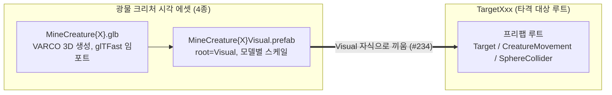

# 광물 크리처 3D 에셋 (철·구리·은·금·다이아몬드)

> 관련 이슈: #282, #247, #234, #37, #9 · 최종 수정: 2026-09-23

**이 문서는 로그다.** 이 기능을 고칠 때마다 갱신한다. 새 문서를 만들지 않는다.

## 무엇을 하는가

작업 6.6(#37)에서 타격 대상 4종의 시각 에셋을 **저금통(피기) 테마에서 광물 크리처 테마로
전면 교체**했고, 작업 6.21(#234)에서 광산 작업장 컨셉아트에 맞춰 그 4종을 **다시 생성해
디자인을 교체**했다. 현재 자산은 VARCO 3D로 생성한 모델
(`Assets/Models/MineCreature{Copper,Silver,Gold,Diamond}.glb`)을 glTFast로 임포트하고, 각각을
`Visual` 자식용 프리팹(`Assets/Prefabs/MineCreature{...}Visual.prefab`)으로 분리 제작해 4개의
`Assets/Prefabs/Targets/TargetXxx.prefab` 의 `Visual` 자식에 끼운 것이다. 뾰족한 실루엣이던
구(舊) `MineralCreature*` 세트는 "조가비 + 광물 로브"의 둥근 실루엣으로 교체됐다 — 4종이 같은
형태 언어를 공유하고 색·광물 종류로만 구분된다.

**저금통(피기) 방향은 폐기했다.** [저금통 3D 에셋](piggy-normal-asset.md) 문서가 다루던
`PiggyNormalVisual.prefab` 은 `TargetNormal` 에서 이미 빠졌고, 남은 파편·코인 그레이박스는
피기 테마와 무관하게 그대로 유효하다 — 자세한 경위는 해당 문서의 정정 표기 참고.

### HP 기준 매핑

내구도(`targets.csv` 의 `hp`)가 약할수록 저가치 광물, 강할수록 고가치 광물을 붙였다.

| `_targetId` | HP | 광물 |
|---|---|---|
| `runner` | 1 | Copper (구리) |
| `normal` | 3 | Silver (은) |
| `tourist` | 10 | Gold (금) |
| `anchor` | 12 | Diamond (다이아몬드) |

**#247 재배정 (2026-09-23)** — HP 가 아니라 **해금 순서(= 가치)** 로 광물 등급을 맞췄다. 위 표는 이력으로 남긴다.

| 해금 | `_targetId` | 외형 | 비고 |
|---|---|---|---|
| 1 | `normal` | Iron (검정 철광석) | #282 에서 임시 `PiggyNormalVisual` 을 교체 |
| 2 | `tourist` | Copper (구리) | |
| 3 | `anchor` | Silver (은) | |
| 4 | `pinata` | Gold (금) | #292 그레이박스 교체, 그레이박스 재질 삭제 |
| 5 | `angry` | Diamond (다이아몬드) | `TargetAnchor` 복제로 생성 |
| — | `runner` | Copper (구리) | 해금 목록에서 제외. 프리팹은 남김 |

## 왜 이 방법인가

| 검토한 방법 | 채택 | 이유 |
|---|---|---|
| 저금통(피기) 테마 유지, `Anchor`/`Runner`/`Tourist` 도 피기 파생으로 제작 | ❌ | 팀 논의 결과 광물 크리처 방향으로 전환 확정. VARCO 3D로 4종이 이미 생성되어 있었다 |
| HP 기준으로 광물 등급 매핑 (약함→저가치, 강함→고가치) | ✅ | 플레이어가 "비싼 걸 부쉈다"는 직관을 얻는다. 임의 배정보다 읽기 쉽다 |
| PR #208(피기 전용, `TargetNormal` 만)을 머지 후 별도 PR로 나머지 교체 | ❌ | 사용자가 "머지하지 않고 이 브랜치에서 광물로 교체해 다시 올림"으로 명시적으로 지시. 미완성 피기 배선이 `Develop` 에 들어가지 않는다 |
| 모델마다 스케일·오프셋을 `Renderer.bounds` 로 개별 실측 | ✅ | 4개 모델의 원본 크기·피벗이 제각각이라(구리 raw height 0.91, 은 1.00, 금 0.97, 다이아 1.02) 공통 배율을 가정하면 어긋난다. 저금통 때는 1종뿐이라 문제되지 않았다 |
| 높이 기준 0.4유닛 유지(저금통 기준 그대로 승계) | ❌ → 0.8로 정정 | 실측/Play Mode 확인 결과 조준 원(지름 0.9유닛)보다 눈에 띄게 작아 조준감이 떨어진다는 사용자 피드백. 아래 "스케일 재조정" 절 참고 |

## 구조

| 에셋 | 경로 | 높이(유닛) | `localScale` | `localPosition.y` |
|---|---|---|---|---|
| `MineCreatureIronVisual.prefab` | `Assets/Prefabs/` | 0.65 | 루트 0.8125 × 모델 0.8027 | 0.0000 |
| `MineCreatureCopperVisual.prefab` | `Assets/Prefabs/` | 0.8 | 0.7970 | 0.0000 |
| `MineCreatureSilverVisual.prefab` | `Assets/Prefabs/` | 0.8 | 0.7954 | 0.0000 |
| `MineCreatureGoldVisual.prefab` | `Assets/Prefabs/` | 0.8 | 0.7979 | 0.0000 |
| `MineCreatureDiamondVisual.prefab` | `Assets/Prefabs/` | 0.8 | 0.8030 | 0.0000 |

스케일 산출 방식은 이전 `MineralCreature*` 세트와 동일하다 — glTFast에는 임포트 시점 스케일
필드가 없으므로(ASSET_PIPELINE 2절) `Visual` 프리팹 루트에서 조정한다. 4종 각각 `Renderer.bounds`
를 코드로 직접 측정해 목표 높이(0.8유닛)에 맞는 균일 스케일을 계산했다. **이번 세트는 Y 오프셋이
4종 전부 0.0000이다** — VARCO 다운로드 시 `pivotToBottom=true` 로 내보내 모델 피벗이 이미 바닥에
있기 때문에(구 세트는 이 옵션 없이 받아 오프셋을 별도 계산해야 했다), 별도 절 참고.

### 이벤트

해당 없음 — 로직 컴포넌트가 없는 시각 에셋 프리팹.

### 읽는 밸런스 값

| CSV | 열 | 쓰는 곳 |
|---|---|---|
| `economy.csv` | `reticle_radius` | 스케일 기준을 정할 때 조준 원 크기와 비교하는 참고값(코드에서 직접 읽지는 않음) |

## 스케일 재조정 — 0.4 → 0.8 (2026-09-21)

최초 배선(높이 0.4유닛, 저금통과 동일 기준)을 Play Mode 스크린샷으로 확인시켰더니, 사용자가
"망치 조준 원 안에 들어와야 하는데 지금은 너무 작다"고 지적했다. 계산해 보니 실제로 근거가 있었다.

- 조준 원 지름 = `economy.csv` 의 `reticle_radius`(0.45) × 2 = **0.9유닛**
- 0.4유닛 높이 기준 대상의 실측 밑변 폭은 약 0.3~0.37유닛 — 원의 **40%** 밖에 못 채움

높이 기준을 0.8유닛으로 올리고 4종 전부 `Renderer.bounds` 재실측으로 스케일·오프셋을 다시
산출했다. `Transform.localScale` 은 원점 기준 선형 변환이라 스케일을 정확히 2배 하면 오프셋도
정확히 2배가 되는데, 실측값이 이론과 정확히 일치했다(예: Diamond 오프셋 0.2000 → 0.4000).

Play Mode 에서 실제 스폰된 `TargetNormal(Clone)` 의 `Renderer.bounds` 를 다시 측정한 결과 밑변
0.746×0.600유닛, 높이 0.800유닛 — 조준 원 지름(0.9) 대비 약 **83%** 를 채운다.

이 재조정으로 `hit-targets.md`·`ASSET_PIPELINE.md` 의 "0.4유닛" 기준이 전부 **0.8유닛**으로
바뀌었다. `PiggyNormalVisual.prefab` 은 이제 어디에서도 참조되지 않으므로 이 표준 변경의
영향을 받지 않는다(폐기된 에셋).

## 재생성 — MineralCreature → MineCreature (2026-09-22, #234)

광산 작업장 컨셉아트([docs/CONCEPT_ART](../CONCEPT_ART/README.md))가 확정되면서, 뾰족한 실루엣의
구(舊) `MineralCreature*` 4종을 "조가비 + 광물 로브" 형태의 `MineCreature*` 4종으로 다시 생성해
전면 교체했다. HP 기준 매핑(Copper=runner, Silver=normal, Gold=tourist, Diamond=anchor)과 목표
높이(0.8유닛)는 이전과 동일 — 실루엣과 자산 이름만 바뀌었다.

- **입력 이미지는 재생성하지 않았다.** `docs/CONCEPT_ART/PROMPTS.md` 에서 이미 승인된 컨셉아트
  이미지 URL을 그대로 VARCO 3D `Generate3D` 노드에 연결해 4종을 한 워크플로에서 생성했다
  (설정은 ASSET_PIPELINE 2절 표 그대로: `polygonCount=1500`, `topology=tri`, `usePbrTexture=1`
  등 — "바꾸지 않는다" 규칙 준수).
- **Y 오프셋이 4종 전부 0이 된 이유**: 다운로드 시 `get_output_downloads` 의 `pivotToBottom=true`
  옵션으로 받아, glb 자체의 피벗이 이미 모델 밑면에 있다. 구 세트는 이 옵션 없이 받아서 밑면이
  원점에서 떠 있었고, 그래서 `Visual` 프리팹에 별도 `localPosition.y` 보정이 필요했다. 스케일만
  적용하면 밑면이 자동으로 `y=0` 에 닿으므로, 이번엔 코드로 `Renderer.bounds.min.y` 를 직접 재확인해
  실제로 0에 닿는지 검증하는 절차만 유지했다(계산상 우연이 아니라 export 옵션 차이).
- **Target 프리팹 교체는 YAML 수동 편집이 아니라 Unity API로 했다** —
  `PrefabUtility.LoadPrefabContents` 로 각 `TargetXxx.prefab` 을 열어 기존 `Visual` 자식을 지우고
  새 `MineCreature{X}Visual.prefab` 인스턴스를 그 자리(로컬 좌표 identity)에 붙인 뒤,
  `Target._visual` (`Transform` 필드)을 `SerializedObject` 로 새 자식에 재연결하고
  `SaveAsPrefabAsset` 으로 덮어썼다. fileID 를 손으로 맞출 필요가 없어 참조가 끊길 위험이 없다.
- 구 에셋(`MineralCreature{Copper,Silver,Gold,Diamond}.glb`,
  `MineralCreature{...}Visual.prefab`, 총 8개 + `.meta`)은 Unity Project 창 기준으로 삭제했다.
  `PiggyFragment01~08.glb` 와 코인 그레이박스는 이 정리와 무관하게 유효하므로 건드리지 않았다.

## 검증

Unity 6000.3.21f1, 2026-09-22.

- [x] 4개 GLB(`MineCreature{Copper,Silver,Gold,Diamond}.glb`) 모두 glTFast 정상 임포트 확인
  (`manage_asset get_info` 로 GUID·`assetType` 확인, 콘솔 임포트 오류 0건)
- [x] `Renderer.bounds` 실측으로 4종 스케일 산출 (목표 높이 0.8유닛), 오프셋은 전부 0.0000
- [x] 4개 `MineCreature{X}Visual.prefab` 생성 후 4개 `TargetXxx.prefab` 의 `Visual` 자식 교체,
  `Target._visual` 참조가 새 자식을 정확히 가리키는지 코드로 확인
- [x] Play Mode 진입 → `CreatureManager` 가 스폰한 인스턴스(`FindObjectsByType<Target>`)의
  렌더러·셰이더(`Shader Graphs/glTF-pbrMetallicRoughness`, 분홍 머티리얼 아님) 확인 — 이 짧은
  런에서는 Normal/Anchor만 스폰되어 Runner/Tourist는 스폰 장면을 못 봄
- [x] 4개 `TargetXxx.prefab` 을 직접 `InstantiatePrefab` 으로 강제 생성해 4종 **전부** 렌더러 1개·
  glTF PBR 셰이더·높이 0.800·바닥 `minY=0.000` 확인 (스폰 타이밍에 의존하지 않는 결정적 검증)
- [x] 콘솔 오류·경고 0건 (Play 진입 전/종료 후, 구 에셋 삭제 후 각각 재확인)
- [x] Play Mode 진입 후 `Camera.main` 을 `RenderTexture` 로 렌더링해 PNG로 캡처, 직접 육안 확인 —
  Copper(주황빛 로브)·Silver(회색 로브)·Gold(황금빛 로브)·Diamond(분홍-회색 로브) 4종 전부 동시에
  스폰된 장면에서 "조가비 + 광물 로브"의 공통 실루엣과 종별 색 구분이 컨셉아트 의도대로 보임.
  분홍 머티리얼(임포트 실패 시 나타나는 증상) 없음, 바닥 밀착·조준 원 대비 크기도 정상

## 철광석 추가 — 일반형 외형 (2026-09-23, #282)

#247 재배정으로 일반형이 임시 기본 저금통을 쓰고 있었다. 5번째 광물로 **검정 철광석**을 같은 골격으로 추가했다.

- 입력 이미지: 구리 원형(P-25 v6)을 source 로 색 변형 골격에 재질만 바꾼 **P-35** (nano-banana-2, 1회 채택).
  로브와 껍질이 둘 다 검으면 로브가 묻히므로 껍질을 로브보다 한 톤 **밝은** 슬레이트 회색으로 지정했다
  — 다른 종은 껍질이 로브보다 어둡다.
- Generate3D 는 **`generateTexture=1` 을 명시해야 텍스처가 붙는다.** MCP 로 노드를 만들 때 이 값을 빼면
  기본값이 꺼짐이라 회색 메시만 나온다(첫 시도가 그랬다).
- 두 번째 시도는 텍스처는 붙었지만 노드 `topology` 가 `quad` 로 바뀌어 있어 사각면 1,500개가 삼각형
  4,058개로 쪼개졌다(완료 기준 1,000~2,000 초과). **`tri` 로 되돌려 세 번째로 생성한 결과를 채택했다** —
  삼각형 1,500개, 베이스컬러 1024px, `pivotToBottom=true` 로 받아 raw 높이 0.9967, 바닥 0.
- `TargetNormal` 은 다른 종과 달리 `Visual` 이 빈 GameObject 이고 그 아래 모델 프리팹이 붙는 구조
  (ASSET_PIPELINE 1절)라, `Visual` 아래 `PiggyNormalVisual` 인스턴스만 지우고 `MineCreatureIronVisual`
  인스턴스를 붙였다. 루트·`Target`·콜라이더·`_targetId`·프리팹 GUID 는 그대로다.
- 작업 중 Develop 에 들어온 #313(6.26)이 타격 대상 높이를 **0.8 → 0.65** 로 낮췄다. 이슈 본문의 0.8 대신
  현재 `TargetChecks.TargetHeight`(0.65)에 맞췄다. 스케일은 #313 이 다른 4종에 쓴 방식을 그대로 따른다 —
  모델 자식은 0.8 높이 정규화 값(0.8027), `Visual` 프리팹 루트에 0.65/0.8 = 0.8125. 위 표의 다른 4종
  `localScale` 은 모델 자식 값이며 루트에는 모두 0.8125 가 곱해져 있다.

## 알려진 한계

- **피기 방향으로 만들었던 `PiggyNormalVisual.prefab`·`PiggyNormal.glb` 는 이제 어디에서도
  참조되지 않는다.** 삭제 여부는 별도 정리 이슈에서 판단한다 — 파편(`PiggyFragment01~08.glb`)과
  코인 그레이박스는 저금통 테마와 무관하게(파괴 연출용) 유효하므로 같이 지우면 안 된다.
- 파괴 연출(작업 6.3)은 여전히 없다. 부서지면 오브젝트가 사라지는 정도이며, 광물 특유의 파편
  연출(예: 결정 조각)은 이 작업 범위 밖이다.
- 애니메이션·리깅은 이 작업 범위 밖이다(정적 메시).
- 공개 배포·상업적 이용 시 VARCO 라이선스 약관 재확인 필요 ([THIRD_PARTY.md](../THIRD_PARTY.md) 참고).

## 갱신 이력

| 날짜 | 이슈 | 누가 | 무엇이 바뀌었나 |
|---|---|---|---|
| 2026-09-21 | #37 | Claude | 최초 작성 — 저금통 방향 철회, 광물 크리처 4종으로 전면 교체. HP 기준 매핑, 모델별 스케일 실측(0.4유닛 기준) |
| 2026-09-21 | #37 | Claude | 조준 원 대비 너무 작다는 사용자 피드백으로 높이 기준 0.4 → 0.8유닛 재조정, 4종 재실측 |
| 2026-09-22 | #234 | Claude | 광산 작업장 컨셉아트에 맞춰 `MineralCreature*` → `MineCreature*` 로 4종 재생성·전면 교체. `pivotToBottom` 옵션으로 Y 오프셋 전부 0, 구 에셋 8개 삭제. Play Mode 렌더 캡처로 4종 동시 육안 확인 완료 |
| 2026-09-23 | #247 | saltlake00 | 해금 순서 기준 재배정 — 일반=임시 기본 저금통, 회복=구리, 거치=은, 피냐타=금, 화난 저금통=다이아. `TargetAngry` 추가 |
| 2026-09-23 | #282 | Claude | 검정 철광석 `MineCreatureIron` 생성(P-35), 일반형 `Visual` 자식을 임시 저금통에서 교체. 세 번째 생성본(tri·텍스처) 채택. #313 의 높이 기준 0.65 에 맞춰 다른 4종처럼 루트 0.8125 × 모델 0.8027, 바닥 0, TargetChecks 통과 |
