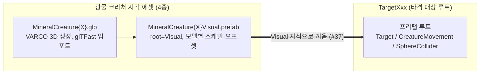

# 광물 크리처 3D 에셋 (구리·은·금·다이아몬드)

> 관련 이슈: #37, #9 · 최종 수정: 2026-09-21

**이 문서는 로그다.** 이 기능을 고칠 때마다 갱신한다. 새 문서를 만들지 않는다.

## 무엇을 하는가

작업 6.6(#37)에서 타격 대상 4종의 시각 에셋을 **저금통(피기) 테마에서 광물 크리처 테마로
전면 교체**했다. VARCO 3D로 생성한 모델(`Assets/Models/MineralCreature{Copper,Silver,Gold,
Diamond}.glb`)을 glTFast로 임포트하고, 각각을 `Visual` 자식용 프리팹
(`Assets/Prefabs/MineralCreature{...}Visual.prefab`)으로 분리 제작해 4개의
`Assets/Prefabs/Targets/TargetXxx.prefab` 의 `Visual` 자식에 끼웠다.

**저금통(피기) 방향은 폐기했다.** [저금통 3D 에셋](piggy-normal-asset.md) 문서가 다루던
`PiggyNormalVisual.prefab` 은 `TargetNormal` 에서 이미 빠졌고, 남은 파편·코인 그레이박스는
피기 테마와 무관하게 그대로 유효하다 — 자세한 경위는 해당 문서의 정정 표기 참고.

### HP 기준 매핑

내구도(`targets.csv` 의 `hp`)가 약할수록 저가치 광물, 강할수록 고가치 광물을 붙였다.

| `_targetId` | HP | 광물 |
|---|---|---|
| `runner` | 1 | Copper (구리) |
| `normal` | 3 | Silver (은) |
| `tourist` | 10 | Gold (금) |
| `anchor` | 12 | Diamond (다이아몬드) |

## 왜 이 방법인가

| 검토한 방법 | 채택 | 이유 |
|---|---|---|
| 저금통(피기) 테마 유지, `Anchor`/`Runner`/`Tourist` 도 피기 파생으로 제작 | ❌ | 팀 논의 결과 광물 크리처 방향으로 전환 확정. VARCO 3D로 4종이 이미 생성되어 있었다 |
| HP 기준으로 광물 등급 매핑 (약함→저가치, 강함→고가치) | ✅ | 플레이어가 "비싼 걸 부쉈다"는 직관을 얻는다. 임의 배정보다 읽기 쉽다 |
| PR #208(피기 전용, `TargetNormal` 만)을 머지 후 별도 PR로 나머지 교체 | ❌ | 사용자가 "머지하지 않고 이 브랜치에서 광물로 교체해 다시 올림"으로 명시적으로 지시. 미완성 피기 배선이 `Develop` 에 들어가지 않는다 |
| 모델마다 스케일·오프셋을 `Renderer.bounds` 로 개별 실측 | ✅ | 4개 모델의 원본 크기·피벗이 제각각이라(구리 raw height 0.91, 은 1.00, 금 0.97, 다이아 1.02) 공통 배율을 가정하면 어긋난다. 저금통 때는 1종뿐이라 문제되지 않았다 |
| 높이 기준 0.4유닛 유지(저금통 기준 그대로 승계) | ❌ → 0.8로 정정 | 실측/Play Mode 확인 결과 조준 원(지름 0.9유닛)보다 눈에 띄게 작아 조준감이 떨어진다는 사용자 피드백. 아래 "스케일 재조정" 절 참고 |

## 구조

| 에셋 | 경로 | 높이(유닛) | `localScale` | `localPosition.y` |
|---|---|---|---|---|
| `MineralCreatureCopperVisual.prefab` | `Assets/Prefabs/` | 0.8 | 0.8809 | 0.4000 |
| `MineralCreatureSilverVisual.prefab` | `Assets/Prefabs/` | 0.8 | 0.8001 | 0.4031 |
| `MineralCreatureGoldVisual.prefab` | `Assets/Prefabs/` | 0.8 | 0.8212 | 0.3984 |
| `MineralCreatureDiamondVisual.prefab` | `Assets/Prefabs/` | 0.8 | 0.7868 | 0.4000 |

스케일·오프셋 산출 방식은 [저금통 3D 에셋](piggy-normal-asset.md) 문서와 동일하다 — glTFast에는
임포트 시점 스케일 필드가 없으므로(ASSET_PIPELINE 2절) `Visual` 프리팹 루트에서 조정한다. 다만
저금통은 모델이 1종이라 배율을 손으로 정했지만, 여기서는 4종 각각 `Renderer.bounds` 를 코드로
직접 측정해 목표 높이에 맞는 스케일과, 바닥(`y=0`)에 밑면이 닿도록 하는 Y 오프셋을 계산했다.

### 이벤트

해당 없음 — 로직 컴포넌트가 없는 시각 에셋 프리팹.

### 읽는 밸런스 값

| CSV | 열 | 쓰는 곳 |
|---|---|---|
| `economy.csv` | `reticle_radius` | 스케일 기준을 정할 때 조준 원 크기와 비교하는 참고값(코드에서 직접 읽지는 않음) |

## 스케일 재조정 — 0.4 → 0.8 (2026-09-21)

최초 배선(높이 0.4유닛, 저금통과 동일 기준)을 Play Mode 스크린샷으로 확인시켰더니, 사용자가
"망치 조준 원 안에 들어와야 하는데 지금은 너무 작다"고 지적했다. 계산해 보니 실제로 근거가 있었다.

- 조준 원 지름 = `economy.csv` 의 `reticle_radius`(0.45) × 2 = **0.9유닛**
- 0.4유닛 높이 기준 대상의 실측 밑변 폭은 약 0.3~0.37유닛 — 원의 **40%** 밖에 못 채움

높이 기준을 0.8유닛으로 올리고 4종 전부 `Renderer.bounds` 재실측으로 스케일·오프셋을 다시
산출했다. `Transform.localScale` 은 원점 기준 선형 변환이라 스케일을 정확히 2배 하면 오프셋도
정확히 2배가 되는데, 실측값이 이론과 정확히 일치했다(예: Diamond 오프셋 0.2000 → 0.4000).

Play Mode 에서 실제 스폰된 `TargetNormal(Clone)` 의 `Renderer.bounds` 를 다시 측정한 결과 밑변
0.746×0.600유닛, 높이 0.800유닛 — 조준 원 지름(0.9) 대비 약 **83%** 를 채운다.

이 재조정으로 `hit-targets.md`·`ASSET_PIPELINE.md` 의 "0.4유닛" 기준이 전부 **0.8유닛**으로
바뀌었다. `PiggyNormalVisual.prefab` 은 이제 어디에서도 참조되지 않으므로 이 표준 변경의
영향을 받지 않는다(폐기된 에셋).

## 검증

Unity 6000.3.21f1, Play Mode, 2026-09-21.

- [x] 4개 GLB 모두 glTFast 정상 임포트 확인 (`manage_asset get_info` 로 GUID·`assetType` 확인, 콘솔
  임포트 오류 0건)
- [x] `Renderer.bounds` 실측으로 모델별 스케일·오프셋 산출(1차 0.4유닛, 2차 0.8유닛 재조정)
- [x] `manage_prefabs get_hierarchy` 로 4개 `TargetXxx.prefab` 전부 `Visual` 자식이 해당
  `MineralCreature*Visual` 하나뿐임을 확인
- [x] Play Mode 진입 → 일시정지 → 스크린샷으로 Silver/Gold/Diamond 3종 직접 육안 확인(올바른
  스케일, 바닥 밀착, 정상 머티리얼). Copper/Runner 는 해당 짧은 런에서 스폰되지 않아 구조
  검증만 완료 — 나머지 3종과 동일한 방식으로 생성·배선했으므로 다음 검증 세션에서 확인 권장
- [x] 콘솔 오류·경고 0건(MCP 포트 재연결 로그만 존재), `NotifyBeginRun` → 스폰 → `Running ->
  Result` 까지 정상 진행 확인
- [x] `Target._visual` 필드가 여전히 `Visual` GameObject 를 가리켜 로직 참조 안 깨짐 확인
- [ ] TargetRunner/Copper 의 실제 스폰 장면 육안 확인 — **미검증**, 구조 검증만 완료

## 알려진 한계

- **피기 방향으로 만들었던 `PiggyNormalVisual.prefab`·`PiggyNormal.glb` 는 이제 어디에서도
  참조되지 않는다.** 삭제 여부는 별도 정리 이슈에서 판단한다 — 파편(`PiggyFragment01~08.glb`)과
  코인 그레이박스는 저금통 테마와 무관하게(파괴 연출용) 유효하므로 같이 지우면 안 된다.
- TargetRunner/Copper 는 이번 세션의 짧은 Play Mode 검증에서 실제 스폰 장면을 보지 못했다.
- 파괴 연출(작업 6.3)은 여전히 없다. 부서지면 오브젝트가 사라지는 정도이며, 광물 특유의 파편
  연출(예: 결정 조각)은 이 작업 범위 밖이다.
- 공개 배포·상업적 이용 시 VARCO 라이선스 약관 재확인 필요 ([THIRD_PARTY.md](../THIRD_PARTY.md) 참고).

## 갱신 이력

| 날짜 | 이슈 | 누가 | 무엇이 바뀌었나 |
|---|---|---|---|
| 2026-09-21 | #37 | Claude | 최초 작성 — 저금통 방향 철회, 광물 크리처 4종으로 전면 교체. HP 기준 매핑, 모델별 스케일 실측(0.4유닛 기준) |
| 2026-09-21 | #37 | Claude | 조준 원 대비 너무 작다는 사용자 피드백으로 높이 기준 0.4 → 0.8유닛 재조정, 4종 재실측 |
