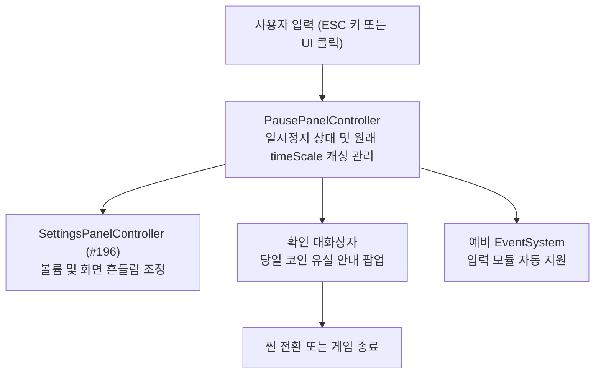

# 일시정지 패널

> 관련 이슈: #192, #196 · 최종 수정: 2026.09.21

**이 문서는 로그다.** 이 기능을 고칠 때마다 갱신한다. 새 문서를 만들지 않는다.

## 무엇을 하는가

Game 씬에서 ESC 키 입력 시 게임을 일시정지하고 모달 창을 표시한다.
Time.timeScale 을 0 으로 만들어 게임 진행을 멈추고, 계속하기 버튼 또는 ESC 키 재입력 시 정지 직전의 원래 timeScale 로 안전하게 복원한다.
설정 패널(#196)을 자식 프리팹으로 포함 조립하여 일시정지 중 볼륨과 화면 흔들림을 조정할 수 있다.
메인 메뉴 이동 및 게임 종료 선택 시 당일 코인 유실 경고 확인창을 거친 뒤 실행한다.
퍼크 선택이 진행 중일 때는 ESC 입력을 차단하여 상태 꼬임을 방지한다.

## 왜 이 방법인가

검토한 방법 및 결정 사유:

* 원래 시간 복원 방식:
  채택: 일시정지 진입 직전의 Time.timeScale 값을 _timeScaleBeforePause 에 캐싱하고 복귀 시 복원.
  이유: 고정값 1.0f 로 복원하면 피버 모드나 슬로우 모션 등의 배속 상태가 강제로 덮어씌워져 게임 규칙이 깨진다.

* 설정 패널(#196) 조립 방식:
  채택: SettingsPanel 프리팹을 PausePanel 프리팹의 자식으로 인스턴스화하여 조립 배치.
  이유: Game 씬에 별도 인스턴스를 중복 생성하지 않고, 일시정지 화면 내부에서 독립적인 레이어로 활성화/비활성화 제어가 용이하다.

* 설정 패널 닫힘 감지:
  채택: SettingsPanelController 에 Closed 액션 이벤트를 추가하고 PausePanelController 가 이를 구독하여 메인 상자를 재활성화.
  이유: 설정 패널 내부 로직을 직접 침범하지 않고 느슨한 결합으로 자연스럽게 화면 복귀를 동기화한다.

* 퍼크 선택 중 ESC 차단:
  채택: BillManager.Instance?.OfferedPerkIds 배열이 존재할 때 ESC 키 무시.
  이유: 퍼크 선택창이 뜬 상태에서 일시정지가 중복 활성화되면 UI 포커스와 시간 제어가 꼬이므로 원천 차단한다.

* 확인 대화상자 안전 흐름:
  채택: 메인 메뉴 이동 또는 게임 종료 시 즉시 실행하지 않고 코인 유실 경고 팝업을 거친 뒤 Time.timeScale 복원 후 씬 전환 또는 종료.
  이유: 오작동으로 인한 유저의 진행 데이터 손실을 방지하고 timeScale 정지 상태가 다음 씬에 잔류하는 현상을 방지한다.

* 예비 EventSystem 지원:
  채택: EventSystem 이 씬에 없을 때를 대비하여 비활성화된 예비 EventSystem 을 프리팹에 내장하고 런타임에 필요 시 활성화.
  이유: Game 씬 그레이박스 단계나 독립 테스트 환경에서도 클릭 입력이 누락되지 않도록 안전장치를 제공한다.

## 구조

구성 요소:

* PausePanelController
  경로: Assets/Scripts/Runtime/UI/PausePanelController.cs
  역할: ESC 입력 감지, Time.timeScale 정지 및 복원, 설정 패널 및 확인 대화상자 전환 제어, 예비 EventSystem 수명 관리

* SettingsPanelController (#196 연동)
  경로: Assets/Scripts/Runtime/UI/SettingsPanelController.cs
  역할: 오디오 볼륨 및 환경설정 UI 제어, Closed 이벤트 발행

* PausePanel.prefab
  경로: Assets/Prefabs/Resources/UI/PausePanel.prefab
  역할: 1920x1080 불투명 단색 팔레트 UI 프리팹 (SettingsPanel 포함)

* PausePanelPrefabCreator
  경로: Assets/Scripts/Editor/PausePanelPrefabCreator.cs
  역할: 에디터 메뉴 NCAI/UI/일시정지 패널 프리팹 생성 스크립트

* PausePanelUiChecks
  경로: Assets/Scripts/Editor/PausePanelUiChecks.cs
  역할: 프리팹 배선, 시간 정지 및 복원, 확인 팝업 흐름, 설정 패널 조립 흐름 자동 검증

### 이벤트

* OnSettingsRequested
  발행: PausePanelController
  시점: 설정 버튼 클릭 시 외부 알림용

* Closed
  발행: SettingsPanelController
  구독: PausePanelController
  시점: 설정 패널 닫힐 때 일시정지 메인 상자 복귀용

## 검증

Unity 6000.3.21f1 에디터 환경 검증 결과:

* 컴파일 에러 0건 확인 완료
* PausePanelUiChecks.RunBatch() 실행 통과 (총 15개 검사항목 PASS)
  1. 프리팹 배선 및 필수 컴포넌트 연결 검증 통과
  2. 일시정지 시 Time.timeScale = 0 및 원래 값 정확한 복원 검증 통과
  3. 확인 대화상자 오픈, 취소 시 복귀, 승인 시 timeScale 복원 및 분기 검증 통과
  4. 설정 패널 오픈 시 메인 패널 숨김, ESC 입력 시 설정 패널 우선 닫힘, Closed 이벤트 수신 시 메인 패널 복귀 검증 통과
* UiGuidelineChecks.RunBatch() 실행 통과 (UI 프리팹 8종 321개 항목 검사 완료)
* ValidationRunner.RunAll() 전체 검증 하네스 일괄 실행 통과

## 알려진 한계

* 자식으로 내장된 SettingsPanel 내부의 리셋 확인 다이얼로그 버튼 높이가 30px 로 제작되어 있어 UI 가이드 권장 기준(44px)에 대한 경고가 검출됨 (#196 패널 원본과 동일 이슈). 일시정지 자체 버튼들은 56px 이상으로 규격 충족.

## 갱신 이력

* 2026.09.21 (이슈 #192, 계획 6.13): 최초 작성 및 설정 패널(#196) 조립 연동 완료.
* 2026.09.21 (피드백 반영): 중간 컨테이너를 제거하고 childControlHeight = true 적용으로 구분선 두께(2px) 및 버튼 정렬 정밀화, 설정 버튼 노출 및 화면 겹침 버그 해결.
