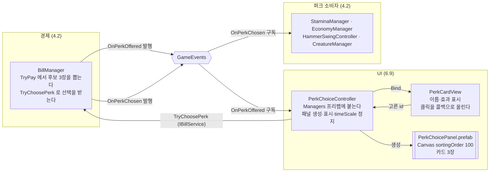

# 퍼크 3장 선택 화면

> 관련 이슈: #92 · 최종 수정: 2026-09-18

**이 문서는 로그다.** 이 기능을 고칠 때마다 갱신한다. 새 문서를 만들지 않는다.

## 무엇을 하는가

납부 직후 나온 퍼크 후보 3장을 띄우고, 한 장을 고를 때까지 게임을 멈춘다.

**후보를 뽑는 쪽은 [고지서](billing.md)(4.2)**, **고른 효과를 적용하는 쪽은 [퍼크 효과](perks.md)**
다. 이 문서는 그 사이의 화면만 다룬다 — 제시와 선택 입력이 전부다.

## 왜 이 방법인가

| 검토한 방법 | 채택 | 이유 |
|---|---|---|
| Managers 프리팹의 컨트롤러가 패널을 지연 생성 | ✅ | 씬·남의 프리팹을 건드리지 않으면서 **자기 배선**이라 죽지 않는다. `ManagerBootstrap` 이 이미 쓰는 모양이다 |
| `GameHud.prefab` 안에 넣기 | ❌ | 6.1(#33)이 진행 중이라 같은 파일을 동시에 고치게 된다 |
| 프리팹만 만들고 씬 배치는 코어 플레이 담당에게 넘기기 | ❌ | 규칙(남의 씬은 프리팹으로 넘긴다)에는 맞지만, 아무도 배치하지 않으면 **아무도 부르지 않는 코드**가 된다. #131·#126·#164 가 전부 그렇게 죽어 있었다 |
| 정지를 `Time.timeScale = 0` 으로 | ✅ | GDD 6절이 멈추라는 다섯(스태미나·스윙·스폰·피버·기간제 효과)이 전부 `Time.deltaTime` 으로 돈다. 스윙도 클릭이 아니라 타이머 구동이라 입력이 새지 않는다 |
| 정지용 공용 계약(`IPausable` 또는 `RunState.Paused`) 신설 | ❌ | 공용 계약 변경이라 구현 전에 이슈가 먼저고(AGENTS.md), 남의 매니저 여섯 개를 고쳐야 한다. 지금 필요한 것은 "전부 멈춘다" 하나뿐이라 계약을 팔 이유가 없다 |
| 카드 3장을 오브젝트 풀로 | ❌ | 고정 3장이라 생성·파괴가 반복되지 않는다. 풀(PATTERNS 7절)은 팝업·이펙트처럼 수백 번 오가는 것에 쓴다 |
| 패널이 예비 `EventSystem` 을 들고 다니기 | ✅ | **`Game.unity` 에 `EventSystem` 이 없다.** 없으면 uGUI 가 클릭을 아예 처리하지 않아 화면만 뜨고 영영 못 고른다. 씬은 다른 담당의 것이라 고칠 수 없어 패널이 자기 것을 들고 다닌다. 이미 있으면 켜지 않는다 — 둘이면 Unity 가 한쪽을 꺼 버린다 |
| 취소(닫기·ESC) 제공 | ❌ | 3장을 버릴 수 있으면 `BillManager.OfferedPerkIds` 가 남은 채로 화면만 사라져 4.2 의 상태가 갈라진다 (#92 완료 기준) |

## 구조

| 클래스 | 경로 | 하는 일 |
|---|---|---|
| `PerkChoiceController` | `Assets/Scripts/Runtime/UI/PerkChoiceController.cs` | 후보를 받아 패널을 띄우고 시간을 멈춘다. 선택을 `IBillService` 로 되돌린다 |
| `PerkCardView` | `Assets/Scripts/Runtime/UI/PerkCardView.cs` | 카드 한 장. 이름·효과 문구를 채우고 클릭을 올린다 |
| `PerkChoicePanel` | `Assets/Prefabs/UI/PerkChoicePanel.prefab` | **불투명** 암전(`#0A0705`) + 제목 + 카드 3장. `Canvas.sortingOrder = 100` 으로 HUD 위를 덮는다. #184 부터 `PerkChoicePanelPrefabCreator`(`NCAI/UI/퍽 선택 패널 프리팹 생성`) 산출물이다 — 같은 경로에 덮어써 `Managers.prefab` 의 참조를 유지한다 |
| `PerkChoicePanelPrefabCreator` | `Assets/Scripts/Editor/PerkChoicePanelPrefabCreator.cs` | 프리팹 생성기 (#184). 카드는 테두리 Image 가 `Button.targetGraphic` 이라 호버·눌림에서 테두리가 금색으로 바뀌고, 면은 3px 안쪽 `Fill` 자식이다. `NameLabel`·`EffectLabel` 은 `Fill` 아래에 있다 |
| `FallbackEventSystem` | `PerkChoicePanel.prefab` 의 자식 (기본 꺼짐) | `EventSystem` + `InputSystemUIInputModule`. 씬에 활성 `EventSystem` 이 없을 때만 켜진다 |
| `Managers` | `Assets/Prefabs/Resources/Managers.prefab` | `PerkChoiceController` 를 달고 `BalanceData`·패널 프리팹 참조를 넣어 준다 |

### 이벤트

| 이벤트 | 발행/구독 | 언제 |
|---|---|---|
| `GameEvents.OnPerkOffered` | 구독 | 납부 직후. 패널을 띄우고 `timeScale` 을 0 으로 내린다 |
| `GameEvents.OnPerkChosen` | — | 이 화면은 발행하지 않는다. `BillManager.TryChoosePerk` 가 발행한다 |

`OnEnable` 구독 / `OnDisable` 해제를 쌍으로 쓴다 (AGENTS.md).

**구독만으로는 부족하다.** `OnPerkOffered` 는 한 번만 발행되므로 그 순간 꺼져 있었으면 영영 못 받는다.
그래서 `OnEnable` 이 `IBillService.OfferedPerkIds` 를 한 번 읽어 남아 있는 후보가 있으면 그대로 띄운다
(ARCHITECTURE 3절 "UI는 구독 후 공용 조회 인터페이스로 초기 상태를 한 번 읽는다"). 저장에서 복원된
선택 대기 상태(`SaveData.OfferedPerkIds`)가 그 경우다.

### 읽는 밸런스 값

| CSV | 열 | 쓰는 곳 |
|---|---|---|
| `Assets/GameData/Balance/perks.csv` | `display_name` | 카드 제목 |
| `Assets/GameData/Balance/perks.csv` | `value` | 효과 문구의 수치 |
| `Assets/GameData/Balance/perks.csv` | `duration_sec` | 코인 강화 퍼크의 지속 시간 문구 |

**문구의 숫자는 코드에도 프리팹에도 없다.** `PerkCardView.DescribeEffect` 가 `PerkType` 별
포맷만 들고 있고 값은 전부 `BalanceData.GetPerk(id)` 에서 읽는다. 단위가 타입마다 다르다 —
회복량은 점수, 코인은 배율, 나머지는 퍼센트다.

### 시간 정지의 범위

`timeScale = 0` 이므로 `Time.deltaTime` 을 쓰는 모든 것이 멈춘다. 되돌릴 때는 1 이 아니라
**멈추기 직전의 값**으로 되돌린다 — 나중에 배속 기능이 생겨도 어긋나지 않게 하기 위해서다.

복원 경로를 셋 둔다. 하나라도 새면 게임이 영구 정지한다.

| 언제 | 왜 |
|---|---|
| 선택 성공 | 정상 경로 |
| `OnDisable` | 패널이 열린 채로 컨트롤러가 꺼지는 경우 |
| `OnDestroy` | 파괴되는 경우 |

## 검증

### Edit Mode (2026-09-18, #92)

`PerkChoiceUiChecks.RunBatch()` — **20건 PASS**. `ValidationRunner.RunAll()` 전체 **18/18, 실패 0**
(기존 17종에 회귀 없음).

- [x] 패널 프리팹에 `PerkCardView` 가 3장이고 각 카드의 라벨·버튼 참조가 비어 있지 않다
- [x] `Managers` 프리팹에 `PerkChoiceController` 가 붙어 있고 `BalanceData`·패널 참조가 채워져 있다
- [x] 모든 퍼크의 효과 문구에 CSV 값이 실제로 들어간다 (코인 강화는 지속 시간까지)
- [x] `OnPerkOffered` 를 받으면 패널이 뜨고 카드가 후보 순서대로 채워진다
- [x] 제시 중 `timeScale` 이 0 이다
- [x] **후보에 없는 id 는 거부되고 패널이 닫히지 않는다** (후보 목록도 그대로)
- [x] 고르면 `OnPerkChosen` 이 1회 발행되고, 패널이 닫히고, `timeScale` 이 원래대로 돌아오고, 후보가 비워진다
- [x] **고르지 않은 채 비활성화돼도 `timeScale` 이 복원된다**
- [x] **다시 켜지면 아직 안 고른 후보를 조회로 집어 온다** (`OnPerkOffered` 는 이미 지나갔으므로 구독만으로는 못 받는다)
- [x] 패널에 예비 `EventSystem`(+`InputSystemUIInputModule`)이 **꺼진 채로** 들어 있다
- [x] 패널 Canvas 의 `sortingOrder` 가 HUD(0) 보다 높고 `GraphicRaycaster` 가 있다

검증은 `finally` 에서 `timeScale`·`BillManager.Instance` 와 함께 **구독까지 거둔다.** `GameEvents` 는 정적이라 중간 단언이 실패하면 파괴된 컨트롤러의 핸들러가 남아 뒤이어 도는 하네스까지 오염시킨다.

**변이 테스트로 검증이 실제로 잡는지 확인했다.**

| 심은 결함 | 잡은 메시지 |
|---|---|
| 거부해도 패널을 닫게 함 | "후보에 없는 퍼크를 거부하고도 패널이 닫혔습니다. 고를 기회가 사라집니다." |
| `OnDisable` 의 시간 복원 제거 | "고르지 않은 채 비활성화됐는데 시간이 멈춘 채로 남았습니다 — 게임이 영구 정지합니다." |
| `OnEnable` 의 남은 후보 조회 제거 | "다시 켰는데 남아 있던 후보를 띄우지 않았습니다 — 고를 기회가 사라집니다." |
| 검증 자신의 `finally` 에서 구독 해제 제거 | 중간 실패 시 `GameEvents.OnPerkOffered` 에 죽은 구독자 1개가 남았다 (고친 뒤 0) |

### Play Mode (2026-09-18, #92)

`Game` 씬에서 확인했다. 납부 UI 가 아직 없어(아래 한계) 라이브 `BillManager.TryPay` 를 직접
호출해 후보를 띄웠다 — **제품 코드는 추가하지 않았다.**

| 단계 | 관찰 |
|---|---|
| 납부 | 후보 3장 발행, 패널 표시, `timeScale` 0 |
| 화면 | 스크린샷으로 확인 — 반투명 막·제목·카드 3장이 HUD 위에 정상 렌더 |
| 카드 문구 | 세 장 모두 `perks.csv` 의 `display_name`·`value`·`duration_sec` 와 일치 |
| 정지 중 | **프레임은 579장 돌았는데** 스태미나 80.500 그대로, 크리처 좌표 그대로 |
| 실제 클릭 | 마우스 클릭 한 번으로 패널이 닫히고 후보가 0장, `timeScale` 1 복원 |
| 재개 후 | 스태미나 80.500 → 63.297, 크리처 이동 재개 |

오류·경고 0건. 씬은 `isDirty=false` 로 두고 Play Mode 를 빠져나왔다.

#### 검증이 두 번 스스로를 속일 뻔했다

**첫째, 정지를 프레임 수로 세야 했다.** 처음에는 창이 비활성이라
`Application.runInBackground` 가 꺼진 채였고, 그래서 **정지와 무관하게 프레임 자체가 돌지
않았다.** 스태미나가 안 변한 것이 정지 때문인지 알 수 없었다. 플레이 세션 한정으로
`runInBackground` 를 켜 대조군(`timeScale` 1 에서 스태미나 119.936 → 107.616)을 잡은 뒤에야
위 표가 근거가 됐다. 프로젝트 설정은 건드리지 않았다 — 런타임 값이라 Play 를 끄면 사라진다.

**둘째, 처음 확인은 `Button.onClick.Invoke()` 를 코드로 불러 입력 계층을 통째로 건너뛰었다.**
그래서 **`Game.unity` 에 `EventSystem` 이 없다**는 것을 못 봤다 — 없으면 uGUI 가 클릭을 아예
처리하지 않아 카드를 눌러도 반응이 없고, 시간이 멈춘 채 영영 못 고른다. `EventSystem.current`
를 읽어 보고서야 `NULL`(활성 0개)인 것이 드러났다. 예비 `EventSystem` 을 패널에 넣은 뒤
**실제 마우스 클릭**으로 다시 확인했다.

합성 입력(`GraphicRaycaster.Raycast` 직접 호출, `InputSystem.QueueStateEvent`)은 MCP 로 보낸
코드에서는 입력 모듈의 프레임 맥락 밖이라 신뢰할 수 없었다 — UI 기하는
`RectTransformUtility.RectangleContainsScreenPoint` 로 따로 확인했고(카드 영역
(753,116)–(993,452), 포함 판정 참), **최종 근거는 실제로 들어온 클릭 한 번이다.**

## 알려진 한계

- ~~**납부 이후 전체 화면 흐름은 아직 연결되지 않았다 (#249).**~~ — #249에서
  납부 완료 표시 → 퍼크 선택 → 새 고지서 발행·확인 → 아직 → 스킬 트리 안내 → 계속하기 전체 흐름을
  연결하고 4단계 저장/복원 검증(`FlowPersistenceChecks`)까지 통과했다.

- ~~**고지서를 낼 방법이 게임에 없다.**~~ — 6.10([#181](https://github.com/KDNA-Gwangju-1/NCAIClicker/issues/181))에서
  고지서 패널의 납부 버튼이 `TryPay`에 연결되어 정상 플레이로 퍼크 선택 화면을 열 수 있게 됐다.
- **연출이 없다.** 카드가 정적으로 뜨고 사라진다. 등장·선택 애니메이션은 이슈가 범위 밖으로 뒀다
- **키보드·게임패드로 고를 수 없다.** 마우스 클릭만 받는다. 예비 `EventSystem` 에 `firstSelectedGameObject` 를 주지 않았다
- **`Game.unity` 에 `EventSystem` 이 없는 것은 그대로다.** 패널이 예비를 들고 다니는 것은 임시방편이다 — 씬에 버튼이 하나라도 더 생기면(납부 UI, 6.1 HUD) 씬 소유자가 `EventSystem` 을 직접 넣는 편이 맞다. 그때 이 예비는 저절로 꺼지지만, 거두는 것을 잊지 말 것
- **퍼크를 두 번 이상 받을 때의 표시가 없다.** 이미 가진 퍼크인지 카드에 드러나지 않는다 —
  중첩 규칙 자체가 아직 없다 ([퍼크 효과](perks.md) 참고)
- **예비 `EventSystem` 의 활성 판정은 화면을 띄울 때 한 번뿐이다.** 그 뒤 씬의 `EventSystem` 이 사라지거나 생겨도 다시 보지 않는다. 특히 패널이 열린 채로 씬이 `MainMenu`(자체 `EventSystem` 보유)로 바뀌면 활성이 둘이 되어 Unity 가 한쪽을 꺼 버린다. 지금은 도달할 수 없다 — 선택 중에는 시간이 멈춰 런이 끝나지 않고, 화면을 덮고 있어 씬을 바꿀 입력도 닿지 않는다. 선택 중 씬을 떠날 수 있는 경로가 생기면 다시 볼 것
- **패널이 `DontDestroyOnLoad` 아래 산다.** 씬이 바뀌어도 살아남는다. 지금은 선택 중에 런이
  끝날 길이 없어(시간이 멈춰 스태미나가 줄지 않는다) 문제가 되지 않지만, 선택 중에 런을
  끝낼 수 있는 경로가 생기면 다시 볼 것
- **카드 제목이 CSV 에서 오므로 폰트 Static 아틀라스에 주의해야 한다.** 지금은 `NanumGothicSDF` 가 Dynamic(`m_AtlasPopulationMode: 1`)이라 런타임에 구워 문제가 없다. 하지만 8.6(#77)이 Static 혼합을 넣으면, 카드 제목은 프리팹이 아니라 `perks.csv` 의 `display_name` 에서 오기 때문에 프리팹만 훑어서는 필요한 글리프를 알 수 없다 — 빠뜨리면 카드 이름이 두부(□)로 뜬다
- **화면 문구가 코드·프리팹에 하드코딩돼 있다.** 제목("퍼크를 한 장 고르세요")은 CSV 가 아니라
  프리팹 텍스트다. 현지화를 하게 되면 전부 끌어내야 한다

## 갱신 이력

| 날짜 | 이슈 | 누가 | 무엇이 바뀌었나 |
|---|---|---|---|
| 2026-09-18 | #92 | twins6375-art | 최초 작성. `PerkChoiceController`·`PerkCardView`·`PerkChoicePanel.prefab` 신설, `timeScale` 정지와 삼중 복원, `PerkChoiceUiChecks` 20건 |
| 2026-09-22 | #184 | saltlake00 | 비주얼을 디자인 시스템 2차로 교체 — 반투명 막을 불투명 암전으로 바꿔 뒤 화면(고지서·HUD)이 비치지 않게 했고, 카드를 Surface 면 + 패널 선 + 호버 금색 테두리로. `PerkChoicePanelPrefabCreator` 신설, 목업 [퍽 선택 · 업그레이드 탭 목업](https://claude.ai/artifact/1VHLpgcfwdRH4YAqt76RhW). `PerkChoiceUiChecks` 통과, 런타임 로직 변경 없음 |
| 2026-09-22 | #249 | saltlake00 | 납부 후 퍽 선택 및 새 고지서 발행 흐름 전체 연결. 퍽 선택 직후 새 고지서 발행 및 중복 선택 방지 검증 추가, 4단계 저장/복원 하네스 통과 |
