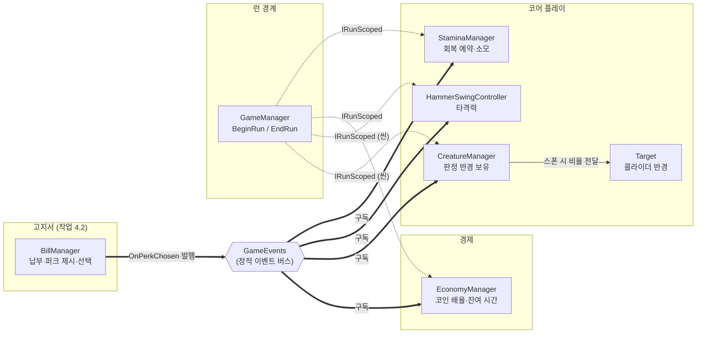

# 퍼크 효과

> 관련 이슈: #126, #92, #188 · 최종 수정: 2026-09-21

**이 문서는 로그다.** 이 기능을 고칠 때마다 갱신한다. 새 문서를 만들지 않는다.

## 무엇을 하는가

고른 퍼크가 실제로 게임에 효과를 내게 한다. 퍼크를 **제시하고 고르는** 쪽은
[고지서](billing.md)(작업 4.2)이고, 여기는 그 결과(`OnPerkChosen`)를 받아 적용하는 쪽이다.

4.2 가 `OnPerkChosen` 까지 붙였지만 **구독하는 시스템이 한 곳도 없었다.** 퍼크를 골라도
아무 일도 일어나지 않는 상태였고, 그것이 이 카드다.

## 누가 무엇을 맡나

퍼크마다 값을 쓰는 시스템이 다르므로 **중앙에서 적용하지 않고 각 소유자가 스스로 받는다.**

| 퍼크 (`perks.csv`) | `PerkType` | 주체 | 근거 |
|---|---|---|---|
| 스태미나 회복 | `StaminaRestore` | `StaminaManager` | 스태미나 풀의 소유자 |
| 코인 획득 강화 | `CoinGainBoost` | `EconomyManager` | **코인 배율은 여기서만** 적용한다 (AGENTS.md) |
| 타격력 강화 | `HitPowerBoost` | `HammerSwingController` | 타격력 계산의 소유자 |
| 피격 판정 확대 | `HitRadiusBoost` | `CreatureManager` → `Target` | 아래 참고 |

### `Target` 이 직접 구독하지 않는 이유

`Target` 은 화면에 여러 개 떠 있는 **인스턴스**다. 직접 `OnPerkChosen` 을 구독하면 크리처
수만큼 구독자가 생기고, 파괴될 때 해제를 한 번만 놓쳐도 정적 이벤트에 죽은 구독이 쌓인다.
그래서 `CreatureManager` 가 한 번만 받아 들고 있다가 스폰할 때 넘기고, 런 도중에 고른
퍼크는 이미 살아 있는 크리처에도 바로 발라 준다.

## 왜 이 방법인가

| 검토한 방법 | 채택 | 이유 |
|---|---|---|
| 각 소유자가 `OnPerkChosen` 을 구독해 스스로 적용 | ✅ | `BillManager` 가 #28 에서 그렇게 위임했고, 퍼크마다 값을 쓰는 곳이 달라 한곳에 모으면 그 한곳이 모든 매니저를 알게 된다 |
| 퍼크 전담 매니저를 두고 각 시스템에 값을 밀어 넣는다 | ❌ | 시스템마다 통로(`SetXxx`)를 파야 하고, 그 통로가 늘수록 업그레이드가 쓰는 `IUpgradeStats` 와 반영 경로가 두 갈래가 된다. #131 에서 같은 이유로 `SetUpgradeOverrides` 를 걷어냈다 |
| 퍼크를 `StatId` 로 흡수해 `IUpgradeStats` 에 얹는다 | ❌ | 업그레이드는 영구·레벨식이고 퍼크는 런 한정·기간제다. 같은 통로에 넣으면 "레벨 0 으로 되돌리기"와 "런 끝나면 사라지기"가 한 상태에 섞인다 |
| 적용 시점을 호출측 책임으로 두기 | ❌ | 고르는 곳은 `BillManager` 하나인데 받는 곳이 넷이다. 시점 판단을 네 번 복제하게 된다 |
| 각 주체가 자기 런 상태를 보고 즉시/예약을 고른다 | ✅ | GDD 6절이 요구하는 분기가 주체마다 다르다 (회복은 "빈자리가 생길 때", 기간제는 "다음 런 시작부터") |

### 적용 시점 — GDD 6절이 까다롭다

> 런 도중 받은 퍼크는 즉시 적용한다. 결과 화면에서 받은 기간제 퍼크는 다음 런 시작부터 시간을
> 센다. 회복 퍼크는 다음 런에서 해당 회복량만큼 스태미나가 부족해질 때 한 번 적용해 만충 시작으로
> 낭비되지 않게 한다.

`TryPay` 는 런 도중에도 결과 화면에서도 불린다. 그래서 각 주체가 **자기 런 상태를 보고** 고른다.

| 퍼크 | 런 중에 받으면 | 런 밖에서 받으면 | 런이 끝나면 |
|---|---|---|---|
| 회복 | 빈자리가 있으면 즉시, 없으면 예약 | 예약 | **예약은 유지** (다음 런에서 쓴다) |
| 코인 강화 | 즉시 시작 | 다음 런 시작부터 | 남은 시간 **버림** |
| 타격력 | 즉시 | 다음 런부터 | **파산 전까지 유지** (팀장 지시, #188) |
| 판정 확대 | 즉시 (살아 있는 크리처도 갱신) | 다음 런부터 | **파산 전까지 유지** (팀장 지시, #188) |

**회복 퍼크가 가장 까다롭다.** 만충일 때 그냥 쓰면 `Restore()` 가 0 을 돌려주고 퍼크는
사라진다 — 검증에서 빈자리 확인을 빼 보니 정확히 그렇게 조용히 증발했다. 그래서 예약해 두고
**회복량이 통째로 들어갈 자리가 생기는 순간** 한 번에 쓴다.

기간제 퍼크(코인 강화)를 런 종료 시 버리는 것은 GDD 에 없는 판단이다. 런 밖에서는 코인이 들어오지 않아
시간만 흘려 보내면 다음 런에 껍데기만 남기 때문이다. 결과 화면에서 **받은** 것은 예약이므로
영향이 없다.

타격력·판정 확대는 반대로 **파산 전까지 유지**한다 — 원래는 코인 강화와 같이 매 런 종료마다
지웠는데, 팀장 지시로 4.11(#188) 문서 정리 중 고쳤다. 업그레이드·고지서·대출과 같은
"회차" 층(GDD "파산" 절)에 놓인다고 보면 된다 — 하루가 끝나도 안 사라지고, 회차 자체가
끝나는 파산에서만 초기화된다. percent 값이라 만료 시각을 셀 필요가 없어, 코인 강화처럼
버릴 "남은 시간"이 애초에 없다는 점도 다르게 취급하는 이유다.

## 구조

| 클래스 | 경로 | 이 기능에서 하는 일 |
|---|---|---|
| `StaminaManager` | `Assets/Scripts/Runtime/Core/StaminaManager.cs` | 회복 예약과 소모 |
| `EconomyManager` | `Assets/Scripts/Runtime/Economy/EconomyManager.cs` | 코인 배율과 잔여 시간 |
| `HammerSwingController` | `Assets/Scripts/Runtime/Core/HammerSwingController.cs` | 타격력 비율 |
| `CreatureManager` | `Assets/Scripts/Runtime/Core/CreatureManager.cs` | 판정 반경 비율 보유·전달 |
| `Target` | `Assets/Scripts/Runtime/Targets/Target.cs` | 콜라이더 반경에 합산 |
| `PerkEffectChecks` | `Assets/Scripts/Editor/PerkEffectChecks.cs` | Edit Mode 검증 25건 |

### 런 경계를 씬까지 넓혔다

`HammerSwingController` 와 `CreatureManager` 는 **씬에 산다.** `GameManager` 가 런 경계를
뿌리는 `GetComponentsInChildren<IRunScoped>` 는 `Managers` 프리팹 안만 훑으므로 이 둘은
잡히지 않았다. 위 표의 "런 중인지"와 "런이 끝나면 사라짐"이 둘 다 런 경계를 요구해서,
두 클래스가 `IRunScoped` 를 구현하고 `GameManager` 가 씬 구현체도 따로 모아 부른다.

**새 계약을 만들지 않았다.** 기존 `IRunScoped` 의 구현자가 늘었을 뿐이다. 씬 구현체는
캐시하지 않고 런 시작마다 다시 찾는다 — 씬이 다시 로드되면 인스턴스가 새로 생긴다.
인터페이스 참조로는 Unity 의 "파괴됨" 판정이 걸리지 않아 `UnityEngine.Object` 로 되돌려 확인한다.

### 씬 재로드가 예약 퍼크를 지운 버그 (#188 에서 발견·수정)

Result 화면(런 밖)에서 고른 퍼크는 씬 구현체의 `_pendingXxx` 필드에 예약된다. `ContinueRun()`
도 `SceneManager.LoadScene` 으로 씬을 통째로 다시 로드한다는 점이 문제였다 — Result 전이
자체는 씬을 새로 로드하지 않지만, 그 다음 "이어하기"가 로드한다. 그 사이 예약값을 들고 있던
옛 인스턴스가 파괴되고 새 인스턴스가 기본값(0)으로 시작해, 결과 화면에서 고른 퍼크가 다음
런에서 조용히 사라졌다. `CreatureManager` 는 `Managers` 프리팹(`DontDestroyOnLoad`) 소속이라
영향이 없었고, 씬에 사는 유일한 `IRunScoped` 구현체인 `HammerSwingController`(타격력 강화)만
겪었다. 사용자가 데미지 표시 소수점으로 직접 잡아냈다.

`GameManager` 가 `ContinueRun` 직전에 옛 인스턴스의 예약값을 자신(`DontDestroyOnLoad`)이
옮겨 들고 있다가, `WireSceneConsumers` 에서 새 인스턴스를 찾은 직후 되돌려 준다.

### 위 수정이 놓친 절반 — 활성값도 옮겨야 했다 (#188, 파산 전까지 유지 작업 중 재발견)

타격력 강화를 파산 전까지 유지하도록 고친 뒤(위 "갱신 이력" 참고), 사용자가 실제 플레이에서
"15% 강화가 파산도 안 했는데 없어진다"를 다시 보고했다. 원인은 바로 위 수정이 옮기던 것이
`_pendingPerkPowerPercent`(아직 안 켠 예약분) 뿐이었기 때문이다. 이번 작업 전에는 `EndRun`
이 매일 `_perkPowerPercent`(이미 켠 활성분)를 0으로 지웠으니 옮길 활성값이 애초에 없어서 이
경로로는 안 드러났다. `EndRun` 의 초기화를 없앤 뒤로는 활성값이 며칠씩 쌓이는데,
`HammerSwingController` 는 씬 소속이라 `ContinueRun` 마다(파산 여부와 무관하게, 매일) 인스턴스가
통째로 바뀐다 — 예약분만 옮기면 그 활성값이 매번 새 인스턴스의 기본값(0)에 덮인다.

`HammerSwingController` 에 `ActivePerkPowerPercent` 조회 통로를 추가하고, `GameManager.CarryOverScenePerks`
가 `PendingPerkPowerPercent + ActivePerkPowerPercent` 를 합쳐서 옮기도록 고쳤다 — 새 인스턴스는
합계를 예약값으로 받아 `BeginRun` 이 그대로 활성화한다.

### 이벤트

| 이벤트 | 발행/구독 | 언제 |
|---|---|---|
| `GameEvents.OnPerkChosen` | **구독** (4곳) | 자기 종류의 퍼크만 처리하고 나머지는 무시한다 |
| `GameEvents.OnStaminaRestored` | 발행 | 회복 퍼크가 **실제로 들어갔을 때만** |

퍼크 전용 이벤트는 만들지 않았다. UI 가 "퍼크가 걸렸다"를 알아야 하면 그때 정한다 (6.9).

### 읽는 밸런스 값

| CSV | 열 | 쓰는 곳 |
|---|---|---|
| `perks.csv` | `id`, `value` | 퍼크 식별과 효과 수치 |
| `perks.csv` | `duration_sec` | 코인 강화의 지속 시간. 나머지 퍼크는 0 |
| `perks.csv` | `display_name` | 읽지 않는다 — UI(6.9)의 몫 |

`value` 의 뜻은 종류마다 다르다 (회복은 점수, 코인은 배율, 나머지는 percent).
`PerkDef.Value` 주석이 정본이다.

## 검증

Edit Mode 에서 `PerkEffectChecks.RunBatch()` 로 확인했다 (**25건 PASS**). 3회 연속 실행 후
`GameEvents` 구독자 수가 전부 0인 것도 확인했다 — 구독이 새면 퍼크가 두 번 적용된다.
기대값은 코드에 적지 않고 생성된 `BalanceData.asset` 에서 읽는다.

- [x] 만충에서 회복 퍼크를 고르면 쓰지 않고 예약한다
- [x] 회복량만큼 빈자리가 생기면 한 번에 들어가고 `OnStaminaRestored` 가 1회 나간다
- [x] 한 번 쓴 회복 퍼크는 다시 쓰이지 않는다
- [x] 런 밖에서 고른 회복 퍼크가 다음 런에서 쓰인다
- [x] 코인 강화가 즉시 걸리고, 지속 시간이 지나면 풀린다
- [x] 런이 끊기면 남은 코인 강화가 사라진다
- [x] 런 밖에서 고른 코인 강화는 **다음 런 시작부터** 시간을 센다
- [x] 타격력 퍼크가 걸리고, 런이 끝나도 사라지지 않으며(파산 전까지 유지, #188), 런 밖에서 고르면 다음 런부터 걸린다
- [x] 타격력·판정 확대 퍼크는 파산해야 지워진다 — 활성분과 (런 밖에서 고른) 예약분 둘 다 (#188)
- [x] 판정 반경 퍼크가 기준 비율에 **더해진다** (업그레이드 비율과 합산)
- [x] 재초기화(풀 재사용)에서 퍼크 반경이 유지된다
- [x] `CreatureManager` 가 런 경계에 맞춰 비율을 켜고 끈다
- [x] 구독을 해제하면 퍼크에 반응하지 않는다
- [x] `BalanceData` 가 dirty 되지 않는다

검증이 실제로 무언가를 잡는지도 확인했다. 회복 퍼크의 빈자리 확인을 빼 보니
"빈자리가 생겼는데 회복이 한 번 나가지 않았습니다"로 실패했다 — 만충에서 퍼크가 조용히
증발하는 것이 그대로 드러났다.

**부분 검증**: Play Mode. 2026-09-21(#188)에 `hit_power_boost` 한정으로 직접 검증했다 —
정상 플레이(고지서 납부 → 퍼크 선택 화면)로 골라 리플렉션으로 필드를 읽었다. 런 도중
선택은 `_perkPowerPercent` 에 즉시 반영(`_runHitPower` 1.0→1.15)됐고, 결과 화면에서 선택한
뒤 다음 런으로 넘어가는 경로는 바로 위 "씬 재로드가 예약 퍼크를 지운 버그"를 드러냈다 —
그 버그를 고친 뒤 같은 경로로 다시 재현해 새 인스턴스의 `_perkPowerPercent=15`,
`_runHitPower=1.15` 승격을 확인했다. 나머지 세 퍼크(`stamina_restore`·`coin_gain_boost`·
`hit_radius_boost`)는 여전히 Play Mode 로 직접 검증하지 못했다 — `EconomyManager`·
`StaminaManager`·`CreatureManager` 가 전부 `Managers` 프리팹(`DontDestroyOnLoad`) 소속이라
씬 재로드 문제는 소스 분석으로는 없다고 보이지만, 적용 값 자체를 플레이로 확인한 것은 아니다.
타격력·판정 확대의 "파산 전까지 유지" 규칙(#188)은 처음엔 `PerkEffectChecks` 로만
확인했었다 — `GameEvents.PublishBankrupt()` 를 직접 발행해 활성·예약 값이 지워지는지 Edit
Mode 에서 봤을 뿐이었다. 그런데 Edit Mode 검증은 씬 재로드를 흉내 내지 않아 "며칠째 유지되던
활성값이 매일 씬 재로드로 사라지는" 위 회귀를 못 잡았고, 사용자가 실제 플레이에서 먼저
발견했다. 그래서 Play Mode 로 다시 검증했다 — MainMenu → StartNewRun → 1일차 Result 화면에서
`hit_power_boost` 선택(예약 15) → `ContinueRun`(2일차, 새 인스턴스에서 활성 15·`_runHitPower`
1.15 승격 확인) → 정상 종료 → `ContinueRun`(3일차, **또 새 인스턴스인데** 활성 15 유지 확인 —
이게 회귀가 있었다면 0 으로 돌아갔을 지점이다) → `GameEvents.PublishBankrupt()` 발행 →
활성·예약 모두 0, `_runHitPower` 1.0 복귀 확인. 나머지 세 퍼크(`stamina_restore`·
`coin_gain_boost`·`hit_radius_boost`)는 여전히 Play Mode 로 직접 검증하지 못했다 —
`EconomyManager`·`StaminaManager`·`CreatureManager` 가 전부 `Managers` 프리팹
(`DontDestroyOnLoad`) 소속이라 씬 재로드 문제는 소스 분석으로는 없다고 보이지만(그래서 이번
회귀도 `HammerSwingController` 하나에서만 났다), 적용 값 자체를 플레이로 확인한 것은 아니다.
실제 고지서 미납으로 파산까지 이어지는 Play Mode 경로(`PublishBankrupt` 를 직접 발행하는 것이
아니라 `BillManager.TryCloseDay` 가 발행하게 하는 경로)도 아직 재현하지 않았다.

## 알려진 한계

- **저장·복원이 없다.** `SaveData.PendingPerkIds` 가 계약에 있지만 수집 대상이 아니라
  **예약된 퍼크는 앱을 끄면 사라진다.** 회복 퍼크를 받아 두고 끄면 그대로 손해다.
  `SaveManager` 연동 자체는 #203 에서 붙었고([저장·불러오기](save-load.md)), 퍼크가 빠진 것은
  되돌릴 통로가 없어서다 — 담아 두고 복원하지 못하면 "저장된다"는 착각만 만든다. 별도 계약 이슈가 먼저다
- **중첩 규칙이 없다.** 같은 퍼크를 두 번 받으면 회복·타격력·반경은 **더해지고**, 코인 강화만
  **덮어쓴다**(지속 시간이 있어 더할 수가 없다). CSV 도 GDD 도 정하지 않아 구현이 정한 것이므로,
  퍼크를 여러 번 받을 수 있게 되면 다시 볼 것
- ~~**선택 중 시간 정지가 없다.**~~ — #92 에서 붙였다. 선택 화면이 `Time.timeScale` 을 0 으로
  내려 GDD 6절이 말하는 다섯(스태미나·스윙·스폰·피버·기간제 효과)이 함께 멈춘다
  ([퍼크 3장 선택 화면](perk-choice-ui.md))
- **빌드에서는 판정 반경 퍼크가 먹지 않는다.** `CreatureManager` 자체가 빌드에 없기 때문이다
  ([#140](https://github.com/KDNA-Gwangju-1/NCAIClicker/issues/140))
- **퍼크 수치를 Play Mode 로 실측하지 않았다.** `perks.csv` 의 `value`·`duration_sec` 는
  4.11(#188, 2026-09-21)에서 스태미나 7.0 기준으로 다시 잡았지만, 근거는 모델 계산(드레인률·
  스윙 간격·`fever.csv` 대비 규모)이고 `simulate_balance.py` 는 퍼크를 모델링하지 않는다.
  실제 체감이 맞는지는 7.2 밸런싱에서 본다

## 갱신 이력

| 날짜 | 이슈 | 누가 | 무엇이 바뀌었나 |
|---|---|---|---|
| 2026-09-17 | #126 | twins6375-art | 최초 작성 (퍼크 4종 적용, 즉시/예약 분기, 런 경계를 씬까지 확장) |
| 2026-09-18 | #92 | twins6375-art | 선택 화면이 붙어 시간 정지 한계를 닫았다 ([퍼크 3장 선택 화면](perk-choice-ui.md)). 알려진 한계의 CSV 수치 복제를 열 이름으로 바꿨다 |
| 2026-09-21 | #188 | yahoo-afk | `idle_drain_per_sec` 7.0(#187) 미반영분 재계산 — `stamina_restore` 20→40, `coin_gain_boost.duration_sec` 15→5.0(`hit_power_boost`·`hit_radius_boost` 는 percent 값이라 유지). 근거는 `BALANCE.md` "퍼크 값 재계산" 절 |
| 2026-09-21 | #188 | yahoo-afk | `ContinueRun` 의 씬 재로드로 `HammerSwingController` 의 예약 퍼크(`hit_power_boost`)가 다음 런에서 사라지던 버그를 발견·수정 — `GameManager` 가 씬 재로드 전후로 값을 옮겨 준다. Play Mode 리플렉션으로 즉시 적용·예약 승격 모두 확인 |
| 2026-09-21 | #188 | yahoo-afk | 팀장 지시로 타격력 강화·피격 판정 확대 퍼크의 적용 시점 규칙을 바꿨다 — 매 런 종료(`EndRun`)마다 지우던 것을 그만두고, `GameEvents.OnBankrupt` 구독으로 파산할 때만 지운다(활성분·예약분 모두). `BeginRun` 도 예약분으로 덮어쓰던 것을 기존 값에 더하는 것으로 고쳐야 했다 — 안 그러면 다음 런 시작에 이어온 값이 지워진다(`PerkEffectChecks` 가 먼저 잡았다). 코인 획득 강화는 1회성 기간제라 그대로 뒀다. `PerkEffectChecks` 에 파산 케이스를 추가(21→25건), `GDD.md` "파산" 절의 층 표에 이 두 퍼크를 회차 층으로 추가 |
| 2026-09-21 | #188 | yahoo-afk | 위 수정이 놓친 절반을 사용자가 실제 플레이에서 잡아냈다 — "파산 전까지 유지"로 고친 뒤에도 타격력 강화가 다음 날 조용히 사라졌다. 원인은 `GameManager.CarryOverScenePerks` 가 씬 재로드 때 예약분(`PendingPerkPowerPercent`)만 옮기고, 매일 쌓이는 활성분(`_perkPowerPercent`, 이제는 `EndRun` 이 안 지운다)은 옮기지 않아서였다. `HammerSwingController` 에 `ActivePerkPowerPercent` 를 추가하고 `CarryOverScenePerks` 가 둘을 합쳐 옮기도록 고쳤다. Play Mode 로 1→2→3일차 연속 전환에서 활성값이 유지되고, 파산에서만 지워지는 것을 재확인 |
