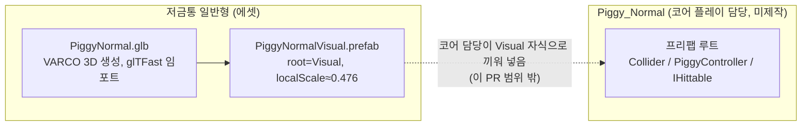

# 저금통 일반형 3D 에셋

> 관련 이슈: #9 · 최종 수정: 2026-09-18

**이 문서는 로그다.** 이 기능을 고칠 때마다 갱신한다. 새 문서를 만들지 않는다.

## 무엇을 하는가

VARCO 3D로 생성한 저금통 일반형 모델(`Assets/Models/PiggyNormal.glb`)을 glTFast로 임포트하고,
그레이박스 `Cube`를 대체할 `Visual` 자식용 프리팹(`Assets/Prefabs/PiggyNormalVisual.prefab`)으로
분리 제작했다. 프리팹 구조 규칙과 스케일 기준은 [ASSET_PIPELINE.md](../ASSET_PIPELINE.md) 참고.

**이 PR은 `Visual` 서브트리만 만든다. `Piggy_Normal` 프리팹 루트(Collider/PiggyController/IHittable)는
포함하지 않는다** — 아래 "왜 이 방법인가" 참고.

## 왜 이 방법인가

| 검토한 방법 | 채택 | 이유 |
|---|---|---|
| `PiggyNormalVisual.prefab`만 별도 제작 (Visual 서브트리 단독) | ✅ | `PiggyController`가 코드베이스 어디에도 없어 (`IHittable`은 있음) 로직 컴포넌트를 채운 완전한 `Piggy_Normal`을 만들려면 코어 플레이 담당 소유 영역에 코드를 새로 써야 한다 — 이슈 #9(3D 에셋 제작) 범위 밖. 코어 담당이 나중에 자기 `Piggy_Normal` 프리팹의 `Visual` 자식으로 이 프리팹을 끼워 넣으면 된다 |
| 그레이박스 `Piggy_Normal`을 찾아 그 안의 `Visual` 자식 메시만 교체 | ❌ | 그런 그레이박스 프리팹이 존재하지 않음 (`Assets/Prefabs/`에 저금통 관련 프리팹 전무, `PiggyController`는 문서의 다이어그램 라벨로만 존재) |
| 임포트 설정(Scale Factor)에서 모델 크기를 0.4 유닛에 맞춤 | ❌ | glTFast(`com.unity.cloud.gltfast`)에는 전역 Scale Factor 필드가 없다 (리플렉션으로 `ImportSettings`/`InstantiationSettings`/`EditorImportSettings` 전체 확인). 대신 `Visual` 프리팹 자체를 스케일 |
| 텍스처를 512×512로 다운스케일 | ❌ | glTFast는 `TextureImporter`의 Max Size를 타지 않는 자체 임포터를 쓴다. 512로 낮추려면 별도 `AssetPostprocessor`가 필요해 배보다 배꼽이 커짐. 저금통 1개당 VRAM 약 26MB(BaseColor 1024²+Normal 2048², 밉맵 포함)로 예산에 문제없어 1024/2048 그대로 채택 |

## 구조

| 애셋 | 경로 | 하는 일 |
|---|---|---|
| `PiggyNormal.glb` | `Assets/Models/PiggyNormal.glb` | VARCO 3D 생성 원본 모델 (1500 삼각형, BaseColor 1024², Normal 2048²) |
| `PiggyNormalVisual.prefab` | `Assets/Prefabs/PiggyNormalVisual.prefab` | `PiggyNormal.glb`를 인스턴스화한 `Visual` 루트, `localScale=(0.4762, 0.4762, 0.4762)`로 저금통 높이를 0.4 유닛에 맞춤 (메시 원본 높이 0.838 → 스케일 후 0.399, 오차 0.2%) |

### 이벤트

해당 없음 — 로직 컴포넌트가 없는 시각 에셋 프리팹.

### 읽는 밸런스 값

해당 없음.

## 검증

- [x] `execute_code`로 `PrefabUtility.InstantiatePrefab` → `localScale` 설정 → `PrefabUtility.SaveAsPrefabAsset` 실행 후 `success=True` 확인 (씬을 열거나 저장하지 않고 임시 인스턴스만 만들어 즉시 `DestroyImmediate`)
- [x] `read_console`(`types=["error","warning"]`)로 프리팹 생성 직후 콘솔에 실제 오류·경고 없음 확인 (MCP 포트 재연결 로그 3줄만 존재)
- [ ] Play Mode에서 `Visual` 프리팹을 실제 `Piggy_Normal`에 끼워 화면 비율·조준 판정 확인 — **미검증**. `Piggy_Normal` 루트 프리팹이 아직 없어 코어 담당 작업 완료 후 가능

## 알려진 한계

- **`Piggy_Normal` 프리팹 루트가 아직 없다.** 코어 플레이 담당이 `Collider`/`PiggyController`/`IHittable`을 붙인 루트를 만들고 이 `PiggyNormalVisual.prefab`을 `Visual` 자식으로 끼워야 그레이박스 교체가 완성된다.
- glTFast는 임포트 시점 스케일 조정 수단이 전혀 없다 — 앞으로 추가하는 모델도 전부 별도 `Visual` 프리팹에서 스케일을 맞춰야 한다 (임포트 설정에서 되는 것으로 착각하지 말 것).
- 공개 배포·상업적 이용 시 VARCO 라이선스 약관 재확인 필요 ([THIRD_PARTY.md](../THIRD_PARTY.md) 참고).

## 갱신 이력

| 날짜 | 이슈 | 누가 | 무엇이 바뀌었나 |
|---|---|---|---|
| 2026-09-18 | #9 | Claude | 최초 작성 — `PiggyNormalVisual.prefab` 제작, 텍스처 해상도·스케일 방식 결정 기록 |
