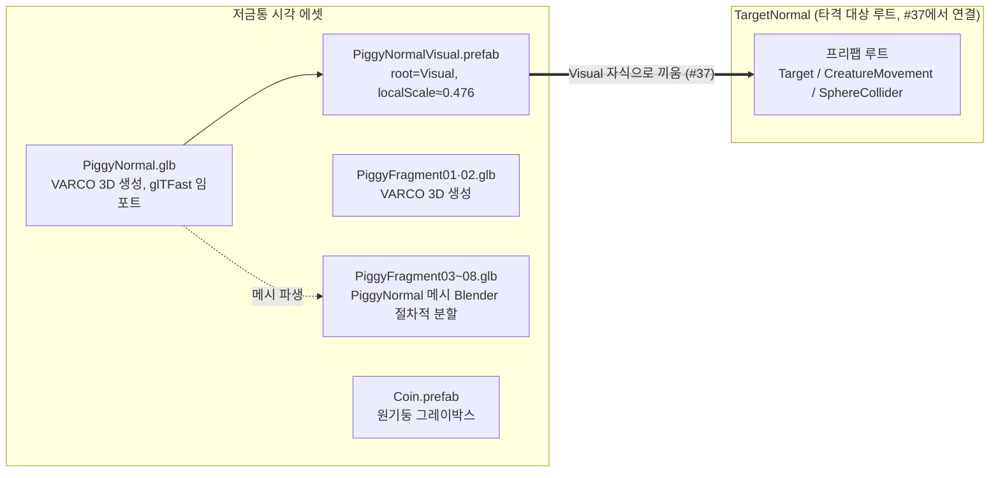

# 저금통 3D 에셋 (일반형·파편·코인)

> 관련 이슈: #9, #37 · 최종 수정: 2026-09-21

**이 문서는 로그다.** 이 기능을 고칠 때마다 갱신한다. 새 문서를 만들지 않는다.

> **2026-09-21 정정.** 아래 1절이 설명하는 **"저금통 일반형" 방향은 #37에서 철회됐다.**
> `PiggyNormalVisual.prefab`은 더 이상 어느 `TargetXxx.prefab`에도 연결돼 있지 않다 — 타격
> 대상 4종은 광물 크리처 테마로 전면 교체됐다. 자세한 경위와 대체 에셋은
> [광물 크리처 3D 에셋](mineral-creature-assets.md) 참고. **파편 8종·코인 그레이박스(2·3절)는
> 저금통 테마와 무관하게 그대로 유효하다** — 파괴 연출용 자원이라 폐기 대상이 아니다. 이 문서는
> 삭제하지 않는다: `PiggyNormal.glb`·`PiggyNormalVisual.prefab` 파일 자체는 저장소에 남아 있고,
> 이 문서가 그 제작 경위를 정확히 설명하기 때문이다.

## 무엇을 하는가

이슈 #9(6.5 VARCO 3D 에셋 제작)의 완료 기준 "저금통·파편·코인 확보" 3종을 다룬다.

1. **저금통 일반형** — VARCO 3D로 생성한 모델(`Assets/Models/PiggyNormal.glb`)을 glTFast로
   임포트하고, 그레이박스 `Cube`를 대체할 `Visual` 자식용 프리팹(`Assets/Prefabs/PiggyNormalVisual.prefab`)으로
   분리 제작했다.
2. **저금통 파편 8종** (`Assets/Models/PiggyFragment01~08.glb`) — 파괴 연출에 쓸 깨진 조각.
   01·02는 VARCO 3D로 직접 생성, 03~08은 `PiggyNormal.glb` 메시를 Blender로 절차적으로
   분할해 제작했다.
3. **코인 그레이박스** (`Assets/Prefabs/Coin.prefab`) — 원기둥 프리미티브.

프리팹 구조 규칙과 스케일 기준은 [ASSET_PIPELINE.md](../ASSET_PIPELINE.md) 참고.

**세 항목 모두 시각 에셋 확보까지만 다룬다.** 파편의 Rigidbody·3초 소멸·오브젝트 풀 배선
(PATTERNS.md 7절), 코인의 3D 모델 교체는 포함하지 않는다 — 아래 "왜 이 방법인가" 참고.
`PiggyNormalVisual.prefab` 을 실제 루트에 끼우는 작업은 작업 6.6(#37)에서 완료했다 —
[타격 대상](hit-targets.md) 참고. "저금통" ≡ "타격 대상(Target)"이라 별도의 `Piggy_Normal`
루트를 새로 만들지 않고, 기존 그레이박스 루트 `Assets/Prefabs/Targets/TargetNormal.prefab` 의
`Visual` 자식을 갈아끼웠다.

## 왜 이 방법인가

| 검토한 방법 | 채택 | 이유 |
|---|---|---|
| `PiggyNormalVisual.prefab`만 별도 제작 (Visual 서브트리 단독) | ✅ | `PiggyController`가 코드베이스 어디에도 없어 (`IHittable`은 있음) 로직 컴포넌트를 채운 완전한 `Piggy_Normal`을 만들려면 코어 플레이 담당 소유 영역에 코드를 새로 써야 한다 — 이슈 #9(3D 에셋 제작) 범위 밖. 코어 담당이 나중에 자기 `Piggy_Normal` 프리팹의 `Visual` 자식으로 이 프리팹을 끼워 넣으면 된다 |
| 그레이박스 `Piggy_Normal`을 찾아 그 안의 `Visual` 자식 메시만 교체 | 보류 → #37에서 채택 | #9 시점엔 그런 그레이박스 프리팹이 안 보였다(`Assets/Prefabs/`에 저금통 관련 프리팹 전무). 실제로는 "저금통"이 GDD 상 "타격 대상(Target)"과 같은 개념이라 `Assets/Prefabs/Targets/TargetNormal.prefab` 이 그 루트였다 — #37에서 이걸 찾아 `Visual` 자식만 교체했다 |
| 임포트 설정(Scale Factor)에서 모델 크기를 0.4 유닛에 맞춤 | ❌ | glTFast(`com.unity.cloud.gltfast`)에는 전역 Scale Factor 필드가 없다 (리플렉션으로 `ImportSettings`/`InstantiationSettings`/`EditorImportSettings` 전체 확인). 대신 `Visual` 프리팹 자체를 스케일 |
| 텍스처를 512×512로 다운스케일 | ❌ | glTFast는 `TextureImporter`의 Max Size를 타지 않는 자체 임포터를 쓴다. 512로 낮추려면 별도 `AssetPostprocessor`가 필요해 배보다 배꼽이 커짐. 저금통 1개당 VRAM 약 26MB(BaseColor 1024²+Normal 2048², 밉맵 포함)로 예산에 문제없어 1024/2048 그대로 채택 |
| 파편 03~08을 VARCO 3D로 추가 생성 | ❌ | 이 작업을 수행한 세션의 Unity MCP `generate_model`은 Tripo·Meshy만 연동돼 있고 둘 다 API 키 미설정(`list_providers` 확인 결과 `configured:false`) — VARCO는 애초에 연동되지 않음. 생성형 AI 호출 자체가 불가능했다 |
| `PiggyNormal.glb` 메시를 Blender(`bpy`) 헤드리스로 절차적 분할 | ✅ | ASSET_PIPELINE.md의 "원본을 쪼갠 형태" 문구를 그대로 구현. `bmesh.ops.bisect_plane`으로 중심 근처 무작위 평면을 반복 절단해 8개 중 6개(03~08)를 생성. 신규 생성형 AI 산출물이 아니므로 THIRD_PARTY.md 별도 기재 불필요 |
| 코인을 VARCO 3D 생성 모델로 제작 | ❌ | 이번 PR 시점에는 VARCO 미연동(위와 동일 사유)이라 그레이박스로 우선 확보. 3D 교체는 별도 이슈에서 진행 |

## 구조

| 애셋 | 경로 | 하는 일 |
|---|---|---|
| `PiggyNormal.glb` | `Assets/Models/PiggyNormal.glb` | VARCO 3D 생성 원본 모델 (1500 삼각형, BaseColor 1024², Normal 2048²) |
| `PiggyNormalVisual.prefab` | `Assets/Prefabs/PiggyNormalVisual.prefab` | `PiggyNormal.glb`를 인스턴스화한 `Visual` 루트, `localScale=(0.4762, 0.4762, 0.4762)`로 저금통 높이를 0.4 유닛에 맞춤 (메시 원본 높이 0.838 → 스케일 후 0.399, 오차 0.2%) |
| `PiggyFragment01.glb`, `PiggyFragment02.glb` | `Assets/Models/` | VARCO 3D 생성 파편 원본 (각 1131 / 1484 정점, 독립 텍스처 포함) |
| `PiggyFragment03~08.glb` | `Assets/Models/` | `PiggyNormal.glb`를 Blender `bpy` 헤드리스 스크립트로 절차적 분할한 파편 6종 (909 / 93 / 257 / 86 / 204 / 58 정점). `PiggyNormal`의 임베디드 텍스처·UV를 그대로 물려받는다 |
| `Coin.prefab` | `Assets/Prefabs/Coin.prefab` | 원기둥(Cylinder) 그레이박스, `scale=(0.3, 0.05, 0.3)`, `MeshRenderer.shadowCastingMode = Off` (ASSET_PIPELINE.md 4절) |

### 이벤트

해당 없음 — 로직 컴포넌트가 없는 시각 에셋 프리팹.

### 읽는 밸런스 값

해당 없음.

## 검증

- [x] `execute_code`로 `PrefabUtility.InstantiatePrefab` → `localScale` 설정 → `PrefabUtility.SaveAsPrefabAsset` 실행 후 `success=True` 확인 (씬을 열거나 저장하지 않고 임시 인스턴스만 만들어 즉시 `DestroyImmediate`)
- [x] `read_console`(`types=["error","warning"]`)로 프리팹 생성 직후 콘솔에 실제 오류·경고 없음 확인 (MCP 포트 재연결 로그 3줄만 존재)
- [x] 파편 03~08 각각을 씬에 임시 인스턴스화해 스크린샷으로 형태 확인 — 큰 조각과 작은 파편이 섞인 절단 패턴이 "원본을 쪼갠 형태" 요구와 부합함을 눈으로 확인. 확인 후 씬 저장 없이 전부 `DestroyImmediate`로 제거
- [x] 코인 그레이박스 `MeshRenderer.shadowCastingMode`가 `Off`로 저장됐는지 `execute_code`로 재조회해 확인
- [x] Play Mode에서 `Visual` 프리팹을 실제 `TargetNormal`에 끼워 화면 비율·조준 판정 확인 — #37에서 완료, [타격 대상](hit-targets.md) "#37" 절 참고
- [ ] 파편의 Rigidbody·물리 낙하·오브젝트 풀 배선(PATTERNS.md 7절), 파괴 연출 시퀀스에서의 실제 동작 — **미검증**. 이 PR은 시각 에셋 확보까지만 다룬다
- [ ] 코인 프리팹이 실제 코인 드롭 로직에 연결된 상태에서의 동작 — **미검증**. 그레이박스 확보만 이 PR 범위

## 알려진 한계

- ~~**`Piggy_Normal` 프리팹 루트가 아직 없다.**~~ — #37에서 해결. 실제 루트는 `Assets/Prefabs/Targets/TargetNormal.prefab` 이었고, 그 `Visual` 자식을 이 프리팹으로 교체했다.
- glTFast는 임포트 시점 스케일 조정 수단이 전혀 없다 — 앞으로 추가하는 모델도 전부 별도 `Visual` 프리팹에서 스케일을 맞춰야 한다 (임포트 설정에서 되는 것으로 착각하지 말 것).
- **파편 03~08은 신규 텍스처가 없다.** `PiggyNormal.glb`의 기존 UV·텍스처를 그대로 물려받은 절단면이라, 단면(절단 단면)에는 별도 재질이 없다 — 클로즈업 연출에서는 어색할 수 있다.
- **코인은 원기둥 그레이박스일 뿐 3D 모델이 아니다.** VARCO 3D 연동이 이 PR 시점엔 준비되지 않아(Tripo·Meshy만 연동, API 키 미설정) 3D 교체는 후속 이슈에서 진행한다.
- 파편·코인 모두 **Rigidbody·오브젝트 풀·파괴 연출 배선이 없다.** 시각 에셋만 확보된 상태다.
- 공개 배포·상업적 이용 시 VARCO 라이선스 약관 재확인 필요 ([THIRD_PARTY.md](../THIRD_PARTY.md) 참고).

## 갱신 이력

| 날짜 | 이슈 | 누가 | 무엇이 바뀌었나 |
|---|---|---|---|
| 2026-09-18 | #9 | Claude | 최초 작성 — `PiggyNormalVisual.prefab` 제작, 텍스처 해상도·스케일 방식 결정 기록 |
| 2026-09-21 | #9 | Claude | 문서 범위를 저금통 3종 에셋 전체로 확장 — 파편 8종(VARCO 생성 01·02 + Blender 절차적 분할 03~08), 코인 그레이박스 프리팹 추가 반영. PR #199에서 코드만 병합되고 누락됐던 기술 문서를 사후 보강 |
| 2026-09-21 | #37 | Claude | `PiggyNormalVisual.prefab`을 `TargetNormal.prefab`의 `Visual` 자식으로 연결 완료 (6.6). "Piggy_Normal 루트 미제작" 한계 해소, 자세한 내용은 [타격 대상](hit-targets.md) 참고 |
| 2026.09.21 | #37, #192 | saltlake00 | TargetNormal 프리팹의 Mesh 자식명 정규화, localPosition.y = 0.20 오프셋 및 스케일(0.477) 교정으로 책상 파묻힘 문제 해결 및 TargetChecks 통과 |
| 2026-09-21 | #37 | Claude | 저금통 방향 철회 — 타격 대상 4종을 광물 크리처로 전면 교체하며 `PiggyNormalVisual` 연결 해제. 문서 상단에 정정 표기 추가, 파편·코인은 유효 유지. 자세한 내용은 [광물 크리처 3D 에셋](mineral-creature-assets.md) 참고 |
