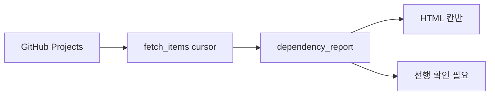

# 진행 대시보드

> 관련 이슈: #46 · 최종 수정: 2026-09-16

## 무엇을 하는가

GitHub Projects 전체 페이지를 읽어 칸반과 선행 관계를 정적 HTML로 만든다.

## 왜 이 방법인가

| 방법 | 채택 | 이유 |
|---|---|---|
| 첫 100개만 조회 | ❌ | 카드가 100개를 넘으면 누락된다 |
| GraphQL cursor 페이지네이션 | ✅ | 전체 카드를 일관되게 집계한다 |
| 느슨한 문자열 파싱 | ❌ | 오타·없는 이슈가 착수 가능으로 올라간다 |
| 엄격한 토큰 검증 | ✅ | 확인 필요 칸으로 보내 안전하게 멈춘다 |

## 구조

| 함수 | 경로 | 하는 일 |
|---|---|---|
| `fetch_items` | `.github/scripts/build_dashboard.py` | cursor를 따라 전체 카드 조회 |
| `parse_deps` | `.github/scripts/build_dashboard.py` | 번호·범위·묶음·이슈 참조 검증 |

## 검증

- Python unittest 8개 통과 (2026-09-16).
- GitHub Actions 실행은 PR 후 확인한다.

## 알려진 한계

- GitHub Projects API는 `read:project` 권한이 필요하다.

## 갱신 이력

| 날짜 | 이슈 | 누가 | 무엇이 바뀌었나 |
|---|---|---|---|
| 2026-09-16 | #46 | Codex | 페이지네이션과 엄격한 선행 검증 기록 |
