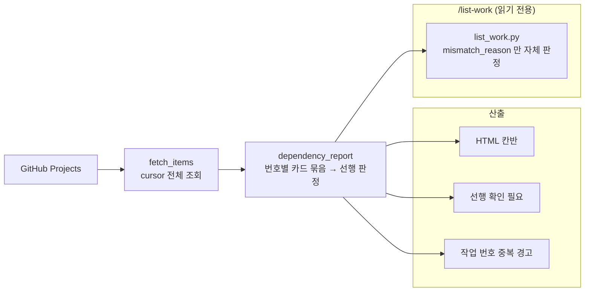

# 진행 대시보드

> 관련 이슈: #46, #81 · 최종 수정: 2026-09-16

## 무엇을 하는가

GitHub Projects 전체 페이지를 읽어 칸반과 선행 관계를 정적 HTML로 만든다.
같은 판정 함수를 `/list-work` 스킬이 불러다 써서, 대시보드와 착수 목록이 **한 벌의 판정**을 공유한다.

## 왜 이 방법인가

| 방법 | 채택 | 이유 |
|---|---|---|
| 첫 100개만 조회 | ❌ | 카드가 100개를 넘으면 누락된다 |
| GraphQL cursor 페이지네이션 | ✅ | 전체 카드를 일관되게 집계한다 |
| 느슨한 문자열 파싱 | ❌ | 오타·없는 이슈가 착수 가능으로 올라간다 |
| 엄격한 토큰 검증 | ✅ | 확인 필요 칸으로 보내 안전하게 멈춘다 |
| 작업 번호당 카드 한 장만 보관 (`by_no[n] = it`) | ❌ | 번호가 겹치면 뒤엣것이 앞엣것을 조용히 덮어써, 어느 카드를 집었는지에 따라 답이 달라진다. 출력은 그럴듯해 보여 아무도 못 알아챈다 |
| 번호별 카드를 리스트로 모으고 **전부** 끝났을 때만 완료로 판정 | ✅ | 카드 순서에 결과가 의존하지 않는다. 겹친 채로도 답이 하나다 |
| 중복을 만나면 예외를 던져 멈춤 | ❌ | 변경은 최소지만 중복 하나에 대시보드 배포가 멈춘다. 제목 한 줄 고치면 되는 일로 팀 전체가 보는 페이지를 죽이는 건 과하다 |
| 네 번째 반환값 `duplicates` 로 돌려주고 경고만 | ✅ | 양쪽이 계속 돌면서도 조용히 틀리지 않는다. 호출부는 저장소 안 둘뿐이라 범위가 좁다 |
| `/list-work` 가 선행을 자체 구현 | ❌ | 두 벌이 되면 대시보드와 목록이 다른 답을 내고 어느 쪽이 맞는지 알 수 없다 |
| `dependency_report()` 를 불러다 쓰기 | ✅ | 규칙이 한 곳에만 있다 |

## 구조

| 함수 | 경로 | 하는 일 |
|---|---|---|
| `fetch_items` | `.github/scripts/build_dashboard.py` | cursor를 따라 전체 카드 조회 |
| `parse_deps` | `.github/scripts/build_dashboard.py` | 번호·범위·묶음·이슈 참조 검증 |
| `dependency_report` | `.github/scripts/build_dashboard.py` | 착수 가능·대기·형식 오류·**번호 중복** 네 덩어리로 나눔 |
| `mismatch_reason` | `.claude/skills/list-work/list_work.py` | Status와 담당자 불일치. 스킬이 더한 유일한 판정 |

### 판정에서 빠지는 카드

| 무엇 | 어떻게 되나 |
|---|---|
| 제목에 작업 번호가 없는 카드 | 선행 판정 대상이 아니다. 열려 있으면 `/list-work` 가 경고한다 |
| 같은 작업 번호를 쓴 카드 | 판정은 계속하되 정정 필요로 보고한다. 이슈 번호가 앞선 쪽을 원본으로 두고 뒤쪽 제목의 번호를 옮긴다 |

`/list-work` 출력은 `Done` 과 `In Progress` 를 모두 착수 후보에서 빼므로, 예전에는
"목록에 없음"이 두 가지를 뜻했다. 실제로 방금 닫힌 이슈를 진행 중으로 읽고 없는 병목을
보고한 일이 있어, **진행 중 덩어리와 합계 줄**을 더해 공백을 없앴다. 합계는 서로 겹치지
않는 수라 보드 카드 수와 일치해야 한다 — 어긋나면 어딘가 빠진 것이다.

## 검증

- Python unittest 11개 통과 (2026-09-16). 중복 관련 3개: 중복 보고, 카드 순서 무관·전원 완료 시에만 해제, HTML 경고 레인.
- `list_work.py --selftest` 6개 통과 (2026-09-16).
- 실데이터로 `render()` 전체 실행 — 정상 생성 확인.
- 실사용 확인: 착수 직후 #80·#81 이 같은 `1.9` 를 쓴 것을 검출기가 잡아 #81 을 `1.10` 으로 옮겼다.
- GitHub Actions 실행은 PR 후 확인한다.

## 알려진 한계

- GitHub Projects API는 `read:project` 권한이 필요하다.
- 번호 중복·번호 누락은 **검출만** 한다. 제목 정정은 사람이 한다 — 누가 무엇을 잡고 있는지는 사람이 안다.
- 작업 번호가 없는 카드는 선행 그래프에 들어가지 않는다. 규칙·문서 이슈를 `[1.x]` 처럼 적는 관행이 남아 있어, 열린 채로 두면 목록에서 보이지 않는다.

## 갱신 이력

| 날짜 | 이슈 | 누가 | 무엇이 바뀌었나 |
|---|---|---|---|
| 2026-09-16 | #46 | Codex | 페이지네이션과 엄격한 선행 검증 기록 |
| 2026-09-16 | #81 | Claude | 번호 중복 덮어쓰기 제거·경고 추가, `/list-work` 가 판정을 공유하는 구조와 출력 공백 제거 기록 |
