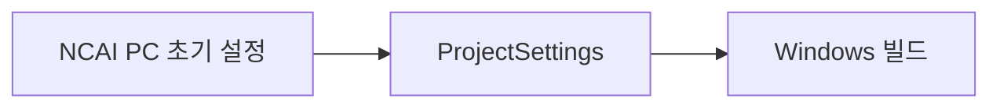

# 초기 PC 설정

> 관련 이슈: #46, #43 · 최종 수정: 2026-09-16

## 무엇을 하는가

Windows PC용 기본 해상도·창 모드·리사이즈·전체화면 전환과 Enter Play Mode 설정을 저장소 기준으로 고정한다.

## 왜 이 방법인가

| 방법 | 채택 | 이유 |
|---|---|---|
| 에디터에서 개인별 수동 설정 | ❌ | 팀원마다 빌드 동작이 달라진다 |
| `ProjectSettings`와 메뉴 도구로 공유 | ✅ | 설정을 코드·YAML로 검토할 수 있다 |

## 구조

| 클래스 | 경로 | 하는 일 |
|---|---|---|
| `ProjectSetup` | `Assets/Scripts/Editor/ProjectSetup.cs` | 메뉴에서 PC 기본 설정 적용 |

## 검증

- Unity 배치 검증에서 기본 1920×1080 및 회사/제품명 확인 완료 (2026-09-16).
- 8.2 재확인 (2026-09-16, #43): 임시 `-executeMethod` 배치(`-batchmode -quit -nographics`)로 `PlayerSettings` 실측 — Windowed 1920×1080, native resolution 해제, Resizable Window·Alt+Enter 전환 해제, Run In Background 꺼짐, Scripting Backend Mono, 스플래시 표시 켜짐(Unity 로고 포함), Product/Company Name `NCAIClicker`/`NCAITeamTwo`. 전 항목 #46 확정값과 일치. 임시 스크립트는 삭제했다.
- Play Mode 미검증.

## 알려진 한계

- 폰트 파일과 아이콘은 아직 배치하지 않았다 (#66).

## 갱신 이력

| 날짜 | 이슈 | 누가 | 무엇이 바뀌었나 |
|---|---|---|---|
| 2026-09-16 | #46 | Codex | PC 기본 설정과 검증 범위 기록 |
| 2026-09-16 | #43 | Claude | 8.2 재확인 — 실측값 기록, 아이콘 #66 분리 |
