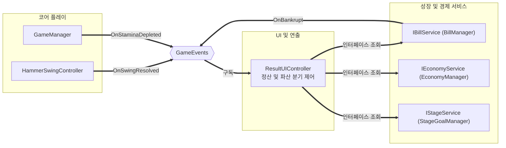

# 결과 화면 2종

> 관련 이슈: #34, #178 · 최종 수정: 2026.09.21

**이 문서는 로그다.** 이 기능을 고칠 때마다 갱신한다. 새 문서를 만들지 않는다.

## 무엇을 하는가

스태미나 소진 시의 하루 정산 화면과 고지서 미납 시의 파산 화면 2종을 분기 표시한다.
이번 런 획득 코인, 조준 정확도, 고지서 마감 상태, 단계 목표 달성 여부를 사용자에게 시각적으로 전달한다.

## 왜 이 방법인가

<table>
  <tr><th>검토한 방법</th><th>채택</th><th>이유</th></tr>
  <tr><td>Game.unity 씬을 직접 열어 UI 오브젝트 배치 후 저장</td><td>❌</td><td>Game 씬은 코어 플레이 담당 소유다. UI 담당자가 씬을 직접 고치면 가장 복잡한 씬 병합 충돌이 발생한다 (AGENTS.md 씬 소유권 규칙)</td></tr>
  <tr><td>ResultUI 프리팹을 제작하여 제공하고 스크립트로 분기 제어</td><td>✅</td><td>프리팹 형태로 넘기면 씬 수정 충돌 없이 코어 플레이 담당이 캔버스에 배치할 수 있다</td></tr>
  <tr><td>정확도 집계 시 모든 스윙(자동 망치 포함) 누적</td><td>❌</td><td>GDD 220행 및 ARCHITECTURE 361행에서 자동 망치를 정확도 분모 및 분자에서 제외하도록 명시했다. 플레이어의 실력을 순수하게 측정하기 위해 Hover 스윙만 집계한다</td></tr>
  <tr><td>GameEvents.OnStaminaDepleted 및 OnBankrupt 구독 기반 분기</td><td>✅</td><td>새로운 이벤트를 추가하지 않고 기존 동결된 이벤트를 그대로 활용하여 결합도를 낮춘다</td></tr>
  <tr><td>정산창 현장 납부·더블 오어 낫싱 처분: 현장 납부만 살리고 더블 오어 낫싱은 뺀다 (#222)</td><td>✅</td><td>코드를 확인해 보니 이미 이 상태였다 — <code>PayButton</code>은 #34 원본 구현부터 <code>HandlePayClicked</code>→<code>BillPanel.ShowAsModal()</code>로 실제 배선돼 있었고, #181·#212가 고지서 모달 쪽 납부·부족액 표시를 완성시키면서 새 규칙 없이 그대로 동작하게 됐다. <code>GambleButton</code>(더블 오어 낫싱)은 애초에 프리팹에 넣은 적이 없다 — <code>ResultUIChecks</code>가 "MVP 범위 밖이라 없어야 한다"고 계속 검증해 왔다. 도박 규칙을 GDD·BALANCE에 새로 정의할 여유가 7일 일정에 없어, 이미 그렇게 된 상태를 그대로 유지하기로 한다</td></tr>
</table>

## 구조



<table>
  <tr><th>클래스</th><th>경로</th><th>하는 일</th></tr>
  <tr><td>ResultUIController</td><td>Assets/Scripts/Runtime/UI/ResultUIController.cs</td><td>결과 화면 2종의 활성화 상태 제어, 조준 정확도 계산, 재도전 및 1일차 재시작 위임</td></tr>
  <tr><td>StaminaHud</td><td>Assets/Scripts/Runtime/UI/StaminaHud.cs</td><td>스태미나 잔여 수치 실시간 표기 (결과창 전환 트리거 확인용 임시 표기)</td></tr>
  <tr><td>InGameUIFallbackLoader</td><td>Assets/Scripts/Runtime/UI/InGameUIFallbackLoader.cs</td><td>Game 씬 로드 시 UI가 없을 때 런타임에 임시 Canvas 및 프리팹을 안전하게 띄우는 로더 (정식 UI 도입 시 자동 양보)</td></tr>
  <tr><td>ResultUIChecks</td><td>Assets/Scripts/Editor/ResultUIChecks.cs</td><td>조준 정확도 공식, 화면 분기 상태 전이, 스태미나 HUD 수치 갱신 자동 검증 (ValidationRunner 통합)</td></tr>
  <tr><td>ResultUIPrefabCreator</td><td>Assets/Scripts/Editor/ResultUIPrefabCreator.cs</td><td>ResultUI 및 StaminaHud 프리팹 에셋 생성 유틸리티</td></tr>
</table>

### 이벤트

<table>
  <tr><th>이벤트</th><th>발행 및 구독</th><th>언제</th></tr>
  <tr><td>GameEvents.OnSwingResolved</td><td>구독</td><td>HitSource.Hover 스윙의 적중 및 실패를 누적하여 정확도 계산</td></tr>
  <tr><td>GameEvents.OnStaminaDepleted</td><td>구독</td><td>스태미나 소진으로 런 정상 종료 시 하루 정산 화면 활성화</td></tr>
  <tr><td>GameEvents.OnBankrupt</td><td>구독</td><td>고지서 마감 미납 확정 시 파산 화면 활성화</td></tr>
</table>

### 읽는 밸런스 값

직접 CSV를 파싱하지 않으며, IEconomyService, IBillService, IStageService 공용 인터페이스를 통해 런타임 수치를 조회한다.
코인 개수 칸은 `IEconomyService.RunCoin`(금액)이 아니라 `IEconomyService.RunCoinBreakdown`(액면별 개수)을 합산해 채운다 —
`BalanceData.Coins`의 순서대로 프리팹의 4개 액면 슬롯("$1"/"$5"/"$25"/"$100")에 매핑한다 (#178).

## 하루의 흐름과 고지서 패널 (#34 범위 확대)

원작을 실측해 보니 결과 화면만으로는 하루가 닫히지 않는다. **정산창이 하루의 끝이면서 다음 하루의
관문이다.** 별도의 "턴 시작 화면" 은 없다.

```text
런 종료 → 정산창(지친 손!)
            ├ [업그레이드]  → 메뉴 화면 → 나가면 다음 런
            ├ [지금 납부]   → 고지서 모달 → 납부 → 정산창 복귀
            └ [계속]        → 다음 런
```

### 고지서 패널은 하나의 프리팹, 두 가지 상태

| | 모달 | 탭 |
|---|---|---|
| 언제 | 정산창의 납부 버튼 | 새 고지서가 발행될 때 |
| 상단 탭 줄 | 감춤 | 보임 |
| 우하단 계속하기 | 감춤 | 보임 |

**두 벌로 만들지 않는 이유**: 금액과 기한 표기가 조용히 어긋난다. 실제로 이 저장소에서
`ResultUI.prefab` 이 두 경로에 저장돼 갈라진 적이 있다.

### 기한 당일 처리

기한이 당일이면 기한 칸이 `지금 납부!` 로 바뀌고 **[아직] 버튼이 사라진다.** 잠그는 대신 감추는
이유는, 잠긴 버튼은 "왜 안 눌리지" 를 만들지만 없는 버튼은 질문을 만들지 않기 때문이다. 원작도 같다.

### 조립

컨트롤러끼리 서로를 찾지 않는다. `InGameUIFallbackLoader` 가 두 프리팹을 띄우고 이어 준다.

```text
BillPanel 생성 → SetServices(billService, economyService, legacyService, gameFlowService)
ResultUI 생성  → SetServices(경제·고지서·단계) + SetBillPanel(billPanel)
```

납부 버튼은 **낼 고지서가 있고 패널이 이어져 있을 때만** 열린다. 배선 없이 열어 두면 눌러도
아무 일이 없어 고장으로 읽힌다.

고지서 발신처와 제목은 `bill_names.csv` 가 정본이다. `BalanceData` 는 `Target`·`HammerSwingController`
와 같은 방식으로 프리팹에 직렬화해 둔다 — 씬을 건너 주입할 통로를 새로 만들지 않기 위해서다.

## 검증

EditMode 검증(ResultUIChecks) 및 Unity MCP 런타임 환경에서 확인했다.

* [x] 스윙 기록이 없을 때 정확도 0.0% 확인
* [x] 호버 스윙 1회 시도 1회 적중 시 정확도 100.0% 확인
* [x] 호버 스윙 2회 시도 1회 적중 시 정확도 50.0% 확인
* [x] HitSource.AutoHammer(자동 망치) 스윙은 정확도 분모 및 분자에서 제외됨을 확인
* [x] HideAll 호출 시 전체 패널 비활성화 확인
* [x] ShowSettlement 호출 시 정산 패널 활성화 및 파산 패널 비활성화 확인
* [x] ShowBankruptcy 호출 시 파산 패널 활성화 및 정산 패널 비활성화 확인
* [x] ResetRunStats 호출 시 스윙 통계 리셋 및 패널 닫힘 확인
* [x] StaminaHud 스태미나 수치(75/120, 0/120) 갱신 및 라벨 반영 확인
* [x] ValidationRunner 전체 17개 검증 하네스 일괄 통과 확인
* [x] Assets/Prefabs/Resources/UI/ResultUI.prefab 및 StaminaHud.prefab 단일 원본 유지 및 정상 로드 확인
* [x] 프리팹의 `[SerializeField]` 참조가 하나도 비어 있지 않음을 리플렉션으로 확인 (배열 원소 포함)
* [x] Assets/Prefabs/UI/ResultUI.prefab 사본이 남아 있지 않음을 확인
* [x] PayButton 이 프리팹 저장 시점에 interactable = false 임을 확인
* [x] GambleButton 이 프리팹에 없음을 확인 (MVP 범위 밖)
* [x] BillPanel 의 직렬화 참조가 하나도 비어 있지 않음을 확인
* [x] 모달에서 탭 줄과 계속하기가 감춰지고, 탭에서 둘 다 보임을 확인
* [x] 기한이 남으면 [아직] 이 보이고, 기한 당일에는 사라지며 표기가 "지금 납부!" 로 바뀜을 확인
* [x] 납부 완료 시 납부 버튼이 사라지고 표기가 "납부 완료" 로 바뀜을 확인
* [x] ValidationRunner 전체 19개 하네스 일괄 통과 확인
* [x] 코인 개수 칸이 `RunCoin`(금액)이 아니라 `RunCoinBreakdown`(액면별 개수 합)을 보여줌을 가짜 `IEconomyService`로 확인 — 개수와 금액이 실제로 다른 숫자임을 함께 확인 (#178)
* [x] 액면별 칸이 `coins.csv`/`BalanceData.Coins` 순서대로 채워지고, 안 뽑힌 액면은 0으로 표시됨을 확인 (#178)
* [x] `IEconomyService`가 없어도 예외 없이 0으로 채워짐을 확인 (#178)

## 알려진 한계 및 후속 과제

* ~~**납부 완료 뒤 퍼크 선택과 다음 날 준비 화면이 하나의 흐름으로 이어지지 않았다 (#249).**~~ — #249에서
  납부 완료를 실제 한 프레임 표시한 뒤 퍼크 선택 → 새 고지서 확인 → 스킬 트리 투자 메뉴 → 계속하기로 연결했다.
  각 구간은 `PostPaymentFlowState`로 저장되어 재실행해도 같은 화면에서 재개한다 (#255).
* Game.unity 씬에 프리팹을 실제 캔버스 하위로 영구 배치하는 작업은 씬 소유권 규칙에 따라 코어 플레이 담당이 진행한다.
* InGameUIFallbackLoader 는 6.1 정식 HUD가 유입되면 완전히 제거해야 할 임시 기술 부채다.
* 원작 정산 화면의 상세 요소는 **레이아웃만** 이식했다. 토니의 몫 10% 차감, 격파 저금통 집계, 해금 진행도는 조회 계약이 없어 값을 채우지 못하며 `ResultUIController.UnwiredPlaceholder`(`—`)로 표시한다. 0 을 넣지 않는 이유는 "정말 0"과 "배선 누락"이 구분되지 않기 때문이다. **코인 종류별(액면별) 환산은 #178 에서 해결** — `RunCoinBreakdown` 이 생기면서 자리표시자가 아니라 실제 개수를 표시한다.
* 코인 종류별 개수는 표시하지만, `targets.csv`의 `coin_count`/`min_denom_id`와 `coins.csv` 가중치가 아직 잠정값이라 (이슈 #176 대기, [coin-economy.md](coin-economy.md) 참고) 숫자 자체의 밸런스는 검증되지 않았다 — 배선만 검증했다.
* ~~정산창 현장 납부와 더블 오어 낫싱은 버튼만 배치하고 `interactable = false` 로 잠갔다. 도박 규칙이 GDD·BALANCE 어디에도 없어 동작을 정의할 수 없다.~~ **#222(4.15)에서 처분 확정·문서화(2026.09.21) — 현장 납부(PayButton)는 이미 배선돼 있었고(#34/#181/#212), 더블 오어 낫싱(GambleButton)은 애초에 프리팹에 없어 잠긴 버튼 자체가 남아 있지 않다.** Play Mode 실측으로 PayButton `interactable=true`·클릭 시 고지서 모달 정상 진입, 정산창 버튼 5개(Upgrade/Pay/Continue/Restart/MainMenu) 전부 `interactable=true` 확인, `ValidationRunner` 26개 검증 클래스 전부 PASS 확인.
* 파산 시 보유 코인 초기화는 공용 지갑 비우기 계약(#158)이 적용되기 전까지 뷰 상의 안내 문구로 먼저 반영되어 있다.

## 갱신 이력

<table>
  <tr><th>날짜</th><th>이슈</th><th>누가</th><th>무엇이 바뀌었나</th></tr>
  <tr><td>2026.09.18</td><td>#34</td><td>saltlake00</td><td>최초 작성. ResultUIController 구현, ResultUI 프리팹 생성, ResultUIChecks 9개 검증 작성 및 통과</td></tr>
  <tr><td>2026.09.18</td><td>#34</td><td>saltlake00</td><td>원작 구조로 레이아웃 교체 — 좌측 명세 / 우측 집계 2컬럼을 LayoutGroup 으로 조립, 미배선 칸은 자리표시자, 납부·도박 버튼 잠금. 프리팹 저장 경로를 Resources 한 곳으로 정리하고 프리팹 검증 4건 추가</td></tr>
  <tr><td>2026.09.18</td><td>#34</td><td>saltlake00</td><td>StaminaHud 구현, StaminaHud.prefab 생성, 검증 하네스 11개로 확장 및 통과</td></tr>
  <tr><td>2026.09.18</td><td>#34</td><td>saltlake00</td><td>프리팹 중복 제거(Resources 단일화), 매니저 구현체 직접 참조 제거 및 인터페이스 조회 전환, HammerSwingVisual 초기 가시성 동기화, stamina.csv 6.5 반영</td></tr>
  <tr><td>2026.09.21</td><td>#178</td><td>yahoo-afk</td><td>코인 개수 칸을 `RunCoin`(금액) 대신 `RunCoinBreakdown`(액면별 개수 합)으로 교체 — 개수와 금액이 항상 같던 버그 수정. 액면별 개수 표시 배선(`UpdateDenomCounts`) 추가, 플레이스홀더였던 코인 종류별 환산 항목 해소. 프리팹은 이미 4개 액면 슬롯이 있어 변경 없음</td></tr>
  <tr><td>2026.09.22</td><td>#184</td><td>saltlake00</td><td>정산창 고지서 정보를 한 줄로 통합 — 부제 두 조각("고지서 마감: N일 남음 (N원)" / "N단계 고지서 $N 미납")을 <code>N단계 고지서 $N · 마감 N일 남음</code> 하나로 합치고 <code>_stageGoalText</code> 는 비워 둔다(프리팹 호환용으로 필드 유지). 버튼 3종(업그레이드·납부·계속)을 Base 톤으로 통일하고, <code>ResultUIPrefabCreator.CreateButton</code> 을 테두리 Image(targetGraphic)+면(Fill) 구조로 바꿔 호버·눌림에서 테두리가 금색으로 바뀌게 했다 — 전에는 어두운 면에 흰색 틴트라 호버가 보이지 않아 눌리지 않는 것처럼 읽혔다. <code>ResultUIChecks</code>·<code>UiGuidelineChecks</code> 통과</td></tr>
  <tr><td>2026.09.21</td><td>#222</td><td>Claude</td><td>정산창 잠긴 버튼 2종 처분 확정. 코드 변경 없음 — 현장 납부(PayButton)가 이미 배선돼 있었고 더블 오어 낫싱(GambleButton)은 애초에 없었음을 Play Mode 실측으로 확인하고 알려진 한계·왜 이 방법인가 표에 근거 기록</td></tr>
  <tr><td>2026.09.22</td><td>#249</td><td>saltlake00</td><td>납부 후 퍽 선택 및 스킬 트리 안내 흐름 전체 연결 완료</td></tr>
</table>
