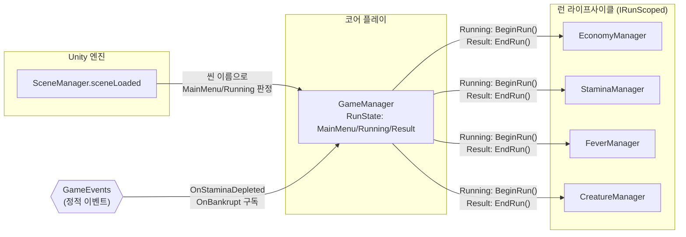

# 런 상태 머신

> 관련 이슈: #20, #111, #21, #142, #140 · 최종 수정: 2026-09-17

**이 문서는 로그다.** 이 기능을 고칠 때마다 갱신한다. 새 문서를 만들지 않는다.

## 무엇을 하는가

`GameManager`가 게임의 논리적 상태(`RunState`: `MainMenu` / `Running` / `Result`)를 관리한다.
`MainMenu ↔ Running` 전이는 실제로 로드된 Unity 씬을 그대로 따르고, `Running → Result` 전이는
스태미나 소진·파산 이벤트로 결정한다.

이슈 #111과 #140에서 `Running` 전이 시 `IRunScoped.BeginRun()`, `Result` 전이 시 `IRunScoped.EndRun()` 을
호출하여 매니저 구현 클래스를 직접 잡지 않고 다형적으로 런 시작과 종료를 배선한다.
게임 규칙은 [GDD](../GDD.md)에 있으니 여기서 반복하지 않는다.

## 왜 이 방법인가

| 검토한 방법 | 채택 | 이유 |
|---|---|---|
| `MainMenu`/`Running` 전이를 `SceneManager.sceneLoaded` + 활성 씬 이름으로 판정 | ✅ | ARCHITECTURE.md 0절이 이미 "아무 씬이나 열어도 매니저가 정상 동작해야 한다"고 요구한다. 씬 이름이 상태의 유일한 근거이므로 개발자가 `Game` 씬을 바로 열고 Play 해도 별도 처리 없이 `Running`으로 초기화된다 |
| `StartRun()`/`ReturnToMainMenu()` 같은 public 메서드를 두고 (아직 없는) UI 버튼이 직접 호출 | ❌ | 시작 버튼(6.7 메인 메뉴)과 결과 화면(6.2)이 아직 없다. 존재하지 않는 소비자를 위해 API 형태를 지금 확정하면 나중에 실제 UI가 붙을 때 다시 바꿔야 할 가능성이 높다 — 과설계 |
| `Running → Result` 전이에 새 이벤트(`OnRunStateChanged` 류)를 추가 | ❌ | ARCHITECTURE.md 3절에 동결된 이벤트 목록에 없다. 새 이벤트 추가는 공용 계약 변경이라 구현 전 별도 이슈 발의가 필요한데(AGENTS.md), 지금 이 이벤트를 소비할 코드가 없어 필요성이 확인되지 않았다 |
| `Running → Result` 전이에 기존 동결 이벤트(`OnStaminaDepleted`, `OnBankrupt`) 재사용 | ✅ | ARCHITECTURE.md 2절 "하루 종료 순서"에 "GameManager만 이 두 이벤트를 구독해 종료 순서를 조정한다"고 이미 명시돼 있다. 새 계약이 필요 없다 |
| 매니저 구현 클래스를 직접 참조해 `BeginRun()`/`EndRun()` 호출 | ❌ | AGENTS.md "다른 매니저 구현 클래스를 직접 참조하지 않는다" 규칙을 위반한다 |
| `IRunScoped` 인터페이스 목록을 취득해 일괄 호출 (`GetComponentsInChildren<IRunScoped>`) | ✅ | 구체 클래스 의존성을 100% 제거하고 다형적으로 라이프사이클을 통지한다 (이슈 #111, #140) |
| `RunState` 조회용 새 인터페이스(`IRunStateService`) 추가 | ❌ | ARCHITECTURE.md 2절에 동결된 인터페이스는 `IHittable`/`IEconomyService`/`IBillService`/`ISaveService` 넷뿐이다. 아직 `RunState`를 읽어야 하는 다른 모듈이 없어 인터페이스를 먼저 얼릴 근거가 없다 |
| `RunState` 조회는 `GameManager.Instance` 정적 프로퍼티(구체 클래스)로 노출 | ✅ (임시) | 당장 소비자가 없으므로 `SaveManager.Instance` 패턴(구체 싱글톤)만 따르고, 실제 소비자가 생기면 그때 공용 계약(이벤트 또는 인터페이스) 추가를 먼저 발의한다 |

## 구조

<!-- GameEvents 를 거치는 관계는 이벤트 노드를 경유해 그린다. 모듈끼리 직접 잇지 않는다 -->

| 클래스 | 경로 | 하는 일 |
|---|---|---|
| `GameManager` | `Assets/Scripts/Runtime/Core/GameManager.cs` | 런 상태 소유. 씬 로드로 `MainMenu`/`Running`을, 이벤트로 `Result`를 결정한다. `IRunScoped` 런 시작·종료 배선. `Managers` 프리팹(Resources)에 부착 |
| `RunState` | `Assets/Scripts/Runtime/Core/RunState.cs` | `MainMenu` / `Running` / `Result` 세 값의 열거형 |

### 이벤트

| 이벤트 | 발행/구독 | 언제 |
|---|---|---|
| `GameEvents.OnStaminaDepleted` | 구독 | `CurrentState == Running`일 때만 `Result`로 전이 |
| `GameEvents.OnBankrupt` | 구독 | `CurrentState == Running`일 때만 `Result`로 전이 |

`GameManager`는 이번 작업에서 새 이벤트를 발행하지 않는다 (위 "왜 이 방법인가" 참고).

### 읽는 밸런스 값

없음 — 이 기능은 CSV 값을 읽지 않는다.

## 검증

Unity MCP 및 에디터 검증 배치로 확인했다.

- [x] `MainMenu` 씬에서 Play → `GameManager.Instance.CurrentState == MainMenu`
- [x] `SceneManager.LoadScene("Game")` 호출 → 콘솔에 `[GameManager] MainMenu -> Running` 로그, `CurrentState == Running`
- [x] `Running` 전이 시 `IRunScoped.BeginRun()` 호출 확인 (Economy → Stamina → Fever 순서 보장)
- [x] `GameEvents.PublishStaminaDepleted()` 강제 발행(Running 상태에서) → `CurrentState == Result` 및 `IRunScoped.EndRun()` 호출
- [x] `GameEvents.PublishBankrupt()` 발행 시 → `CurrentState == Result` 및 `IRunScoped.EndRun()` 호출
- [x] `SceneManager.LoadScene("MainMenu")` 호출 → `CurrentState == MainMenu`로 복귀 및 런 정리
- [x] `Game` 씬을 처음부터 직접 열고 Play(개발자가 자주 쓰는 경로) → `Awake` 초기값이 `CurrentState == Running`으로 정상 계산되고 `Start()`에서 런 활성화
- [x] `ContractsValidationChecks.RunBatch()` 자동 검증에 GameManager 라이프사이클 테스트 포함 및 통과

### #21 첫 완주 반복 검증 (2026-09-17)

완료 기준 "시작→정산→재도전을 빌드에서 반복 가능"을 확인하기 위해 에디터 Play Mode에서
시작→정산→재도전 4사이클(정산 2회, 재도전 2회)을 반복 실행했다.

- [x] `Running` 상태에서 `GameEvents.PublishStaminaDepleted()` 발행 → `Running -> Result` 로그가
  **사이클마다 정확히 1회만** 출력됨(구독 중복 없음 — AGENTS.md가 경고하는 "코인 2배" 버그 클래스 확인)
- [x] `SceneManager.LoadScene("Game")`로 재도전 반복 → `Result -> Running` 로그 1회, `EconomyManager.RunCoin`이
  매 사이클 0으로 정상 리셋
- [x] `GameManager`/`StaminaManager` 인스턴스가 재도전 반복 동안 `DontDestroyOnLoad`로 동일 인스턴스 유지(재생성 아님)
- [x] 콘솔 warning/error 0건

**한계**: 결과 화면 UI(#34, 재도전 버튼)가 아직 없어 `SceneManager.LoadScene("Game")` 직접 호출로 재도전을 대신했다. 스태미나 자연 소진(자동 망치 타격 누적)이 아닌 `GameEvents.PublishStaminaDepleted()` 직접 발행으로 소진을 시뮬레이션했다.
(참고: 기존 에디터 Play Mode 전용 검증의 한계였던 "빌드 시 크리처 누락 결함"은 이슈 #140에서 StandaloneWindows64 패키징 빌드 직접 실행 검증을 완료하여 해소됨.)

## 알려진 한계

- `RunState`를 다른 모듈이 읽으려면 지금은 `GameManager.Instance`(구체 클래스) 직접 참조뿐이다. 실제 소비자(예: HUD, 결과 화면)가 생기면 "다른 매니저 구현 클래스 직접 참조 금지" 규칙과 부딪히므로, 그때 이벤트 또는 인터페이스 추가를 공용 계약 변경 이슈로 먼저 발의해야 한다.
  ~~씬 전환 API(`StartRun()` 류)도 같은 문제가 될 것이다~~ — 이슈 #142에서 실제로 그렇게 됐다. 6.7 메인 메뉴(#90)가 `GameManager.Instance`를 구체 클래스로 직접 참조하자 convention-checker가 규칙 위반을 지적했고, `IGameFlowService`(`StartNewRun`/`ContinueRun`/`QuitGame`)를 발의해 `Instance`를 그 인터페이스 타입으로 노출하도록 고쳤다 (상세는 [main-menu.md](main-menu.md), 계약은 [contracts.md](contracts.md)). `CurrentState` 조회는 여전히 소비자가 없어 이 한계가 남아 있다.
- ~~`EconomyManager.BeginRun()`/`RestoreWallet()` 호출을 GameManager가 아직 연결하지 않았다.~~ — 이슈 #111에서 `IRunScoped` 인터페이스를 확장하고, `GameManager`가 `IRunScoped` 컴포넌트들을 취득해 `BeginRun()`과 `EndRun()`을 일괄 호출하도록 배선 완료.
- 청구서 마감·납부·대출·파산 판정 등 "하루 종료 순서"(ARCHITECTURE.md 2절) 전체 오케스트레이션은 구현하지 않았다. 이번 이슈는 `Result` 전이 및 매니저 런 라이프사이클 종료만 담당하며, 나머지는 4.x 이슈들 몫이다.

## 갱신 이력

| 날짜 | 이슈 | 누가 | 무엇이 바뀌었나 |
|---|---|---|---|
| 2026-09-17 | #20 | Claude | 최초 작성 — `GameManager`/`RunState` 구현, 씬 로드 기반 전이 + `OnStaminaDepleted`/`OnBankrupt` 기반 `Result` 전이 |
| 2026-09-17 | #111 | saltlake00 | `IRunScoped` 기반 `BeginRun()`/`EndRun()` 매니저 배선 추가, 초기화 순서 준수(Economy -> Stamina -> Fever) |
| 2026-09-17 | #21 | Claude | 첫 완주 빌드 검증 — 시작→정산→재도전 반복 실행으로 구독 중복(코인 2배 버그) 없음과 상태·런코인 정상 리셋 확인 |
| 2026-09-17 | #142 | hunil58 | `GameManager.Instance`를 신규 `IGameFlowService` 인터페이스 타입으로 노출(계약 변경). "알려진 한계"가 예견한 대로 6.7 메인 메뉴(#90)가 실제 소비자가 되면서 구체 클래스 직접 참조 위반을 convention-checker가 발견해 정정 |
| 2026-09-17 | #140 | saltlake00 | `CreatureManager`를 `IRunScoped` 라이프사이클에 배선(순서 4), StandaloneWindows64 빌드 실행으로 런 시작 시 크리처 6마리 정상 스폰 확인 |
