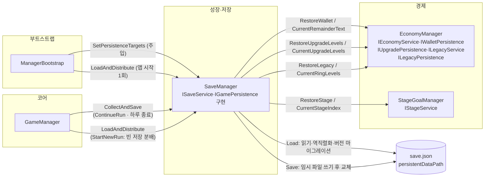

# 저장·불러오기

> 관련 이슈: #25, #76, #139, #203 · 최종 수정: 2026-09-21

**이 문서는 로그다.** 이 기능을 고칠 때마다 갱신한다. 새 문서를 만들지 않는다.

## 무엇을 하는가

`SaveData` DTO를 `Application.persistentDataPath/save.json` 파일 하나로 저장·불러온다.
직렬화 규격·버전 정책·저장 시점은 [ARCHITECTURE.md](../ARCHITECTURE.md) 2절("직렬화 방식", "저장 경계")이 정본이다.

#203 에서 **매니저와 저장을 잇는 배선**이 붙었다. 그전까지 `SaveManager` 는 파일을 읽고 쓸 줄만
알았고 그 값을 누구에게서 모으고 누구에게 돌려줄지는 아무도 정하지 않아서, 업그레이드 레벨·
레거시 포인트·반지가 앱을 끄면 사라졌다.

## 왜 이 방법인가

| 검토한 방법 | 채택 | 이유 |
|---|---|---|
| Unity 내장 `JsonUtility` | ✅ | ARCHITECTURE 2절이 요구한다. Newtonsoft 등 추가 패키지는 PATTERNS.md 8절 기조(패키지 의존성 최소화)와 맞지 않는다 |
| 저장 직전 임시 파일(`.tmp`)에 쓰고 `File.Replace`/`Move`로 교체 | ✅ | 쓰는 도중 종료돼도 기존 `save.json`은 멀쩡히 남는다. 원본에 바로 덮어쓰면 중단 시 파일이 반쯤 망가진 채 남는다 |
| `ActiveBill`/`ActiveLoan`이 없을 때 필드를 `null`로 두고 `JsonUtility`가 알아서 처리하게 둔다 | ❌ | ARCHITECTURE.md에 그렇게 적혀 있었지만 **실제로는 틀렸다.** `JsonUtility`는 참조 타입 필드의 `null`을 직렬화하지 못하고 필드 기본값을 채운 빈 객체로 되살린다. Unity 에디터에서 직접 왕복 테스트로 확인했다 |
| `SaveData`에 `HasActiveBill`/`HasActiveLoan` bool 플래그 추가, `SaveManager`가 null ↔ 플래그를 변환 | ✅ | 위 문제의 해법. 변환을 `SaveManager` 안에만 가두면 다른 매니저는 여전히 `ActiveBill == null`만 보고 판단할 수 있어 ARCHITECTURE의 "없으면 null" 계약을 메모리상에서는 그대로 지킨다. 별도 계약 변경 이슈(#76)로 합의했다 |
| `Bill`/`Loan`을 값 타입(struct)으로 바꾸고 "0원짜리 대출"을 곧 "없음"으로 취급 | ❌ | `Loan.Principal == 0`이 실제로 유효한 상태(예: 상환 직후 유예)와 겹칠 수 있어 있음/없음 구분이 흐려진다. 명시적 플래그가 더 명확하다 |
| `SaveManager`가 `EconomyManager`를 직접 참조해 불러온 값을 즉시 복원 | ❌ | `RestoreWallet` 등은 `IEconomyService`에 없는 concrete 전용 API라 직접 참조하면 ARCHITECTURE 2절의 매니저 간 직접 참조 금지와 충돌한다. [coin-economy.md](coin-economy.md) 알려진 한계에 이미 "공용 계약 변경 이슈가 필요하다"고 기록돼 있어, 이슈 #25 범위에서는 손대지 않고 `ISaveService` 구현만 완결했다 |
| `SaveManager.Instance`를 `SaveManager` 구현 타입으로 노출 | ❌ | 다른 매니저가 구현 클래스를 직접 참조하게 된다. `ISaveService` 타입으로 노출해 계약에만 의존하게 했다 |

### 배선 (#203)

| 검토한 방법 | 채택 | 이유 |
|---|---|---|
| `ManagerBootstrap`이 `SetPersistenceTargets(...)`로 대상을 주입 | ✅ | 조립하는 지점 한 곳만 구현 클래스를 안다는 ARCHITECTURE 2절 규칙 그대로다. 새 공용 조회 통로를 열 필요도 없었다 |
| `SaveManager`가 `EconomyManager.Instance` 등을 직접 찾아 나선다 | ❌ | 매니저가 매니저를 뒤지는 경로가 생긴다. 게다가 영속 계약(`IUpgradePersistence`·`ILegacyPersistence`)용 정적 통로는 열려 있지도 않아 새로 열어야 했다 — 계약을 늘리지 않고 끝내는 편이 낫다 |
| 수집·분배를 `ISaveService`에 추가 | ❌ | 소비처가 다르다. 메인 메뉴는 `HasSave`만 쓰는데 한 계약에 묶으면 그쪽에서도 수집·분배가 보인다. `IGamePersistence`로 나눴다 |
| 수집·분배를 `IRunScoped`(`BeginRun`/`EndRun`)로 대신 | ❌ | 복원은 **모든** `BeginRun`보다 앞, 저장은 **모든** `EndRun`보다 뒤여야 하는데 `GameManager`는 두 경계에 같은 순서 배열을 쓴다. 한 순번으로 양쪽 끝을 잡을 수 없다 |
| 씬이 로드될 때마다 복원 | ❌ | **처음엔 이렇게 했다가 되돌렸다.** 매니저는 `DontDestroyOnLoad`라 씬을 다시 로드해도 값을 들고 있다 — 저장을 덮어씌우면 마지막 저장 이후의 변경이 사라진다. 실제로 고지서 화면에서 반지를 사고 "다음 날"을 누르면 구매가 통째로 되돌아갔다 (500점 → 구매 후 497점·1레벨 → 복원 후 500점·0레벨) |
| 복원은 앱이 켜질 때 `ManagerBootstrap`에서 한 번만 | ✅ | 저장은 기록이지 살아 있는 값의 출처가 아니다. `Instantiate`가 `Awake`를 이미 돌린 뒤이고 첫 씬은 아직 로드되지 않아, 어느 `BeginRun`보다도 앞선다 |
| 새 회차는 빈 저장을 쓰는 것으로 충분 | ❌ | 파일만 비우면 업그레이드·반지가 메모리에 남아 직전 회차의 성장을 달고 시작한다. `StartNewRun`이 빈 저장을 곧바로 **분배**해 명시적으로 지운다 — 이 게임에서 성장을 지우는 유일한 지점이다 (파산은 지우지 않는다, #183) |
| 구매할 때마다 저장 | ❌ | `EconomyManager`가 저장을 부르게 되어 매니저 간 결합이 늘고, 구매 UI 세 곳을 모두 고쳐야 한다. 대신 고지서 화면을 떠나는 `ContinueRun`에서 저장한다 — ARCHITECTURE 저장 경계의 "런 시작 직전"이 그 지점이다 |

## 구조

이벤트를 거치는 관계가 없어 `GameEvents` 노드는 그리지 않았다. `SaveManager`가 `EconomyManager`
상자로 향하는 화살표는 전부 **인터페이스 호출**이다 — 구현 클래스를 아는 것은 `ManagerBootstrap`
하나뿐이고, 지금 한 클래스가 다섯 계약을 모두 구현하지만 나뉘어도 배선 코드는 그대로다.

| 클래스 | 경로 | 하는 일 |
|---|---|---|
| `SaveManager` | `Assets/Scripts/Runtime/SaveManager.cs` | `ISaveService` 구현. `JsonUtility` 직렬화, 버전 마이그레이션, 손상 파일 백업, null↔`Has*` 플래그 변환. `Managers` 프리팹에 붙는다 |
| `SaveData` | `Assets/Scripts/Runtime/Data/SaveData.cs` | 저장 DTO. 이번 작업에서 `HasActiveBill`·`HasActiveLoan` 필드 추가 |
| `ISaveService` | `Assets/Scripts/Runtime/Interfaces/ISaveService.cs` | `Load()`/`Save(SaveData)`/`HasSave` 계약 |
| `IGamePersistence` | `Assets/Scripts/Runtime/Interfaces/ISaveService.cs` | 수집·분배 계약(#203). `SaveManager.Persistence`가 이 타입으로 노출. `ManagerBootstrap`과 `GameManager`만 쓴다 |
| `ManagerBootstrap` | `Assets/Scripts/Runtime/ManagerBootstrap.cs` | `WirePersistence()`로 저장 대상 6개를 주입하고, 이어서 복원을 **한 번** 실행 (#203) |
| `GameManager` | `Assets/Scripts/Runtime/Core/GameManager.cs` | 저장 시점 둘(`ContinueRun`·`NotifyEndRun`)과 새 회차 초기화(`StartNewRun`) (#203) |
| `SavePersistenceChecks` | `Assets/Scripts/Editor/SavePersistenceChecks.cs` | 저장 왕복·길이 불일치·호출부 존재 검증 15건 (#203) |

### 이벤트

없음. `GameEvents`를 구독·발행하지 않는다 — 저장/로드는 다른 매니저가 즉시 반응해야 할 상태 변화가 아니다.

### 읽는 밸런스 값

없음.

## 검증

Unity 6000.3.21f1 에디터, `UnityMCP execute_code`로 Edit Mode에서 직접 실행, 2026-09-16.

- [x] 컴파일: `refresh_unity(compile: request)` 후 콘솔 오류·경고 0건
- [x] `ActiveBill`이 있고 `ActiveLoan`이 `null`인 상태로 저장 → 로드 왕복: `TotalCoin`·`UpgradeLevels`·`ActiveBill.Amount` 그대로 유지, `ActiveLoan == null` 유지 확인
- [x] `ActiveBill`·`ActiveLoan` 둘 다 `null`인 상태로 저장 → 로드 왕복: 둘 다 `null` 유지 확인
- [x] 저장 파일이 없을 때 `Load()` → `Version == 2`, 기본값(`TotalCoin == 0`) 반환 확인
- [x] 손상된 JSON(`{ this is not valid json`) 로드 → `save.json.bak` 생성, 기본값으로 초기화 확인
- [x] 미지원 버전(예: 99) 로드 → `save.json.bak` 생성, 기본값으로 초기화 확인
- [x] v1 스타일 JSON(회차 정보 필드 전부 없음) 로드 → `Version`이 2로 올라가고, `CurrentDay`·`BillIndex`·`LastLoanRepaidDay`가 필드 이니셜라이저 기본값(1, 1, -1)으로 채워지며, `TotalCoin`(성장 데이터)은 유지되고, `ActiveBill`·`ActiveLoan`은 `null`로 정상 복원됨을 확인
- [x] `convention-checker` 에이전트 점검 통과 (ARCHITECTURE.md `SaveData` 정의에 `Has*` 필드 반영 필요하다는 지적 1건 반영 완료, 그 외 위반 없음)
- [x] `Managers.prefab`에 `SaveManager` 컴포넌트 부착. 프리팹을 `Instantiate`해 `EconomyManager`·`SaveManager`가 함께 존재하고 `SaveManager.Instance`가 `Awake()`에서 정상 설정됨을 확인
- [x] 기존 `ManagerBootstrapTests`(PlayMode, MainMenu↔Game 전환 후 `Managers` 단일 인스턴스 확인) 1/1 통과 — 컴포넌트 추가로 인한 회귀 없음
- [ ] **씬을 실제로 Play 해서 로드된 상태로 저장·불러오기를 실행하는 경로는 미검증** — Save/Load 자체 검증은 Edit Mode에서 `AddComponent`로 만든 임시 오브젝트로 직접 호출했다

### 배선 (2026-09-21, #203)

`SavePersistenceChecks.RunBatch()` — `[SavePersistenceChecks] PASS 15 checks.`

- [x] 코인·소수 잔여·업그레이드 레벨·레거시 포인트·반지 레벨·단계를 저장 → 전부 0으로 비운 뒤 복원 → 원래 값으로 돌아온다
- [x] `UpgradeLevels`·`RingLevels` 길이가 CSV와 다를 때(짧을 때·길 때·`null`일 때) 겹치는 만큼만 채우고 예외가 나지 않는다
- [x] v2 이하 저장(`RingLevels`가 `null`)을 읽어도 깨지지 않는다
- [x] 저장 파일이 없을 때 복원하면 코인 0·단계 0
- [x] 고지서·대출은 담지 않는다 (`HasActiveBill == false`, `ActiveBill == null`)
- [x] 전체 검증 회귀: 23개 검증 스위트 전부 통과

**변이 시험** — 검사가 정말로 결함을 잡는지 하나씩 결함을 넣고 확인했다. 왕복 검증만으로는
전부 놓친다(왕복은 `SetPersistenceTargets`를 직접 부르므로 호출부가 지워져도 초록이다).

| 넣은 결함 | 결과 |
|---|---|
| `ManagerBootstrap`에서 `WirePersistence(_instance)` 삭제 | 실패 — "주입이 빠지면 저장 대상이 전부 null" |
| `ManagerBootstrap`에서 `save.LoadAndDistribute()` 삭제 | 실패 — "켤 때 아무것도 되돌아오지 않습니다" |
| `GameManager`에서 `CollectAndSave()` 호출 삭제 | 실패 — "저장 시점이 없습니다" |
| `HandleSceneLoaded`에 `LoadAndDistribute()` 다시 추가 | 실패 — "씬 로드마다 복원하면 마지막 저장 이후의 구매가 사라집니다" |
| `StartNewRun`에서 `LoadAndDistribute()` 삭제 | 실패 — "업그레이드·반지가 메모리에 남아 새 회차로 넘어갑니다" |
| `ContinueRun`에서 `CollectAndSave()` 삭제 | 실패 — "고지서 화면에서 산 업그레이드·반지가 종료 시 사라집니다" |

첫 시도의 `WirePersistence` 검사는 **메서드가 있는지만 봐서 변이를 놓쳤다.** 호출부 문자열을
직접 확인하도록 고친 뒤 다시 잡혔다. 같은 이유로 `HandleSceneLoaded`·`StartNewRun`·`ContinueRun`
검사는 파일 전체가 아니라 **메서드 본문만 잘라내어** 본다 — 다른 메서드의 호출이 대신 걸리면
"어느 메서드에 두었는가"라는 이 카드의 핵심이 검사에서 빠진다.

- [ ] **Play Mode 미검증** — 앱을 실제로 껐다 켜서 복원되는지는 아직 확인하지 않았다.

## 알려진 한계

- ~~**자동 로드/저장 호출부가 없다.**~~ — #203 에서 풀었다. `IEconomyService`에 없는 concrete API 문제는 계약을 늘리는 대신 `ManagerBootstrap` 주입으로 우회했다.
- **고지서·대출·퍼크 후보를 저장하지 않는다.** `IBillService`에 복원 통로가 없어 담아 봐야 되돌릴 수 없다 — 쓰기만 하고 읽지 못하는 필드는 "저장된다"는 착각만 만든다 ([billing.md](billing.md) 알려진 한계). 별도 계약 이슈가 먼저다. 같은 이유로 `LastRunCoin`·`WasBankrupt`·`ResumePoint`·`BestRunCoin`도 아직 수집하지 않는다.
- **저장 시점이 ARCHITECTURE 저장 경계보다 성기다.** 경계는 "구매·납부를 완료한 직후"도 요구하지만, 현재 배선은 고지서 화면을 떠날 때(`ContinueRun`)와 하루 종료 직후 둘뿐이다. 구매 직후 앱이 강제 종료되면 그 구매를 잃는다.
- **런 도중 종료 시 그 런의 시작 스냅샷으로 복귀하지 않는다.** 저장이 하루 종료 시점에만 찍히므로 결과적으로는 비슷하게 동작하지만, 의도한 규칙을 코드가 보장하지는 않는다.
- **테스트 asmdef가 런타임 코드를 참조하지 못하는 기존 제약**([manager-bootstrap.md](manager-bootstrap.md) 참고)이 여기도 적용된다. 그래서 자동화된 `Tests/PlayMode` 테스트 대신 `execute_code`로 직접 실행해 확인했다 — 코드 변경 때마다 재현 가능한 회귀 테스트로 남지 않는다.
- `BackupCorruptFile()`은 `save.json.bak` 하나만 유지한다. 손상이 반복되면 이전 백업을 덮어쓴다.
- 동시에 여러 곳에서 `Save()`를 호출할 때의 경합은 고려하지 않았다 — 이 게임은 단일 스레드에서 메인 루프만 저장을 호출한다고 가정한다.

## 갱신 이력

| 날짜 | 이슈 | 누가 | 무엇이 바뀌었나 |
|---|---|---|---|
| 2026-09-16 | #25, #76 | hunil58 | 최초 작성. `SaveManager` 구현(직렬화, 버전 마이그레이션, 손상 파일 백업), `JsonUtility` null 직렬화 불가 문제 발견 및 `HasActiveBill`/`HasActiveLoan` 플래그로 수정. `Managers.prefab`에 컴포넌트 부착 및 검증 완료로 알려진 한계 항목 갱신 |
| 2026-09-17 | #139 | hunil58 | `ISaveService.HasSave` 추가(6.7 메인 메뉴 #90 착수 중 발견), `SaveManager.HasSave => File.Exists(SavePath)` 구현. 자동 로드/저장 배선 한계와는 무관함을 명시 |
| 2026-09-21 | #203 | twins6375-art | 매니저↔저장 배선. `IGamePersistence` 계약 추가, `ManagerBootstrap` 주입 + 앱 시작 1회 복원, `GameManager` 저장 시점 둘과 새 회차 초기화. `SavePersistenceChecks` 15건. "자동 로드/저장 호출부가 없다" 한계 해소 |
