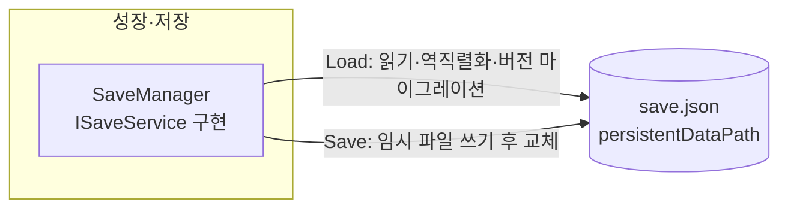

# 저장·불러오기

> 관련 이슈: #25, #76 · 최종 수정: 2026-09-16

**이 문서는 로그다.** 이 기능을 고칠 때마다 갱신한다. 새 문서를 만들지 않는다.

## 무엇을 하는가

`SaveData` DTO를 `Application.persistentDataPath/save.json` 파일 하나로 저장·불러온다.
직렬화 규격·버전 정책·저장 시점은 [ARCHITECTURE.md](../ARCHITECTURE.md) 2절("직렬화 방식", "저장 경계")이 정본이다.

## 왜 이 방법인가

| 검토한 방법 | 채택 | 이유 |
|---|---|---|
| Unity 내장 `JsonUtility` | ✅ | ARCHITECTURE 2절이 요구한다. Newtonsoft 등 추가 패키지는 PATTERNS.md 8절 기조(패키지 의존성 최소화)와 맞지 않는다 |
| 저장 직전 임시 파일(`.tmp`)에 쓰고 `File.Replace`/`Move`로 교체 | ✅ | 쓰는 도중 종료돼도 기존 `save.json`은 멀쩡히 남는다. 원본에 바로 덮어쓰면 중단 시 파일이 반쯤 망가진 채 남는다 |
| `ActiveBill`/`ActiveLoan`이 없을 때 필드를 `null`로 두고 `JsonUtility`가 알아서 처리하게 둔다 | ❌ | ARCHITECTURE.md에 그렇게 적혀 있었지만 **실제로는 틀렸다.** `JsonUtility`는 참조 타입 필드의 `null`을 직렬화하지 못하고 필드 기본값을 채운 빈 객체로 되살린다. Unity 에디터에서 직접 왕복 테스트로 확인했다 |
| `SaveData`에 `HasActiveBill`/`HasActiveLoan` bool 플래그 추가, `SaveManager`가 null ↔ 플래그를 변환 | ✅ | 위 문제의 해법. 변환을 `SaveManager` 안에만 가두면 다른 매니저는 여전히 `ActiveBill == null`만 보고 판단할 수 있어 ARCHITECTURE의 "없으면 null" 계약을 메모리상에서는 그대로 지킨다. 별도 계약 변경 이슈(#76)로 합의했다 |
| `Bill`/`Loan`을 값 타입(struct)으로 바꾸고 "0원짜리 대출"을 곧 "없음"으로 취급 | ❌ | `Loan.Principal == 0`이 실제로 유효한 상태(예: 상환 직후 유예)와 겹칠 수 있어 있음/없음 구분이 흐려진다. 명시적 플래그가 더 명확하다 |
| `SaveManager`가 `EconomyManager`를 직접 참조해 불러온 값을 즉시 복원 | ❌ | `RestoreWallet` 등은 `IEconomyService`에 없는 concrete 전용 API라 직접 참조하면 ARCHITECTURE 2절의 매니저 간 직접 참조 금지와 충돌한다. [coin-economy.md](coin-economy.md) 알려진 한계에 이미 "공용 계약 변경 이슈가 필요하다"고 기록돼 있어, 이슈 #25 범위에서는 손대지 않고 `ISaveService` 구현만 완결했다 |
| `SaveManager.Instance`를 `SaveManager` 구현 타입으로 노출 | ❌ | 다른 매니저가 구현 클래스를 직접 참조하게 된다. `ISaveService` 타입으로 노출해 계약에만 의존하게 했다 |

## 구조

이벤트를 거치는 관계가 없어 `GameEvents` 노드는 그리지 않았다.

| 클래스 | 경로 | 하는 일 |
|---|---|---|
| `SaveManager` | `Assets/Scripts/Runtime/SaveManager.cs` | `ISaveService` 구현. `JsonUtility` 직렬화, 버전 마이그레이션, 손상 파일 백업, null↔`Has*` 플래그 변환. `Managers` 프리팹에 붙는다 |
| `SaveData` | `Assets/Scripts/Runtime/Data/SaveData.cs` | 저장 DTO. 이번 작업에서 `HasActiveBill`·`HasActiveLoan` 필드 추가 |
| `ISaveService` | `Assets/Scripts/Runtime/Interfaces/ISaveService.cs` | `Load()`/`Save(SaveData)` 계약. 기존 파일, 변경 없음 |

### 이벤트

없음. `GameEvents`를 구독·발행하지 않는다 — 저장/로드는 다른 매니저가 즉시 반응해야 할 상태 변화가 아니다.

### 읽는 밸런스 값

없음.

## 검증

Unity 6000.3.21f1 에디터, `UnityMCP execute_code`로 Edit Mode에서 직접 실행, 2026-09-16.

- [x] 컴파일: `refresh_unity(compile: request)` 후 콘솔 오류·경고 0건
- [x] `ActiveBill`이 있고 `ActiveLoan`이 `null`인 상태로 저장 → 로드 왕복: `TotalCoin`·`UpgradeLevels`·`ActiveBill.Amount` 그대로 유지, `ActiveLoan == null` 유지 확인
- [x] `ActiveBill`·`ActiveLoan` 둘 다 `null`인 상태로 저장 → 로드 왕복: 둘 다 `null` 유지 확인
- [x] 저장 파일이 없을 때 `Load()` → `Version == 2`, 기본값(`TotalCoin == 0`) 반환 확인
- [x] 손상된 JSON(`{ this is not valid json`) 로드 → `save.json.bak` 생성, 기본값으로 초기화 확인
- [x] 미지원 버전(예: 99) 로드 → `save.json.bak` 생성, 기본값으로 초기화 확인
- [x] v1 스타일 JSON(회차 정보 필드 전부 없음) 로드 → `Version`이 2로 올라가고, `CurrentDay`·`BillIndex`·`LastLoanRepaidDay`가 필드 이니셜라이저 기본값(1, 1, -1)으로 채워지며, `TotalCoin`(성장 데이터)은 유지되고, `ActiveBill`·`ActiveLoan`은 `null`로 정상 복원됨을 확인
- [x] `convention-checker` 에이전트 점검 통과 (ARCHITECTURE.md `SaveData` 정의에 `Has*` 필드 반영 필요하다는 지적 1건 반영 완료, 그 외 위반 없음)
- [ ] **Play Mode에서 씬 로드와 함께 실행하는 경로는 미검증** — 이번 검증은 Edit Mode에서 `AddComponent`로 임시 오브젝트를 만들어 직접 호출했다. `Managers` 프리팹에 컴포넌트를 붙이는 작업은 이 이슈 범위에서 하지 않았다(아래 한계 참고)
- [ ] **실제 게임 흐름(씬 진입 시 자동 로드, 상태 변화 시 자동 저장)은 미검증** — 그 흐름을 조립할 GameManager가 아직 없다

## 알려진 한계

- **`Managers` 프리팹에 컴포넌트를 붙이지 않았다.** `new-script` 스킬 규칙상 이슈 작업자가 씬/프리팹을 직접 수정하지 않는다. **`SaveManager` 컴포넌트를 `Assets/Prefabs/Resources/Managers.prefab`에 붙이는 작업이 필요하다.**
- **자동 로드/저장 호출부가 없다.** `SaveManager.Instance.Load()`를 언제 부르고 그 결과로 `EconomyManager.RestoreWallet()` 등을 언제 호출할지는 [coin-economy.md](coin-economy.md) 알려진 한계에 적힌 대로 `IEconomyService`에 없는 concrete API 문제가 먼저 풀려야 한다(공용 계약 변경 이슈 필요). ARCHITECTURE 1절의 초기화 순서(저장 로드 → 코인·업그레이드 복원 → …)를 실제로 조립하는 주체는 아직 없다.
- **테스트 asmdef가 런타임 코드를 참조하지 못하는 기존 제약**([manager-bootstrap.md](manager-bootstrap.md) 참고)이 여기도 적용된다. 그래서 자동화된 `Tests/PlayMode` 테스트 대신 `execute_code`로 직접 실행해 확인했다 — 코드 변경 때마다 재현 가능한 회귀 테스트로 남지 않는다.
- `BackupCorruptFile()`은 `save.json.bak` 하나만 유지한다. 손상이 반복되면 이전 백업을 덮어쓴다.
- 동시에 여러 곳에서 `Save()`를 호출할 때의 경합은 고려하지 않았다 — 이 게임은 단일 스레드에서 메인 루프만 저장을 호출한다고 가정한다.

## 갱신 이력

| 날짜 | 이슈 | 누가 | 무엇이 바뀌었나 |
|---|---|---|---|
| 2026-09-16 | #25, #76 | hunil58 | 최초 작성. `SaveManager` 구현(직렬화, 버전 마이그레이션, 손상 파일 백업), `JsonUtility` null 직렬화 불가 문제 발견 및 `HasActiveBill`/`HasActiveLoan` 플래그로 수정 |
