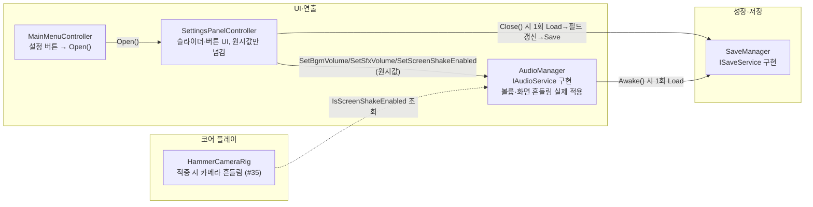

# 설정 패널

> 관련 이슈: #196, #202, #203 · 최종 수정: 2026-09-21

**이 문서는 로그다.** 이 기능을 고칠 때마다 갱신한다. 새 문서를 만들지 않는다.

## 무엇을 하는가

배경음·효과음 볼륨, 창 모드(전체 화면/창), 화면 흔들림 on/off, 저장 데이터 초기화를 한 화면에서
조정한다. `MainMenu` 씬에서 열리며, `Game` 씬 일시정지 경유는 아직 연결되지 않았다(아래
"알려진 한계" 참고). 게임 규칙은 [GDD](../GDD.md)에 없는 시스템 메뉴라 여기서만 다룬다.

## 왜 이 방법인가

| 검토한 방법 | 채택 | 이유 |
|---|---|---|
| `AudioManager`에 `IAudioService` 신설, `Instance`를 이 타입으로 노출 | ✅ | [contracts.md](contracts.md) #202 참고. `SettingsPanelController`(UI)와 `HammerCameraRig`(코어 플레이) 양쪽이 볼륨·화면 흔들림을 읽고 써야 하는데 `AudioManager`엔 외부 공용 API가 전혀 없었다 |
| 화면 흔들림 변경을 새 `GameEvents` 이벤트로 방송 | ❌ | `HammerCameraRig`는 적중 순간에만 현재 값이 필요하다. 상태가 바뀔 때마다 쏘는 이벤트보다 조회 한 줄이 더 단순하고, 새 이벤트를 늘리는 만큼 계약이 무거워진다 |
| `AudioManager.Awake()`가 `SaveManager.Instance.Load()`를 직접 불러 초기 볼륨·흔들림 값을 스스로 복원 | ✅ (조건부) | ARCHITECTURE 1절은 "저장 로드 → … → UI/오디오" 순서를 GameManager가 조정한다고 정했지만, 지갑·업그레이드 복원조차 아직 아무도 배선하지 않은 상태(save-load.md 알려진 한계)라 GameManager에 기댈 수 없었다. `ISaveService` 타입으로만 접근해 "직접 참조 금지"는 지킨다. GameManager가 초기화를 조정하게 되면 그때 옮긴다 |
| 슬라이더 값이 바뀔 때마다(`onValueChanged`) 즉시 `SaveManager.Save()` 호출 | ❌ | 드래그 중 매 프레임 값이 바뀌어 그때마다 파일을 다시 쓰면 성능 낭비이자 쓰기 경합 위험이다 |
| 볼륨은 매 프레임 `AudioManager`에만 즉시 반영하고, 디스크 저장은 패널 `Close()` 시 한 번만 | ✅ | 위 문제의 해법. 오디오 반응성은 그대로 유지하면서 저장 빈도만 줄인다 |
| 저장 데이터 초기화 시 `new SaveData()`를 그대로 저장 | ❌ | DoD는 "업그레이드와 납부 기록이 사라진다"고만 했다. 방금 조정한 볼륨·창모드·화면 흔들림까지 기본값으로 되돌리면 사용자가 방금 바꾼 설정을 잃는다 |
| 초기화 확인 시 새 `SaveData`를 만들되 현재 `BgmVolume`·`SfxVolume`·`IsFullscreen`·`IsScreenShakeEnabled`만 복사해 넣고 저장 | ✅ | 진행 기록(코인·업그레이드·날짜·고지서 등)만 지우고 설정은 그대로 둔다 |
| 창 모드 선택 표시를 `Button.interactable` 토글로 구현(선택된 쪽을 비활성화) | ❌ | 배경색은 `ColorBlock.disabledColor`로 흉내 낼 수 있어도, 자식 TMP 라벨의 글자색(강조 배경엔 어두운 글자, 중립 배경엔 밝은 글자)까지는 `interactable`만으로 못 바꾼다 |
| `SetSelected(Button, TMP_Text, bool)`로 배경(`targetGraphic.color`)과 글자색을 직접 스크립트에서 교체 | ✅ | 상태가 바뀔 때마다 정확한 배경·글자색 조합을 보장한다. 두 버튼 다 항상 클릭 가능하게 남겨 둬 "이미 선택된 걸 다시 눌러도 그냥 같은 값을 재적용"하는 정도로만 동작한다 |
| 화면 흔들림 상태 표시를 GameObject on/off(`SetActive`) 하나로 구현 | ❌ | 시안(#192 레이아웃 명세)은 스위치 옆에 "켬/꺼짐 — …" 문구를 요구한다. 켜짐 전용 오브젝트 하나만 토글하면 꺼짐 상태의 문구를 보여줄 수 없다 |
| `_screenShakeStatusText`(TMP) 텍스트를 켬/꺼짐 문구로 교체 + 토글 버튼 배경색도 함께 갱신 | ✅ | 시안대로 두 상태 모두 문구로 안내되고, 토글 버튼 자체도 강조/중립 색으로 상태를 보여준다 |
| 프리팹을 처음부터 커스텀 스프라이트로 제작 | ❌ | 7일 일정에 맞지 않는 과잉 작업이다. 이 패널의 DoD는 색·크기·대비·클릭 타깃 기준이지 커스텀 아이콘·둥근 모서리 그래픽이 아니다 |
| Unity 내장 `UI/Skin/UISprite.psd`·`Background.psd`·`Knob.psd`(`DefaultControls`가 쓰는 것과 동일)를 재사용해 버튼·슬라이더를 만들고 색만 시안대로 교체 | ✅ | 슬라이더의 Fill/Handle 배선처럼 손으로 다시 만들면 버그가 나기 쉬운 부분을 Unity 기본 팩토리(`DefaultControls.CreateButton`/`CreateSlider`)에 맡기고, 색상·글자만 시안값(#1B1410·#E8B04B 등)으로 덮었다 |
| 패널 폭 660×높이 630(1280×720 기준) 그대로 고정 `RectTransform` 크기로 배치 | ❌ | 행이 12개(헤더·구분선 3·소리 라벨/행 2·화면 라벨/행 2·초기화 행·닫기)라 손으로 각 행의 y좌표를 계산해 배치하면 나중에 행 하나만 추가해도 전부 다시 계산해야 한다 |
| `VerticalLayoutGroup` + `ContentSizeFitter(PreferredSize)`로 세로 스택, 각 행은 `LayoutElement.preferredHeight`로 높이만 지정 | ✅ | 행을 더하거나 빼도 패널 높이가 자동으로 다시 계산된다. 다만 섹션 간 간격(원래 20)과 같은 섹션 내 간격(원래 16)을 하나(24)로 통일했다 — 두 세트의 다른 간격을 같은 레벨의 `VerticalLayoutGroup` 하나로 표현할 수 없어서다 |
| 패널을 카드+테두리 이중 이미지로 구현(시안의 2px 테두리 재현) | ❌ | 크기 동기화가 겹겹이 필요해지는 것에 비해 이득이 적다. 대비·클릭 타깃 기준에는 테두리가 필수가 아니다 |
| 배경 이미지 하나(`#1B1410`)만 쓰고 테두리 생략 | ✅ | 그레이박스 수준에서는 충분하다. 알려진 한계에 남긴다 |
| 열려 있는 동안 형제 인덱스를 그대로 둔다 | ❌ | 이 패널을 여는 버튼(메인 메뉴의 "설정" 버튼)이 캔버스에 이 패널보다 나중에 추가돼 있으면, 캔버스 그리기 순서상 버튼이 패널 위에 겹쳐 보인다. 실제로 이 세션에서 겹침 버그가 발견됐다(사람이 스크린샷으로 지적) |
| `Open()`에서 `transform.SetAsLastSibling()` 호출 | ✅ | 어느 캔버스, 어느 순서로 추가됐든 열 때마다 항상 맨 위(형제 목록 마지막)로 이동해 다른 UI에 가려지지 않는다 |

## 구조

<!-- GameEvents를 거치는 관계가 없다 — 이 기능은 새 이벤트를 발행·구독하지 않는다 -->

| 클래스 | 경로 | 하는 일 |
|---|---|---|
| `SettingsPanelController` | `Assets/Scripts/Runtime/UI/SettingsPanelController.cs` | 슬라이더 2개, 창모드 버튼 2개, 화면 흔들림 토글, 저장 초기화(확인 다이얼로그 포함), 닫기/뒤로 버튼을 관리. `AudioManager`·`SaveManager`의 `Instance`(인터페이스 타입)만 참조 |
| `IAudioService` | `Assets/Scripts/Runtime/Interfaces/IAudioService.cs` | 볼륨·화면 흔들림 계약. 상세는 [contracts.md](contracts.md) |
| `AudioManager` | `Assets/Scripts/Runtime/UI/AudioManager.cs` | `IAudioService` 구현 추가(이슈 #36 문서는 [sound-effects.md](sound-effects.md)). `_bgmSource`(신규 `AudioSource`, `Managers` 프리팹의 자식 `BgmSource`) 추가, `Awake()`에서 저장값으로 초기 볼륨·흔들림 복원 |
| `HammerCameraRig` | `Assets/Scripts/Runtime/Core/HammerCameraRig.cs` | 적중 시 임펄스 발생 직전 `AudioManager.Instance?.IsScreenShakeEnabled` 조회 추가 (이슈 #35 원본 로직은 그대로) |
| `SaveData` | `Assets/Scripts/Runtime/Data/SaveData.cs` | `BgmVolume`·`SfxVolume`·`IsFullscreen`·`IsScreenShakeEnabled` 필드 추가, `CurrentVersion` 4 (`Develop`에 먼저 병합된 #175·#183의 v3 레거시 포인트·반지 필드 위에 얹었다) |
| `SaveManager` | `Assets/Scripts/Runtime/SaveManager.cs` | `ApplyVersionMigrations`에 `case 3` 추가(필드 이니셜라이저 기본값에 의존, v1 케이스와 동일 패턴) |
| `MainMenuController` | `Assets/Scripts/Runtime/UI/MainMenuController.cs` | "설정" 버튼 추가, 클릭 시 `SettingsPanelController.Open()` 호출 |
| (프리팹) | `Assets/Prefabs/UI/SettingsPanel.prefab` | 위 컨트롤러가 붙은 패널 프리팹. `MainMenu` 씬 `Canvas` 아래 인스턴스 하나가 있다 |

### 이벤트

없음. `GameEvents`를 구독·발행하지 않는다 — 위 "왜 이 방법인가" 참고.

### 읽는 밸런스 값

없음 — 이 기능은 CSV 값을 읽지 않는다.

## 검증

Unity 6000.3.21f1 에디터, Play Mode에서 UnityMCP `execute_code`로 실제 값을 직접 읽어 확인, 2026-09-21.

- [x] 컴파일: 매 단계 `refresh_unity(compile: request)` 후 콘솔 오류 0건
- [x] `convention-checker` 에이전트 점검 2회 통과 — 1차에서 `ScreenShakeEnabled`가 AGENTS.md bool 명명 규칙(질문형/동사 접두어) 위반이라는 지적을 받아 `IsScreenShakeEnabled`로 정정, 슬라이더 드래그마다 저장하던 것도 지적받아 `Close()` 1회로 변경. 2차 재점검에서 신규 위반 없음 확인
- [x] `MainMenu` 씬에서 "설정" 버튼 클릭 → `SettingsPanel.activeInHierarchy == true`, 크기 자동 계산(990×965) 확인
- [x] 겹침 버그 발견(사용자 스크린샷 제보: 여는 버튼이 패널 위에 겹쳐 보임) → `Open()`에 `SetAsLastSibling()` 추가 후 형제 인덱스가 항상 마지막으로 이동함을 확인
- [x] `BgmSlider`/`SfxSlider` 값 변경 → `AudioManager.BgmVolume`/`SfxVolume`이 즉시 반영되고 값 라벨(0~100 정수)이 갱신됨을 확인
- [x] 창 모드 버튼 클릭 → 클릭한 쪽 배경이 강조색(#E8B04B)·글자가 어두운색으로, 반대쪽이 중립색으로 전환됨을 확인. `Screen.fullScreen` 자체는 에디터 Game 뷰에서 실제로 바뀌지 않음(아래 알려진 한계)
- [x] 화면 흔들림 토글 클릭 → `AudioManager.IsScreenShakeEnabled` 전환, 상태 문구가 "켬 — …"/"꺼짐 — …"으로 갱신됨을 확인
- [x] 저장 초기화: 확인 다이얼로그 열림/닫힘 확인, "예" 클릭 후 저장 파일을 다시 읽어 방금 조정한 `BgmVolume`(0.3)·`SfxVolume`(0.6)·`IsScreenShakeEnabled`(false)는 그대로 남고 진행 데이터만 초기화됨을 확인
- [x] 닫기 버튼 클릭 → 패널 비활성화 + 그 시점 값이 저장 파일에 반영됨을 `Load()` 재호출로 확인
- [x] 재시작 시나리오: 새 `AudioManager` 컴포넌트를 추가해 `Awake()`를 다시 태워본 결과 직전에 저장한 값(Bgm=0.3/Sfx=0.6/Shake=false)이 그대로 복원됨 — "게임을 껐다 켜도 유지" DoD 충족
- [ ] **실제 화면 스크린샷 검증은 못했다** — 이 세션의 Play Mode에서 Game 뷰 프레임이 갱신되지 않는 현상(`Time.frameCount`가 2에서 고정)이 있어 스크린샷이 계속 같은 프레임을 반환했다. 위 항목은 전부 스크린샷 대신 실행 중인 오브젝트의 실제 값을 코드로 읽어 확인했다
- [ ] **배경음이 실제로 들리는지는 미검증** — 프로젝트에 BGM 재생 코드·클립이 아직 없어([sound-effects.md](sound-effects.md)와 같은 사유) 볼륨 수치 적용까지만 확인했다
* [x] **Game 씬(일시정지 경유) 연결 검증 완료** · #192 일시정지 패널에 조립되어 ESC 및 설정 버튼 연동 정상 동작 확인
- [ ] **빌드된 실행 파일에서 `Screen.fullScreen`이 실제로 전체 화면/창을 전환하는지는 미검증** — 에디터 Game 뷰는 이 값을 반영하지 않는다

## 알려진 한계

* **Game 씬(일시정지 경유) 연결 완료.** #192 일시정지 패널의 자식으로 조립되어 정상 연동됨.
- **배경음(BGM) 실제 재생 코드가 없다.** `AudioManager`에 `_bgmSource`(`Managers` 프리팹의 자식 `BgmSource`)를 추가했지만 재생할 클립이 아직 없다. 볼륨 값 자체는 정상 적용·저장되지만 귀로 듣는 검증은 BGM이 생길 때까지 불가능하다.
- **에디터에서 `Screen.fullScreen`은 실제로 전체 화면을 전환하지 않는다.** Unity Editor의 Game 뷰는 독립된 OS 창이 아니라서 이 값 자체가 별 의미가 없다 — main-menu.md가 기록한 `Application.Quit()`의 에디터 한계와 같은 종류다. 실제 빌드에서의 동작은 미검증.
- **테두리·아이콘을 생략했다.** 시안(#192 레이아웃 명세)의 2px 테두리와 버튼 좌측 아이콘은 넣지 않고 배경색·글자·크기만 맞췄다. 대비 4.5:1·클릭 타깃 48px(스케일 후 72px) 이상 기준은 지켰다.
- **해상도 선택·키 리매핑은 범위 밖이다** — 이슈 #196 DoD에 이미 명시돼 있다.
- ~~**저장 초기화(`HandleResetConfirmed`)는 디스크의 저장 파일만 새로 쓴다.**~~ — #203 에서 닫았다.
  3.10 이 자동 저장을 붙이면서 이 한계가 **한계에서 결함으로 바뀌었다.** 메모리에 남은 값을
  다음 자동 저장이 파일에 도로 써서 초기화가 아예 없던 일이 됐기 때문이다. 이제
  `IGamePersistence.ResetAndDistribute()` 를 불러 메모리까지 함께 비운다 —
  새 회차 시작(`GameManager.StartNewRun`)과 **같은 메서드**다.
  설정을 남기는 판단은 그대로 유지했고, `ResetAndDistribute` 가 설정을 파일에서 옮겨 담으므로
  **부르기 전에 `PersistCurrentSettings()` 로 반영한다** — 설정은 패널을 닫을 때만 저장되어서,
  열어 둔 채 초기화하면 방금 조정한 값이 아니라 옛 값이 살아남는다.
- **런 도중 저장 초기화는 일관성 없는 상태를 남긴다.** #192 가 일시정지 패널에서 설정 패널을
  열 수 있게 하면서, 런 한가운데서 초기화 버튼에 닿을 수 있게 됐다. 그때 `ResetAndDistribute()`
  는 코인·업그레이드·레거시·단계를 0 으로 만드는데 **고지서와 날짜는 수집 대상이 아니라 그대로
  남고**, 이미 스폰된 크리처도 그대로다. Play Mode 로 확인한 결과 예외는 나지 않지만
  (단계 2 → 0 으로 내려가면서 2단계 크리처가 그대로 남았다) 게임 상태가 앞뒤가 맞지 않는다.
  **어느 한 카드의 결함이 아니다** — #192 가 경로를 열고 #203 이 초기화에 실체를 준 결과라
  따로 보면 양쪽 다 정상이다. 초기화 후 메인 메뉴로 돌려보낼지, 런 중에는 버튼을 잠글지는
  설정 패널(#196)의 판단이라 여기서 정하지 않았다.
- **`SettingsPanelController`가 참조하는 색(`_selectedBg`·`_neutralBg` 등)은 인스펙터에 노출된 `[SerializeField]`라 프리팹에서 바로 조정할 수 있지만, 시안 색상표와 다르게 바뀌어도 컴파일 타임에 잡히지 않는다.** 색이 바뀌면 이 문서와 #192 레이아웃 명세 댓글을 함께 갱신해야 한다.

## 갱신 이력

| 날짜 | 이슈 | 누가 | 무엇이 바뀌었나 |
|---|---|---|---|
| 2026-09-21 | #196, #202 | hunil58 | 최초 작성. `IAudioService` 신설(계약 #202), `AudioManager` 구현 편입, `HammerCameraRig` 화면 흔들림 조회 추가, `SaveData` v2→v3, `SettingsPanelController`·`SettingsPanel.prefab` 신규, `MainMenuController`에 설정 버튼 연결 |
| 2026.09.21 | #192 | saltlake00 | Game 씬 일시정지 패널(#192) 조립 연동 및 Closed 이벤트 발행 추가, RectTransform 안전 캐스팅 보강 |
| 2026-09-21 | #203 | twins6375-art | 저장 초기화가 메모리를 남기던 한계를 닫았다. 3.10 자동 저장이 붙으면서 초기화가 다음 저장에 되돌려지는 결함이 됐다 — `ResetAndDistribute()` 로 새 회차 시작과 같은 경로를 쓴다. 설정을 남기는 판단은 유지 |
