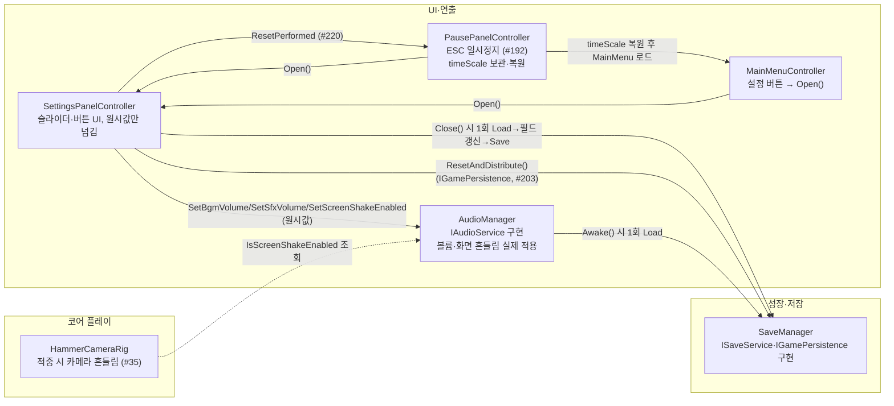

# 설정 패널

> 관련 이슈: #196, #202, #203, #220 · 최종 수정: 2026-09-21

**이 문서는 로그다.** 이 기능을 고칠 때마다 갱신한다. 새 문서를 만들지 않는다.

## 무엇을 하는가

배경음·효과음 볼륨, 창 모드(전체 화면/창), 화면 흔들림 on/off, 저장 데이터 초기화를 한 화면에서
조정한다. **`MainMenu` 씬과 `Game` 씬(일시정지 경유, #192) 양쪽에서 같은 프리팹으로 연다.**
게임 규칙은 [GDD](../GDD.md)에 없는 시스템 메뉴라 여기서만 다룬다.

## 왜 이 방법인가

| 검토한 방법 | 채택 | 이유 |
|---|---|---|
| `AudioManager`에 `IAudioService` 신설, `Instance`를 이 타입으로 노출 | ✅ | [contracts.md](contracts.md) #202 참고. `SettingsPanelController`(UI)와 `HammerCameraRig`(코어 플레이) 양쪽이 볼륨·화면 흔들림을 읽고 써야 하는데 `AudioManager`엔 외부 공용 API가 전혀 없었다 |
| 화면 흔들림 변경을 새 `GameEvents` 이벤트로 방송 | ❌ | `HammerCameraRig`는 적중 순간에만 현재 값이 필요하다. 상태가 바뀔 때마다 쏘는 이벤트보다 조회 한 줄이 더 단순하고, 새 이벤트를 늘리는 만큼 계약이 무거워진다 |
| `AudioManager.Awake()`가 `SaveManager.Instance.Load()`를 직접 불러 초기 볼륨·흔들림 값을 스스로 복원 | ✅ (조건부) | ARCHITECTURE 1절은 "저장 로드 → … → UI/오디오" 순서를 GameManager가 조정한다고 정했지만, 지갑·업그레이드 복원조차 아직 아무도 배선하지 않은 상태(save-load.md 알려진 한계)라 GameManager에 기댈 수 없었다. `ISaveService` 타입으로만 접근해 "직접 참조 금지"는 지킨다. GameManager가 초기화를 조정하게 되면 그때 옮긴다 |
| 슬라이더 값이 바뀔 때마다(`onValueChanged`) 즉시 `SaveManager.Save()` 호출 | ❌ | 드래그 중 매 프레임 값이 바뀌어 그때마다 파일을 다시 쓰면 성능 낭비이자 쓰기 경합 위험이다 |
| 볼륨은 매 프레임 `AudioManager`에만 즉시 반영하고, 디스크 저장은 패널 `Close()` 시 한 번만 | ✅ | 위 문제의 해법. 오디오 반응성은 그대로 유지하면서 저장 빈도만 줄인다 |
| 저장 데이터 초기화 시 `new SaveData()`를 그대로 저장 | ❌ | DoD는 "업그레이드와 납부 기록이 사라진다"고만 했다. 방금 조정한 볼륨·창모드·화면 흔들림까지 기본값으로 되돌리면 사용자가 방금 바꾼 설정을 잃는다 |
| 초기화 확인 시 새 `SaveData`를 만들되 현재 `BgmVolume`·`SfxVolume`·`IsFullscreen`·`IsScreenShakeEnabled`만 복사해 넣고 저장 | ✅ | 진행 기록(코인·업그레이드·날짜·고지서 등)만 지우고 설정은 그대로 둔다 |
| 창 모드 선택 표시를 `Button.interactable` 토글로 구현(선택된 쪽을 비활성화) | ❌ | 배경색은 `ColorBlock.disabledColor`로 흉내 낼 수 있어도, 자식 TMP 라벨의 글자색(강조 배경엔 어두운 글자, 중립 배경엔 밝은 글자)까지는 `interactable`만으로 못 바꾼다 |
| `SetSelected(Button, TMP_Text, bool)`로 배경(`targetGraphic.color`)과 글자색을 직접 스크립트에서 교체 | ✅ | 상태가 바뀔 때마다 정확한 배경·글자색 조합을 보장한다. 두 버튼 다 항상 클릭 가능하게 남겨 둬 "이미 선택된 걸 다시 눌러도 그냥 같은 값을 재적용"하는 정도로만 동작한다 |
| 화면 흔들림 상태 표시를 GameObject on/off(`SetActive`) 하나로 구현 | ❌ | 시안(#192 레이아웃 명세)은 스위치 옆에 "켬/꺼짐 — …" 문구를 요구한다. 켜짐 전용 오브젝트 하나만 토글하면 꺼짐 상태의 문구를 보여줄 수 없다 |
| `_screenShakeStatusText`(TMP) 텍스트를 켬/꺼짐 문구로 교체 + 토글 버튼 배경색도 함께 갱신 | ✅ | 시안대로 두 상태 모두 문구로 안내되고, 토글 버튼 자체도 강조/중립 색으로 상태를 보여준다 |
| 프리팹을 처음부터 커스텀 스프라이트로 제작 | ❌ | 7일 일정에 맞지 않는 과잉 작업이다. 이 패널의 DoD는 색·크기·대비·클릭 타깃 기준이지 커스텀 아이콘·둥근 모서리 그래픽이 아니다 |
| Unity 내장 `UI/Skin/UISprite.psd`·`Background.psd`·`Knob.psd`(`DefaultControls`가 쓰는 것과 동일)를 재사용해 버튼·슬라이더를 만들고 색만 시안대로 교체 | ✅ | 슬라이더의 Fill/Handle 배선처럼 손으로 다시 만들면 버그가 나기 쉬운 부분을 Unity 기본 팩토리(`DefaultControls.CreateButton`/`CreateSlider`)에 맡기고, 색상·글자만 시안값(#1B1410·#E8B04B 등)으로 덮었다 |
| 패널 폭 660×높이 630(1280×720 기준) 그대로 고정 `RectTransform` 크기로 배치 | ❌ | 행이 12개(헤더·구분선 3·소리 라벨/행 2·화면 라벨/행 2·초기화 행·닫기)라 손으로 각 행의 y좌표를 계산해 배치하면 나중에 행 하나만 추가해도 전부 다시 계산해야 한다 |
| `VerticalLayoutGroup` + `ContentSizeFitter(PreferredSize)`로 세로 스택, 각 행은 `LayoutElement.preferredHeight`로 높이만 지정 | ✅ | 행을 더하거나 빼도 패널 높이가 자동으로 다시 계산된다. 다만 섹션 간 간격(원래 20)과 같은 섹션 내 간격(원래 16)을 하나(24)로 통일했다 — 두 세트의 다른 간격을 같은 레벨의 `VerticalLayoutGroup` 하나로 표현할 수 없어서다 |
| 패널을 카드+테두리 이중 이미지로 구현(시안의 2px 테두리 재현) | ❌ | 크기 동기화가 겹겹이 필요해지는 것에 비해 이득이 적다. 대비·클릭 타깃 기준에는 테두리가 필수가 아니다 |
| 배경 이미지 하나(`#1B1410`)만 쓰고 테두리 생략 | ✅ | 그레이박스 수준에서는 충분하다. 알려진 한계에 남긴다 |
| 열려 있는 동안 형제 인덱스를 그대로 둔다 | ❌ | 이 패널을 여는 버튼(메인 메뉴의 "설정" 버튼)이 캔버스에 이 패널보다 나중에 추가돼 있으면, 캔버스 그리기 순서상 버튼이 패널 위에 겹쳐 보인다. 실제로 이 세션에서 겹침 버그가 발견됐다(사람이 스크린샷으로 지적) |
| `Open()`에서 `transform.SetAsLastSibling()` 호출 | ✅ | 어느 캔버스, 어느 순서로 추가됐든 열 때마다 항상 맨 위(형제 목록 마지막)로 이동해 다른 UI에 가려지지 않는다 |

### 런 도중 초기화 (#220)

6.13(#192)이 일시정지 패널에서 이 패널을 열 수 있게 하면서 **런 한가운데서 저장 초기화가
가능**해졌다. 3.10(#203)이 초기화에 실체를 주기 전까지는 파일만 비웠으므로 런에 아무 일도
일어나지 않았지만, 이제 `ResetAndDistribute()` 가 메모리까지 비운다.

| 검토한 방법 | 채택 | 이유 |
|---|---|---|
| 런 중에는 초기화 버튼을 잠근다 | ❌ | 증상만 막는다. "초기화했는데 방금 지운 성장으로 런을 계속한다"는 이상함이 남고, **메인 메뉴에서 초기화하면 같은 문제가 안 난다** — 즉 동작을 정의하는 것이 아니라 문제를 피할 위치를 고르는 것이다 |
| 런 상태(날짜·고지서)까지 함께 초기화한다 | ❌ | **지금은 불가능하다.** `IBillService` 에 복원 통로가 없어 날짜·고지서를 되돌릴 수 없다 (4.14 가 그 통로를 여는 카드다) |
| 초기화하면 런을 접고 메인 메뉴로 보낸다 | ✅ | "초기화"의 뜻에 가장 가깝다. 런이 통째로 버려지므로 **날짜·고지서를 되돌릴 필요가 애초에 없어진다** — 위 방법이 막혀 있는데도 이 카드가 성립하는 이유다 |
| `SettingsPanelController` 가 직접 `SceneManager.LoadScene` 을 부른다 | ❌ | 일시정지 중이면 `Time.timeScale` 이 0 이고 **원래 값을 아는 것은 `PausePanelController` 뿐**이다. 복원하지 않고 씬을 넘기면 메인 메뉴가 0배속으로 열려 멈춰 보인다. 씬 이름 상수를 네 번째 파일에 또 적게 되는 문제도 있다 |
| `IGameFlowService` 에 `CurrentState` 를 열어 "런 중인가" 를 묻는다 | ❌ | 공용 계약 변경이라 합의가 먼저다 (AGENTS.md). 아래 방법을 쓰면 **물을 필요 자체가 없어진다** |
| 설정 패널이 `ResetPerformed` 를 발행하고 일시정지 패널이 받는다 | ✅ | #192 가 이미 깔아 둔 `Closed` 이벤트와 같은 모양이다. **메인 메뉴에는 일시정지 패널이 없어 구독자가 아예 없고**, 그때는 패널만 닫히는 것이 맞는 동작이라 상태 검사가 사라진다. `timeScale` 복원도 그 값을 아는 쪽에서 일어난다 |
| 일시정지 패널이 다시 한 번 확인을 묻는다 | ❌ | 확인은 설정 패널이 이미 거쳤다. 두 곳에 두면 한쪽을 건너뛰는 경로가 생긴다 (`BillManager.DeclareBankruptcy` 주석, #175) |

## 구조

`ResetPerformed` 는 `GameEvents` 를 거치지 않는다. 구독자가 **같은 프리팹 안의 일시정지
패널 하나뿐**이고 이미 `SetSettingsPanel` 로 직접 물려 있어서다 — 정적 이벤트로 올리면
메인 메뉴의 설정 패널까지 같은 통로를 쓰게 되어 "구독자가 없으면 아무 일도 안 일어난다"는
이 설계의 핵심이 사라진다.

<!-- GameEvents 를 거치는 관계가 없어 이벤트 노드를 그리지 않았다. 클래스 자체 이벤트 둘은 아래 "이벤트" 절 -->

| 클래스 | 경로 | 하는 일 |
|---|---|---|
| `SettingsPanelController` | `Assets/Scripts/Runtime/UI/SettingsPanelController.cs` | 슬라이더 2개, 창모드 버튼 2개, 화면 흔들림 토글, 저장 초기화(확인 다이얼로그 포함), 닫기/뒤로 버튼을 관리. `AudioManager`·`SaveManager`의 `Instance`(인터페이스 타입)만 참조 |
| `IAudioService` | `Assets/Scripts/Runtime/Interfaces/IAudioService.cs` | 볼륨·화면 흔들림 계약. 상세는 [contracts.md](contracts.md) |
| `AudioManager` | `Assets/Scripts/Runtime/UI/AudioManager.cs` | `IAudioService` 구현 추가(이슈 #36 문서는 [sound-effects.md](sound-effects.md)). `_bgmSource`(신규 `AudioSource`, `Managers` 프리팹의 자식 `BgmSource`) 추가, `Awake()`에서 저장값으로 초기 볼륨·흔들림 복원 |
| `HammerCameraRig` | `Assets/Scripts/Runtime/Core/HammerCameraRig.cs` | 적중 시 임펄스 발생 직전 `AudioManager.Instance?.IsScreenShakeEnabled` 조회 추가 (이슈 #35 원본 로직은 그대로) |
| `SaveData` | `Assets/Scripts/Runtime/Data/SaveData.cs` | `BgmVolume`·`SfxVolume`·`IsFullscreen`·`IsScreenShakeEnabled` 필드 추가, `CurrentVersion` 4 (`Develop`에 먼저 병합된 #175·#183의 v3 레거시 포인트·반지 필드 위에 얹었다) |
| `SaveManager` | `Assets/Scripts/Runtime/SaveManager.cs` | `ApplyVersionMigrations`에 `case 3` 추가(필드 이니셜라이저 기본값에 의존, v1 케이스와 동일 패턴) |
| `MainMenuController` | `Assets/Scripts/Runtime/UI/MainMenuController.cs` | "설정" 버튼 추가, 클릭 시 `SettingsPanelController.Open()` 호출 |
| (프리팹) | `Assets/Prefabs/UI/SettingsPanel.prefab` | 위 컨트롤러가 붙은 패널 프리팹. `MainMenu` 씬 `Canvas` 아래 인스턴스 하나가 있다 |

### 이벤트

`GameEvents`는 구독·발행하지 않는다 — 위 "왜 이 방법인가" 참고. 클래스 자체 이벤트가 둘 있다.

| 이벤트 | 언제 | 받는 곳 |
|---|---|---|
| `SettingsPanelController.Closed` | `Close()` 마지막 (#192) | `PausePanelController` — 일시정지 메인 상자를 다시 켠다 |
| `SettingsPanelController.ResetPerformed` | 저장 초기화 직후, `Close()` **뒤** (#220) | `PausePanelController` — 런을 접고 메인 메뉴로 보낸다. **메인 메뉴에는 구독자가 없다** |

둘 다 `OnEnable` 구독 / `OnDisable` 해제를 쌍으로 맞춘다. `SetSettingsPanel` 로 대상을
바꿀 때도 옛 대상에서 떼고 새 대상에 붙인다 — 셋 중 하나만 빠져도 초기화가 조용히 아무
일도 안 하거나 씬을 두 번 넘긴다.

### 읽는 밸런스 값

없음 — 이 기능은 CSV 값을 읽지 않는다.

## 검증

Unity 6000.3.21f1 에디터, Play Mode에서 UnityMCP `execute_code`로 실제 값을 직접 읽어 확인, 2026-09-21.

- [x] 컴파일: 매 단계 `refresh_unity(compile: request)` 후 콘솔 오류 0건
- [x] `convention-checker` 에이전트 점검 2회 통과 — 1차에서 `ScreenShakeEnabled`가 AGENTS.md bool 명명 규칙(질문형/동사 접두어) 위반이라는 지적을 받아 `IsScreenShakeEnabled`로 정정, 슬라이더 드래그마다 저장하던 것도 지적받아 `Close()` 1회로 변경. 2차 재점검에서 신규 위반 없음 확인
- [x] `MainMenu` 씬에서 "설정" 버튼 클릭 → `SettingsPanel.activeInHierarchy == true`, 크기 자동 계산(990×965) 확인
- [x] 겹침 버그 발견(사용자 스크린샷 제보: 여는 버튼이 패널 위에 겹쳐 보임) → `Open()`에 `SetAsLastSibling()` 추가 후 형제 인덱스가 항상 마지막으로 이동함을 확인
- [x] `BgmSlider`/`SfxSlider` 값 변경 → `AudioManager.BgmVolume`/`SfxVolume`이 즉시 반영되고 값 라벨(0~100 정수)이 갱신됨을 확인
- [x] 창 모드 버튼 클릭 → 클릭한 쪽 배경이 강조색(#E8B04B)·글자가 어두운색으로, 반대쪽이 중립색으로 전환됨을 확인. `Screen.fullScreen` 자체는 에디터 Game 뷰에서 실제로 바뀌지 않음(아래 알려진 한계)
- [x] 화면 흔들림 토글 클릭 → `AudioManager.IsScreenShakeEnabled` 전환, 상태 문구가 "켬 — …"/"꺼짐 — …"으로 갱신됨을 확인
- [x] 저장 초기화: 확인 다이얼로그 열림/닫힘 확인, "예" 클릭 후 저장 파일을 다시 읽어 방금 조정한 `BgmVolume`(0.3)·`SfxVolume`(0.6)·`IsScreenShakeEnabled`(false)는 그대로 남고 진행 데이터만 초기화됨을 확인
- [x] 닫기 버튼 클릭 → 패널 비활성화 + 그 시점 값이 저장 파일에 반영됨을 `Load()` 재호출로 확인
- [x] 재시작 시나리오: 새 `AudioManager` 컴포넌트를 추가해 `Awake()`를 다시 태워본 결과 직전에 저장한 값(Bgm=0.3/Sfx=0.6/Shake=false)이 그대로 복원됨 — "게임을 껐다 켜도 유지" DoD 충족
- [ ] **실제 화면 스크린샷 검증은 못했다** — 이 세션의 Play Mode에서 Game 뷰 프레임이 갱신되지 않는 현상(`Time.frameCount`가 2에서 고정)이 있어 스크린샷이 계속 같은 프레임을 반환했다. 위 항목은 전부 스크린샷 대신 실행 중인 오브젝트의 실제 값을 코드로 읽어 확인했다
- [ ] **배경음이 실제로 들리는지는 미검증** — 프로젝트에 BGM 재생 코드·클립이 아직 없어([sound-effects.md](sound-effects.md)와 같은 사유) 볼륨 수치 적용까지만 확인했다
* [x] **Game 씬(일시정지 경유) 연결 검증 완료** · #192 일시정지 패널에 조립되어 ESC 및 설정 버튼 연동 정상 동작 확인
- [ ] **빌드된 실행 파일에서 `Screen.fullScreen`이 실제로 전체 화면/창을 전환하는지는 미검증** — 에디터 Game 뷰는 이 값을 반영하지 않는다

### 런 도중 초기화 (2026-09-21, #220)

`PausePanelUiChecks.RunBatch()` — `[PausePanelUiChecks] PASS 21 checks.` (15 → 21)

Edit Mode 검사는 **씬 전환 직전까지**만 본다. `SceneManager.LoadScene` 은 Play Mode 전용이라
부르면 콘솔 오류가 난다 — 그래서 이벤트 존재·발행·구독 쌍·`timeScale` 복원 순서·확인창 문구를
보고, 씬이 실제로 넘어가는지는 아래 Play Mode 로 확인했다.

**변이 시험** — 넣은 결함 5종이 전부 잡혔다.

| 넣은 결함 | 결과 |
|---|---|
| `HandleResetConfirmed` 에서 `ResetPerformed?.Invoke()` 삭제 | 잡음 — "런이 그대로 이어져 지운 성장으로 계속 플레이하게 됩니다" |
| `OnDisable` 에서 `ResetPerformed` 해제 삭제 | 잡음 — 구독자 수 0 이어야 할 자리에 1 |
| `HandleSettingsReset` 에서 `timeScale` 복원을 `LoadScene` 뒤로 | 잡음 — "메인 메뉴가 0배속으로 열려 멈춰 보입니다" |
| 확인창 문구를 옛 것으로 되돌림 | 잡음 |
| **한쪽 프리팹만** 옛 문구로 되돌림 | 잡음 — 파일 경로와 함께 |

마지막 줄이 이번 작업에서 가장 값비싼 교훈이다. **처음 검사는 `SettingsPanel.prefab` 하나만
봐서 초록이 떴는데, 게임에는 옛 문구가 그대로 떴다** — 같은 확인창이 두 프리팹에 복제돼 있고
인게임에서 쓰는 것은 `Resources/UI/PausePanel.prefab` 쪽이었다. Play Mode 로 실제 화면을 보고서야
발견했다. 검사를 `t:Prefab` 전체를 훑도록 고쳐, 사본이 하나 더 생겨도 걸리게 했다.

**Play Mode** — 저장에 코인 7000·포인트 150·반지 1·업그레이드 `[2,0,0,0]`·단계 2·설정
`Bgm 0.25 / 흔들림 꺼짐` 을 심고 `Game` 씬에서 시작.

| 단계 | 결과 |
|---|---|
| ESC → 일시정지 | `timeScale` 0 |
| 설정 → 초기화 → 확인창 | 문구 3줄 정상, **텍스트 4줄 · 필요 110.89 · 배정 120 · 넘침 없음** |
| "예, 초기화한다" | `timeScale` **1 복구**, `IsPaused` false, 메모리 코인·포인트 0 |
| 다음 프레임 | **씬 = MainMenu**, 저장 파일 코인 0 · 업그레이드 `[0,0,0,0]` · 단계 0 |
| 설정 보존 | `Bgm 0.25` · 흔들림 꺼짐 **그대로** |

**메인 메뉴 경로**(구독자가 없어 아무 일도 없어야 하는 쪽)도 따로 확인했다 — `MainMenu` 씬에서
초기화하면 씬이 바뀌지 않고 패널만 닫히며, `timeScale` 1 유지·설정 보존·콘솔 오류 0건이었다.

- [x] 확인창이 3줄이 되며 텍스트 칸(100)을 11px 넘기던 것을 칸 120·상자 300 으로 고쳤다.
      `overflowMode` 가 `Overflow` 라 잘리지 않고 **아래 버튼과 겹치는** 형태였다
- [x] 전체 검증 회귀: `ValidationRunner.RunAll()` — **통과 24 / 실패 1 (전체 25)**.
      실패는 `TargetChecks` 의 `TargetNormal: Visual 아래 Mesh 자식이 없습니다` 하나이고
      **이 작업과 무관하다** — `Assets/Prefabs/Targets/TargetNormal.prefab` 은 `Develop` 과
      바이트 단위로 같고 이 브랜치가 건드리지 않았다. 6.6(#37) 에셋 교체에서 들어온 것으로
      보인다. `PASS` 줄만 읽으면 이 실패가 보이지 않으니 **요약 줄을 확인할 것**
- [ ] **빌드된 실행 파일에서는 미검증** — 에디터 Play Mode 까지다

## 알려진 한계

* **Game 씬(일시정지 경유) 연결 완료.** #192 일시정지 패널의 자식으로 조립되어 정상 연동됨.
- **배경음(BGM) 실제 재생 코드가 없다.** `AudioManager`에 `_bgmSource`(`Managers` 프리팹의 자식 `BgmSource`)를 추가했지만 재생할 클립이 아직 없다. 볼륨 값 자체는 정상 적용·저장되지만 귀로 듣는 검증은 BGM이 생길 때까지 불가능하다 — **#223(6.17)** 이 BGM 을 넣는다.
- **에디터에서 `Screen.fullScreen`은 실제로 전체 화면을 전환하지 않는다.** Unity Editor의 Game 뷰는 독립된 OS 창이 아니라서 이 값 자체가 별 의미가 없다 — main-menu.md가 기록한 `Application.Quit()`의 에디터 한계와 같은 종류다. 실제 빌드에서의 동작은 미검증.
- **테두리·아이콘을 생략했다.** 시안(#192 레이아웃 명세)의 2px 테두리와 버튼 좌측 아이콘은 넣지 않고 배경색·글자·크기만 맞췄다. 대비 4.5:1·클릭 타깃 48px(스케일 후 72px) 이상 기준은 지켰다.
- **해상도 선택·키 리매핑은 범위 밖이다** — 이슈 #196 DoD에 이미 명시돼 있다.
- ~~**저장 초기화(`HandleResetConfirmed`)는 디스크의 저장 파일만 새로 쓴다.**~~ — #203 에서 닫았다.
  3.10 이 자동 저장을 붙이면서 이 한계가 **한계에서 결함으로 바뀌었다.** 메모리에 남은 값을
  다음 자동 저장이 파일에 도로 써서 초기화가 아예 없던 일이 됐기 때문이다. 이제
  `IGamePersistence.ResetAndDistribute()` 를 불러 메모리까지 함께 비운다 —
  새 회차 시작(`GameManager.StartNewRun`)과 **같은 메서드**다.
  설정을 남기는 판단은 그대로 유지했고, `ResetAndDistribute` 가 설정을 파일에서 옮겨 담으므로
  **부르기 전에 `PersistCurrentSettings()` 로 반영한다** — 설정은 패널을 닫을 때만 저장되어서,
  열어 둔 채 초기화하면 방금 조정한 값이 아니라 옛 값이 살아남는다.
  이어지는 `Close()` 안에서도 한 번 더 반영되는데, 그쪽은 초기화된 파일을 다시 읽어 설정만
  덮어쓰므로 결과가 같다 — 줄이지 않은 이유는 "닫을 때 설정을 반영한다"는 `Close()` 의 계약을
  이 경로만 예외로 만들지 않기 위해서다.
- ~~**런 도중 저장 초기화는 일관성 없는 상태를 남긴다.**~~ — #220 에서 닫았다. 초기화하면
  런을 접고 메인 메뉴로 보낸다 (위 "런 도중 초기화" 참고).
- **초기화해도 "이어하기" 버튼이 살아 있다.** 초기화는 빈 `SaveData` 를 **쓰는** 것이라 파일이
  남고 `ISaveService.HasSave` 가 계속 `true` 다. 눌러도 0 으로 초기화된 상태로 들어가므로
  데이터가 깨지지는 않지만, "초기화했는데 이어할 것이 있다"는 말이 된다. #196 부터의 동작이라
  #220 범위 밖으로 두었다.
- **같은 초기화 확인창이 두 프리팹에 복제돼 있다.** `Assets/Prefabs/UI/SettingsPanel.prefab` 과
  `Assets/Prefabs/Resources/UI/PausePanel.prefab` 이 각각 들고 있어, 문구를 고칠 때 **양쪽을
  같이 고쳐야 한다.** #220 에서 실제로 한쪽만 고쳤다가 놓쳤고, 검증이 이제 두 곳을 모두 본다.
  1.25(#173)가 `BillHud.prefab` 중복을 정리한 것과 같은 종류의 정리가 필요하다.
- **`SettingsPanelController`가 참조하는 색(`_selectedBg`·`_neutralBg` 등)은 인스펙터에 노출된 `[SerializeField]`라 프리팹에서 바로 조정할 수 있지만, 시안 색상표와 다르게 바뀌어도 컴파일 타임에 잡히지 않는다.** 색이 바뀌면 이 문서와 #192 레이아웃 명세 댓글을 함께 갱신해야 한다.

## 갱신 이력

| 날짜 | 이슈 | 누가 | 무엇이 바뀌었나 |
|---|---|---|---|
| 2026-09-21 | #196, #202 | hunil58 | 최초 작성. `IAudioService` 신설(계약 #202), `AudioManager` 구현 편입, `HammerCameraRig` 화면 흔들림 조회 추가, `SaveData` v2→v3, `SettingsPanelController`·`SettingsPanel.prefab` 신규, `MainMenuController`에 설정 버튼 연결 |
| 2026.09.21 | #192 | saltlake00 | Game 씬 일시정지 패널(#192) 조립 연동 및 Closed 이벤트 발행 추가, RectTransform 안전 캐스팅 보강 |
| 2026-09-21 | #203 | twins6375-art | 저장 초기화가 메모리를 남기던 한계를 닫았다. 3.10 자동 저장이 붙으면서 초기화가 다음 저장에 되돌려지는 결함이 됐다 — `ResetAndDistribute()` 로 새 회차 시작과 같은 경로를 쓴다. 설정을 남기는 판단은 유지 |
| 2026-09-21 | #220 | twins6375-art | 런 도중 초기화가 런을 접고 메인 메뉴로 가도록. `ResetPerformed` 이벤트 신설, 확인창 문구에 런 종료 안내 추가(두 프리팹), 3줄이 되며 넘치던 텍스트 칸 확대. 검증 15 → 21건 |
