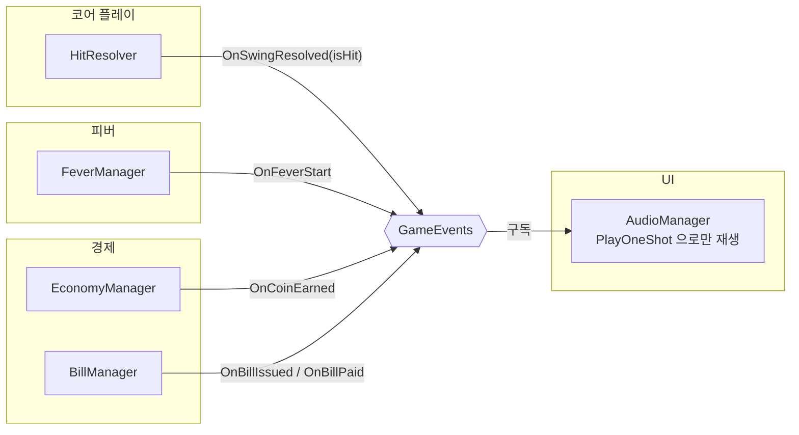

# 효과음

> 관련 이슈: #36 · 최종 수정: 2026-09-17

**이 문서는 로그다.** 이 기능을 고칠 때마다 갱신한다. 새 문서를 만들지 않는다.

## 무엇을 하는가

타격·코인 획득·피버 발동·청구서 발행·청구서 납부 시점에 효과음을 재생한다. `GameEvents` 를 구독해 재생 시점만 판단하고, 재생 자체는 `AudioSource.PlayOneShot` 에 맡긴다.

## 왜 이 방법인가

| 검토한 방법 | 채택 | 이유 |
|---|---|---|
| 발행 주체 각각(`HitResolver`, `EconomyManager` 등)에 `AudioSource` 배치 | ❌ | 모듈마다 오디오 재생 코드가 흩어지고, 효과음 종류가 늘 때마다 여러 파일을 고쳐야 한다. `GameEvents` 로 이미 알리고 있는 시점을 재사용하면 될 일이다 |
| Managers 프리팹에 `AudioManager` 하나를 두고 `GameEvents` 구독 | ✅ | 다른 매니저와 같은 자리·같은 생명주기(`DontDestroyOnLoad`)를 쓴다. 구독/해제 쌍 규칙([AGENTS.md](../../AGENTS.md))만 지키면 되고, 새 효과음이 추가돼도 이 파일 하나만 고친다 |
| `AudioSource.Play()` (클립을 `_sfxSource.clip` 에 미리 대입) | ❌ | 겹쳐 울려야 하는 효과음(예: 연속 타격 중 코인 획득)이 서로를 끊는다 |
| `AudioSource.PlayOneShot(clip)` | ✅ | 여러 클립이 겹쳐도 서로 끊기지 않는다. 클립이 비어 있어도(`null`) 경고 로그만 남기고 예외 없이 무시되므로, 에셋이 아직 없는 지금도 안전하게 붙여 둘 수 있다 |

## 구조

| 클래스 | 경로 | 하는 일 |
|---|---|---|
| `AudioManager` | `Assets/Scripts/Runtime/UI/AudioManager.cs` | `GameEvents` 구독, 해당 시점에 지정된 `AudioClip` 을 `PlayOneShot` 으로 재생. `[RequireComponent(typeof(AudioSource))]` |
| (프리팹) | `Assets/Prefabs/Resources/Managers.prefab` | `AudioManager` 와 `AudioSource` 부착 자리. 기존 매니저와 같은 루트에 붙인다([매니저 자동 생성](manager-bootstrap.md) 참고) |

### 이벤트

| 이벤트 | 발행/구독 | 언제 |
|---|---|---|
| `GameEvents.OnSwingResolved` | 구독 | `isHit == true` 일 때만 `_hitClip` 재생. 헛스윙은 무시 |
| `GameEvents.OnCoinEarned` | 구독 | 코인 획득마다 `_coinClip` 재생 |
| `GameEvents.OnFeverStart` | 구독 | 피버 발동 시 `_feverStartClip` 재생 |
| `GameEvents.OnBillIssued` | 구독 | 청구서 발행 시 `_billIssuedClip` 재생 |
| `GameEvents.OnBillPaid` | 구독 | 청구서 납부 완료 시 `_billPaidClip` 재생 |

### 읽는 밸런스 값

없음.

## 검증

Unity 6000.3.21f1 에디터 Play Mode, 2026-09-17.

- [x] 컴파일: `error CS` 0건.
- [x] `convention-checker` 에이전트 점검: 공용 계약 위반 없음.
- [x] `Managers.prefab` 부착: `AudioManager`(+ `RequireComponent` 로 자동 추가된 `AudioSource`)를 기존 매니저와 같은 루트에 붙이고 저장. 프리팹 컴포넌트 목록에 두 컴포넌트가 있음을 `get_hierarchy` 로 확인.
- [x] `Game` 씬에서 Play Mode 진입 → 콘솔에서 `PlayOneShot was called with a null AudioClip.` 2회 관찰. `AudioManager` 가 `GameEvents` 를 구독해 실제로 `Play()` 를 호출하고 있다는 증거다. 같은 세션의 `read_console(types=["error"])` 는 0건 — 예외·크래시 없음.
- [ ] 실제 `AudioClip` 을 슬롯에 채운 뒤 소리가 들리는지 확인 — 효과음 에셋이 아직 없어 미검증.
- [ ] 여러 효과음이 동시에 겹칠 때(예: 피버 중 연속 타격 + 코인 획득) 음량·우선순위가 적절한지 — 미검증.

## 알려진 한계

- `_hitClip`·`_coinClip`·`_feverStartClip`·`_billIssuedClip`·`_billPaidClip` 슬롯이 전부 비어 있다. 사운드 에셋이 `Assets/Audio/` 에 들어오면 인스펙터에서 연결해야 한다(공용 계약 변경 아님 — 프리팹 값 채우기만 필요).
- 음량 조절·믹서 채널 분리가 없다. 옵션 메뉴에 효과음 볼륨 슬라이더가 생기면 `AudioMixerGroup` 배선이 필요하다.
- `OnBankrupt`, `OnStageGoalReached` 등 다른 이벤트에는 효과음이 없다 — 이슈 #36 완료 기준(타격·코인·피버·청구서)에 없는 범위라 포함하지 않았다.

## 갱신 이력

| 날짜 | 이슈 | 누가 | 무엇이 바뀌었나 |
|---|---|---|---|
| 2026-09-17 | #36 | Claude | 최초 작성 |
