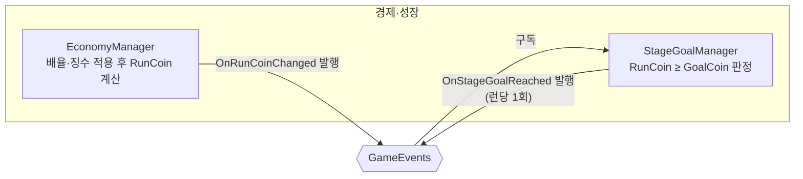

# 단계 목표 판정과 진행

> 관련 이슈: #26, #150, #164 · 최종 수정: 2026-09-18

**이 문서는 로그다.** 이 기능을 고칠 때마다 갱신한다. 새 문서를 만들지 않는다.

## 무엇을 하는가

이번 런에서 번 코인(`RunCoin`)이 현재 단계의 목표 코인(`StageDef.GoalCoin`) 이상인지 매 변동마다 판정하고, 달성 시 `GameEvents.OnStageGoalReached` 를 런당 한 번만 발행한다.
그리고 런이 종료되는 시점(`EndRun`)에 목표를 달성했으면 다음 단계로 진행(`AdvanceStage`)하며, `IStageService` 계약을 통해 `CreatureManager` 와 `BillManager` 가 새 단계의 수치를 사용하도록 단일 출처를 제공한다.
게임 규칙은 [GDD.md](../GDD.md) "단계 목표는 누적 보유 코인이 아니라 이번 런에서 획득한 코인 기준" 절에 있으니 여기서 반복하지 않는다.

## 왜 이 방법인가

| 검토한 방법 | 채택 | 이유 |
|---|---|---|
| `EconomyManager` 안에 판정 로직 추가 | ❌ | `EconomyManager` 는 배율·징수 적용까지가 책임이다(AGENTS.md "코인 배율과 대출 징수는 EconomyManager 안에서만"). 단계 판정을 얹으면 그 클래스가 "코인 계산"과 "목표 달성 여부"라는 서로 다른 이유로 바뀌게 된다 |
| `GameEvents.OnRunCoinChanged` 를 구독하는 별도 `StageGoalManager` | ✅ | `EconomyManager` 는 원시값을 발행만 하고, 목표 비교는 구독 쪽에서 한다. 새 매니저 하나·이벤트 하나로 끝나고 기존 코인 계산 경로를 건드리지 않는다 |
| 누적 보유 코인(`Balance`) 기준 판정 | ❌ | GDD.md 가 명시적으로 금지한다 — 누적 기준이면 업그레이드를 안 사고 쌓기만 하는 게 최적 전략이 된다 |
| `EconomyConfig.StageGoalGrowth` 로 런타임에 목표를 재계산 | ❌ | 그 값은 BALANCE.md 6절에 따라 **오프라인 밸런싱 산출 전용**이다. 런타임 정본은 `stages.csv` → `StageDef.GoalCoin` 이미 산출된 값 하나뿐이라 이중 계산을 만들 이유가 없다 |
| 목표 달성 시 다음 단계로 즉시 전환까지 처리 | ❌ | GDD.md 92번째 줄: 전환은 "결과 정산 후" 일어난다. 이 이슈의 완료 기준은 판정이라 전환은 Result 화면(6.x) 쪽에서 이 이벤트를 구독해 처리하는 게 맞다 |

## 구조

<!-- GameEvents 를 거치는 관계는 이벤트 노드를 경유해 그린다. StageGoalManager 는 EconomyManager 를 직접 참조하지 않는다 -->

| 클래스 | 경로 | 하는 일 |
|---|---|---|
| `IStageService` | `Assets/Scripts/Runtime/Interfaces/IStageService.cs` | 단계 진행 상태 공용 조회 인터페이스 (`CurrentStageIndex`, `CurrentStageNumber`, `IsMaxStage`, `AdvanceStage`, `RestoreStage`) |
| `StageGoalManager` | `Assets/Scripts/Runtime/Economy/StageGoalManager.cs` | `IStageService` 및 `IRunScoped` 구현. `OnRunCoinChanged` 구독 목표 판정 및 `EndRun` 시 목표 달성에 따른 단계 진행(`AdvanceStage`) |
| `StageGoalManagerChecks` | `Assets/Scripts/Editor/StageGoalManagerChecks.cs` | Edit Mode 헤드리스 점검 (목표 판정, 단계 진행/가드, 소비자 조립 등 17건) |
| (프리팹) | `Assets/Prefabs/Resources/Managers.prefab` | `StageGoalManager` 컴포넌트 부착. 생성은 `ManagerBootstrap` |

### 이벤트

| 이벤트 | 발행/구독 | 언제 |
|---|---|---|
| `GameEvents.OnRunCoinChanged` | 구독 | `EconomyManager` 가 런 순수입을 갱신할 때마다 |
| `GameEvents.OnStageGoalReached` | 발행 | 런 내 `RunCoin` 이 현재 단계 `GoalCoin` 이상이 된 최초 시점, 런당 정확히 한 번 |

### 읽는 밸런스 값

| CSV | 열 | 쓰는 곳 |
|---|---|---|
| `Assets/GameData/Balance/stages.csv` | `goal_coin` (→ `StageDef.GoalCoin`) | `StageGoalManager.HandleRunCoinChanged` 의 판정 임계값 |

## 검증

Unity 6000.3.21f1 Edit Mode 배치 실행, 2026-09-18 (`unity run . -- -executeMethod NCAIClicker.EditorTools.StageGoalManagerChecks.RunBatch -logFile -`).

- [x] 컴파일: 종료 코드 0, `error CS` 0건
- [x] `StageGoalManagerChecks.RunBatch()` PASS 17 checks:
  * 목표 미달 시 미판정, 목표 도달 시 1회만 발행, 중복 발행 방지, 다음 런 재판정, 범위 초과 무시, 해제 후 미판정 (기존 6건)
  * 목표 미달 시 런 종료 후 단계 유지, 목표 달성 후 런 종료(`EndRun`) 시 2단계 진행, 2단계 목표 달성 시 3단계 진행, 최고 단계(3단계) 목표 달성 후 초과 없이 3단계 유지, `RestoreStage` 복원 (신규 7건)
  * `CreatureManager` 연동(단계별 스폰 수 및 비율 반영), `BillManager` 연동(단계별 고지서 금액 및 기한 반영), 단계 상승 후 스폰 수 증가 확인 (신규 4건)
- [x] `BillManagerChecks.RunBatch()` PASS 23 checks (회귀 검증 통과)
- [x] `ContractsValidationChecks.RunBatch()` PASS (공용 계약 검증 통과)

## 알려진 한계

- Result 화면에서 목표 달성 여부를 표시하는 UI(6.x)는 아직 없다. `OnStageGoalReached` 를 구독하는 곳이 현재 없다(`StageGoalManagerChecks` 의 테스트 구독자 제외).
- 마지막 단계 목표 달성 후 고지서 정산과의 순서(클리어 표시 게이팅)는 GDD.md 가 "마감 처리를 통과하면 클리어" 라고만 적어 두었고 구현되지 않았다.
- 파산 시 1단계로 되돌리는 호출은 4.4(#30)가 `IStageService.RestoreStage(0)` 으로 연결했고, 4.8(#164)에서 `BillManager` 가 런 경계에 붙으며 실제로 돌기 시작했다 — Play Mode 에서 파산 후 단계 인덱스가 0 이 되는 것을 확인했다.

**`EndRun` 순서에 제약이 있다.** 이 매니저는 목표를 채웠으면 단계를 올리고 `BillManager` 는 파산이면 0 으로 되돌리므로, **여기가 먼저**여야 한다. 순서는 `GameManager.GetServiceOrder` 가 `Stage`=5 · `Bill`=6 으로 고정한다(#164). 둘 다 순번이 없으면 동점이라 `Array.Sort` 가 순서를 보장하지 않는다.

## 갱신 이력

| 날짜 | 이슈 | 누가 | 무엇이 바뀌었나 |
|---|---|---|---|
| 2026-09-17 | #26 | soilrist | 최초 작성. `StageGoalManager` 신설, `OnStageGoalReached` 이벤트 추가, Edit Mode 6건 검증 |
| 2026-09-18 | #150 | saltlake00 | 3.7 단계 진행 및 단일 출처 연결. `IStageService` 신설, `EndRun` 시 단계 진행 및 최대 단계 가드, `CreatureManager`·`BillManager` 연동, 검증 17건 확장 |
| 2026-09-18 | #164 | twins6375-art | `BillManager` 가 런 경계에 붙어 `RestoreStage(0)` 이 실제로 돌기 시작한 것을 반영. `EndRun` 순서 제약(`Stage`=5 < `Bill`=6)을 알려진 한계에 명시 |
