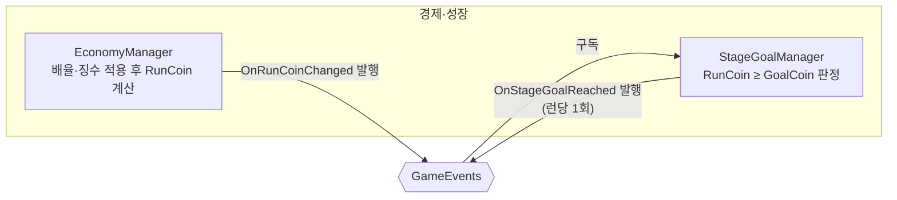

# 단계 목표 판정

> 관련 이슈: #26 · 최종 수정: 2026-09-17

**이 문서는 로그다.** 이 기능을 고칠 때마다 갱신한다. 새 문서를 만들지 않는다.

## 무엇을 하는가

이번 런에서 번 코인(`RunCoin`)이 현재 단계의 목표 코인(`StageDef.GoalCoin`) 이상인지 매 변동마다 판정하고, 달성 시 `GameEvents.OnStageGoalReached` 를 런당 한 번만 발행한다. 게임 규칙은 [GDD.md](../GDD.md) "단계 목표는 누적 보유 코인이 아니라 이번 런에서 획득한 코인 기준" 절에 있으니 여기서 반복하지 않는다.

**판정만 한다.** 단계를 실제로 올리는 것, 저장, Result 화면 표시, 마지막 단계 청구서 정산 게이팅은 이 이슈의 완료 기준("런 내 획득 코인 기준으로 판정") 밖이라 다음 절에서 명시적으로 범위를 뺐다.

## 왜 이 방법인가

| 검토한 방법 | 채택 | 이유 |
|---|---|---|
| `EconomyManager` 안에 판정 로직 추가 | ❌ | `EconomyManager` 는 배율·징수 적용까지가 책임이다(AGENTS.md "코인 배율과 대출 징수는 EconomyManager 안에서만"). 단계 판정을 얹으면 그 클래스가 "코인 계산"과 "목표 달성 여부"라는 서로 다른 이유로 바뀌게 된다 |
| `GameEvents.OnRunCoinChanged` 를 구독하는 별도 `StageGoalManager` | ✅ | `EconomyManager` 는 원시값을 발행만 하고, 목표 비교는 구독 쪽에서 한다. 새 매니저 하나·이벤트 하나로 끝나고 기존 코인 계산 경로를 건드리지 않는다 |
| 누적 보유 코인(`Balance`) 기준 판정 | ❌ | GDD.md 가 명시적으로 금지한다 — 누적 기준이면 업그레이드를 안 사고 쌓기만 하는 게 최적 전략이 된다 |
| `EconomyConfig.StageGoalGrowth` 로 런타임에 목표를 재계산 | ❌ | 그 값은 BALANCE.md 6절에 따라 **오프라인 밸런싱 산출 전용**이다. 런타임 정본은 `stages.csv` → `StageDef.GoalCoin` 이미 산출된 값 하나뿐이라 이중 계산을 만들 이유가 없다 |
| 목표 달성 시 다음 단계로 즉시 전환까지 처리 | ❌ | GDD.md 92번째 줄: 전환은 "결과 정산 후" 일어난다. 이 이슈의 완료 기준은 판정이라 전환은 Result 화면(6.x) 쪽에서 이 이벤트를 구독해 처리하는 게 맞다 |

## 구조

<!-- GameEvents 를 거치는 관계는 이벤트 노드를 경유해 그린다. StageGoalManager 는 EconomyManager 를 직접 참조하지 않는다 -->

| 클래스 | 경로 | 하는 일 |
|---|---|---|
| `StageGoalManager` | `Assets/Scripts/Runtime/Economy/StageGoalManager.cs` | `OnRunCoinChanged` 구독, `_balanceData.GetStage(_stageIndex + 1).GoalCoin` 과 비교, 달성 시 런당 한 번만 `OnStageGoalReached` 발행. `IRunScoped` 구현(`BeginRun` 에서 판정 플래그 초기화) |
| `StageGoalManagerChecks` | `Assets/Scripts/Editor/StageGoalManagerChecks.cs` | Edit Mode 헤드리스 점검(`EconomyManagerChecks.cs` 를 본떠 작성) |
| (프리팹) | `Assets/Prefabs/Resources/Managers.prefab` | `StageGoalManager` 컴포넌트 부착. 생성은 `ManagerBootstrap` |

### 이벤트

| 이벤트 | 발행/구독 | 언제 |
|---|---|---|
| `GameEvents.OnRunCoinChanged` | 구독 | `EconomyManager` 가 런 순수입을 갱신할 때마다 |
| `GameEvents.OnStageGoalReached` | 발행 | 런 내 `RunCoin` 이 현재 단계 `GoalCoin` 이상이 된 최초 시점, 런당 정확히 한 번 |

### 읽는 밸런스 값

| CSV | 열 | 쓰는 곳 |
|---|---|---|
| `Assets/GameData/Balance/stages.csv` | `goal_coin` (→ `StageDef.GoalCoin`) | `StageGoalManager.HandleRunCoinChanged` 의 판정 임계값 |

## 검증

Unity 6000.3.21f1 Edit Mode 배치 실행, 2026-09-17 (`unity run . --timeout 120 -- -executeMethod NCAIClicker.EditorTools.StageGoalManagerChecks.RunBatch -logFile ...`).

- [x] 컴파일: 종료 코드 0, `error CS` 0건 — `StageGoalManager.cs`·`StageGoalManagerChecks.cs`·수정된 `GameEvents.cs`·`Managers.prefab` 신규 컴포넌트(GUID `3d95c8a0a18a00d65c9b9919217a92b6`) 전부 포함
- [x] `StageGoalManagerChecks.RunBatch()` PASS 6 checks: 목표 미달 시 미판정, 목표 도달 시 1회만 발행, 같은 런에서 재도달해도 중복 발행 안 함, `BeginRun()` 후 재판정, 설정 범위를 넘는 단계는 조용히 무시, `OnDisable` 후 미판정(구독 해제 확인)
- [ ] Play Mode 확인 — **미검증**. 테스트 asmdef 가 런타임 코드(Assembly-CSharp)를 참조하지 못해 `OnEnable`/`OnDisable` 이 Unity 생명주기로 실제 호출되는지는 Edit Mode 리플렉션 호출로만 우회 확인했다(`manager-bootstrap.md` 의 기존 한계와 동일)
- [ ] `Managers.prefab` 에서 실제로 씬을 Play 해 `EconomyManager` → `StageGoalManager` 배선이 한 프레임 안에서 동작하는지 — **미검증**

## 알려진 한계

- 단계를 실제로 올리는 처리(단계 인덱스 증가·`SaveData.StageIndex` 갱신·저장)는 이 이슈 범위 밖이다. `CurrentStageIndex` 는 읽기 전용이고 이 클래스 안에서 증가시키는 진입점이 없다.
- Result 화면에서 목표 달성 여부를 표시하는 UI(6.x)는 아직 없다. `OnStageGoalReached` 를 구독하는 곳이 현재 없다(`StageGoalManagerChecks` 의 테스트 구독자 제외).
- 마지막 단계 목표 달성 후 청구서 정산과의 순서(클리어 표시 게이팅)는 GDD.md 가 "마감 처리를 통과하면 클리어" 라고만 적어 두었고 구현되지 않았다.
- `_balanceData` 가 비어 있거나(`Awake` 에서 `LogError`) 설정 범위를 넘는 단계 인덱스면 조용히 판정을 건너뛴다 — GDD.md 208번째 줄("범위를 넘는 다음 단계 데이터를 조회하지 않는다")을 그대로 따른 것이지만, 마지막 단계를 넘어간 뒤에는 이 매니저가 더 이상 아무 이벤트도 내지 않는다는 뜻이다. 마지막 단계 클리어 처리가 생기면 이 지점을 다시 봐야 한다.
- 이 작업으로 `GameEvents` 에 이벤트가 17번째로 늘었지만, `docs/ARCHITECTURE.md` §3 과 `docs/TECH_NOTES/contracts.md` 의 이벤트 표(둘 다 16종까지만 나열)는 갱신하지 않았다 — 이슈 #26 이 요구하는 문서 갱신 범위(이 문서·`manager-bootstrap.md`) 밖이라 손대지 않았다. 두 문서 모두 다음에 `GameEvents` 를 만지는 사람이 자기 이벤트와 함께 갱신하거나, 별도 `docs:` 커밋으로 따라잡아야 한다.

## 갱신 이력

| 날짜 | 이슈 | 누가 | 무엇이 바뀌었나 |
|---|---|---|---|
| 2026-09-17 | #26 | soilrist | 최초 작성. `StageGoalManager` 신설, `OnStageGoalReached` 이벤트 추가, Edit Mode 6건 검증 |
