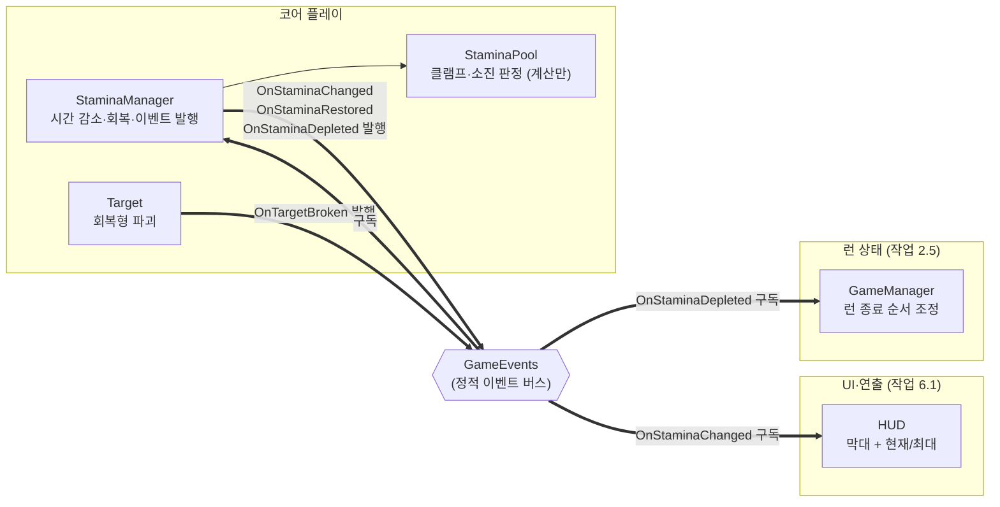

# 스태미나

> 관련 이슈: #19, #131, #126, #164 · 최종 수정: 2026-09-18

**이 문서는 로그다.** 이 기능을 고칠 때마다 갱신한다. 새 문서를 만들지 않는다.

## 무엇을 하는가

스태미나를 시간에 따라 줄이고, 회복형 대상이 부서질 때 되돌려 준다. 0이 되면 런 종료를 **요청**한다.

런을 실제로 끝내는 것은 여기가 아니다. `OnStaminaDepleted` 를 발행할 뿐이고, 입력 차단·정산·결과
화면 전이는 GameManager 가 조정한다 (ARCHITECTURE "하루 종료 순서", 작업 2.5). 이 경계 때문에
**2.5 가 붙기 전까지는 스태미나가 0이 되어도 화면에서 아무 일도 일어나지 않는다.**

## 왜 이 방법인가

| 검토한 방법 | 채택 | 이유 |
|---|---|---|
| 계산부(`StaminaPool`)와 컴포넌트(`StaminaManager`) 분리 | ✅ | Edit Mode 는 `Awake`·`OnEnable`·`Update` 를 부르지 않아, 계산을 MonoBehaviour 안에 두면 검증할 방법이 없다. 코인 정산에서 같은 벽에 부딪혀 `CoinWallet` 을 뺀 것과 같은 이유다 |
| 전부 `StaminaManager` 한 클래스에 | ❌ | 위와 같음. 클램프·소진 경계처럼 틀리기 쉬운 부분이 검증 밖에 남는다 |
| `Update` 가 직접 `Time.deltaTime` 을 소비 | ❌ | 검증에서 기본 런 길이를 재현할 수 없다. `Tick(float)` 으로 분리해 경과 시간을 주입한다 |
| 감소를 `BeginRun()` 뒤에만 (런 게이트) | ✅ | 게이트가 없으면 MainMenu 씬에서도 스태미나가 샌다. 매니저는 `DontDestroyOnLoad` 라 씬을 가리지 않는다 |
| 활성화되면 바로 감소 | ❌ | 지금은 Play 하자마자 줄어 편하지만, 2.5 가 오면 걷어내야 하는 코드다 |
| `OnStaminaChanged` 를 매 프레임 발행 | ❌ | 지속 감소라 매 프레임 값이 바뀐다. ARCHITECTURE 3절이 "UI 갱신을 묶는다"고 정해 두었다. 0.1초 간격으로 묶고, 회복·소진·런 시작은 즉시 발행한다 |
| `move_drain_per_unit`·`hit_drain_per_swing`·`fever_drain_multiplier` 구현 | ❌ | **구현해도 절대 실행되지 않는다.** 임포터가 기본값(0·0·1) 외의 값을 거부한다 (`BalanceImporter.cs` 의 `Validate`). 넣으면 커서 이동 추적과 스윙·피버 이벤트 구독이 붙는데 효과는 0이고, 구독이 늘어난 만큼 해제 누락 위험만 커진다 |

### 회복량을 `BreakInfo` 로만 받는 이유

`targets.csv` 를 여기서 다시 읽지 않는다. 회복량의 출처는 `BreakInfo.StaminaRestore` 하나이며,
대상 구현(`Target`)이나 PiggyManager 를 참조하지 않는다 (#3 에서 동결). 같은 값을 두 곳에서
읽으면 대상이 퍼크나 업그레이드로 회복량을 바꿀 때 한쪽만 반영된다.

## 구조

| 클래스 | 경로 | 하는 일 |
|---|---|---|
| `StaminaPool` | `Assets/Scripts/Runtime/Core/StaminaPool.cs` | 감소·회복·상한 클램프·소진 판정. Unity 의존도 이벤트도 없다 |
| `StaminaManager` | `Assets/Scripts/Runtime/Core/StaminaManager.cs` | `Managers` 프리팹에 붙는 MonoBehaviour. 시간을 먹이고 이벤트를 발행한다 |
| `StaminaChecks` | `Assets/Scripts/Editor/StaminaChecks.cs` | Edit Mode 검증 22건 |

### 이벤트

| 이벤트 | 발행/구독 | 언제 |
|---|---|---|
| `GameEvents.OnTargetBroken` | 구독 | 파괴 보상 중 `StaminaRestore` 몫을 받는다. 런 진행 중이 아니면 무시한다 |
| `GameEvents.OnStaminaChanged` | 발행 | 런 시작·회복·소진 시 즉시, 지속 감소는 0.1초로 묶어서 |
| `GameEvents.OnStaminaRestored` | 발행 | **실제로** 회복된 양이 0보다 클 때만. 만충이거나 회복량 0인 대상은 발행하지 않는다 |
| `GameEvents.OnStaminaDepleted` | 발행 | 0에 닿는 순간 한 번. 런당 한 번을 넘지 않는다 |

`OnStaminaChanged(0, 최대)` 를 **먼저** 발행하고 그다음 `OnStaminaDepleted` 를 발행한다.
순서가 뒤집히면 HUD 가 0을 찍기 전에 결과 화면으로 넘어가 막대가 조금 남은 채로 끝난다.

### 공개 API (인터페이스 아님)

| 멤버 | 누가 부르나 |
|---|---|
| `BeginRun()` | GameManager (`IRunScoped`) — 런 시작. 가득 채우고 감소를 켠다 |
| `EndRun()` | GameManager (`IRunScoped`) — 감소만 멈춘다. 남은 값은 결과 화면이 읽도록 남긴다 |
| `CurrentStamina` / `MaxStamina` / `IsRunning` | 조회 |

런 라이프사이클은 `IRunScoped` 인터페이스를 구현해 `GameManager` 가 다형적으로 부른다 (이슈 #111).
다만 조회 인터페이스는 아직 없어 HUD 처럼 **런 도중에 구독을 시작하는 쪽은 초기값을 읽을 통로가 없다** (아래 한계 참고).

### 읽는 밸런스 값

| CSV | 열 | 쓰는 곳 |
|---|---|---|
| `Assets/GameData/Balance/stamina.csv` | `max_stamina` | `BeginRun()` 이 채우는 최대치 |
| `Assets/GameData/Balance/stamina.csv` | `idle_drain_per_sec` | `Tick()` 의 초당 감소량 |
| `Assets/GameData/Balance/targets.csv` | `stamina_restore` | 직접 읽지 않는다 — `BreakInfo` 로 전달받는다 |

같은 파일의 `move_drain_per_unit`·`hit_drain_per_swing`·`fever_drain_multiplier` 는 읽지 않는다.
이유는 "왜 이 방법인가" 마지막 줄.

## 검증

Edit Mode 에서 `StaminaChecks.RunBatch()` 로 확인했다 (**22건 PASS**). 연속 3회 실행 후
`GameEvents` 의 4개 이벤트 구독자 수가 전부 0인 것도 확인했다 — 구독이 새면 다음 실행에서
회복이 두 배가 된다.

**기대값은 코드에 적지 않고 생성된 `BalanceData.asset` 에서 읽는다.** 최대치·초당 감소량·회복량을
검증에 박아 두면 CSV 를 고쳤을 때 검증이 조용히 옛 값을 지킨다. 실제 에셋을 읽되 수정하지
않으며, 실행 후 에셋이 dirty 가 아닌 것을 확인했다.

- [x] 기본 런 길이가 `max_stamina / idle_drain_per_sec` 와 일치 (BALANCE 2절)
- [x] 0 아래로 내려가지 않는다
- [x] 소진 시 `OnStaminaChanged(0, 최대)` → `OnStaminaDepleted` 순서, 종료 요청은 한 번만
- [x] 소진 뒤 계속 `Tick` 해도 종료 요청이 반복되지 않고 회복도 되지 않는다
- [x] 회복형 파괴 시 실제 회복량만 `OnStaminaRestored` 로 나간다
- [x] 만충에서 회복하면 값이 넘지 않고 이벤트도 나가지 않는다
- [x] 회복량 0인 대상(일반·거치·고속형)은 이벤트를 만들지 않는다
- [x] `OnDisable` 후 파괴 이벤트에 반응하지 않고, 재구독해도 중복되지 않는다
- [x] 지속 감소 발행이 프레임 수보다 적다 (묶기 동작)
- [x] `BeginRun()` 전에는 시간이 흘러도 줄지 않는다
- [x] `EndRun()` 후 남은 값이 유지된다
- [x] `Managers` 프리팹의 `_balanceData` 가 생성된 `BalanceData.asset` 을 가리키고,
  거기서 읽은 `max_stamina`·`idle_drain_per_sec`·`tourist` 의 `stamina_restore` 로
  기본 런 길이와 회복형 연장이 BALANCE 2절의 범위에 드는 것을 확인

**미검증**: Play Mode. Unity 가 `OnEnable`·`Update` 를 실제로 그 시점에 불러 주는지는 확인하지
못했다 — 검증에서는 리플렉션으로 직접 부른다. 테스트 asmdef 가 런타임 코드(`Assembly-CSharp`)를
참조하지 못해 PlayMode 테스트를 쓸 수 없는 제약이 그대로다 (`coin-economy.md` 와 같은 사유).
~~런을 시작시키는 주체(작업 2.5)가 아직 없어 실제 플레이로 런 하나가 끝까지 흐르는 것은 보지 못했다.~~
— #111 이 런 경계를 배선했고, **#164 의 Play Mode 검증에서 런 시작 → 소진 → `Result` 전이 →
재도전이 하루씩 흐르는 것을 실제로 확인했다** ([고지서·파산](billing.md) "Play Mode").

## 알려진 한계

- ~~**작업 2.5 전까지 게임에서 스태미나가 줄지 않는다.**~~ — 이슈 #111에서 `StaminaManager` 가 `IRunScoped` 를 상속하고 `GameManager` 가 `Running` 전이 시 `BeginRun()`, `Result` 전이 시 `EndRun()` 을 호출하도록 배선 완료.
- ~~**최대 스태미나 업그레이드가 반영되지 않는다.**~~ — #131 에서 `IUpgradeStats` 를 주입받아
  `BeginRun()` 이 `max_stamina`·`idle_drain_per_sec` 의 실효값을 굳힌다. 다만 **지금 이 두 stat 을
  올리는 업그레이드는 `upgrade_effects.csv` 에 없다** — 통로만 뚫려 있고 값이 달라지지는 않는다.
  자세한 것은 [업그레이드](upgrades.md)
- **퍼크 선택 중 일시정지가 없다.** GDD 4절이 "퍼크 선택 중 스태미나 시간이 멈춘다"고 정해 두었다.
  퍼크는 작업 4.2 라 그때 `EndRun()`/`BeginRun()` 이 아닌 일시정지 통로가 필요하다 —
  지금 `BeginRun()` 으로 재개하면 스태미나가 만충으로 되돌아간다
- **런 도중 구독을 시작하는 UI 는 초기값을 못 읽는다.** 스태미나에는 조회 인터페이스가 없다.
  HUD(작업 6.1)가 매니저보다 늦게 살아나면 첫 `OnStaminaChanged` 까지 최대 0.1초 동안 빈 막대를
  보게 된다. 계약을 넓힐지는 6.1 담당자와 맞춰야 한다 (#71 과 같은 성격의 빈 곳)
- **저장·복원이 없다.** 스태미나는 런 안에서만 사는 값이라 `SaveData` 에 필드가 없다.
  런 도중 저장을 지원하게 되면 다시 볼 것

## 갱신 이력

| 날짜 | 이슈 | 누가 | 무엇이 바뀌었나 |
|---|---|---|---|
| 2026-09-17 | #19 | twins6375-art | 최초 작성 (시간 감소, 회복형 회복, 소진 요청, 발행 묶기) |
| 2026-09-17 | #111 | saltlake00 | `IRunScoped` 상속 추가, `GameManager` 런 라이프사이클 배선 완료 반영 |
| 2026-09-17 | #131 | twins6375-art | `IUpgradeStats` 주입, `BeginRun()` 에서 최대치·감소 속도 실효값 캐시 |
| 2026-09-17 | #126 | twins6375-art | 회복 퍼크 적용 — 만충이면 예약했다가 빈자리가 생길 때 1회 ([퍼크 효과](perks.md)) |
| 2026-09-18 | #164 | twins6375-art | Play Mode 로 런이 끝까지 흐르는 것을 확인해 "보지 못했다" 서술을 닫음 |
