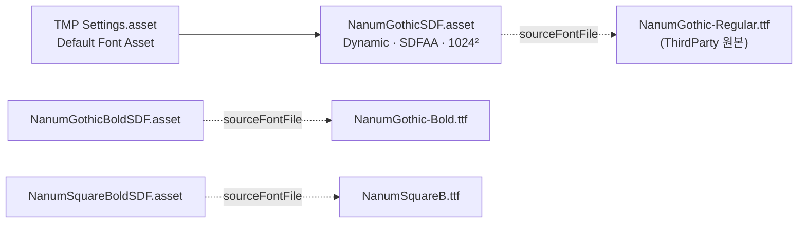

# UI 폰트

> 관련 이슈: #42, #78, #92 · 최종 수정: 2026-09-18

**이 문서는 로그다.** 이 기능을 고칠 때마다 갱신한다. 새 문서를 만들지 않는다.

## 무엇을 하는가

TMP 텍스트가 쓰는 한글 폰트를 결정하고 저장소에 고정한다. 본문 나눔고딕, HUD 숫자 강조 나눔스퀘어 Bold
([RELEASE_CHECKLIST 1절](../RELEASE_CHECKLIST.md) 결정). 원본 ttf 와 OFL 전문을 동봉하고, TMP 기본 폰트를 나눔고딕으로 바꾼다.

## 왜 이 방법인가

| 검토한 방법 | 채택 | 이유 |
|---|---|---|
| 나눔고딕 (SIL OFL 1.1) | ✅ | 임베딩·상업 이용·재배포 허용. 의무는 라이선스 전문 동봉뿐 → `LICENSES/` |
| Pretendard (OFL 1.1) | ❌ | 라이선스는 같지만 문서 결정이 나눔고딕이다. 바꾸려면 팀 논의 |
| 맑은 고딕 | ❌ | Windows 번들 폰트라 임베딩 불가 |
| Static 아틀라스로 한글 전체 굽기 | ❌ | 완성형 11,172자 → 텍스처 수십 MB. Dynamic 은 쓰인 글자만 런타임에 채운다 |

## 구조

| 에셋 | 경로 | 하는 일 |
|---|---|---|
| 원본 ttf | `Assets/ThirdParty/Fonts/NanumGothic-Regular.ttf`, `NanumGothic-Bold.ttf`, `NanumSquareB.ttf` | 수정 금지. Dynamic 아틀라스가 런타임에 여기서 글립을 만든다 |
| SDF 폰트 에셋 | `Assets/Materials/Fonts/NanumGothicSDF.asset`, `NanumGothicBoldSDF.asset`, `NanumSquareBoldSDF.asset` | 폰트 에셋·아틀라스 텍스처·머티리얼이 한 파일에 서브에셋. 샘플링 90pt, 패딩 9, SDFAA, 1024×1024, Dynamic, 멀티 아틀라스 |
| TMP 설정 | `Assets/TextMesh Pro/Resources/TMP Settings.asset` | `m_defaultFontAsset` = `NanumGothicSDF`. `Assets/TextMesh Pro/` 는 TMP 필수 리소스 import 산출물이라 손으로 고치지 않는다 |
| 라이선스 | `LICENSES/NanumGothic-OFL.txt`, `LICENSES/NanumSquare-OFL.txt` | OFL 1.1 전문. 빌드 산출물과 함께 배포 |

생성 방법: 임시 에디터 스크립트로 `TMP_PackageResourceImporter.ImportResources(true,false,false)` →
`TMP_FontAsset.CreateFontAsset(font, 90, 9, SDFAA, 1024, 1024, Dynamic, true)` + `AssetDatabase.CreateAsset/AddObjectToAsset` →
`SerializedObject` 로 `TMP_Settings.m_defaultFontAsset` 교체. 임시 스크립트는 삭제했다. 다시 만들 일이 있으면 에디터 메뉴
`Window > TextMeshPro > Font Asset Creator` 로 같은 설정을 쓰면 된다.

### 이벤트

없음.

### 읽는 밸런스 값

없음.

## 검증

Edit Mode 배치(`-batchmode -nographics -executeMethod`) 실측, 2026-09-16:

- [x] `TMP_Settings.defaultFontAsset` 이 `NanumGothicSDF`, null 아님
- [x] `TryAddCharacters("스태미나 코인 0123456789")` → `true`, `atlasPopulationMode == Dynamic`, 아틀라스 1024×1024
- [x] 세 SDF 에셋 모두 존재, material·sourceFontFile 연결됨
- [x] 숫자 고정폭 (fontTools 로 `hmtx` advance 확인): NanumGothic Regular/Bold 0~9 전부 606, NanumSquare Bold 전부 610
- [ ] Play Mode — 미검증 (worktree 에서 에디터 Play 불가. 머지 후 에디터에서 새 TMP 텍스트가 나눔고딕으로 뜨는지 확인)

## 알려진 한계

- **HUD 고정 문구("스태미나", "코인", 0~9)의 Static 아틀라스는 아직 없다.** 전부 Dynamic 이라 첫 등장 시 한 프레임 튈 수 있다. 6.1 HUD 에서 Static 혼합을 만든다.
- **Static 아틀라스를 만들 때 퍼크 카드 제목을 빼면 안 된다 (#92).** 그 문구는 프리팹이 아니라 `perks.csv` 의 `display_name` 에서 온다 — 씬·프리팹만 훑으면 놓친다. 화면 설명은 [퍼크 3장 선택 화면](perk-choice-ui.md).
- `NanumSquare-OFL.txt` 는 네이버 nanum-square.zip 에 라이선스 파일이 없어 나눔고딕 OFL 전문을 복사한 것이다. 저작권 줄의 Reserved Font Name 목록에 NanumSquare 가 명시돼 있지 않다. 8.7(#78) 에서 이대로 유지하기로 결정했다. 빌드 산출물에는 `LICENSES/` 폴더를 동봉한다(크레딧 화면 없음).
- 나눔고딕 OFL 저작권 표기는 "NHN Corporation"(네이버의 옛 사명)이다.

## 갱신 이력

| 날짜 | 이슈 | 누가 | 무엇이 바뀌었나 |
|---|---|---|---|
| 2026-09-16 | #42 | Claude | 최초 작성 |
| 2026-09-17 | #78 | Claude | 나눔스퀘어 고지문 유지·LICENSES 폴더 동봉 결정 반영 |
| 2026-09-18 | #92 | twins6375-art | Static 아틀라스 작업 시 퍼크 카드 제목(CSV 에서 오는 문구)을 빼면 두부가 뜬다는 주의를 한계에 추가 |
