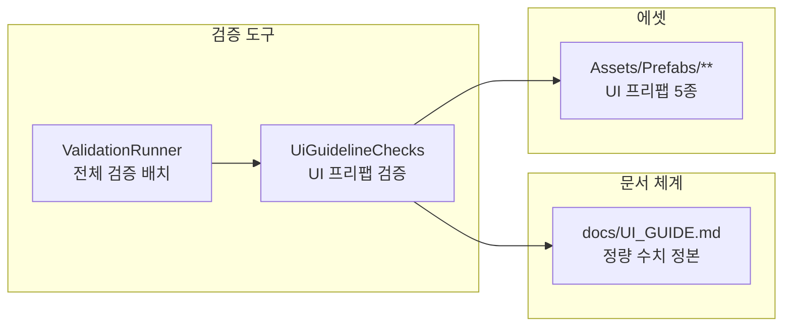

# UI 가이드라인 수립 및 자동 검증

> 관련 이슈: #180 (계획 1.26) · 최종 수정: 2026.09.18

이 문서는 UI 가이드라인 정본화 및 에디터 검증 하네스 연동 로그입니다.

## 무엇을 하는가

* UI 디자인 기준(해상도, 90% 세이프존, 4배수 그리드, 폰트 크기, WCAG 2.1 AA 명도 대비)을 `docs/UI_GUIDE.md` 정본으로 통합합니다.
* `UiGuidelineChecks` 하네스를 통해 `Assets/Prefabs` 내의 모든 UI 프리팹을 정적으로 스캔하여 기계적 검증을 자동 수행합니다.

## 왜 이 방법인가

* **방법 A (개인 위키 유지)**: 기각 (외부 접근성 부재, AI 및 팀원 간 기준 불일치, #34 저대비 1.32:1 결함 유발)
* **방법 B (정본 문서화 및 자동 검증 하네스)**: 채택 (저장소 내 단일 진실 공급원 확보, `ValidationRunner`를 통한 자동 수집 및 정량 판정)

## 구조

### 주요 클래스 및 파일

* `docs/UI_GUIDE.md`: UI 수치 및 설계 원칙 정본 (해상도, 세이프존, 그리드, 폰트, 대비, 디자인 원칙)
* `Assets/Scripts/Editor/UiGuidelineChecks.cs`: 프리팹 UI 정적 검증 및 상대 휘도 계산 하네스
* `AGENTS.md`: 먼저 읽을 것 표에 UI 가이드라인 링크 연결
* `.github/ISSUE_TEMPLATE/task.md`: UI 작업 완료 기준 체크리스트 갱신

## 검증 결과

* **실행 완료 항목**:
  1. `UiGuidelineChecks.RunBatch()` 단독 실행 및 UI 프리팹 5종 (총 164개 항목) 정적 검사 통과
  2. `ValidationRunner.CollectEntries()` 리플렉션 수집을 통해 21번째 하네스로 자동 등록 확인
  3. 실측 기반 취약점 검출 (폰트 크기 미달 4건, 대비 미달 7건, 불완전 알파 톤 11건)
  4. 문서 진입점 링크 유효성 확인

## 알려진 한계 및 과도기 정책

* **과도기 정책**: 기존 프리팹(`BillPanel`, `ResultUI` 등)의 수치 미달 요소로 인한 빌드 파손을 방지하기 위해 경고(`Debug.LogWarning`) 방식으로 집계 보고하며 검증은 PASS 처리합니다.
* **레이아웃 요소 판정**: 프리팹 정적 상태에서 크기가 0인 동적 레이아웃 요소는 `LayoutElement`의 최소 크기(minWidth, minHeight)를 보조 기준으로 삼아 판정합니다.

## 갱신 이력

* 2026.09.18: #180 (계획 1.26), saltlake00, 최초 작성 완료
